<div class="cover-page">

# RiceGuard AI — RiceGuard Vision

## AI-Powered Rice Leaf Disease Detection System

### Complete Technical Documentation

**A Full-Stack Deep Learning Web Application**

React (TanStack Start) · FastAPI · TensorFlow / Keras · MobileNetV2

| | |
|---|---|
| **Document type** | Final-Year Project Technical Reference |
| **Repository** | `riceguard-vision-main` |
| **Frontend** | React 19 + TypeScript + Vite + Tailwind CSS (port 8080) |
| **Backend** | FastAPI + Uvicorn, Python 3.11 (port 8001) |
| **ML framework** | TensorFlow 2.21.0 / Keras 3.15.1 |
| **Model** | MobileNetV2 transfer learning, 4 disease classes |
| **Test accuracy** | 65.82 % (weighted F1 64.75 %) |
| **Date** | August 2026 |

*This document is generated entirely from the actual implementation in the repository — every file path, function name, number, and behavior described here was verified against the running project.*

</div>

---

# TABLE OF CONTENTS

1. **SECTION 1 — Project Overview**: Executive Summary · Abstract · Introduction · Problem Statement · Existing System · Limitations · Proposed System · Motivation · Objectives · Scope · Advantages · Limitations · Future Scope · Conclusion
2. **SECTION 2 — Complete Project Architecture**: Three-tier architecture · Frontend→Backend→ML flow · Every interaction explained · Architecture diagrams
3. **SECTION 3 — Complete Folder Structure**: Full repository tree · Purpose of every folder and important file
4. **SECTION 4 — Frontend Explanation**: React from scratch · Every route · Every component · Routing · State · API calls · Styling · Data flow
5. **SECTION 5 — Backend Explanation**: FastAPI · main.py · routes · services · config · every endpoint · CORS · middleware · model loading · preprocessing · prediction
6. **SECTION 6 — Machine Learning Explanation**: Every ML file · pipeline · MobileNetV2 beginner→advanced · transfer learning · every layer · every callback
7. **SECTION 7 — Dataset**: Source · classes · structure · statistics · preprocessing · augmentation
8. **SECTION 8 — Model Results**: Real training numbers · metrics explained · confusion matrix · weaknesses
9. **SECTION 9 — Complete Execution Flow**: Upload → prediction → response, step by step
10. **SECTION 10 — Complete Code Explanation**: Every important Python, TypeScript, and configuration file
11. **SECTION 11 — Diagrams**: Architecture · Flowchart · DFD 0/1 · Sequence · Activity · Component · Deployment · Class
12. **SECTION 12 — Installation Guide**: Prerequisites → training → running → testing
13. **SECTION 13 — Errors and Solutions**: Every real issue hit during development, with cause and fix
14. **SECTION 14 — Viva Preparation**: 150 questions with detailed answers
15. **SECTION 15 — Interview Preparation**: 150 questions with detailed answers
16. **SECTION 16 — Project Explanation for Presentation**: How to present and defend the project
17. **SECTION 17 — Project Quiz**: 250 questions based only on this repository

---

# SECTION 1 : PROJECT OVERVIEW

## 1.1 Executive Summary

RiceGuard AI (also called RiceGuard Vision) is a complete web application that detects diseases in rice plants from a photograph of a leaf. A user opens the website, uploads a picture of a rice leaf, and within a couple of seconds sees the predicted disease name and a confidence percentage.

The system is built from three cleanly separated parts that talk to each other over HTTP:

1. **A React frontend** (TypeScript, Vite, Tailwind CSS, TanStack Router) that provides a marketing site, a dashboard, and the disease-detection upload page. It runs on `http://localhost:8080`.
2. **A FastAPI backend** (Python 3.11) that receives the uploaded image, validates it, preprocesses it, runs it through the trained neural network, and returns a JSON response. It runs on `http://localhost:8001`.
3. **A machine learning pipeline** (TensorFlow 2.21 / Keras 3.15) that trains a MobileNetV2 transfer-learning model on 979 labelled rice leaf photographs across four classes: *Bacterial Leaf Blight*, *Brown Spot*, *Healthy Rice Leaf*, and *Leaf Blast*.

The trained model (`ml/models/rice_model.keras`, 13.6 MB, 2,593,092 parameters) achieves **65.82 % accuracy on the held-out test set** with a weighted F1 score of 64.75 %, training in just 3.9 minutes on an ordinary laptop CPU. The whole flow — browser upload → API → model → JSON → result card on screen — has been executed and verified end to end.

## 1.2 Abstract

Rice is a staple food for more than half of the world's population, and its yield is constantly threatened by fungal and bacterial diseases such as leaf blast, brown spot, and bacterial leaf blight. Early identification of these diseases is critical, but manual diagnosis requires trained agricultural experts who are not always available to small farmers.

This project presents **RiceGuard AI**, a web-based rice leaf disease detection system powered by deep learning. A convolutional neural network based on **MobileNetV2** with **transfer learning** was trained on a dataset of 979 rice leaf images divided into four classes (Bacterial Leaf Blight, Brown Spot, Healthy Rice Leaf, Leaf Blast) with a 686 / 97 / 196 train / validation / test split. The ImageNet-pretrained convolutional base was frozen and a custom classification head (GlobalAveragePooling → BatchNormalization → Dropout → Dense-256 → BatchNormalization → Dropout → Dense-4 softmax) was trained on top of it, using data augmentation (random flips, rotations, translations, zooms), early stopping, learning-rate scheduling, and best-checkpoint selection on validation loss.

The trained model is served through a **FastAPI** REST API that performs image validation, preprocessing, and prediction, and is consumed by a **React + TypeScript** single-page application in which the user uploads a leaf image and instantly receives the predicted disease with a confidence score. On the unseen test set, the system reaches 65.82 % accuracy, 65.33 % weighted precision, 65.82 % weighted recall, and 64.75 % weighted F1. The architecture keeps the frontend, backend, and ML pipeline fully decoupled, so the model can be retrained and replaced without touching the API contract or the user interface.

## 1.3 Introduction

Agriculture still relies heavily on the human eye. When a rice farmer notices spots or lesions on leaves, the usual options are to guess, to ask a neighbour, or to wait for an agricultural officer. Each of those options costs time, and rice diseases spread quickly — a leaf blast infection can destroy a large portion of a paddy within weeks.

Computer vision changed this picture. Convolutional Neural Networks (CNNs) can learn to recognise visual patterns — lesion shape, colour, texture, distribution — directly from example photographs, without anyone hand-coding rules like "brown circular spots mean brown spot disease." With *transfer learning*, we do not even need millions of images: we can take a network that has already learned general visual features from ImageNet (1.4 million images) and re-train only its final layers on a few hundred rice leaf photos.

RiceGuard AI applies exactly this idea and wraps it in software that ordinary people can use. The deep learning part is useless to a farmer if it only runs in a Python notebook, so this project deliberately invests in the full engineering stack: a polished React interface, a documented REST API, a reproducible training script with callbacks and logged metrics, and a clean separation between the three layers. The result is not just a model — it is a working product pipeline that can be maintained, retrained, and extended.

## 1.4 Problem Statement

> Rice farmers and agricultural workers have no fast, cheap, and reliable way to identify common rice leaf diseases (bacterial leaf blight, brown spot, leaf blast) at the moment they first see symptoms. Manual expert diagnosis is slow, subjective, and often unavailable, which delays treatment and increases crop loss.

The project answers this with a concrete technical goal: **build a web application in which a user uploads a single rice leaf image and receives an automated disease classification with a confidence score in near real-time, using a deep learning model trained on real rice leaf photographs.**

## 1.5 Existing System

Before a system like RiceGuard AI, disease identification typically works like this:

- **Visual inspection by the farmer** — based on experience and guesswork; symptoms of brown spot and leaf blast look similar at early stages, so misidentification is common.
- **Consultation with agricultural extension officers** — accurate but slow; an officer must physically visit or receive samples, which can take days.
- **Laboratory analysis** — the most accurate option (microscopy, culturing) but expensive, slow, and completely inaccessible to smallholders.
- **Generic internet searches** — farmers compare their leaves to random pictures online, with no systematic accuracy.

## 1.6 Limitations of the Existing System

1. **Delay.** Expert or lab diagnosis takes days; diseases spread daily.
2. **Cost.** Lab tests and repeated expert visits are expensive relative to smallholder income.
3. **Availability.** There are far fewer trained plant pathologists than farms; remote areas may have none.
4. **Subjectivity.** Two observers can disagree; early-stage symptoms of different diseases overlap visually.
5. **No records.** Manual diagnosis leaves no digital history, so no trend analysis or early-warning statistics are possible.
6. **No scalability.** A human expert can inspect a limited number of fields per day; software can classify thousands of images per hour.

## 1.7 Proposed System

RiceGuard AI proposes a three-tier automated system:

- **Presentation tier (React)** — a browser application with a landing page, information pages, and a dashboard containing the *Disease Detection* page where the user selects an image (PNG/JPG/JPEG), previews it, and submits it.
- **Application tier (FastAPI)** — a REST API exposing `POST /predict` plus supporting endpoints (`/health`, `/classes`, `/model-info`). It validates the file type and size (max 5 MB), stores the upload, preprocesses the image to the model's expected format, runs inference, and returns structured JSON.
- **Intelligence tier (TensorFlow/Keras)** — a MobileNetV2-based classifier trained by `ml/training/train_model.py`, saved as `ml/models/rice_model.keras` together with `classes.json` (the label order), and loaded once by the backend at startup.

The three tiers communicate only through well-defined contracts: the frontend and backend share a JSON API contract; the backend and the ML pipeline share a file contract (the saved model + class list). This means each tier can be developed, tested, and replaced independently — during this project the model was retrained twice and the backend/frontend never needed code changes to keep working.

## 1.8 Motivation

- **Real-world impact.** Rice feeds billions; even small reductions in crop loss matter enormously.
- **Perfect fit for transfer learning.** Only 979 images exist in the dataset — far too few to train a CNN from scratch, but enough to fine-tune a pretrained network. This makes the project a textbook demonstration of modern practical deep learning.
- **Full-stack learning.** The project deliberately spans UI engineering, API design, and ML engineering, mirroring how real production ML systems are built by teams.
- **Accessibility.** The finished system needs only a browser and a photo — no app installation, no special hardware; the model itself is small enough (13.6 MB) to run on CPU in well under a second per image.

## 1.9 Objectives

1. Collect and organise a labelled rice leaf image dataset with separate training, validation, and testing splits.
2. Build a reproducible training pipeline that automatically detects the dataset structure and the number of classes.
3. Train a MobileNetV2 transfer-learning classifier with proper regularisation (augmentation, dropout, batch normalisation, early stopping) and automatic best-model selection.
4. Evaluate honestly on a held-out test set with accuracy, precision, recall, F1, and a confusion matrix — and persist all metrics to disk (`metrics.json`).
5. Serve the model through a FastAPI REST API with input validation, structured JSON responses, and graceful behaviour when the model file is absent.
6. Build a React frontend with image upload, live preview, prediction display, and backend health monitoring.
7. Verify the complete flow end to end, including CORS between the two dev servers (ports 8080 → 8001).

## 1.10 Scope

**In scope (implemented and verified):**

- Four-class classification: Bacterial Leaf Blight, Brown Spot, Healthy Rice Leaf, Leaf Blast.
- Single-image prediction through both a web UI and a CLI script (`ml/inference/predict.py`).
- Full training pipeline with callbacks, logging (CSV + TensorBoard), checkpoints, and saved evaluation artifacts.
- REST API with health/classes/model-info/predict endpoints and OpenAPI docs (`/docs`).
- Optional MongoDB persistence of predictions (activates only when `MONGODB_URI` is set).

**Out of scope (present only as UI placeholders or not present):**

- User authentication (the login page is a static form with no auth logic).
- Real prediction history, analytics charts, and report generation (those dashboard pages are intentional empty-state shells).
- Disease treatment recommendations (the diseases page shows "No Data Available" placeholders).
- Mobile app, offline mode, detection of diseases outside the four trained classes, and severity estimation.

## 1.11 Advantages

1. **Speed** — prediction returns in roughly a second; training the whole model takes 3.9 minutes on CPU.
2. **Low cost** — no GPU required anywhere in the pipeline; the model is 13.6 MB.
3. **Decoupled architecture** — model retraining never breaks the API or UI; the API contract never changes.
4. **Honest evaluation** — metrics come from a held-out test set the model never saw, and every number is persisted in `metrics.json`.
5. **Robust engineering** — the backend does not crash when the model file is missing (it reports `model_loaded: false` and returns a friendly "Model not trained" response); the training script adapts automatically to different dataset folder names.
6. **Reproducibility** — fixed random seed (42), pinned requirements files, logged epoch history, and saved class indices.

## 1.12 Limitations

1. **Moderate accuracy (65.82 %).** With only 686 training images, the model is far from clinical grade. Brown Spot in particular reaches only 38 % recall and is frequently confused with Leaf Blast.
2. **Overfitting gap.** Training accuracy at the selected epoch was 81.78 % versus 65.82 % on test — evidence the model memorises some training-set specifics despite augmentation and dropout.
3. **Closed-world assumption.** The softmax must pick one of the four known classes; a photo of a cat, or of a rice disease outside the four classes, will still be "classified" as one of them with some confidence.
4. **Single-leaf, single-label.** One image → one disease; mixed infections are not modelled.
5. **No dataset provenance metadata.** Lighting, region, and rice variety diversity of the images is unknown, so field generalisation is unproven.
6. **Placeholder features.** History/analytics/reports/login pages are visual shells awaiting future backend support.

## 1.13 Future Scope

1. **More data** — the single highest-value improvement; a few thousand images per class would likely lift accuracy well above 85 %.
2. **Persistence and analytics** — the MongoDB service already exists; adding a `GET /history` endpoint and wiring the History/Analytics pages would complete the dashboard.
3. **Authentication** — real login (e.g., JWT) behind the dashboard.
4. **Model improvements** — resolution increase, class-weighted loss for Brown Spot, test-time augmentation, EfficientNet/ViT backbones, ONNX/TFLite export for mobile.
5. **Out-of-distribution rejection** — a confidence threshold or open-set method so non-leaf images return "not a rice leaf".
6. **Deployment** — containerise the backend, host the frontend statically, serve the model behind HTTPS; the decoupled design makes this straightforward.
7. **Treatment knowledge base** — populate the diseases page with symptoms and treatments, turning classification into actionable advice.

## 1.14 Conclusion

RiceGuard AI demonstrates the full life cycle of a practical machine learning product: dataset organisation, transfer-learning model design, disciplined training with callbacks and honest evaluation, REST API serving, and a modern web interface — all decoupled, all verified working together. The 65.82 % test accuracy is a truthful, reproducible baseline for a 979-image dataset, and the engineering around it (automatic class detection, graceful degradation, saved artifacts, end-to-end tests) means every future improvement — more data, better backbones, real persistence — can be dropped into an already-working system.

---

# SECTION 2 : COMPLETE PROJECT ARCHITECTURE

## 2.1 The Big Picture

RiceGuard AI is a classic **three-tier architecture** with one extra, offline actor: the training pipeline. At runtime only three things exist — the browser app, the API server, and the model file loaded in the API server's memory.

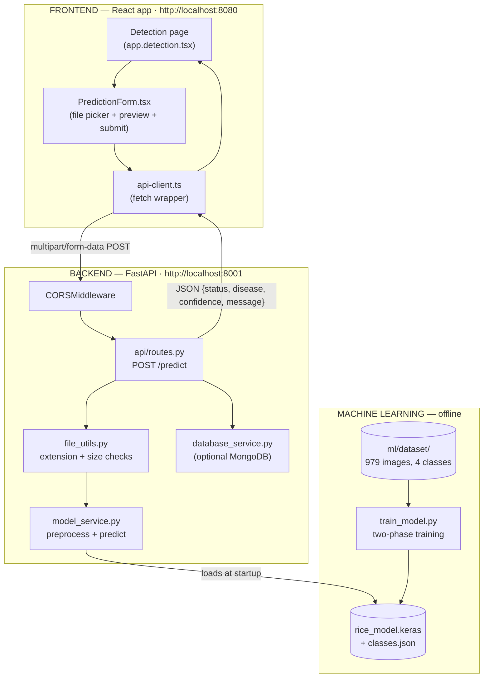

The five-step story the user experiences:

```
Frontend  →  Backend  →  Machine Learning  →  Prediction  →  Response
(upload)     (validate    (model.predict on     (argmax +      (JSON back to
              + save)      preprocessed image)    confidence)    browser, shown
                                                                 in result card)
```

## 2.2 Why this architecture

- **Separation of concerns.** UI code never touches TensorFlow; ML code never touches HTTP. Each layer has one job and one interface.
- **Independent lifecycles.** The model was retrained twice during development. Because the backend only depends on two files (`rice_model.keras`, `classes.json`), retraining required zero backend or frontend changes.
- **Replaceability.** The React app could be swapped for a mobile app tomorrow — the API contract (`POST /predict` with a `file` field) is all it needs. Likewise MobileNetV2 could be swapped for any Keras model that accepts 224×224×3 inputs in [0, 1] and outputs 4 softmax probabilities.
- **Honest failure behaviour.** Every layer degrades gracefully: no model file → API still boots and reports `model_loaded: false`; backend down → frontend catches the fetch error and shows it in the result card; MongoDB absent → predictions still work, storage is silently skipped.

## 2.3 The two contracts that hold everything together

### Contract 1 — HTTP/JSON between frontend and backend

| Endpoint | Method | Request | Response |
|---|---|---|---|
| `/` | GET | — | `{"message": "RiceGuard AI API is running"}` |
| `/health` | GET | — | `{"status": "ok", "model_loaded": true}` |
| `/classes` | GET | — | `{"classes": ["Bacterial Leaf Blight", "Brown Spot", "Healthy Rice Leaf", "Leaf Blast"]}` |
| `/model-info` | GET | — | `{"model_name": "rice_model.keras", "input_size": 224, "number_of_classes": 4, "framework": "TensorFlow", "version": "1.0.0"}` |
| `/predict` | POST | multipart form, field `file` = image | `{"status": "success", "disease": "...", "confidence": 97.5, "message": "..."}` |

The frontend implements its half of the contract in `frontend/src/lib/api-client.ts` (functions `getHealth`, `getModelInfo`, `getClasses`, `predictImage`); the backend implements its half in `backend/api/routes.py` with Pydantic response models in `backend/schemas/prediction.py`. The base URL comes from the Vite environment variable `VITE_API_BASE_URL` (set to `http://localhost:8001` in `frontend/.env`).

### Contract 2 — files on disk between training and serving

| File | Written by | Read by | Purpose |
|---|---|---|---|
| `ml/models/rice_model.keras` | `ModelCheckpoint` during training | `model_service.initialize()` at backend startup; `predict.py` CLI | The trained network (weights + architecture) |
| `ml/models/classes.json` | `train_model.py` after training | `model_service._load_classes()`; `predict.py` | Class names in index order — the decoder ring for softmax outputs |

This second contract is subtle but critical: Keras assigns class indices **alphabetically by folder name** (`Bacterial Leaf Blight`=0, `Brown Spot`=1, `Healthy Rice Leaf`=2, `Leaf Blast`=3). The model outputs only four probabilities; `classes.json` says which name belongs to which position. If the order were wrong, every prediction would show the wrong disease name while looking perfectly confident — which is exactly a bug that was found and fixed during development (the original code hardcoded a different order).

## 2.4 Interaction walkthroughs

### 2.4.1 Application startup (backend)

1. `uvicorn backend.main:app --port 8001` imports `backend/main.py`.
2. `main.py` builds the FastAPI app, reads `settings` (from `backend/core/config.py`, which loads `.env` files and environment variables), attaches `CORSMiddleware` with the allowed origins list, and includes the router.
3. On the `startup` event, `model_service.initialize()` runs: it reads `classes.json` (if present), then tries `keras.models.load_model("ml/models/rice_model.keras")`. Success sets `model_loaded = True`; a missing file or missing TensorFlow only logs a warning — the API stays alive so `/health` can truthfully report the state.

### 2.4.2 Dashboard load (frontend → backend, read-only)

1. User navigates to `/app`. TanStack Router renders `DashboardLayout` (sidebar shell) and inside it the Dashboard route.
2. The `useApiStatus()` hook fires on mount: `Promise.all([getHealth(), getModelInfo()])` — two parallel GETs to port 8001.
3. The browser attaches `Origin: http://localhost:8080`; the backend's CORS middleware recognises the origin and adds `access-control-allow-origin` to the responses, so the browser lets the JavaScript read them.
4. The four `StatusCard`s render live values: API Status "ok", Model Loaded "Yes", the model file name, and the class count (4).

### 2.4.3 A prediction, end to end

1. On `/app/detection`, the user clicks **Choose Image**; `PredictionForm` stores the `File` object in state and shows an instant preview via `URL.createObjectURL`.
2. **Run Prediction** calls `predictImage(file)`: the file goes into a `FormData` under the key `file` and is POSTed to `http://localhost:8001/predict`. (The browser sets the `multipart/form-data` boundary header automatically — the code deliberately does not set `Content-Type`.)
3. FastAPI parses the multipart body into an `UploadFile`. The route handler checks: filename present → extension in {png, jpg, jpeg} → content non-empty → size ≤ 5 MB. Any failure returns HTTP 400 with a `detail` message that the frontend surfaces to the user.
4. The image bytes are written to the `uploads/` folder (`build_upload_path`).
5. `model_service.predict(path)` runs: PIL opens the file, converts to RGB, resizes to 224×224, scales pixels to [0, 1] as float32, adds a batch dimension → shape (1, 224, 224, 3). `model.predict` returns four probabilities; `argmax` picks the winner; the class name comes from the loaded `classes.json` list; confidence = max probability × 100, rounded to two decimals.
6. If MongoDB is configured, `database_service.store_prediction` inserts `{disease, confidence, image_name, timestamp}`; otherwise it returns `None` and life goes on.
7. The route returns a `PredictionResponse` — FastAPI serialises the Pydantic model to JSON.
8. Back in the browser, `request<T>` parses the JSON, `PredictionForm` passes it up through the `onResult` callback, and the Detection page re-renders the result card: Status / Disease Name / Confidence / message.

### 2.4.4 The offline path (training)

1. `python ml/training/train_model.py` resolves the three split folders by name (accepting `Training data` or `train`, etc.), builds `tf.data` datasets, detects the 4 classes from folder names, builds the model, and trains in two phases with six callbacks watching every epoch.
2. `ModelCheckpoint` overwrites `ml/models/rice_model.keras` whenever validation loss improves, so the file on disk is always the *best* model seen, not the last one.
3. After training, the script evaluates that best checkpoint on the test set and writes `metrics.json`, `confusion_matrix.png`, `training_history.json/.png`, `classes.json`, and `class_indices.json`.
4. The next backend restart picks up the new model automatically. Nothing else in the system changes.

## 2.5 Network and process view

At development time exactly three processes run:

| Process | Command | Port | Role |
|---|---|---|---|
| Vite dev server | `npm run dev` (in `frontend/`) | 8080 | Serves the React app with hot reload |
| Uvicorn | `python -m uvicorn backend.main:app --port 8001` | 8001 | Runs FastAPI + the loaded model |
| (Optional) MongoDB | external | 27017 | Prediction storage, only if `MONGODB_URI` is set |

The browser talks to 8080 for the page and directly to 8001 for API calls — there is **no proxy**; cross-origin requests are permitted by the backend's CORS configuration, which explicitly lists `http://localhost:8080` (plus 3000, 5173, and `127.0.0.1:8080`) in `backend/core/config.py`.

---

# SECTION 3 : COMPLETE FOLDER STRUCTURE

## 3.1 Repository tree

```text
riceguard-vision-main/
│
├── backend/                        ← FastAPI application (Python)
│   ├── main.py                     ← app entry point: creates FastAPI app, CORS, startup hook
│   ├── requirements.txt            ← backend Python dependencies
│   ├── api/
│   │   └── routes.py               ← ALL HTTP endpoints (/, /health, /classes, /model-info, /predict)
│   ├── core/
│   │   ├── config.py               ← Settings class; reads .env / environment variables
│   │   └── exceptions.py           ← ModelUnavailableError, InvalidImageError
│   ├── schemas/
│   │   └── prediction.py           ← Pydantic response models (PredictionResponse, ModelInfoResponse, HealthResponse)
│   ├── services/
│   │   ├── model_service.py        ← loads the Keras model; preprocess + predict
│   │   └── database_service.py     ← optional MongoDB storage of predictions
│   ├── utils/
│   │   └── file_utils.py           ← upload folder + extension validation helpers
│   ├── models/                     ← (empty placeholder — the real model lives in ml/models)
│   └── uploads/                    ← runtime storage of uploaded images
│
├── frontend/                       ← React + TypeScript app (TanStack Start / Vite)
│   ├── package.json                ← npm dependencies and scripts (dev/build/lint)
│   ├── vite.config.ts              ← Vite config (via @lovable.dev/vite-tanstack-config)
│   ├── .env                        ← VITE_API_BASE_URL=http://localhost:8001
│   ├── public/                     ← static files served as-is
│   └── src/
│       ├── router.tsx              ← builds the TanStack Router + React Query client
│       ├── routeTree.gen.ts        ← AUTO-GENERATED route tree (never edit by hand)
│       ├── styles.css              ← Tailwind v4 setup + design tokens (colors, radius, utilities)
│       ├── server.ts / start.ts    ← SSR server entry (TanStack Start plumbing)
│       ├── assets/hero-rice.jpg    ← landing page hero image
│       ├── routes/                 ← file-based routing: one file = one page
│       │   ├── __root.tsx          ← HTML shell, <head> metadata, 404 + error pages
│       │   ├── index.tsx           ← public landing page  (/)
│       │   ├── about.tsx           ← about page            (/about)
│       │   ├── contact.tsx         ← contact page          (/contact)
│       │   ├── diseases.tsx        ← disease info cards    (/diseases)
│       │   ├── login.tsx           ← static login screen   (/login)
│       │   ├── app.tsx             ← /app layout route → DashboardLayout
│       │   ├── app.index.tsx       ← dashboard             (/app)
│       │   ├── app.detection.tsx   ← ★ prediction page     (/app/detection)
│       │   ├── app.history.tsx     ← history shell         (/app/history)
│       │   ├── app.analytics.tsx   ← analytics shell       (/app/analytics)
│       │   ├── app.reports.tsx     ← reports shell         (/app/reports)
│       │   └── app.settings.tsx    ← settings summary      (/app/settings)
│       ├── components/
│       │   ├── PredictionForm.tsx  ← ★ upload + preview + submit form
│       │   ├── DashboardLayout.tsx ← sidebar + header shell for /app/*
│       │   ├── PageHeader.tsx      ← page title block
│       │   ├── StatusCard.tsx      ← KPI tile
│       │   ├── EmptyState.tsx      ← dashed "no data" placeholder
│       │   ├── ChartPlaceholder.tsx← decorative chart stand-in (currently unused)
│       │   ├── SiteHeader.tsx      ← public site navigation bar
│       │   ├── SiteFooter.tsx      ← public site footer
│       │   └── ui/                 ← ~50 shadcn/ui primitives (button, card, dialog, table, …)
│       ├── hooks/
│       │   ├── use-api-status.ts   ← fetches /health + /model-info on mount
│       │   └── use-mobile.tsx      ← viewport-width hook (from shadcn)
│       └── lib/
│           ├── api-client.ts       ← ★ fetch wrapper + all API functions
│           ├── env.ts              ← typed access to VITE_API_BASE_URL
│           ├── utils.ts            ← cn() Tailwind class-merge helper
│           └── error-capture.ts, error-page.ts, lovable-error-reporting.ts  ← error plumbing
│
├── ml/                             ← machine learning pipeline (Python)
│   ├── requirements.txt            ← ML-only dependencies (tensorflow, sklearn, matplotlib, tensorboard …)
│   ├── dataset/                    ← the image dataset (979 JPGs)
│   │   ├── Training data/          ← 686 images — one subfolder per class
│   │   │   ├── Bacterial Leaf Blight/   (146)
│   │   │   ├── Brown Spot/              (192)
│   │   │   ├── Healthy Rice Leaf/       (131)
│   │   │   └── Leaf Blast/              (217)
│   │   ├── Validation data/        ← 97 images, same four subfolders (20/27/19/31)
│   │   └── Testing data/           ← 196 images, same four subfolders (42/55/37/62)
│   ├── training/
│   │   └── train_model.py          ← ★ the complete training + evaluation script
│   ├── inference/
│   │   └── predict.py              ← CLI: python predict.py <image> → {disease, confidence}
│   ├── models/                     ← ★ everything the training run produces
│   │   ├── rice_model.keras        ← the served model (13.6 MB)
│   │   ├── classes.json            ← ["Bacterial Leaf Blight", "Brown Spot", "Healthy Rice Leaf", "Leaf Blast"]
│   │   ├── class_indices.json      ← {"Bacterial Leaf Blight": 0, …}
│   │   ├── metrics.json            ← test metrics + confusion matrix + per-class report
│   │   ├── confusion_matrix.png    ← rendered confusion matrix
│   │   ├── training_history.json   ← per-epoch accuracy/loss/lr
│   │   └── training_history.png    ← accuracy & loss curves
│   ├── checkpoints/                ← epoch_XX_val_acc_X.XXX.keras — every epoch that improved val_loss
│   └── logs/
│       ├── training_log.csv        ← CSVLogger output (epoch, accuracy, loss, val_*, lr)
│       └── train/ validation/      ← TensorBoard event files
│
├── config/                         ← reserved for deployment .env files (currently empty)
├── docs/                           ← README.md, PROJECT_WORKFLOW.md, this documentation
├── assets/                         ← project-level static assets
├── uploads/                        ← backend-saved uploaded images (created at runtime)
└── .venv/                          ← Python 3.11.9 virtual environment (all pip packages)
```

## 3.2 Why each top-level folder exists

**`backend/`** exists so all HTTP concerns live in one place, organised in the standard FastAPI "package-per-concern" style: `api/` holds routing only, `core/` holds configuration and exception types, `schemas/` holds the Pydantic data shapes, `services/` holds business logic (the two singletons `model_service` and `database_service`), and `utils/` holds small pure helpers. This layering means, for example, that validation rules (`utils`), response shapes (`schemas`), and inference logic (`services`) can each be modified without touching the others.

**`frontend/`** is a self-contained npm project. Everything the browser needs — routing, components, styling, API access — is under `src/`, and the folder can be built (`npm run build`) and deployed independently of Python entirely.

**`ml/`** is the laboratory. It is intentionally *not* imported by the backend as Python code — the only things that cross the boundary are the files in `ml/models/`. Inside it, `training/` and `inference/` separate the expensive offline job from the cheap repeatable one, `dataset/` keeps data out of code folders, `checkpoints/` preserves intermediate models so a crashed run loses nothing, and `logs/` gives two views of training (CSV for spreadsheets, TensorBoard for interactive curves).

**`ml/dataset/`** uses the *folder-name-is-label* convention: each split contains one folder per class, and Keras's `image_dataset_from_directory` derives both labels and class count from the folder names. Adding a fifth disease would just mean adding a fifth folder to each split.

**`config/` and `docs/`** separate deployment configuration and human documentation from code. `assets/` holds shared static resources.

**`node_modules/` (inside `frontend/`)** — the npm package cache holding React, Vite, Tailwind, TanStack, and every transitive dependency. It is machine-generated from `package.json`/`package-lock.json`, is never edited by hand, is excluded from version control, and is recreated with `npm install`.

**`.venv/`** — same idea for Python: an isolated interpreter + site-packages (TensorFlow 2.21.0, Keras 3.15.1, FastAPI, scikit-learn, etc.) so the project's dependencies never conflict with the system Python. Recreated with `python -m venv .venv` + `pip install -r`.

## 3.3 The four most important files

| File | One-line description |
|---|---|
| `ml/training/train_model.py` | The whole ML story: dataset detection → augmentation → model building → two-phase training with 6 callbacks → evaluation → artifact saving |
| `backend/services/model_service.py` | The bridge between HTTP and TensorFlow: loads the model once, preprocesses each upload identically to training, returns disease + confidence |
| `frontend/src/lib/api-client.ts` | The frontend's single door to the backend: typed fetch wrapper + the four API functions |
| `backend/core/config.py` | Every tunable (model path, upload limits, CORS origins, ports, MongoDB) with environment-variable overrides |

---

# SECTION 4 : FRONTEND EXPLANATION

*This section assumes zero prior React knowledge. Every concept is introduced the first time it appears.*

## 4.1 What React is, in this project's terms

React is a JavaScript library that builds user interfaces out of **components** — small functions that return HTML-like markup (called **JSX**). When a component's data changes, React re-renders only that part of the screen. Three React ideas cover 95 % of this project's frontend:

- **Props** — inputs a parent passes to a child component, like function arguments. Example: the Detection page passes `onResult={setResult}` into `PredictionForm`.
- **State (`useState`)** — data a component owns that can change over time. When state changes, the component re-renders. Example: `const [file, setFile] = useState<File | null>(null)` stores the chosen image.
- **Effects (`useEffect`)** — code that runs after render, used for side effects like fetching data. Example: `useApiStatus` fetches `/health` when the Dashboard first appears.

The project uses **TypeScript**, which adds compile-time types to JavaScript — interfaces like `PredictionResult { status: string; disease: string; confidence: number; message: string }` guarantee the frontend and backend agree on data shapes.

## 4.2 Overall frontend architecture

The app is a **TanStack Start** application: React + **TanStack Router** (file-based routing) + **Vite** (dev server and bundler) + **Tailwind CSS v4** (styling) + **shadcn/ui** (pre-built accessible UI primitives in `components/ui/`) + **lucide-react** (icons). There is **no Redux or global state manager** — the app's state needs are so small that local component state plus prop callbacks are enough. There is **no axios** — API calls use the browser's native `fetch` through one shared wrapper.

The page structure is two worlds:

1. **Public site** (`/`, `/about`, `/contact`, `/diseases`, `/login`) — marketing/informational pages wrapped in `SiteHeader` + `SiteFooter`.
2. **Dashboard** (`/app`, `/app/detection`, `/app/history`, `/app/analytics`, `/app/reports`, `/app/settings`) — the working application, wrapped in `DashboardLayout` (sidebar + top bar).

## 4.3 Routing

TanStack Router uses **file-based routing**: every file in `src/routes/` becomes a URL automatically.

| File | URL | Component |
|---|---|---|
| `__root.tsx` | (wraps everything) | HTML shell, `<head>`, 404 page, error page |
| `index.tsx` | `/` | Landing |
| `about.tsx` | `/about` | AboutPage |
| `contact.tsx` | `/contact` | ContactPage |
| `diseases.tsx` | `/diseases` | DiseasesPage |
| `login.tsx` | `/login` | LoginPage |
| `app.tsx` | `/app` (layout) | DashboardLayout |
| `app.index.tsx` | `/app` | Dashboard |
| `app.detection.tsx` | `/app/detection` | Detection |
| `app.history.tsx` | `/app/history` | History |
| `app.analytics.tsx` | `/app/analytics` | Analytics |
| `app.reports.tsx` | `/app/reports` | Reports |
| `app.settings.tsx` | `/app/settings` | SettingsPage |

The dot in `app.detection.tsx` means "child of the `app` route". The parent `app.tsx` maps `/app` to `DashboardLayout`, which renders an `<Outlet />` — a placeholder where the active child page appears. That is why every `/app/*` page automatically gets the sidebar: the layout renders once, children swap inside it.

`routeTree.gen.ts` is generated automatically by the router plugin from these files — it is never edited manually. `router.tsx` exports `getRouter()`, which creates the router with a React Query `QueryClient` in context and `scrollRestoration: true`.

`__root.tsx` also defines global `<head>` metadata (title "RiceGuard AI — AI-powered Rice Disease Detection", Open Graph tags, Google Fonts Inter), a styled **404 page** ("Page not found" with a "Go home" link), and an **error boundary** page ("This page didn't load") with a "Try again" button that calls `router.invalidate()`.

## 4.4 The API layer — `lib/api-client.ts`

This is the only file that knows how to talk to the backend. It has four parts:

1. **Base URL resolution**:
   ```ts
   const API_BASE_URL = import.meta.env.VITE_API_BASE_URL ?? "http://localhost:8001";
   ```
   Vite replaces `import.meta.env.VITE_API_BASE_URL` at build time with the value from `frontend/.env` (`http://localhost:8001`). The `??` fallback keeps the app working even without a `.env`.

2. **`ApiError`** — a custom `Error` subclass that carries the HTTP status code, so UI code can distinguish a 400 from a 500 if it ever needs to.

3. **`request<T>(path, init)`** — the generic wrapper every call goes through. It:
   - `fetch`es `API_BASE_URL + path`;
   - reads the `content-type` header and parses the body as JSON or text accordingly;
   - if `response.ok` is false, extracts the best available error message (`detail` → `message` → raw text) and **throws** an `ApiError`;
   - otherwise returns the parsed payload typed as `T`.
   
   Centralising this means error handling, parsing, and the base URL are written once, not five times.

4. **The four API functions** — thin, typed wrappers:
   - `getHealth()` → `GET /health`
   - `getModelInfo()` → `GET /model-info`
   - `getClasses()` → `GET /classes`
   - `predictImage(file)` → builds a `FormData`, appends the file under the key `"file"` (matching FastAPI's parameter name), and `POST`s to `/predict`. No `Content-Type` header is set manually — the browser generates the correct `multipart/form-data; boundary=…` automatically. Setting it by hand is a classic bug because the boundary would be missing.

`lib/env.ts` exposes the same base URL as `env.apiBaseUrl` for non-API uses. `lib/utils.ts` exports `cn()` — the standard shadcn helper combining `clsx` (conditional classes) with `tailwind-merge` (deduplicating conflicting Tailwind classes).

## 4.5 The prediction flow — the two files that matter most

### 4.5.1 `components/PredictionForm.tsx`

**Purpose:** everything about choosing and submitting an image. 
**Input (props):** `onResult: (result) => void` — a callback to hand the prediction upward. 
**Output:** calls `onResult(...)` with either the backend's JSON or a synthetic error result. 
**Why it exists:** isolating upload mechanics keeps the Detection page simple and makes the form reusable.

Internal state (all `useState`):

| State | Type | Purpose |
|---|---|---|
| `file` | `File \| null` | the chosen image |
| `previewUrl` | `string \| null` | object URL for the `` preview |
| `isLoading` | `boolean` | disables the button, shows spinner + "Sending…" |
| `error` | `string \| null` | red error banner text |

Plus one `useRef<HTMLInputElement>` — the actual `<input type="file">` is hidden (`className="hidden"`, `accept="image/png,image/jpeg,image/jpg"`); the styled **Choose Image** button forwards clicks to it via `fileInputRef.current?.click()`. This is the standard pattern for custom-styled file pickers.

Flow: `handlePickFile` stores the file, creates a preview with `URL.createObjectURL(selected)` (a local blob URL — the image is *not* uploaded yet), and clears any error. `handleSubmit` guards against no-file, sets loading, calls `predictImage(file)`, and on success passes the result up; on failure it both shows the message locally and sends `{status:"error", disease:"Unavailable", confidence:0, message}` up so the result card also reflects the failure. `finally` always clears the loading flag.

### 4.5.2 `routes/app.detection.tsx`

**Purpose:** the Disease Detection page — composes the form and the result display. 
**State:** exactly one — `const [result, setResult] = useState<PredictionResult | null>(null)`. 
**Communication:** parent-child by props: `<PredictionForm onResult={setResult} />`. When the form calls `onResult`, the page's state updates and the result card re-renders. This is "lifting state up" — the canonical React pattern for sibling communication.

The right column renders:
- **Prediction Result card** — a status badge (shows "Awaiting" until a result exists), then rows for Status, Disease Name, and Confidence (`result.confidence.toFixed(2)%`), then the backend `message` in a box that turns green on `status === "success"`.
- **Model Status card** — checks `result?.status === "Model not trained"` (the special non-error response the backend returns when no model file is loaded) and switches between an amber "Model Not Available Yet" warning and a green "Backend integration is ready."

## 4.6 The dashboard shell and status system

### `components/DashboardLayout.tsx`

Renders the persistent chrome for all `/app/*` pages: a fixed 16-rem sidebar (desktop) with the brand and a nav list built from a data array (`items[]` — Dashboard, Disease Detection, History, Analytics, Reports, Settings, plus a Logout link that simply navigates to `/`), a mobile drawer variant controlled by `useState(open)`, and a sticky header with a decorative search box, a notification bell, and a static user chip ("User / Researcher"). Active-link highlighting compares `useRouterState()`'s pathname with each item (`exact` match for `/app`, prefix match otherwise). The page content renders through `<Outlet />`.

### `hooks/use-api-status.ts`

A **custom hook** — a reusable function whose name starts with `use` and which may call other hooks. `useApiStatus()` runs one `useEffect` on mount: `Promise.all([getHealth(), getModelInfo()])`, storing `{health, modelInfo, loading, error}`. It uses the **ignore-flag cleanup pattern** (`let ignore = false; return () => { ignore = true }`) so that if the component unmounts before the fetch resolves, no state update happens on a dead component. It returns the four values for any component to consume.

### `routes/app.index.tsx` (Dashboard)

Calls `useApiStatus()` and renders four `StatusCard`s: **API Status** (health status or "Offline" + error text), **Model Loaded** ("Yes"/"No" + model file name), **Prediction State** ("Ready"/"Pending"), **Classes** (the live number — 4). Below is the "Prediction Activity" table which currently always renders an `EmptyState` ("No Prediction History") because prediction history is not persisted anywhere the frontend can read yet.

## 4.7 Every other page, briefly but completely

- **`index.tsx` (Landing)** — pure static marketing: hero ("Detect rice diseases in seconds with deep learning."), CTAs to `/app/detection` and `/app`, a stats strip (Diseases 4+, Model CNN, Framework TF), a six-card features grid, a five-step "How it works" (Upload → Preprocessing → Deep Learning Model → Prediction → Treatment Recommendation), benefits, and a bottom CTA. No state, no API calls.
- **`about.tsx`** — static cards: Project Overview, Objectives, Research Gap, Expected Outcomes, Technology Stack (React/TS/Vite/Tailwind; TensorFlow/Keras/OpenCV/CNN/MobileNetV2), a five-step workflow strip, and placeholder Team/Guide cards ("M1–M4", "Guide Name —").
- **`contact.tsx`** — three info cards (Email/Phone/Address, values "—"), a map placeholder, and a contact form whose `onSubmit` only calls `e.preventDefault()` — decorative by design.
- **`diseases.tsx`** — four disease cards (Leaf Blast/Fungal, Brown Spot/Fungal, Bacterial Blight/Bacterial, Healthy Leaf/Healthy) with Description/Symptoms/Treatment all reading "No Data Available" until a knowledge base exists.
- **`login.tsx`** — a standalone sign-in card (email, password, remember-me). **There is no authentication logic** — submit is prevented and nothing is checked; it exists to show where auth would live.
- **`app.history.tsx`** — the history UI shell: search/filter/date toolbar, a six-column table (Image, Disease, Confidence, Date, Status, Action) whose body is a single `EmptyState` row ("No History Available"), and an inert pagination footer ("0 of 0 results").
- **`app.analytics.tsx`** — four static `StatusCard`s (Prediction History 0, Model Status Pending, Backend Online, Reports 0) plus a card explaining that the page shows readiness state, not fabricated statistics. Values here are hardcoded strings, not live checks.
- **`app.reports.tsx`** — reports shell: disabled "Generate Report" button, an empty Recent Reports table, and a dashed "Report Preview" placeholder.
- **`app.settings.tsx`** — read-only configuration summary via a local `Field` component (Backend API: FastAPI; Frontend: React + TanStack Router; Model Status; Dataset) and a Readiness card with three status rows.

## 4.8 Shared presentational components

| Component | Props | Purpose |
|---|---|---|
| `PageHeader` | `title` (required), `description?`, `actions?` | consistent page title block on every dashboard page |
| `StatusCard` | `title`, `value`, `description`, `icon` (all required) | KPI tile: uppercase label, icon badge, 3xl value, caption |
| `EmptyState` | `icon?` (default Inbox), `title`, `description?`, `action?`, `className?` | the "no data yet" placeholder used in tables/panels |
| `ChartPlaceholder` | `title`, `subtitle?`, `variant?: bar\|line\|pie` | decorative chart stand-in with fake bars at 40 % opacity; currently not imported anywhere |
| `SiteHeader` | — | sticky glass navbar for public pages; mobile menu via `useState` |
| `SiteFooter` | — | public footer; computes `new Date().getFullYear()`; placeholder team columns |

The `components/ui/` folder holds ~50 **shadcn/ui** primitives (button, card, dialog, table, tabs, toast, …). These are copied-in source files, not an npm package, which is the shadcn philosophy: you own and can edit every primitive. Most current pages style elements directly with Tailwind classes, but the primitives are available for extension.

## 4.9 Styling approach

`styles.css` is a **Tailwind CSS v4 CSS-first configuration** — there is no `tailwind.config.js`; everything is declared in CSS:

- `@import "tailwindcss"` + `@source "../src"` tells Tailwind where to scan for class names.
- An `@theme inline` block maps design tokens to CSS variables: font (`Inter`), a radius scale derived from `--radius: 0.75rem`, and semantic color names (`--color-background`, `--color-primary`, …).
- The `:root` palette defines the actual colors in **oklch** (a perceptually uniform color space): background `#F7F8F5` (off-white), primary Forest Green `#2F6F4F`, secondary Olive `#6E8B3D`, accent Dark Green `#1F5133` — an agricultural green identity.
- Three custom utilities are defined with `@utility`: `glass` (translucent blurred header background), `card-surface` (the standard card look: white, border, radius, soft shadow — used everywhere), and `animate-fade-in` (0.5 s fade-and-rise entry animation).
- Components then style themselves with utility classes inline, e.g. `className="rounded-xl border border-border bg-card p-4"` — no separate CSS files per component.

Because the tokens are CSS variables, a future dark theme only needs a `.dark` variable block (the `@custom-variant dark` hook is already declared).

## 4.10 Complete frontend data flow, in one picture

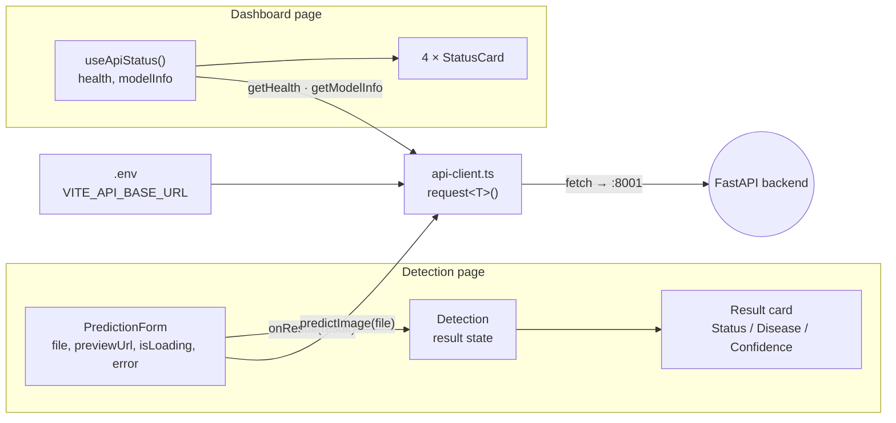

State never travels sideways: it goes **down** through props (`onResult`, card props) and **up** through callbacks — the simplest correct architecture for an app of this size.

---

# SECTION 5 : BACKEND EXPLANATION

## 5.1 What FastAPI is and why this project uses it

**FastAPI** is a modern Python web framework for building HTTP APIs. Its defining features, all used in this project:

- **Type-hint driven.** You declare a parameter as `file: UploadFile = File(...)` and FastAPI parses the multipart body, validates presence, and hands you a ready object. Response models declared as Pydantic classes are validated and serialised automatically.
- **Automatic documentation.** Because everything is typed, FastAPI generates an OpenAPI schema and serves interactive docs at `http://localhost:8001/docs` — you can test `/predict` from the browser with zero extra code.
- **Async-capable.** Route handlers can be `async def`, letting one worker interleave many requests while waiting on I/O (like reading the uploaded file with `await file.read()`).
- **Uvicorn** is the ASGI server that actually listens on the port and feeds requests to the FastAPI app: `python -m uvicorn backend.main:app --host 127.0.0.1 --port 8001`.

Compared to Flask (no built-in validation/docs, sync-first) and Django (a full-site framework with ORM and templates this project doesn't need), FastAPI is the right size: a thin, fast, self-documenting API layer over the model.

## 5.2 Backend structure and responsibility map

```text
backend/
├── main.py                    ← app assembly: middleware, router, startup hook
├── api/routes.py              ← HTTP layer: endpoints, status codes, error translation
├── core/config.py             ← configuration: env vars, paths, limits, origins
├── core/exceptions.py         ← domain exceptions (ModelUnavailableError, InvalidImageError)
├── schemas/prediction.py      ← data shapes (Pydantic): what JSON looks like
├── services/model_service.py  ← ML bridge: load model, preprocess, predict
├── services/database_service.py ← optional MongoDB persistence
└── utils/file_utils.py        ← file validation + upload path helpers
```

The layering rule: **routes call services; services never import routes.** Schemas and utils are leaves imported by anyone. Config is imported everywhere but imports nothing from the app.

## 5.3 `backend/main.py` — application assembly

Line by line, what happens at import time:

1. `PROJECT_ROOT = Path(__file__).resolve().parents[1]` is computed and inserted into `sys.path` so that `backend.*` imports work no matter where uvicorn is launched from.
2. `app = FastAPI(title="RiceGuard AI API", description=…, version="1.0.0")` creates the application object (this also names the `/docs` page).
3. **CORS middleware** is attached (explained fully in §5.8): the comma-separated `settings.allow_origins` string is split into a list, and `CORSMiddleware` is registered with `allow_credentials=True`, `allow_methods=["*"]`, `allow_headers=["*"]`.
4. `app.include_router(api_router)` mounts every endpoint defined in `api/routes.py`.
5. `@app.on_event("startup")` registers `startup_event()`, which calls **`model_service.initialize()`** — so the model loads exactly once, when the server boots, not on the first request. A cold model load takes several seconds (TensorFlow initialisation); doing it at startup means the first user doesn't pay that cost.
6. The `if __name__ == "__main__"` block allows `python backend/main.py` to self-host with uvicorn using the configured host/port.

## 5.4 `backend/core/config.py` — configuration

A single `Settings` Pydantic model, instantiated once as `settings`, gives every module typed access to configuration. Each field reads an environment variable with a sensible default:

| Setting | Env var | Default |
|---|---|---|
| `model_path` | `MODEL_PATH` | `<project root>/ml/models/rice_model.keras` |
| `upload_folder` | `UPLOAD_FOLDER` | `<project root>/uploads` |
| `max_upload_size` | `MAX_UPLOAD_SIZE` | `5242880` (5 MB) |
| `allow_origins` | `ALLOWED_ORIGINS` | `http://localhost:3000, :5173, :8080, http://127.0.0.1:8080` |
| `host` / `port` | `HOST` / `PORT` | `0.0.0.0` / `8000` (the dev run overrides port to 8001 on the command line) |
| `mongodb_uri` / `mongodb_db` / `mongodb_collection` | `MONGODB_URI` etc. | `None` / `riceguard_ai` / `predictions` |

Before the model is constructed, a small hand-written `_load_env_file()` scans three candidate locations (`<root>/.env`, `backend/.env`, `config/.env`), parses `KEY=value` lines (skipping comments), and calls `os.environ.setdefault` — meaning real environment variables always win over file values. This is a dependency-free alternative to python-dotenv.

**Why it matters:** every deployment concern (where the model lives, who may call the API, how big uploads may be) is changeable without touching code.

## 5.5 `backend/services/model_service.py` — the ML bridge

This file is the heart of the backend. It defines `ModelService` and exports a single shared instance `model_service` (a module-level singleton — Python caches modules, so every importer gets the same object and the model is held in memory once).

**`__init__`** sets defaults: `model = None`, `model_loaded = False`, `input_size = 224`, the fallback class list `["Bacterial Leaf Blight", "Brown Spot", "Healthy Rice Leaf", "Leaf Blast"]` (the real classes in correct index order), `model_path` from settings, and `classes_path` = `classes.json` next to the model.

**`initialize()`** — called once at startup — is deliberately failure-tolerant:
1. `_load_classes()` replaces the fallback list with the contents of `classes.json` if the file exists and holds a non-empty list. This keeps the label order in sync with whatever the last training run produced.
2. If the model file does not exist → log a warning, keep `model_loaded = False`, **return without raising**. The API stays up; `/health` reports the truth; `/predict` returns a friendly "Model not trained" response.
3. TensorFlow is imported *inside* the method (`from tensorflow import keras`) — so even a machine without TensorFlow can run the API shell.
4. `keras.models.load_model(str(self.model_path))` deserialises the network — architecture and weights — and sets `model_loaded = True`.

**`preprocess_image(image_path)`** — must mirror the training pipeline exactly, and it does:
```python
image = Image.open(image_path).convert("RGB")   # 3 channels, drops alpha/grayscale
image = image.resize((224, 224))                # model's fixed input size
array = np.asarray(image, dtype=np.float32) / 255.0   # [0,255] → [0,1]
return np.expand_dims(array, axis=0)            # (224,224,3) → (1,224,224,3)
```
The batch dimension exists because Keras models always take batches; a single image is a batch of one. Note the contract: the service scales to **[0, 1]**; the model itself internally rescales [0, 1] → [−1, 1] for MobileNetV2 (a Rescaling layer baked into the saved model). This split means the backend never needs to know MobileNetV2's quirks.

**`predict(image_path)`**:
1. Raises `RuntimeError` if no model is loaded (the route converts this into the "Model not trained" response).
2. `self.model.predict(processed, verbose=0)[0]` → a NumPy vector of 4 softmax probabilities summing to 1, e.g. `[0.0007, 0.0027, 0.9962, 0.0005]`.
3. `predicted_index = int(np.argmax(prediction))` → position of the highest probability.
4. Returns `{"disease": self.classes[predicted_index], "confidence": round(max_prob*100, 2), "probabilities": [...all four, rounded to 4 dp...]}`.

**`get_model_info()`** returns the static metadata served by `/model-info`.

## 5.6 `backend/api/routes.py` — every endpoint

All endpoints live on one `APIRouter` mounted at the root.

### `GET /` — liveness
Returns `{"message": "RiceGuard AI API is running"}`. Useful as a quick "is anything there?" check.

### `GET /health` — health check
Returns `HealthResponse(status="ok", model_loaded=model_service.model_loaded)`. The frontend dashboard polls this on load; `model_loaded` is the single flag that distinguishes "API up, model missing" from "everything ready".

### `GET /classes` — label list
Returns `{"classes": [...]}` straight from `model_service.classes`. Lets any client know what the model can predict without hardcoding.

### `GET /model-info` — model metadata
Returns `ModelInfoResponse`: model file name, input size 224, number of classes 4, framework "TensorFlow", version "1.0.0". Drives the Dashboard's status cards.

### `POST /predict` — the main event

Signature: `async def predict(file: UploadFile = File(...))`. Step by step:

1. **Filename check** — missing filename → HTTP 400 "No file uploaded."
2. **Extension check** — `is_supported_file()` lowercases the suffix and requires `png/jpg/jpeg` → otherwise 400 "Unsupported file type…".
3. **Content checks** — `await file.read()` loads the bytes; empty → `InvalidImageError`; larger than `settings.max_upload_size` (5 MB) → `InvalidImageError`. Both become HTTP 400 with the message as `detail`.
4. **Persist upload** — `ensure_upload_directory` + `build_upload_path` compute `uploads/<filename>`, and the bytes are written. (The image is saved *before* prediction — useful for debugging and future dataset growth.)
5. **Model gate** — if `model_service.model_loaded` is false, raise `ModelUnavailableError`, which is caught below and turned into a **200 response** with `status="Model not trained"`, `disease="Not available"`, `confidence=0.0`. Design choice: an untrained system is a *state*, not a client error, and the frontend renders it as an amber notice rather than a failure.
6. **Predict** — `model_service.predict(str(upload_path))` (see §5.5).
7. **Respond** — build `PredictionResponse(status="success", disease=…, confidence=…, message="Prediction completed successfully.")`.
8. **Persist result (optional)** — `database_service.store_prediction({...})` inserts into MongoDB if configured; otherwise it is a no-op returning `None`.
9. **Error translation** — the `try/except` ladder maps: `InvalidImageError → 400`, `ModelUnavailableError → 200 "Model not trained"`, `HTTPException → re-raise as-is`, anything else → logged with traceback and returned as HTTP 500 "Prediction failed due to an internal error." (the client never sees internal details).

## 5.7 Supporting files

**`schemas/prediction.py`** — three Pydantic models define the exact JSON the API emits: `PredictionResponse{status, disease, confidence, message}`, `ModelInfoResponse{model_name, input_size, number_of_classes, framework, version}`, `HealthResponse{status, model_loaded}`. Declaring them as `response_model` on the routes gives validation (a buggy handler cannot silently return a malformed payload) and drives the OpenAPI docs.

**`utils/file_utils.py`** — `ALLOWED_EXTENSIONS = {"png","jpg","jpeg"}`; `ensure_upload_directory` (mkdir -p), `is_supported_file` (suffix check), `build_upload_path` (join + ensure). Pure functions, trivially testable.

**`core/exceptions.py`** — two tiny domain exception classes. Raising `InvalidImageError` deep in the handler and translating it once at the boundary keeps validation logic separate from HTTP status decisions.

**`services/database_service.py`** — `DatabaseService.__init__` checks `settings.mongodb_uri`; without it, `enabled=False` and `store_prediction` returns `None` immediately. With it, a `MongoClient` (3-second server-selection timeout) targets db `riceguard_ai`, collection `predictions`, and `store_prediction` inserts `{disease, confidence, image_name, timestamp: datetime.utcnow()}` and returns the document with its new id. The app never *reads* from MongoDB yet — persistence is forward-looking groundwork for the History page.

## 5.8 CORS, explained properly

**The problem.** The browser's *same-origin policy* blocks JavaScript on `http://localhost:8080` (origin = scheme + host + port) from reading responses from `http://localhost:8001` — a different port is a different origin. Without extra headers, the fetch would fail with the infamous "CORS policy" console error — exactly the bug hit during development.

**The mechanism.** CORS (Cross-Origin Resource Sharing) is the server's way of opting in. For simple requests (GET, or POST with form data), the browser sends the request with an `Origin: http://localhost:8080` header; the server must answer with `access-control-allow-origin: http://localhost:8080` or the browser discards the response. For non-simple requests, the browser first sends a **preflight** `OPTIONS` request asking "may I?"; the middleware answers with allowed methods/headers/max-age.

**The implementation.** `CORSMiddleware` in `main.py` handles all of this automatically for every route: it answers preflights and stamps the allow-origin header on real responses, but *only* for origins in the configured list. The verified behaviour: `OPTIONS /predict` with `Origin: http://localhost:8080` returns `access-control-allow-origin: http://localhost:8080`, `access-control-allow-methods: DELETE, GET, HEAD, OPTIONS, PATCH, POST, PUT`, `access-control-max-age: 600`.

**Why not `*`?** Because `allow_credentials=True` is set, and the CORS spec forbids wildcard origins with credentials; an explicit allowlist is also simply safer.

**Middleware generally:** middleware is code that wraps every request/response — it runs before routing and after the handler. CORS is this project's only custom middleware; others (auth, rate limiting, logging) would attach the same way with `app.add_middleware`.

## 5.9 Request lifecycle summary

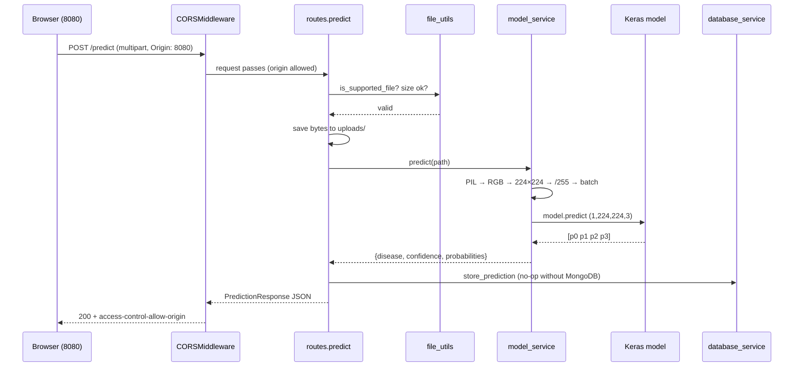

---

# SECTION 6 : MACHINE LEARNING EXPLANATION

## 6.1 The ML folder map

| Path | Role |
|---|---|
| `ml/training/train_model.py` | The complete training program — everything from dataset discovery to saved metrics happens here |
| `ml/inference/predict.py` | Standalone CLI prediction: `python predict.py <image>` |
| `ml/dataset/` | 979 labelled JPGs in `Training data` / `Validation data` / `Testing data` |
| `ml/models/` | Outputs: the model, class files, metrics, plots |
| `ml/checkpoints/` | A saved model copy from every epoch that improved validation loss |
| `ml/logs/` | `training_log.csv` (CSVLogger) + TensorBoard event files |
| `ml/requirements.txt` | tensorflow, keras, numpy, Pillow, scikit-learn, matplotlib, tensorboard |

## 6.2 Dataset loading — how the script finds and reads images

### Folder-name flexibility

The dataset folders are literally named `Training data`, `Validation data`, `Testing data`. Many tutorials hardcode `train/valid/test`, and the original version of this script did too — it crashed. The fix is a lookup table plus a case-insensitive resolver:

```python
SPLIT_CANDIDATES = {
    "train":      ("train", "training", "training data", "train data"),
    "validation": ("valid", "validation", "val", "validation data", "valid data"),
    "test":       ("test", "testing", "testing data", "test data"),
}

def resolve_split_dir(split):
    existing = {e.name.lower(): e for e in DATASET_DIR.iterdir() if e.is_dir()}
    for candidate in SPLIT_CANDIDATES[split]:
        if candidate in existing:
            return existing[candidate]
    raise FileNotFoundError(...)
```

It lowercases every real folder name and returns the first match, so **either** naming convention (or several others) works with zero configuration. A missing split raises a clear error listing what names would have been accepted.

### Reading images with `image_dataset_from_directory`

```python
train_ds = image_dataset_from_directory(
    TRAIN_DIR, image_size=(224, 224), batch_size=32,
    label_mode="categorical", shuffle=True, seed=42)
```

This Keras utility scans the split folder, treats **each subfolder as one class**, sorts class names alphabetically to assign indices (Bacterial Leaf Blight → 0, Brown Spot → 1, Healthy Rice Leaf → 2, Leaf Blast → 3), decodes each JPG, resizes it to 224×224, and yields batches of 32 images with **one-hot labels** (`label_mode="categorical"` → Healthy Rice Leaf = `[0,0,1,0]`). Training data is shuffled with a fixed `seed=42` for reproducibility; validation and test keep `shuffle=False` so predictions stay aligned with labels during evaluation. The number of classes is **detected, never hardcoded** — `train_ds.class_names` drives the size of the output layer, `classes.json`, and everything else.

### Normalisation, augmentation, batching, prefetching

Raw pixels are integers 0–255 — a bad scale for gradient descent. All three splits get `Rescaling(1/255)` applied through `tf.data.map`, producing floats in [0, 1] (the same contract the backend follows at inference time).

Only the **training** split additionally passes through an augmentation pipeline:

```python
data_augmentation = keras.Sequential([
    layers.RandomFlip("horizontal"),        # mirror image, 50% chance
    layers.RandomRotation(0.055),           # ± ~20 degrees
    layers.RandomTranslation(0.2, 0.2),     # shift up to 20% in x and y
    layers.RandomZoom(0.2),                 # zoom in/out up to 20%
])
```

Every epoch each image is randomly transformed differently, so the network effectively never sees the same picture twice. With only 686 training images this is essential — it multiplies the *effective* dataset size and teaches the model that a disease is still the same disease when the leaf is flipped, tilted, shifted, or nearer to the camera. Validation and test data are **never augmented**: they must measure performance on real, unmodified images.

Finally `.prefetch(tf.data.AUTOTUNE)` lets the CPU prepare the next batch while the current one is training — a pipeline parallelism trick that keeps the (CPU) trainer fed. Batching at 32 means gradients are averaged over 32 images per weight update: large enough for stable gradients, small enough for memory, and it gives 686/32 ≈ **22 steps per epoch**.

## 6.3 MobileNetV2 — from beginner to advanced

**Beginner view.** A convolutional neural network (CNN) learns visual features hierarchically: early layers detect edges and colors, middle layers detect textures and patterns (spots, lesions), late layers detect object-level concepts. MobileNetV2 is a famous CNN designed by Google to be *small and fast* — ideal for phones and CPUs — while staying accurate.

**Intermediate view.** MobileNetV2's efficiency comes from **depthwise separable convolutions**: instead of one expensive convolution that mixes space and channels simultaneously, it does a cheap per-channel spatial convolution (depthwise) followed by a 1×1 convolution that mixes channels (pointwise). This cuts multiplications roughly 8–9× versus standard convolutions with minimal accuracy loss.

**Advanced view.** Its building block is the **inverted residual with linear bottleneck**: a 1×1 conv *expands* channels ~6×, a depthwise 3×3 conv filters spatially in that expanded space, and a 1×1 conv *projects* back down to a narrow bottleneck — with **no ReLU on the final projection** (a linear bottleneck), because ReLU in low-dimensional spaces destroys information. Skip connections join the narrow bottlenecks (the inverse of ResNet, which connects wide layers — hence "inverted"). Stacking these blocks, the network maps a 224×224×3 image to a **7×7×1280** feature volume. In this project that base contains **2,257,984 parameters**, pretrained on ImageNet.

**Input range subtlety (a real bug fixed in this project).** MobileNetV2's ImageNet weights were trained on inputs scaled to **[−1, 1]**. The first training run fed [0, 1] and reached only 60.2 % test accuracy; adding a `Rescaling(scale=2.0, offset=-1.0)` layer *inside* the model (so external callers keep the simple [0, 1] contract) lifted test accuracy to 65.8 %. Pretrained networks only work well when fed the distribution they were trained on.

## 6.4 Transfer learning — why and how

Training a CNN from scratch needs tens of thousands of images minimum; this dataset has 686. **Transfer learning** reuses knowledge: MobileNetV2 already learned universal visual features from 1.4 M ImageNet images. Edges, textures, and color blobs are the same in every domain — only the final "what does this combination mean" must be relearned for rice diseases.

**Frozen layers.** `base_model.trainable = False` freezes all base weights: during Phase 1 backpropagation they receive no updates; only the new classification head (332,036 trainable parameters, ~13 % of the model) learns. Freezing prevents the tiny dataset's noisy gradients from destroying good pretrained features, and it makes training fast — 3.9 minutes total on CPU.

**The head built on top** (`build_model` in `train_model.py`):

```python
inputs  = Input((224, 224, 3))
x = Rescaling(2.0, offset=-1.0)(inputs)     # [0,1] → [-1,1]
x = base_model(x, training=False)           # frozen MobileNetV2 → (7,7,1280)
x = GlobalAveragePooling2D()(x)             # → 1280 vector
x = BatchNormalization()(x)
x = Dropout(0.4)(x)
x = Dense(256, activation="relu")(x)
x = BatchNormalization()(x)
x = Dropout(0.3)(x)
outputs = Dense(4, activation="softmax")(x)
```

Layer-by-layer reasoning:

- **GlobalAveragePooling2D** collapses each of the 1280 feature maps from 7×7 to its average — a 62,720-value volume becomes a 1280-value vector with *zero* parameters. Versus `Flatten` (which would feed 62,720 inputs into the next Dense layer and explode the parameter count ~49×), GAP is dramatically less overfitting-prone and is the standard modern choice.
- **BatchNormalization** standardises each feature across the batch (then learns a scale and shift). It stabilises and speeds up training and adds mild regularisation. Used twice: on the pooled features and after the Dense layer.
- **Dropout(0.4) / Dropout(0.3)** randomly zeroes 40 % / 30 % of activations during training only. Neurons cannot co-adapt or rely on any single feature, which fights overfitting — the project's main enemy at 686 images.
- **Dense(256, relu)** is the one hidden layer that learns rice-specific feature combinations ("elongated grey lesion + yellow halo → blast-like"). ReLU (`max(0, x)`) provides the non-linearity. 1280×256+256 = 327,936 parameters — the bulk of the trainable head.
- **Dense(4, softmax)** outputs one score per class, and **softmax** exponentiates and normalises them into probabilities that are positive and sum to 1 — exactly what "confidence 99.62 %" means in the UI. The size **4 is derived from the detected class count**, never hardcoded.

**Loss — categorical crossentropy.** With one-hot labels and a softmax output, crossentropy `−Σ yᵢ log(pᵢ)` reduces to `−log(p_true)`: the loss is small when the model assigns high probability to the correct class and explodes toward infinity as that probability approaches zero. It is the maximum-likelihood-correct loss for multi-class classification, and its gradient with softmax is the beautifully simple `p − y`.

**Optimizer — Adam.** Adam keeps a running mean (momentum) and a running variance of each parameter's gradients and scales each parameter's step individually. It converges fast without manual learning-rate tuning. Phase 1 uses the default learning rate **1e-3**; the fine-tuning phase recompiles with **1e-5** (100× smaller) because updating pretrained weights must be gentle.

## 6.5 The training pipeline — what actually ran

### Phase 1 — train the head (frozen base)

Up to 15 epochs; **early-stopped at epoch 14**. Best epoch (9): train accuracy 81.78 %, validation accuracy 69.07 %, validation loss 0.7906. Along the way `ReduceLROnPlateau` cut the learning rate 1e-3 → 2e-4 → 4e-5 → 8e-6 whenever validation loss plateaued for 2 epochs.

### Phase 2 — fine-tuning (partially unfrozen)

```python
base_model.trainable = True
for layer in base_model.layers[:100]:
    layer.trainable = False          # keep early layers frozen
model.compile(optimizer=Adam(1e-5), ...)
```

Layers 100+ of MobileNetV2 (the abstract, task-specific end) were unfrozen while the first 100 (generic edges/textures) stayed frozen, and training continued at LR 1e-5 for up to 10 more epochs. **Result: fine-tuning overfitted** — training accuracy fell then recovered while validation loss *worsened* every epoch (0.90 → 1.23); early stopping halted it after 6 epochs (20 total).

### Why the served model is the Phase-1 checkpoint

`ModelCheckpoint(..., save_best_only=True, monitor="val_loss")` had been overwriting `ml/models/rice_model.keras` only on improvement — and shares its running best across both phases. Since Phase 2 never beat val_loss 0.7906, the file on disk remained the Phase-1 epoch-9 model, and the script's final evaluation explicitly reloads that file (`keras.models.load_model`) before computing test metrics. This is the **best-checkpoint pattern**: what you deploy is the best validation performer ever seen, not whatever the last epoch happened to produce. It converted the failed fine-tuning experiment from a disaster into a no-op.

## 6.6 The six callbacks and why each exists

Callbacks are hooks Keras calls at epoch/batch boundaries. `train_model.py` registers six:

1. **EarlyStopping**(monitor=`val_loss`, patience=5, restore_best_weights=True) — stops training after 5 epochs without validation improvement. Saves time and prevents late-stage overfitting from being the final state. It fired in *both* phases.
2. **ReduceLROnPlateau**(factor=0.2, patience=2) — when validation loss stalls for 2 epochs, multiplies the learning rate by 0.2. Big steps early to travel fast, small steps later to settle into a minimum. Its effect is visible in the logged LR column: 1e-3 → 2e-4 → 4e-5 → 8e-6.
3. **ModelCheckpoint** → `ml/models/rice_model.keras` (save_best_only on val_loss) — continuously persists the best model to the exact path the backend serves from.
4. **ModelCheckpoint** → `ml/checkpoints/epoch_{epoch:02d}_val_acc_{val_accuracy:.3f}.keras` — an audit trail: one file per improving epoch (5 files exist; best is `epoch_09_val_acc_0.691.keras`). A crash never loses more than one epoch of progress.
5. **CSVLogger** → `ml/logs/training_log.csv` (append=True across both phases) — one CSV row per epoch: accuracy, loss, val_accuracy, val_loss, learning_rate. Spreadsheet-friendly permanent record.
6. **TensorBoard** → `ml/logs/` — event files for interactive curves via `tensorboard --logdir ml/logs`.

## 6.7 Validation vs testing — the three-way split discipline

- **Training set (686)** — the model learns weights from these images.
- **Validation set (97)** — never trained on; measured after every epoch. It *steers* training: early stopping, LR reduction, and checkpoint selection all key off validation loss. Because it influences decisions, it is slightly "used up" as an unbiased measure.
- **Test set (196)** — touched exactly once, after all training decisions are final. Its 65.82 % accuracy is the honest generalisation estimate.

`evaluate_model()` computes on the test set: accuracy (via `model.evaluate`), weighted precision/recall/F1 (scikit-learn), the 4×4 confusion matrix, and a full per-class classification report — all saved into `metrics.json`, with the confusion matrix also rendered to `confusion_matrix.png` via matplotlib.

## 6.8 Everything the training run saves

| Artifact | Content |
|---|---|
| `ml/models/rice_model.keras` | best model (architecture + weights), 13.6 MB |
| `ml/models/classes.json` | `["Bacterial Leaf Blight","Brown Spot","Healthy Rice Leaf","Leaf Blast"]` |
| `ml/models/class_indices.json` | `{"Bacterial Leaf Blight":0, "Brown Spot":1, "Healthy Rice Leaf":2, "Leaf Blast":3}` |
| `ml/models/metrics.json` | test metrics, confusion matrix, per-class report, training time, sample counts |
| `ml/models/training_history.json` | merged per-epoch history of both phases |
| `ml/models/training_history.png` | accuracy + loss curves |
| `ml/models/confusion_matrix.png` | annotated matrix heat map |
| `ml/checkpoints/epoch_*.keras` | every improving epoch |
| `ml/logs/training_log.csv`, `ml/logs/train/`, `ml/logs/validation/` | CSV + TensorBoard logs |

## 6.9 `ml/inference/predict.py` — the CLI twin

A minimal, dependency-light way to test the model without the web stack:

```
python ml/inference/predict.py "ml/dataset/Testing data/Brown Spot/Brown_spot (147).jpg"
→ {'disease': 'Brown Spot', 'confidence': 63.31}
```

It resolves the default model path **relative to its own file location** (`Path(__file__).resolve().parents[1] / "models" / "rice_model.keras"`), so it works from any working directory; loads class names from `classes.json` beside the model (falling back to the correct built-in list); preprocesses identically to the backend (PIL → RGB → 224×224 → /255 → batch axis); and prints the argmax class with confidence. Keeping preprocessing identical in both consumers is what makes CLI results and API results agree exactly.

---

# SECTION 7 : DATASET

## 7.1 Overview

The dataset lives entirely inside the repository at `ml/dataset/` and consists of **979 JPEG photographs of rice leaves**, organised by the folder-per-class convention that Keras reads natively. File names (e.g. `IMG_20231014_172819.jpg`, `Brown_spot (147).jpg`, `20231006_165849.jpg`) indicate the images are real field/phone photographs collected in late 2023 — this is a public rice-leaf disease image collection of the kind hosted on Kaggle/Mendeley, already split by its authors into training, validation, and testing sets.

## 7.2 Classes (4)

| Index | Class | Type | What the model looks for |
|---|---|---|---|
| 0 | **Bacterial Leaf Blight** | Bacterial | water-soaked streaks turning yellow-white along leaf edges |
| 1 | **Brown Spot** | Fungal | circular-to-oval brown lesions, often with grey centres |
| 2 | **Healthy Rice Leaf** | — | uniform green blade, no lesions |
| 3 | **Leaf Blast** | Fungal | spindle/diamond-shaped lesions with grey centres and brown margins |

The index order is **alphabetical folder order** — the order Keras assigns automatically and the order stored in `classes.json`/`class_indices.json`.

## 7.3 Folder structure and statistics

```text
ml/dataset/
├── Training data/      686 images (70.1 %)
│   ├── Bacterial Leaf Blight/  146
│   ├── Brown Spot/             192
│   ├── Healthy Rice Leaf/      131
│   └── Leaf Blast/             217
├── Validation data/     97 images ( 9.9 %)
│   ├── Bacterial Leaf Blight/   20
│   ├── Brown Spot/              27
│   ├── Healthy Rice Leaf/       19
│   └── Leaf Blast/              31
└── Testing data/       196 images (20.0 %)
    ├── Bacterial Leaf Blight/   42
    ├── Brown Spot/              55
    ├── Healthy Rice Leaf/       37
    └── Leaf Blast/              62
```

Total: **979 images** — split roughly 70 / 10 / 20. The class balance is moderate rather than perfect: Leaf Blast (217 train) has ~1.66× the images of Healthy Rice Leaf (131 train). This mild imbalance was accepted without class weighting; its fingerprint is visible in the results (the largest classes get the most attention; Brown Spot underperforms).

Class proportions are consistent across the three splits (a *stratified* split) — e.g. Leaf Blast is 31.6 % of train, 32.0 % of validation, 31.6 % of test — which makes validation an honest proxy for test.

## 7.4 Preprocessing and augmentation applied

| Step | Train | Validation | Test | Inference (API/CLI) |
|---|---|---|---|---|
| Decode JPG, resize to 224×224 | ✓ | ✓ | ✓ | ✓ (PIL) |
| Scale to [0, 1] (`/255`) | ✓ | ✓ | ✓ | ✓ |
| Random flip / rotation ±20° / translation 20 % / zoom 20 % | ✓ | ✗ | ✗ | ✗ |
| [0,1] → [−1,1] (Rescaling layer *inside* the model) | ✓ | ✓ | ✓ | ✓ |
| Batch 32, shuffle (seed 42) | ✓ | batch only | batch only | batch of 1 |

## 7.5 Why this dataset was selected

1. **Directly on-task** — real photographs of the exact four categories the product must recognise, already labelled and already split.
2. **Right size for transfer learning** — big enough to train a classification head meaningfully, small enough to train in minutes on a CPU, making rapid experimentation possible (three full training runs were executed during development).
3. **Clean structure** — the folder-per-class layout plugs straight into `image_dataset_from_directory` with zero annotation tooling.
4. **Honest difficulty** — field photos with varied lighting and backgrounds make the problem realistic; a lab-perfect dataset would inflate accuracy and teach nothing about real deployment.

---

# SECTION 8 : MODEL RESULTS

*Every number in this section is copied from the artifacts the training run wrote to `ml/models/` — nothing is rounded up or idealised.*

## 8.1 Headline numbers

| Metric | Value | Where it comes from |
|---|---|---|
| Training accuracy (best epoch) | **81.78 %** | `training_history.json`, epoch 9 |
| Validation accuracy (best epoch) | **69.07 %** | `training_history.json`, epoch 9 (val_loss 0.7906) |
| **Test accuracy** | **65.82 %** | `metrics.json` |
| Test precision (weighted) | **65.33 %** | `metrics.json` |
| Test recall (weighted) | **65.82 %** | `metrics.json` |
| Test F1 (weighted) | **64.75 %** | `metrics.json` |
| Test macro precision / recall / F1 | 66.61 % / 67.57 % / 66.34 % | `metrics.json` |
| Training time (both phases, CPU) | **3.9 min** (231.4 s) | `metrics.json` |
| Epochs actually run | 20 (14 + 6, both early-stopped) | `training_log.csv` |
| Parameters | 2,593,092 total / 332,036 trainable | model summary |

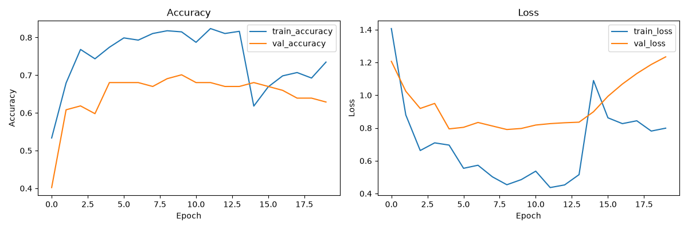

## 8.2 Confusion matrix (test set, 196 images)

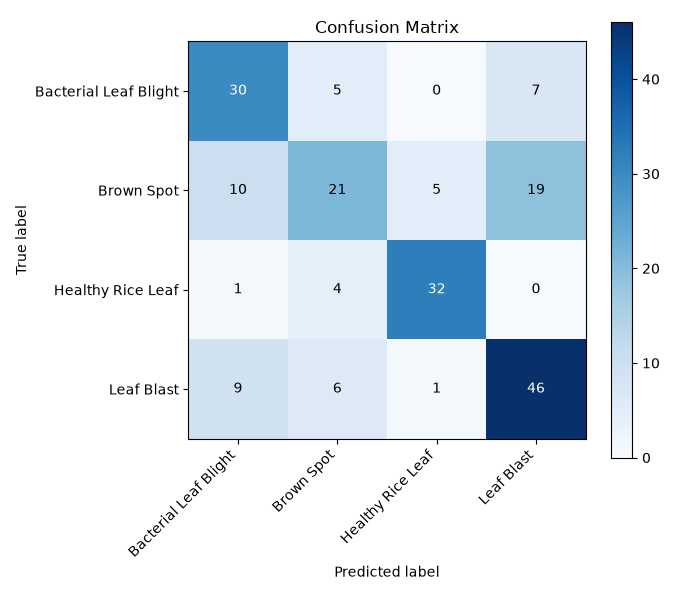

| True \ Predicted | BLB | Brown Spot | Healthy | Leaf Blast | Recall |
|---|---|---|---|---|---|
| **Bacterial Leaf Blight** (42) | **30** | 5 | 0 | 7 | 71.4 % |
| **Brown Spot** (55) | 10 | **21** | 5 | 19 | 38.2 % |
| **Healthy Rice Leaf** (37) | 1 | 4 | **32** | 0 | 86.5 % |
| **Leaf Blast** (62) | 9 | 6 | 1 | **46** | 74.2 % |

Reading it: rows are truth, columns are the model's answer, the diagonal is success. The matrix instantly reveals what a single accuracy number hides — **Brown Spot is the model's blind spot**: of 55 true Brown Spot images, only 21 were caught; 19 were called Leaf Blast and 10 Bacterial Leaf Blight. Both confusions are visually plausible (brown lesions on leaves). Healthy leaves, by contrast, are nearly solved (86.5 % recall, and almost no diseased leaf is ever called healthy — only 6 of 159 diseased test images were predicted "Healthy", which is the least dangerous direction of error for farmers).

## 8.3 Per-class report

| Class | Precision | Recall | F1 | Support |
|---|---|---|---|---|
| Bacterial Leaf Blight | 0.600 | 0.714 | 0.652 | 42 |
| Brown Spot | 0.583 | 0.382 | 0.462 | 55 |
| Healthy Rice Leaf | 0.842 | 0.865 | 0.853 | 37 |
| Leaf Blast | 0.639 | 0.742 | 0.687 | 62 |

## 8.4 What each metric means (and why accuracy is not enough)

- **Accuracy** — the fraction of all test images classified correctly (129/196 = 65.82 %). It is intuitive but *blind to which classes fail*: a model that never recognised Brown Spot at all could still score ~72 % here because Brown Spot is only 28 % of the test set. That is precisely why the per-class numbers matter.
- **Precision** (per class) — of everything the model *called* class X, how much really was X. Brown Spot precision 0.583 means 42 % of "Brown Spot" verdicts are wrong — false alarms.
- **Recall** (per class) — of everything that *really is* class X, how much the model found. Brown Spot recall 0.382 means it misses 62 % of real Brown Spot cases — in a farming context, missed disease is usually the costlier error.
- **F1** — the harmonic mean of precision and recall; harmonic so that being terrible at either one drags the score down hard. It is the single fairest per-class number.
- **Weighted vs macro averaging** — weighted multiplies each class's metric by its share of samples (represents overall experience); macro averages the four classes equally (represents fairness across classes). Both are reported; weighted F1 64.75 %, macro F1 66.34 %.
- **Validation vs test gap** (69.07 % → 65.82 %) — normal small optimism, since validation steered training decisions; with only 97 validation images, ±3–4 points of noise is expected.
- **Train vs test gap** (81.78 % → 65.82 %) — the overfitting signature: the model knows its 686 training images better than the world. Augmentation, dropout, and early stopping kept the gap from being far worse; more data is the real cure.

## 8.5 Honest weaknesses

1. **Brown Spot recall (38 %)** — the dominant failure; visually confusable with Leaf Blast at 224×224 resolution.
2. **Overfitting headroom** — a 16-point train/test gap on 686 images.
3. **Closed-world softmax** — any image, even a non-leaf, is forced into one of four classes with nonzero confidence; there is no "unknown" rejection.
4. **Moderate confidence calibration** — correct predictions ranged from 47 % to 99.6 % confidence in spot checks; softmax confidence is not a calibrated probability of being right.
5. **Rejected fine-tuning** — Phase 2 consistently *hurt* validation loss, showing the dataset is too small to safely update deep pretrained layers; the checkpoint system contained the damage, but it means the model's ceiling is the frozen-feature ceiling.
6. **Dataset scale** — every weakness above traces back to 979 images; per-class thousands would change this model qualitatively.

---

# SECTION 9 : COMPLETE EXECUTION FLOW

This section narrates one complete user journey — from opening the site to seeing a diagnosis — naming the exact file and function responsible at every step.

## Step 1 — User opens the website (`http://localhost:8080`)

The Vite dev server returns the app shell. `__root.tsx` renders the HTML document (`<head>` metadata, Inter font, `styles.css`), and TanStack Router matches `/` to `routes/index.tsx` — the landing page. The user clicks **Upload Image**, a `<Link to="/app/detection">`. Client-side routing swaps components without a page reload: `app.tsx` mounts `DashboardLayout` (sidebar), and `app.detection.tsx` renders inside its `<Outlet/>`.

*(If the user visits the Dashboard first, `useApiStatus()` fires `GET /health` and `GET /model-info` in parallel and the four status cards fill in — this is how the user can confirm "Model Loaded: Yes" before ever uploading.)*

## Step 2 — User uploads an image

In `PredictionForm.tsx`, **Choose Image** clicks the hidden `<input type="file" accept="image/png,image/jpeg,image/jpg">` via `fileInputRef`. `handlePickFile` stores the `File` object in state and creates an instant local preview (`URL.createObjectURL`) — nothing has touched the network yet.

## Step 3 — Frontend validation

Validation at this stage is deliberately light: the `accept` attribute filters the file picker to image types, and `handleSubmit` refuses to run with no file selected ("Select an image before submitting."). Deep validation (extension, size, content) is the backend's job — the backend can never trust a client anyway, so the project puts the authoritative checks server-side.

## Step 4 — The request leaves the browser

`predictImage(file)` in `api-client.ts` builds a `FormData` with the file under key `"file"` and calls `request("/predict", {method: "POST", body: formData})` → `fetch("http://localhost:8001/predict", …)`. The browser adds `Content-Type: multipart/form-data; boundary=…` and, because 8080 ≠ 8001, an `Origin: http://localhost:8080` header. The button meanwhile shows a spinner and "Sending…" (`isLoading` state).

## Step 5 — Backend receives the request

Uvicorn hands the request to FastAPI. `CORSMiddleware` checks the origin against the allowlist. FastAPI parses the multipart stream into an `UploadFile` and invokes `predict()` in `api/routes.py`, which runs the validation ladder: filename present → extension ∈ {png, jpg, jpeg} (`is_supported_file`) → bytes non-empty → ≤ 5,242,880 bytes. Failures return HTTP 400 with a human-readable `detail`. The bytes are then written to `uploads/<filename>`.

## Step 6 — Image preprocessing

`model_service.preprocess_image(path)`: PIL opens the saved file → `.convert("RGB")` (guarantees exactly 3 channels, whatever the source format) → `.resize((224, 224))` → NumPy float32 array ÷ 255 → `np.expand_dims(..., 0)` giving shape **(1, 224, 224, 3)** in [0, 1]. Inside the model, the first layer (`Rescaling(2, -1)`) shifts this to [−1, 1] for MobileNetV2 — the exact pipeline the training data followed, which is what makes inference valid.

## Step 7 — Model prediction

`self.model.predict(processed)` executes the forward pass on CPU: MobileNetV2 extracts a 7×7×1280 feature volume → GlobalAveragePooling → BatchNorm → Dropout (inactive at inference) → Dense-256 ReLU → BatchNorm → Dropout → Dense-4 **softmax**. Output: four probabilities summing to 1, e.g. `[0.0007, 0.0027, 0.9962, 0.0005]`.

## Step 8 — Confidence calculation

`np.argmax` finds the winning index (2 in the example); `self.classes[2]` decodes it to "Healthy Rice Leaf" using the order loaded from `classes.json`; confidence = `round(0.9962 × 100, 2)` = **99.62**. The service returns `{disease, confidence, probabilities}`.

## Step 9 — JSON response

The route wraps this in `PredictionResponse(status="success", disease="Healthy Rice Leaf", confidence=99.62, message="Prediction completed successfully.")`; `database_service.store_prediction` runs (a no-op without MongoDB); FastAPI serialises the Pydantic model to JSON; the CORS middleware stamps `access-control-allow-origin: http://localhost:8080`; uvicorn sends `200 OK`.

## Step 10 — Frontend display

`request<T>` sees `response.ok`, parses the JSON, and returns it. `PredictionForm` calls `onResult(result)`; the Detection page's `setResult` triggers a re-render: the badge flips from "Awaiting" to "success", the rows fill in (Disease Name "Healthy Rice Leaf", Confidence "99.62%"), and the message box turns green. The `finally` block clears `isLoading`. Total elapsed: typically around a second, dominated by the model's CPU forward pass.

**The unhappy paths, briefly:** backend down → `fetch` rejects → catch block shows the error banner and pushes `{status:"error"}` into the result card. Invalid file → HTTP 400 → `request` throws `ApiError` with the backend's `detail` message → same display path. Model file missing → HTTP 200 with `status:"Model not trained"` → the Model Status card shows the amber "Model Not Available Yet" state.

---

# SECTION 10 : COMPLETE CODE EXPLANATION

This section is a file-by-file reference. Deep conceptual explanations live in Sections 4–6; here every important file is catalogued with its purpose and key functions so any line of the project can be located and understood.

## 10.1 Python — ML

### `ml/training/train_model.py` (the training program)

| Function / block | What it does |
|---|---|
| Module constants | `BASE_DIR`/`DATASET_DIR`/`OUTPUT_DIR`/`CHECKPOINT_DIR`/`LOG_DIR` derived from `__file__`; creates output dirs; `IMAGE_SIZE=(224,224)`, `BATCH_SIZE=32`, `EPOCHS=15`, `FINE_TUNE_EPOCHS=10`, `FINE_TUNE_FROM_LAYER=100`, `SEED=42` |
| `SPLIT_CANDIDATES` + `resolve_split_dir(split)` | case-insensitive mapping of accepted folder names per split; returns the real directory or raises with the accepted names listed |
| `build_datasets()` | three `image_dataset_from_directory` calls (categorical labels, batch 32); captures `class_names` and per-split sample counts from `file_paths`; builds the augmentation `Sequential`; maps Rescaling(1/255) (+augmentation on train); prefetches; returns `(train_ds, validation_ds, test_ds, class_names, sample_counts)` |
| `build_model(num_classes)` | assembles Input → Rescaling(2,−1) → frozen MobileNetV2 → GAP → BN → Dropout(.4) → Dense(256) → BN → Dropout(.3) → Dense(num_classes, softmax); compiles with Adam/categorical-crossentropy/accuracy; returns `(model, base_model)` so the caller can unfreeze later |
| `plot_history(history_dict, path)` | two-panel matplotlib figure: accuracy curves and loss curves |
| `plot_confusion_matrix(cm, class_names, path)` | imshow heat map with per-cell counts, white/black text by threshold |
| `evaluate_model(model, test_ds, class_names)` | collects y_true from the (unshuffled) test dataset, predicts, computes accuracy/weighted P/R/F1, confusion matrix, and sklearn `classification_report` → dict |
| `save_metrics(metrics, dir)` | writes `metrics.json` |
| `main()` | orchestrates: print dirs → build datasets → print detected classes → build model + `model.summary()` → delete stale CSV → create the 6 callbacks → **Phase 1 fit** → unfreeze from layer 100, recompile Adam(1e-5) → **Phase 2 fit** (initial_epoch continues numbering) → merge histories → save history JSON/PNG → reload best checkpoint → evaluate → save metrics + confusion PNG + `classes.json` + `class_indices.json` → print final metrics |

### `ml/inference/predict.py` (CLI inference)

| Function | What it does |
|---|---|
| `load_model(path)` | `tf.keras.models.load_model` |
| `load_class_names(model_path)` | reads `classes.json` beside the model; falls back to the correct hardcoded 4-class list |
| `preprocess_image(path, 224)` | PIL → RGB → resize → float32/255 → batch axis |
| `predict(image_path, model_path=DEFAULT)` | load → preprocess → `model.predict` → argmax → `{disease, confidence}` |
| `__main__` | argparse: positional `image_path`, optional `--model` |

## 10.2 Python — backend

### `backend/main.py`
`sys.path` bootstrap → `FastAPI(...)` → `CORSMiddleware` from `settings.allow_origins` → `include_router` → `startup_event()` calls `model_service.initialize()` → optional self-hosted uvicorn under `__main__`.

### `backend/core/config.py`
`_load_env_file()` (three candidate `.env` locations, `os.environ.setdefault`) then `class Settings(BaseModel)` with 12 env-backed fields (see §5.4) and the singleton `settings = Settings()`.

### `backend/api/routes.py`
`root()`, `health_check()`, `get_classes()`, `get_model_info()`, and `predict(file: UploadFile)` — the full validation → save → gate → predict → store → respond ladder with the four-way exception translation (`InvalidImageError`→400, `ModelUnavailableError`→200 "Model not trained", `HTTPException` re-raised, `Exception`→500).

### `backend/services/model_service.py`
`ModelService` with `_load_classes()`, `initialize()`, `preprocess_image()`, `predict()`, `get_model_info()` — detailed in §5.5 — and the `model_service` singleton. Defensive imports (`numpy`/`PIL` wrapped in try/except at module top; TensorFlow imported lazily inside `initialize`).

### `backend/services/database_service.py`
`DatabaseService.__init__` (enabled only with `MONGODB_URI`; `MongoClient` timeout 3 s), `store_prediction(dict)` → inserts `{disease, confidence, image_name, timestamp}` or returns `None`. Singleton `database_service`.

### `backend/schemas/prediction.py` · `backend/utils/file_utils.py` · `backend/core/exceptions.py`
Response shapes; file validation helpers (`ALLOWED_EXTENSIONS`, `ensure_upload_directory`, `is_supported_file`, `get_file_extension`, `build_upload_path`); domain exceptions. All ≤ 25 lines each — leaf modules with zero app dependencies (schemas/utils) by design.

## 10.3 TypeScript — frontend

### Core three
- **`lib/api-client.ts`** — `API_BASE_URL` (env + fallback), `ApiError`, generic `request<T>()` (fetch → content-type-aware parse → throw on !ok), and `getHealth` / `getModelInfo` / `getClasses` / `predictImage` (FormData POST). *(§4.4)*
- **`components/PredictionForm.tsx`** — props `{onResult}`; state `file`/`previewUrl`/`isLoading`/`error`; `handlePickFile`, `handleSubmit`; hidden input + styled buttons + preview card. *(§4.5.1)*
- **`routes/app.detection.tsx`** — `result` state; renders `PredictionForm` + result card + model-status card. *(§4.5.2)*

### Infrastructure
- **`router.tsx`** — `getRouter()`: `createRouter({routeTree, context:{queryClient}, scrollRestoration:true, defaultPreloadStaleTime:0})`.
- **`routeTree.gen.ts`** — auto-generated route tree; regenerated by the dev server; never hand-edited.
- **`routes/__root.tsx`** — document shell + head metadata + 404 + error boundary (reports via `lovable-error-reporting`).
- **`server.ts` / `start.ts` / `lib/error-capture.ts`** — TanStack Start SSR entry and an error-capture buffer (5 s TTL) that preserves real stack traces through the framework's error handling.
- **`hooks/use-api-status.ts`** — parallel health+model-info fetch with ignore-flag cleanup. *(§4.6)*
- **`lib/env.ts`** (`env.apiBaseUrl`), **`lib/utils.ts`** (`cn()` = clsx + tailwind-merge).

### Pages and shared components
All twelve route files and eight shared components are specified in §4.6–4.8. The pattern to remember: pages own state, shared components receive props; only `PredictionForm` and `useApiStatus` ever call the API.

## 10.4 Configuration files

### `backend/requirements.txt`
`fastapi`, `uvicorn[standard]` (server), `pydantic` (validation), `python-multipart` (required for `UploadFile` form parsing), `tensorflow>=2.16` + `keras>=3` (inference), `opencv-python-headless` (available for future CV utilities), `numpy`, `Pillow` (preprocessing), `python-dotenv`, `pymongo` (optional storage).

### `ml/requirements.txt`
`tensorflow>=2.16.0`, `keras>=3.0.0`, `numpy>=1.26.0`, `Pillow>=10.0.0`, `scikit-learn>=1.4.0` (metrics), `matplotlib>=3.8.0` (plots), `tensorboard>=2.16.0` (required by the TensorBoard callback — TF 2.21 no longer bundles it; its absence crashed the first training run).

### `frontend/package.json`
Scripts: `dev` (vite dev), `build` (vite build), `build:dev`, `preview`, `lint` (eslint), `format` (prettier). Dependencies fall into four groups: React 19 + TanStack (router/query/start), the ~25 `@radix-ui/*` primitives underlying shadcn/ui, Tailwind v4 + `tw-animate-css` + `clsx`/`tailwind-merge`/`class-variance-authority`, and utilities (`lucide-react` icons, `react-hook-form`+`zod` available for future forms, `sonner` toasts, `recharts` available for future charts). `package-lock.json` pins the exact resolved versions.

### `frontend/vite.config.ts`
Delegates to `@lovable.dev/vite-tanstack-config`'s `defineConfig`, which bundles the TanStack Start plugin, React, Tailwind, tsconfig-paths (`@/` → `src/`), and VITE_* env injection; the only local option redirects the SSR server entry to `src/server.ts`.

### `frontend/.env` · root `.env` handling
`VITE_API_BASE_URL=http://localhost:8001` — read by Vite at dev-server start (restart required after edits). Backend equivalents (`MODEL_PATH`, `ALLOWED_ORIGINS`, …) may live in `<root>/.env`, `backend/.env`, or `config/.env` per `_load_env_file()`.

### `tsconfig.json` · `eslint.config.js` · `.prettierrc`
TypeScript compiler options (strictness, path alias), lint rules, and formatting — standard tooling, no project-specific surprises.

---

# SECTION 11 : DIAGRAMS

All diagrams below describe the actual implementation (files, classes, and endpoints that exist in the repository).

## 11.1 System Architecture Diagram

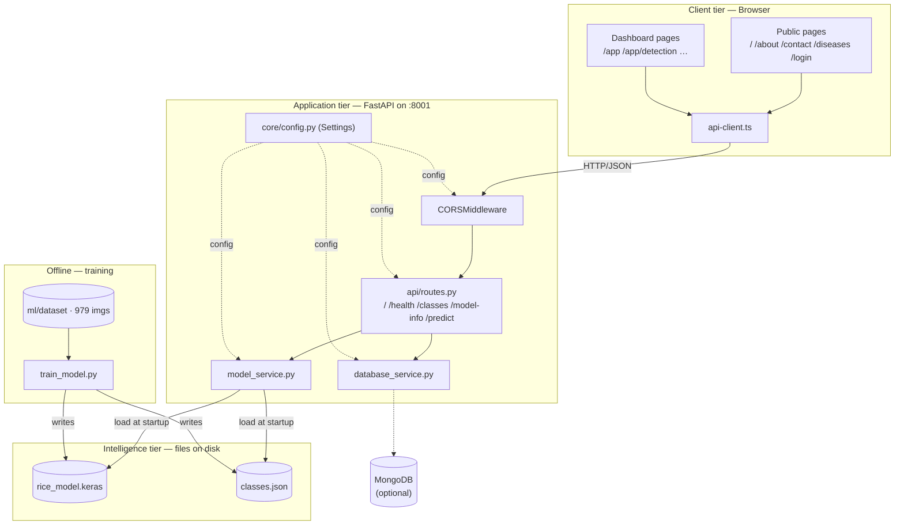

## 11.2 Prediction Flowchart

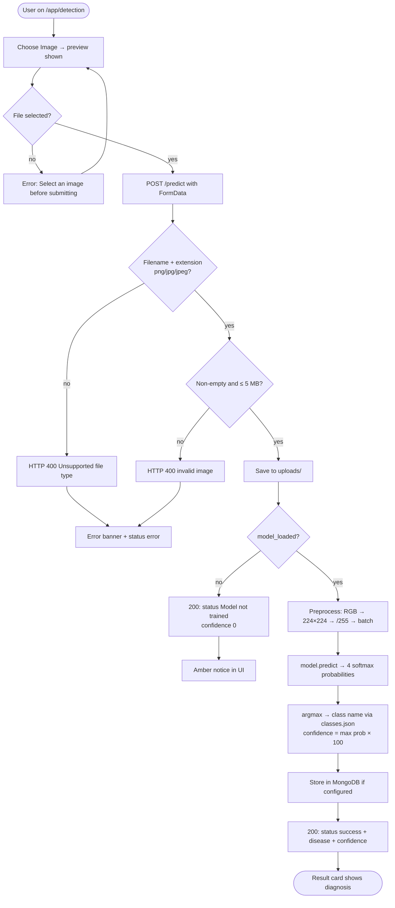

## 11.3 Data Flow Diagram — Level 0 (context)

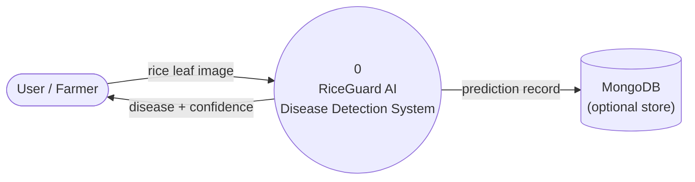

## 11.4 Data Flow Diagram — Level 1

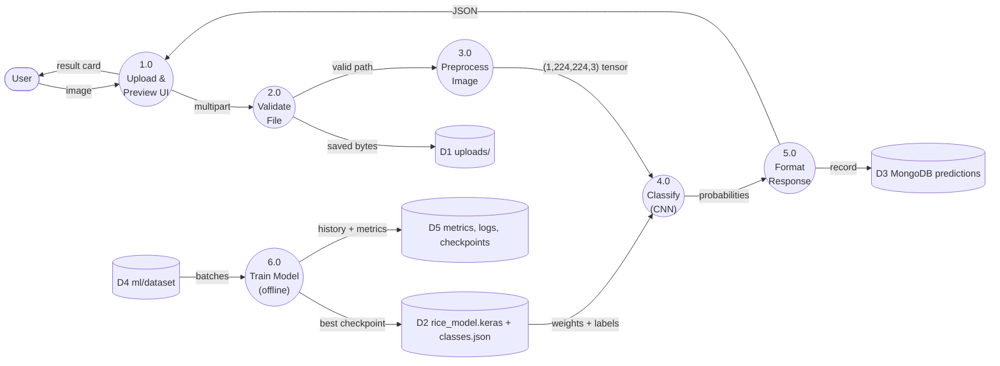

## 11.5 Sequence Diagram — full prediction

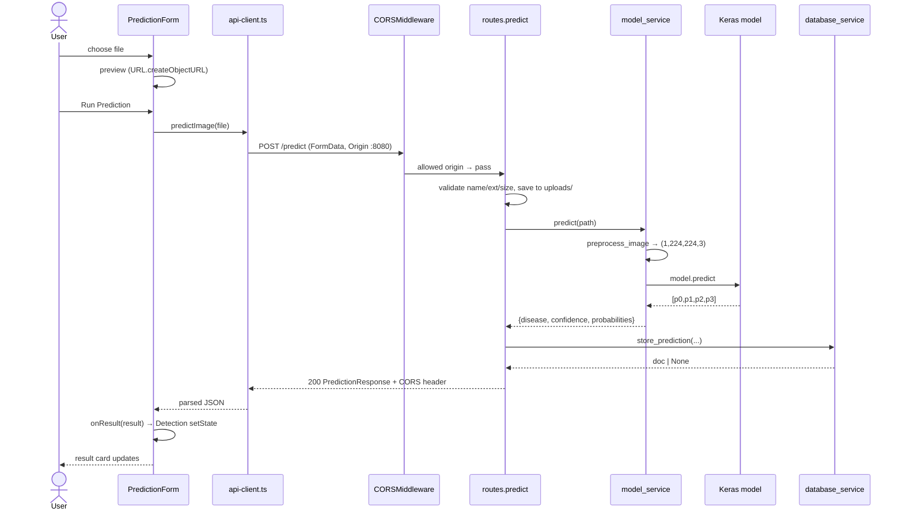

## 11.6 Activity Diagram — training run

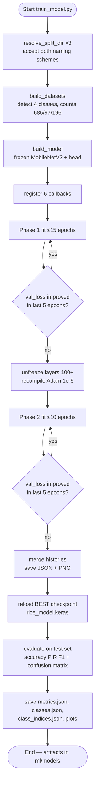

## 11.7 Component Diagram

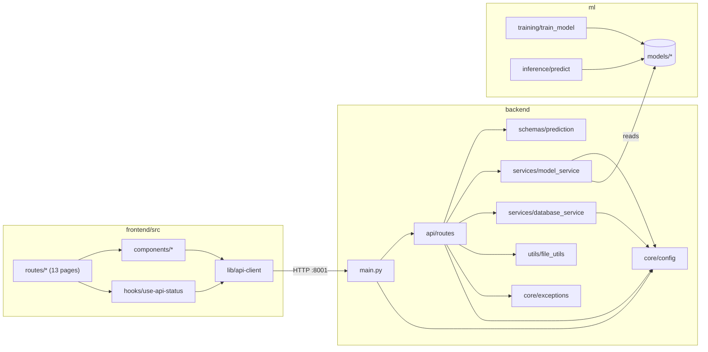

## 11.8 Deployment Diagram (development topology)

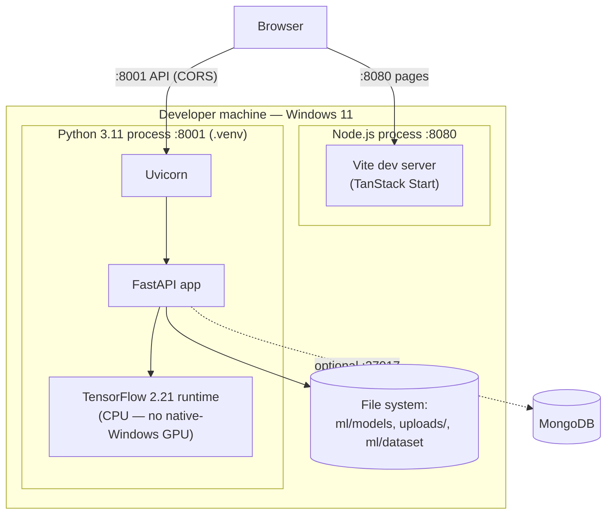

## 11.9 Class Diagram (backend + ML core)

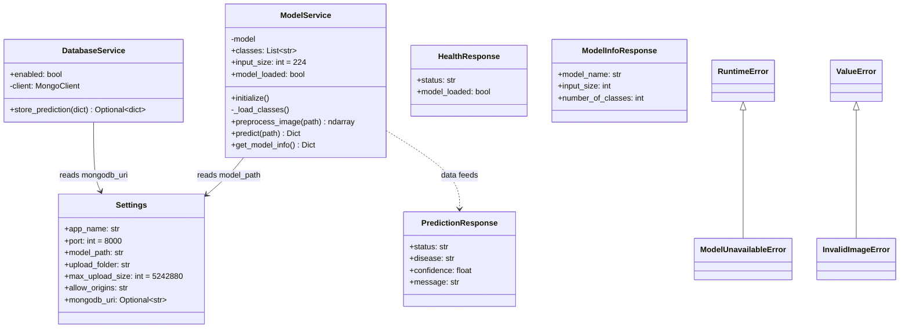

*(The frontend has no class hierarchy — React function components compose by props, as shown in the component diagram.)*

---

# SECTION 12 : INSTALLATION GUIDE

Every command below was actually used to set up and run this project on Windows 11. Commands are shown for a Windows shell from the repository root (`riceguard-vision-main/`); Linux/macOS users replace `.venv\Scripts\python.exe` with `.venv/bin/python`.

## 12.1 Prerequisites

| Requirement | Version used | Check with |
|---|---|---|
| Python | 3.11.9 (3.10–3.12 fine) | `python --version` |
| Node.js + npm | Node 18+ | `node --version` |
| Disk space | ~3 GB (TensorFlow is large) | — |
| GPU | **Not required** — TensorFlow ≥ 2.11 has no GPU support on native Windows; everything runs on CPU | — |
| Internet | for pip/npm downloads and the one-time ImageNet weights download (~9 MB) | — |

## 12.2 Python virtual environment

A virtual environment isolates this project's packages from the system Python:

```bat
cd riceguard-vision-main
python -m venv .venv
.venv\Scripts\activate        REM prompt now shows (.venv)
```

## 12.3 Installing Python packages

Two requirements files — backend (serving) and ML (training):

```bat
python -m pip install -r backend\requirements.txt -r ml\requirements.txt
```

This installs TensorFlow 2.21, Keras 3.15, FastAPI, uvicorn, Pillow, numpy, scikit-learn, matplotlib, tensorboard, pymongo, and friends. The TensorFlow wheel alone is ~300 MB — allow several minutes. Verify:

```bat
python -c "import tensorflow as tf, keras; print(tf.__version__, keras.__version__)"
```

## 12.4 Installing frontend packages

```bat
cd frontend
npm install
```

## 12.5 Dataset placement

Place the class-folder dataset under `ml/dataset/` using **either** naming scheme — the training script accepts both:

```text
ml/dataset/Training data/<ClassName>/*.jpg     (or ml/dataset/train/…)
ml/dataset/Validation data/<ClassName>/*.jpg   (or valid/ …)
ml/dataset/Testing data/<ClassName>/*.jpg      (or test/ …)
```

## 12.6 Training the model

```bat
cd riceguard-vision-main
.venv\Scripts\python.exe ml\training\train_model.py
```

Expected console flow: the three resolved dataset paths → "Found 686 files belonging to 4 classes." (then 97, 196) → the model summary → per-epoch progress bars for Phase 1, then "Phase 2: fine-tuning…" → final metrics and "Training complete. Model saved to …rice_model.keras". Runtime on a laptop CPU: **~4 minutes**. All artifacts appear under `ml/models/`, `ml/checkpoints/`, `ml/logs/`.

## 12.7 Running the backend

```bat
.venv\Scripts\python.exe -m uvicorn backend.main:app --host 127.0.0.1 --port 8001
```

Startup log should include "Model loaded successfully from …rice_model.keras". Interactive API docs: `http://127.0.0.1:8001/docs`.

## 12.8 Running the frontend

```bat
cd frontend
npm run dev        REM → http://localhost:8080
```

`frontend/.env` already points the app at the backend: `VITE_API_BASE_URL=http://localhost:8001`. If you change it, restart the dev server (env vars are read at startup).

## 12.9 Testing the API directly

```bat
curl http://127.0.0.1:8001/health
    → {"status":"ok","model_loaded":true}
curl http://127.0.0.1:8001/classes
curl -X POST http://127.0.0.1:8001/predict -F "file=@ml/dataset/Testing data/Leaf Blast/20231006_165849.jpg"
    → {"status":"success","disease":"Leaf Blast","confidence":47.55,...}
```

## 12.10 Testing prediction end to end

1. CLI check: `.venv\Scripts\python.exe ml\inference\predict.py "ml\dataset\Testing data\Brown Spot\Brown_spot (147).jpg"` → `{'disease': 'Brown Spot', 'confidence': 63.31}`.
2. Browser check: open `http://localhost:8080` → **Open Dashboard** → confirm the Dashboard cards show "API Status ok / Model Loaded Yes / Classes 4" → **Disease Detection** → choose any test image → **Run Prediction** → the result card fills with disease + confidence.

---

# SECTION 13 : ERRORS AND SOLUTIONS

Every entry below is a real problem encountered while making this project work, in the order they appeared. This section doubles as a debugging manual.

## 13.1 Empty virtual environment / missing dependencies

- **Symptom:** `ModuleNotFoundError: No module named 'tensorflow'` (and fastapi, sklearn…) on any script.
- **Cause:** `.venv` existed but contained only pip/setuptools — dependencies had never been installed. The ML pipeline also needed packages (scikit-learn, matplotlib, tensorboard) that were in **no** requirements file.
- **Solution:** created `ml/requirements.txt` for the training-only dependencies and installed both files into the venv: `pip install -r backend/requirements.txt -r ml/requirements.txt`.

## 13.2 Dataset path mismatch

- **Symptom:** `FileNotFoundError: Dataset folders are missing. Place images under dataset/train, dataset/validation, and dataset/test…` even though the dataset was present.
- **Cause:** the script hardcoded `dataset/train`, `dataset/validation`, `dataset/test`, but the real folders are `Training data`, `Validation data`, `Testing data`.
- **Solution:** replaced the hardcoded paths with `SPLIT_CANDIDATES` + `resolve_split_dir()` — a case-insensitive resolver that accepts both naming conventions and raises a self-explaining error otherwise. Verified paths are printed at the start of every run.

## 13.3 Keras 3 removed `ImageDataGenerator`

- **Symptom:** `ImportError: cannot import name 'ImageDataGenerator' from 'keras.preprocessing.image'`.
- **Cause:** the original code targeted the Keras 2 API. TensorFlow 2.16+ ships **Keras 3**, which deleted `ImageDataGenerator` entirely (`keras.preprocessing.image` now only holds `load_img`-style utilities, and there is no `keras.legacy.preprocessing`).
- **Solution:** migrated the whole input pipeline to the modern API — `keras.utils.image_dataset_from_directory` for loading, Keras preprocessing **layers** (`RandomFlip`, `RandomRotation`, `RandomTranslation`, `RandomZoom`, `Rescaling`) for augmentation/normalisation, applied via `tf.data.map` + `prefetch`. Functionally equivalent, faster, and future-proof.

## 13.4 TensorBoard callback crash (`TBNotInstalledError`)

- **Symptom:** training died at the end of epoch 1 with `TBNotInstalledError: TensorBoard is not installed, missing implementation for tf.summary.scalar`.
- **Cause:** TF 2.21 no longer bundles the `tensorboard` package, but the `TensorBoard` callback needs it the moment it writes its first epoch summary.
- **Solution:** `pip install tensorboard` and added `tensorboard>=2.16.0` to `ml/requirements.txt`; restarted training (only one epoch was lost).

## 13.5 Wrong hardcoded class order — the silent mislabeling bug

- **Symptom (would-have-been):** every prediction confidently showing the wrong disease name — e.g. a healthy leaf labelled "Healthy" only by luck, a Bacterial Leaf Blight image labelled "Healthy".
- **Cause:** `ml/inference/predict.py` and the backend fallback both hardcoded `["Healthy", "Leaf Blast", "Brown Spot", "Bacterial Blight"]`, but Keras assigns indices **alphabetically by folder name**: `["Bacterial Leaf Blight", "Brown Spot", "Healthy Rice Leaf", "Leaf Blast"]`. Index 0 would decode as "Healthy" instead of "Bacterial Leaf Blight".
- **Solution:** training now writes `classes.json` (+ `class_indices.json`); both inference consumers load it at runtime, and the fallback lists were corrected to the true order. This is the project's best example of why serialising label order with the model is mandatory.

## 13.6 Wrong input scaling for MobileNetV2 (silent accuracy loss)

- **Symptom:** no error at all — just a mediocre 60.2 % test accuracy on the first successful run.
- **Cause:** the pipeline fed the network [0, 1] pixels, but MobileNetV2's ImageNet weights expect **[−1, 1]**. The frozen features were being computed on a shifted distribution.
- **Solution:** added `layers.Rescaling(scale=2.0, offset=-1.0)` as the first layer *inside* the model, keeping the external [0, 1] contract unchanged so the backend/CLI needed no edits. Retraining lifted test accuracy to **65.8 %** — a 5.6-point gain from one line.

## 13.7 Fine-tuning made things worse

- **Symptom:** during Phase 2, validation loss rose every epoch (0.90 → 1.23) while training accuracy climbed — classic overfitting.
- **Cause:** unfreezing 54 deep layers against 686 images gives the model enough freedom to memorise; even LR 1e-5 couldn't prevent it.
- **Solution:** no manual intervention needed — `ModelCheckpoint(save_best_only=True)` had preserved the Phase-1 best (val_loss 0.7906), `EarlyStopping` cut Phase 2 after 6 epochs, and the script evaluates the **reloaded best checkpoint**, not the final weights. The lesson: always deploy the best validation model, never "whatever training ended with".

## 13.8 Backend model loading & integration verification

- **Symptom to guard against:** backend crashing at startup when `rice_model.keras` is absent (e.g. fresh clone before training).
- **Cause/design:** `model_service.initialize()` is written to *degrade*: missing file → warning log + `model_loaded=False`; `/predict` then returns the JSON `status:"Model not trained"` instead of 500. After training, a restart loads the model ("Model loaded successfully from …") — verified with `/health` → `model_loaded:true` and a real prediction (`Healthy Rice Leaf`, 99.62 %).

## 13.9 Port conflict / wrong port

- **Symptom:** frontend showed "Failed to fetch"; predictions never arrived.
- **Cause:** the backend had been restarted on **port 8001**, but the frontend still targeted `http://localhost:8000` — where a *stale* older server process was still listening with outdated CORS settings, masking the misconfiguration.
- **Solution:** killed the stale 8000 process, created `frontend/.env` with `VITE_API_BASE_URL=http://localhost:8001`, updated the code fallbacks in `api-client.ts`/`env.ts` to 8001, restarted the Vite dev server (env files are only read at startup). Lesson: when two servers might be running, check `netstat -ano | findstr LISTENING` before debugging application code.

## 13.10 CORS errors

- **Symptom:** browser console: *"…has been blocked by CORS policy: No 'Access-Control-Allow-Origin' header…"*; network tab shows the request but JS gets a TypeError.
- **Cause:** the frontend origin `http://localhost:8080` was not in the backend's `ALLOWED_ORIGINS` default (`localhost:3000, localhost:5173` only — the config predated the 8080 dev server).
- **Solution:** extended the default in `backend/core/config.py` to include `http://localhost:8080` and `http://127.0.0.1:8080`; verified with a preflight test (`OPTIONS /predict` with `Origin: http://localhost:8080` → `access-control-allow-origin` echoed back). Remember: CORS is enforced by the **browser**; curl always works, which is why API tests can pass while the web app fails.

## 13.11 "Failed to fetch" — the umbrella symptom

`TypeError: Failed to fetch` in the UI has exactly three causes in this project, checked in order: (1) backend not running → start uvicorn; (2) wrong base URL → check `frontend/.env` and restart Vite; (3) CORS rejection → check `ALLOWED_ORIGINS`. The `request<T>` wrapper surfaces the message in the red banner, and `PredictionForm` also routes it into the result card as `status:"error"`.

## 13.12 TensorFlow installation notes (Windows)

- The install is large; if `pip` seems frozen it is usually still downloading the ~300 MB wheel.
- On native Windows, TF ≥ 2.11 is **CPU-only** — the log line "TensorFlow GPU support is not available…" is informational, not an error. (GPU training would require WSL2.)
- The oneDNN/absl log noise at import (`oneDNN custom operations are on…`) is harmless.
- First model build downloads MobileNetV2 ImageNet weights (~9 MB) to the Keras cache; needs network once.

## 13.13 Dependency installation pitfalls

- Always install into the **venv** (`.venv\Scripts\python.exe -m pip …`), not the system Python — the earlier "empty venv" incident came from installing nowhere.
- `python-multipart` must be present or FastAPI rejects `UploadFile` endpoints at startup — it is in `backend/requirements.txt` for exactly this reason.
- If Keras and TensorFlow versions drift apart, imports break in confusing ways; the requirements pin compatible floors (`tensorflow>=2.16`, `keras>=3`).

---

# SECTION 14 : VIVA PREPARATION — 150 QUESTIONS WITH ANSWERS

This section contains 150 likely viva questions with model answers, grouped by topic and ordered roughly from easy to hard within each group. Use it in three passes: first read every answer once to refresh the facts; second, cover the answers and speak your own version aloud, checking that you quote the real project numbers (65.82% test accuracy, 2,593,092 parameters, 686/97/196 split, batch 32, port 8001, and so on); third, drill the "trap" questions — why not accuracy alone, why softmax, why the base was frozen, why the fine-tune phase was rejected, why class order matters — because examiners use these to separate memorised answers from real understanding. Every number and file path in this section is taken from the actual repository and the saved `ml/models/metrics.json`, so you can defend any answer by opening the file it refers to.

## Project Basics & Motivation

**Q1. What is RiceGuard Vision in one sentence?**

**A.** RiceGuard Vision (also called RiceGuard AI) is a full-stack web application that detects rice-leaf diseases from a photograph. A farmer or agronomist uploads a leaf image in the browser, the image is sent to a FastAPI backend, and a MobileNetV2-based deep learning model classifies it into one of four classes — Bacterial Leaf Blight, Brown Spot, Healthy Rice Leaf, or Leaf Blast — returning the disease name and a confidence percentage. The whole pipeline, from dataset to trained model to REST API to React dashboard, was built in this project.

**Q2. Why did you choose rice disease detection as the problem?**

**A.** Rice is a staple crop, and diseases like Bacterial Leaf Blight, Brown Spot, and Leaf Blast cause significant yield loss when they are identified too late. Diagnosis normally needs an expert, who may not be available in the field, whereas almost every farmer has a phone camera. Image classification with convolutional neural networks is a proven fit for this kind of visual diagnosis, so the project combines a socially useful problem with a technically complete demonstration of transfer learning, REST API design, and modern frontend development.

**Q3. What are the four classes your system predicts?**

**A.** The four classes, in the exact index order the model uses, are: 0 — Bacterial Leaf Blight, 1 — Brown Spot, 2 — Healthy Rice Leaf, and 3 — Leaf Blast. The order is alphabetical because Keras assigns label indices from the alphabetically sorted folder names in the dataset directory. This order is saved to `ml/models/classes.json` at training time, and both the backend and the CLI inference script load that file so predictions are always mapped to the correct name.

**Q4. What is the overall technology stack?**

**A.** The frontend is React with TanStack Start and Vite 8.1.5, written in TypeScript, styled with Tailwind CSS and shadcn/ui components. The backend is FastAPI running on Python 3.11.9, served by uvicorn on port 8001. The machine learning pipeline uses TensorFlow 2.21.0 with Keras 3.15.1, applying transfer learning on MobileNetV2. There is optional MongoDB storage via pymongo, which stays disabled unless the MONGODB_URI environment variable is set.

**Q5. What is the headline result of the project?**

**A.** The final model achieves 65.82% accuracy on a held-out test set of 196 images it never saw during training, with a weighted F1-score of 64.75%. The best validation accuracy during training was 69.07% and the corresponding training accuracy was 81.78%. On a manual spot check of 12 test images (3 per class), the saved model predicted 11 out of 12 correctly. These numbers are honest results for a small dataset of only 979 images trained in 3.9 minutes on CPU.

**Q6. Is this a research project or an engineering project?**

**A.** It is primarily an engineering project: I did not invent a new algorithm, I applied a well-established technique — transfer learning with MobileNetV2 — correctly and built a complete, working system around it. The engineering value is in the end-to-end integration: a reproducible training pipeline with callbacks and saved artifacts, a robust API that degrades gracefully when the model is missing, and a typed frontend client. The debugging journey, such as fixing the input-scaling mismatch that lifted test accuracy from 60.2% to 65.8%, shows applied understanding rather than pure theory.

**Q7. Who are the intended users of the system?**

**A.** The intended users are farmers, agricultural extension workers, and agronomy students who need a quick first opinion on a diseased rice leaf. The dashboard interface is deliberately simple: upload an image, press analyse, read the disease name and confidence. Because it is a web application, it works on any device with a browser; no app installation is needed. In the current academic version it runs locally, but the architecture would support hosted deployment.

**Q8. What does the confidence percentage mean to a user?**

**A.** The confidence is the softmax probability of the predicted class, multiplied by 100 and rounded to two decimal places in `backend/services/model_service.py`. It expresses how strongly the model favours that class over the other three; a value near 100% means the model is very sure, while a value near 25% means it is essentially guessing among four classes. Users should treat low-confidence predictions as a prompt to take a better photo or consult an expert, not as a definitive diagnosis. The backend also computes the full probability list over all four classes internally.

**Q9. What are the main limitations of the current system?**

**A.** First, the dataset is small — 979 images total — so test accuracy is 65.82%, which is a demonstrator level, not clinical level; Brown Spot in particular has only 38% recall. Second, only four classes are covered, while rice has many more diseases. Third, several dashboard pages — History, Analytics, and Reports — are empty shells with no functionality yet, and there is no authentication logic behind the login page. Fourth, predictions are only persisted if MongoDB is configured via MONGODB_URI; otherwise they are not stored. I state these openly because knowing a system's limits is part of engineering it.

**Q10. Why a web application instead of a mobile app?**

**A.** A web app gives the widest reach with one codebase — it runs on phones, tablets, and desktops without app-store distribution. It also cleanly separates concerns: the heavy TensorFlow model lives on the server, so the client device only needs to upload an image and render JSON, which keeps the frontend light. The REST API design means a native mobile app could be added later as just another client of the same `POST /predict` endpoint. Finally, the browser's FormData and fetch APIs made the upload flow simple to implement.

## Architecture & Data Flow

**Q11. Describe the end-to-end architecture of RiceGuard Vision.**

**A.** There are three layers. The presentation layer is a React/TanStack Start single-page application served by Vite on http://localhost:8080. The application layer is a FastAPI backend on http://localhost:8001 that exposes REST endpoints (`/`, `/health`, `/classes`, `/model-info`, `/predict`) and holds a ModelService singleton wrapping the Keras model. The ML layer is offline: `ml/training/train_model.py` trains the model and writes `ml/models/rice_model.keras` plus supporting artifacts like `classes.json` and `metrics.json`, which the backend loads at startup. An optional MongoDB layer stores predictions only when MONGODB_URI is set.

**Q12. Walk me through what happens when a user uploads an image, step by step.**

**A.** The user selects a file in `PredictionForm.tsx`; the component shows a local preview via URL.createObjectURL and, on submit, calls `predictImage(file)` from `lib/api-client.ts`, which wraps the file in a FormData object under the key "file" and POSTs it to http://localhost:8001/predict. FastAPI receives it as an UploadFile, validates the filename and extension (png/jpg/jpeg), rejects empty files and anything over 5 MB, and saves it to the `uploads/` folder. The ModelService then preprocesses the image — PIL open, convert to RGB, resize to 224×224, scale to float32 in [0,1], add a batch axis — and runs `model.predict`. The argmax index is mapped to a class name, confidence is the max probability ×100, the optional database service stores the record, and the JSON `{status, disease, confidence, message}` travels back to the browser, where the Detection page renders it in a result card.

**Q13. Why did you separate training from serving?**

**A.** Training is slow, resource-heavy, and happens rarely, while serving must be fast and always available, so mixing them in one process would be poor design. The training script runs offline and communicates with the backend only through file artifacts: `ml/models/rice_model.keras` (13.6 MB) and `classes.json`. The backend just loads whatever model file exists at startup, which means I can retrain, evaluate, and swap in a better model without touching a single line of backend code. This artifact-based contract is a standard MLOps pattern in miniature.

**Q14. Which ports does the system use and why does that matter?**

**A.** The Vite dev server runs the frontend on port 8080 and uvicorn runs the backend on port 8001 (the config default is 8000, but we launch with `--port 8001`). The frontend knows the backend address through `VITE_API_BASE_URL=http://localhost:8001` in `frontend/.env`, with the same value as a hardcoded fallback in `api-client.ts`. This matters because we actually hit a real bug where the frontend fell back to port 8000, where a stale server with old CORS settings was running, producing "Failed to fetch" errors — so I can say from experience that explicit port configuration is not a cosmetic detail.

**Q15. How do the frontend and backend communicate, and in what format?**

**A.** They communicate over HTTP using JSON for all responses and multipart/form-data for the image upload. The frontend uses the native fetch API — no axios — through a small typed wrapper `request<T>()` in `lib/api-client.ts`, which throws a custom ApiError carrying the HTTP status when a response is not OK. The backend defines its response shapes as Pydantic models in `backend/schemas/prediction.py` (PredictionResponse, ModelInfoResponse, HealthResponse), so both sides agree on a stable contract.

**Q16. What is CORS and why did your project need it?**

**A.** CORS — Cross-Origin Resource Sharing — is the browser security mechanism that blocks JavaScript on one origin from reading responses from another origin unless the server explicitly allows it. My frontend runs on http://localhost:8080 and the backend on http://localhost:8001; different ports mean different origins, so every fetch would be blocked without CORS headers. In `backend/main.py` I add FastAPI's CORSMiddleware with the allowed origins from settings — including http://localhost:8080 and http://127.0.0.1:8080 — with credentials allowed and all methods and headers permitted. We genuinely hit CORS failures during development when a stale server had the old, narrower origin list of only ports 3000 and 5173.

**Q17. Where does the trained model live and how does the backend find it?**

**A.** The served model is `ml/models/rice_model.keras`, a 13.6 MB Keras-format file. The backend's `core/config.py` defines a Settings object whose MODEL_PATH defaults to `<project root>/ml/models/rice_model.keras`, overridable via environment variables loaded by a hand-written `_load_env_file()` helper. At startup, FastAPI's `@app.on_event("startup")` hook calls `model_service.initialize()`, which first loads `classes.json` from the folder next to the model and then calls `keras.models.load_model()`. If either the file or TensorFlow is missing, it logs a warning and sets a flag instead of crashing the app.

**Q18. What happens if the model file is missing when a prediction is requested?**

**A.** The backend does not crash and does not return an HTTP error. The route catches the ModelUnavailableError raised by the service and returns a normal 200 PredictionResponse with `status: "Model not trained"`, `disease: "Not available"`, and `confidence: 0.0`. This graceful-degradation design means the frontend can always render a meaningful message and the `/health` endpoint truthfully reports `model_loaded: false`. It also means the backend can be developed and demonstrated before training has even been run — a deliberate decoupling decision.

**Q19. Is there a database in the system?**

**A.** Only optionally. `backend/services/database_service.py` can store each prediction — disease, confidence, image name, and timestamp — in MongoDB via pymongo, but it is completely disabled and simply returns None unless the MONGODB_URI environment variable is set. In the default local setup there is no database at all; the app is stateless apart from images saved to the `uploads/` folder. I designed it this way so the core demo has zero infrastructure dependencies while leaving a clean extension point for persistence.

**Q20. How is the ModelService structured and why a singleton?**

**A.** `backend/services/model_service.py` defines a ModelService class used as a singleton: one instance is created and shared across all requests. This is important because loading a 13.6 MB Keras model takes noticeable time and memory, so it must happen once at startup — inside `initialize()` — not on every request. The service exposes `preprocess_image()` and `predict()`, keeps a `model_loaded` boolean for the health endpoint, and holds the class-name list. A per-request model load would make every prediction take seconds instead of milliseconds.

**Q21. Is there any inference path besides the web API?**

**A.** Yes — `ml/inference/predict.py` is a command-line inference tool: `python ml/inference/predict.py <image> [--model path]`. It resolves the model path relative to its own `__file__` so it works from any working directory, loads class names from `classes.json` next to the model, applies exactly the same preprocessing as the backend (PIL, RGB, resize 224, divide by 255), and prints the disease and confidence. I used it for the manual spot check where 11 of 12 test images were classified correctly, and it is useful for scripted batch testing without running the server.

**Q22. Why must preprocessing be identical between training and inference?**

**A.** A neural network learns a mapping from a specific input distribution; if inference feeds it differently scaled or differently sized data, the learned weights are effectively applied to the wrong numbers and accuracy collapses silently — no error is raised. In this project, training feeds 224×224 RGB images scaled to [0,1] by a Rescaling(1/255) map in the tf.data pipeline, and the model internally maps [0,1] to [-1,1] with a Rescaling(scale=2.0, offset=-1.0) layer for MobileNetV2. The backend and CLI therefore both do PIL open → RGB → resize 224×224 → float32/255, and because the [-1,1] rescaling is a layer inside the saved model, it travels with the model automatically. Baking preprocessing into the model is exactly how you prevent training–serving skew.

## Frontend / React / TanStack

**Q23. Why did you choose React for the frontend?**

**A.** React is the most widely used component-based UI library, so it has mature tooling, a huge ecosystem, and transferable skills. Its declarative model — UI as a function of state — fits this app perfectly: the Detection page simply re-renders when the prediction result state changes, with no manual DOM manipulation. Combined with TypeScript I get compile-time checking of the API response shapes, and combined with Vite I get near-instant hot reload during development.

**Q24. What is TanStack Start and what role does it play?**

**A.** TanStack Start is a full-stack React framework built around TanStack Router, and in this project it provides file-based routing on top of Vite 8.1.5. Files under `frontend/src/routes/` automatically become routes — for example `routes/app.detection.tsx` becomes the `/app/detection` page — and the framework generates `routeTree.gen.ts`, a typed route tree, so navigation is type-safe. It gives modern framework conveniences while keeping the app a standard React SPA talking to my own FastAPI backend.

**Q25. List the routes in the application and what each shows.**

**A.** Public routes: `/` is the landing page, plus `/about`, `/contact`, `/diseases`, and `/login`. Then `/app` is a layout route that renders DashboardLayout with nested pages inside it: `/app` itself is the Dashboard (`routes/app.index.tsx`) showing four live status cards, and `/app/detection` is the Disease Detection page with the upload form. The sidebar also lists History, Analytics, Reports, and Settings, but I must be honest that those pages are empty shells — navigation targets without implemented functionality — kept as future-work placeholders.

**Q26. How does the file upload form work internally?**

**A.** `components/PredictionForm.tsx` uses a hidden file input accessed through useRef, triggered by a styled button, with `accept="image/png,image/jpeg,image/jpg"` to filter the file picker. Its local state holds the selected file, a previewUrl created with URL.createObjectURL so the user sees the image before submitting, an isLoading flag, and an error string. On submit it calls `predictImage(file)`; on success it passes the result object up through the `onResult` prop callback, and on failure it calls `onResult` with a status of "error" so the parent page renders the failure consistently.

**Q27. Why is the image sent as FormData instead of JSON?**

**A.** JSON is a text format, so sending binary image bytes in JSON would require base64 encoding, which inflates the payload by roughly a third and adds encode/decode work on both ends. FormData produces a multipart/form-data request — the standard HTTP mechanism for file upload — which sends the raw bytes with proper part boundaries and lets the browser set the correct Content-Type header, including the boundary, automatically. On the server side, FastAPI's UploadFile (backed by python-multipart) parses that natively. The field name "file" appended to the FormData must match the parameter name in the FastAPI route — that pairing is the contract between the two sides.

**Q28. Describe your API client design.**

**A.** `lib/api-client.ts` centralises all HTTP access in one generic wrapper, `request<T>()`, built on native fetch. It prefixes every call with API_BASE_URL, which is `import.meta.env.VITE_API_BASE_URL` with `http://localhost:8001` as the fallback, and on a non-OK response it throws a custom ApiError class that carries the HTTP status code so callers can distinguish a 400 validation failure from a 500 server error. On top of it sit four typed functions matching the backend endpoints: `getHealth()`, `getModelInfo()`, `getClasses()`, and `predictImage(file)`. Centralising this means error handling, the base URL, and response typing live in exactly one place.

**Q29. Why native fetch instead of axios?**

**A.** Fetch is built into every modern browser, so choosing it removes an entire dependency — smaller bundle, one less thing to update, no library-specific abstractions to learn. The features axios is usually chosen for — a default base URL, JSON parsing, typed errors — I implemented in a small amount of code in `request<T>()`, tailored exactly to this app's needs. For a project with five endpoints, a full HTTP library would be over-engineering; knowing when not to add a dependency is itself a design decision I can defend.

**Q30. What is the useApiStatus hook and why did you write it?**

**A.** `hooks/use-api-status.ts` exports `useApiStatus()`, a custom hook that on mount fires `Promise.all([getHealth(), getModelInfo()])` and returns `{health, modelInfo, loading, error}`. It exists because both the Dashboard and the Detection page need to know whether the API is reachable and whether the model is loaded, and a custom hook packages that fetch-on-mount logic, its loading state, and its error state into one reusable unit. Using Promise.all runs both requests concurrently instead of one after the other, halving the wait.

**Q31. In useApiStatus, what is the "ignore flag" cleanup for?**

**A.** It prevents a React state update on an unmounted component. The effect sets a local ignore variable to false, and the cleanup function returned by useEffect sets it to true when the component unmounts; the async handlers check the flag before calling setState. Without this, a user who navigates away while the health request is still in flight would trigger a state update on a dead component — a memory-leak warning in React and a classic async pitfall. It demonstrates understanding of the useEffect lifecycle rather than just copying a fetch example.

**Q32. How does state management work across the app? Did you use Redux?**

**A.** No global state library at all — no Redux, no Zustand, no React Query. All state is local useState/useEffect plus prop callbacks: PredictionForm owns its file and loading state, the Detection page owns the latest result and receives it via the `onResult` prop, and useApiStatus encapsulates server-status state per page. This is deliberate: the app has no state that genuinely needs to be shared across distant components, and adding Redux for a single upload flow would be complexity without benefit. If History or Analytics were implemented with cached server data, that is the point where I would introduce a server-state library.

**Q33. Describe the DashboardLayout component.**

**A.** `components/DashboardLayout.tsx` is the application shell for everything under `/app`. It renders a sidebar that is fixed at 264px wide on desktop and becomes an overlay on mobile, containing navigation entries for Dashboard (`/app`), Disease Detection (`/app/detection`), History, Analytics, Reports, and Settings, plus a Logout link that simply navigates to `/`. The header has a search input (currently decorative), a bell icon, and a user chip. The child route's content renders through the Outlet component, which is TanStack Router's placeholder for nested routes — so the shell renders once and only the inner page swaps.

**Q34. What does the Dashboard page actually show?**

**A.** `routes/app.index.tsx` calls `useApiStatus()` and renders four StatusCards driven by live backend data: API Status (from `/health`), Model Loaded (the model_loaded boolean), Prediction State, and Classes (the four class names). Below them is a Prediction Activity table which currently renders an EmptyState component, because prediction history is not persisted in the default setup. So the Dashboard is a genuine live status monitor for the backend, plus an honest placeholder for future history data.

**Q35. How is the prediction result displayed to the user?**

**A.** `routes/app.detection.tsx` holds the result in component state and renders, beside the PredictionForm, a result card showing Status, Disease Name, and Confidence plus the message from the backend, and a separate model status card showing whether the model is loaded. When PredictionForm calls `onResult`, the page's state updates and React re-renders the cards with the new values. Error results flow through the exact same path with status "error", so the UI has a single consistent rendering path for success, failure, and the "Model not trained" case.

**Q36. How is the app styled?**

**A.** With Tailwind CSS utility classes composed directly in the JSX, plus CSS variables acting as design tokens defined in `styles.css` — colours, radii, and surfaces are tokens, so theming is centralised. Reusable primitives like buttons, cards, and inputs come from shadcn/ui, which generates accessible component code into `components/ui/*` that I own and can edit, rather than importing a black-box component library. There is also a `card-surface` utility class for the recurring card look, and icons come from lucide-react.

**Q37. What is Vite and why is it used here?**

**A.** Vite is the build tool and dev server underneath TanStack Start — this project uses Vite 8.1.5. In development it serves source files over native ES modules with very fast transforms, giving startup in milliseconds and instant hot module replacement, which made the UI iteration loop very quick. For production it bundles into optimised static assets. It also provides the `import.meta.env` mechanism through which `VITE_API_BASE_URL` reaches my code — only variables prefixed with `VITE_` are exposed to the client, which is a safety feature against leaking server secrets.

**Q38. How does the frontend know the backend URL, and what happens if it is wrong?**

**A.** `frontend/.env` sets `VITE_API_BASE_URL=http://localhost:8001`; `lib/api-client.ts` reads it via import.meta.env with `http://localhost:8001` as the fallback, and `lib/env.ts` mirrors the same value. If the URL is wrong, every request fails — and I know precisely what that looks like because it happened: originally there was no `.env` and the fallback was port 8000, where a stale server with old CORS defaults was still running, producing "Failed to fetch" and CORS errors in the console. The fix was creating the `.env` file, correcting the fallback to 8001, widening ALLOWED_ORIGINS to include port 8080, and killing the stale server.

**Q39. Is there authentication in the frontend?**

**A.** No — and I state that plainly rather than let the UI imply otherwise. There is a `/login` route with a login page, and the sidebar has a Logout entry, but no authentication logic exists anywhere: no tokens, no sessions, no protected-route guards; Logout simply navigates back to `/`. The login page is a UI placeholder marking where authentication would slot in as future work. For a single-user local academic demo, real authentication was out of scope, and pretending otherwise in a viva would be worse than the omission.

**Q40. What is TypeScript giving you in this project, concretely?**

**A.** Three concrete things. First, the API contract is typed: `request<T>()` is generic, so `predictImage` returns a typed prediction object and a typo in a field name fails at compile time instead of silently rendering undefined. Second, component props such as PredictionForm's `{onResult}` are checked, so the parent cannot forget the callback or pass a wrong signature. Third, TanStack Router's generated `routeTree.gen.ts` makes route paths type-checked, so a broken link becomes a build error. In a solo project, the compiler acts as a second reviewer.

## Backend / FastAPI / API design

**Q41. Why FastAPI and not Flask or Django?**

**A.** FastAPI gives three things I needed with almost no boilerplate: automatic request validation and serialisation through Pydantic models, automatic interactive API documentation at /docs, and first-class async support on a modern ASGI server (uvicorn). Django would bring an ORM, admin, and template engine I do not use — the frontend is a separate React app — while Flask would need extra libraries to match what FastAPI includes. FastAPI is also the natural home for ML serving in the Python ecosystem, so the model, preprocessing, and API all live in one language and process.

**Q42. List all the API endpoints and what each returns.**

**A.** Five endpoints, all defined in `backend/api/routes.py` and included into the app in `backend/main.py`. `GET /` returns a simple welcome message; `GET /health` returns `{status, model_loaded}` so clients can check liveness and whether the model is available; `GET /classes` returns `{classes: [...]}` with the four class names; `GET /model-info` returns a ModelInfoResponse with model_name, input_size, number_of_classes, framework, and version; and `POST /predict` accepts an UploadFile named "file" and returns a PredictionResponse of `{status, disease, confidence, message}`.

**Q43. Walk through the /predict endpoint's logic in order.**

**A.** First it validates the upload: the filename must exist and the extension must be png, jpg, or jpeg according to `utils/file_utils.py`; an empty file or one larger than 5 MB raises InvalidImageError, which maps to HTTP 400. Next the file is saved into the `uploads/` directory via `build_upload_path`. Then, if the model is not loaded, a ModelUnavailableError is raised and caught, and the endpoint returns a normal PredictionResponse with status "Model not trained", disease "Not available", and confidence 0.0 — deliberately not an HTTP error. Otherwise `model_service.predict()` runs, `database_service.store_prediction()` is called (a no-op without MongoDB), and the success JSON `{status: "success", disease, confidence, message}` is returned. Any unexpected exception becomes an HTTP 500.

**Q44. Why does a missing model return a 200 response instead of a 503 error?**

**A.** Because "the model is not trained yet" is a well-understood domain state, not a transport failure, and I wanted the frontend to handle it through its normal rendering path rather than its exception path. The PredictionResponse schema always has status, disease, confidence, and message fields, so the UI can display "Model not trained / Not available / 0.0" in the same result card it uses for success. It also means the demo works end-to-end even before training has run. A genuine argument exists for 503 Service Unavailable in a public API, and I can discuss that trade-off, but for this coupled frontend the in-band status keeps client code simpler.

**Q45. How is file validation implemented?**

**A.** `backend/utils/file_utils.py` defines ALLOWED_EXTENSIONS as the set {png, jpg, jpeg} and an `is_supported_file()` check used by the route; it also provides `ensure_upload_directory()` and `build_upload_path()`. The route additionally rejects a missing filename, an empty file body, and any body over MAX_UPLOAD_SIZE, which is 5,242,880 bytes (5 MB) from settings. Violations raise InvalidImageError — a custom ValueError subclass from `backend/core/exceptions.py` — which the route converts into an HTTP 400 with a descriptive message. Extension checking is a first-line filter; the PIL open in preprocessing acts as a second, content-level check because a corrupt file will fail there.

**Q46. What are your custom exception classes and why define them?**

**A.** `backend/core/exceptions.py` defines two: ModelUnavailableError, subclassing RuntimeError, and InvalidImageError, subclassing ValueError. They let the service layer signal precise, domain-meaningful failure conditions without knowing anything about HTTP, and the route layer then decides the mapping: InvalidImageError becomes a 400 response, ModelUnavailableError becomes the graceful "Model not trained" PredictionResponse, and everything unexpected becomes a 500. This separation keeps HTTP concerns out of the ML service and makes the error-handling policy readable in one place in `routes.py`.

**Q47. How does configuration work in the backend?**

**A.** `backend/core/config.py` defines a Settings class (a Pydantic BaseModel) whose fields read environment variables with sensible defaults: MODEL_PATH defaults to `<root>/ml/models/rice_model.keras`, UPLOAD_FOLDER to `<root>/uploads`, MAX_UPLOAD_SIZE to 5242880, PORT to 8000, and ALLOWED_ORIGINS to a list including http://localhost:3000, :5173, :8080 and http://127.0.0.1:8080, plus optional MONGODB_URI/DB/COLLECTION. A hand-written `_load_env_file()` looks for a .env file in the project root, backend/, or config/ and applies it with os.environ.setdefault, so real environment variables always win over file values. This gives twelve-factor-style configuration without hardcoding paths.

**Q48. The config default port is 8000 but you run on 8001 — explain.**

**A.** Settings.PORT defaults to 8000, but we launch uvicorn explicitly with `--port 8001`, and the frontend's `VITE_API_BASE_URL` points at 8001 accordingly. The reason is historical and practical: during development a stale server instance was occupying port 8000 with outdated CORS settings, which caused confusing "Failed to fetch" errors, so the working setup standardised on 8001 and the frontend .env was created to match. It is a good example of why the launch command, the config default, and the client base URL must be kept consciously in sync.

**Q49. What happens at backend startup?**

**A.** `backend/main.py` creates the FastAPI app titled "RiceGuard AI API", attaches CORSMiddleware with the origins from settings (credentials allowed, all methods and headers), and includes the router from `api/routes.py`. A `@app.on_event("startup")` hook then calls `model_service.initialize()`, which loads `classes.json` from the directory next to the model file and then calls `keras.models.load_model()` on `ml/models/rice_model.keras`, setting the model_loaded flag. Crucially, initialize() is wrapped so that a missing model file or missing TensorFlow only logs a warning — the API still starts and serves every endpoint, just with model_loaded false.

**Q50. Describe the image preprocessing inside the backend.**

**A.** `model_service.preprocess_image()` opens the uploaded bytes with PIL, converts to RGB (which normalises PNGs with alpha channels or grayscale images), resizes to 224×224, converts to a numpy float32 array divided by 255 so pixels lie in [0,1], and adds a batch axis with expand_dims so the shape becomes (1, 224, 224, 3). The final step from [0,1] to the [-1,1] range MobileNetV2 expects is not done here — it is done by the Rescaling(scale=2.0, offset=-1.0) layer saved inside the model itself, which guarantees the backend can never get that step wrong. This preprocessing is byte-for-byte identical to `ml/inference/predict.py`.

**Q51. How does predict() turn model output into the API response?**

**A.** `model.predict` on the (1, 224, 224, 3) batch returns a (1, 4) array of softmax probabilities. The service takes argmax to get the winning index, maps it through the class list loaded from `classes.json` to get the disease name, and computes confidence as the maximum probability times 100, rounded to 2 decimal places; it also keeps the full four-probability list. The route wraps this into `{status: "success", disease, confidence, message}` matching the PredictionResponse Pydantic schema. The mapping step is exactly where a wrong class order would silently corrupt every answer, which is why the names come from a file written at training time.

**Q52. What Pydantic schemas does the API use?**

**A.** Three, in `backend/schemas/prediction.py`. PredictionResponse has status, disease, confidence, and message; HealthResponse has status and model_loaded; ModelInfoResponse has model_name, input_size, number_of_classes, framework, and version. Declaring these as Pydantic models gives automatic validation and serialisation, guarantees the response shape never drifts accidentally, and feeds FastAPI's automatic OpenAPI documentation so the /docs page shows exact response schemas for every endpoint.

**Q53. Why is python-multipart in your requirements?**

**A.** FastAPI itself only defines the UploadFile interface; the actual parsing of multipart/form-data request bodies — the format the browser's FormData produces — is delegated to the python-multipart library. Without it, declaring a File parameter makes FastAPI raise an error telling you to install it. So it is the server-side half of the FormData decision made on the frontend: FormData on the client, python-multipart on the server, joined by the field name "file".

**Q54. What else is in backend/requirements.txt and why?**

**A.** fastapi and uvicorn[standard] for the framework and ASGI server; pydantic for settings and schemas; python-multipart for uploads; tensorflow>=2.16 and keras>=3 to load and run the model; numpy and Pillow for preprocessing; opencv-python-headless as an image-handling utility (headless because a server needs no GUI bindings); python-dotenv supporting .env loading; and pymongo for the optional MongoDB storage. Each dependency maps to one concrete responsibility, and there is nothing speculative in the list.

**Q55. How would you test the backend without the frontend?**

**A.** Three ways I actually used. First, FastAPI's auto-generated Swagger UI at http://localhost:8001/docs lets me exercise every endpoint interactively, including uploading a file to /predict. Second, curl or any HTTP client can POST a multipart request with -F "file=@leaf.jpg". Third, the health-check chain — GET /health returning model_loaded, GET /classes returning the four names — verifies startup wiring without any image at all. For pure model verification without HTTP, `ml/inference/predict.py` bypasses the server entirely.

**Q56. Where do uploaded images go, and is that a risk?**

**A.** Every valid upload is saved into the `uploads/` folder (UPLOAD_FOLDER setting, created on demand by `ensure_upload_directory()`), with the path produced by `build_upload_path`. In the local academic deployment this is fine, but I recognise the production concerns: the folder grows without bound because there is no cleanup job, and saved user images are a privacy consideration. Mitigations for a real deployment would be a retention policy or writing to object storage, and making saving optional. The 5 MB limit and extension whitelist already bound the worst abuse.

**Q57. Is the API safe against a non-image file renamed to .jpg?**

**A.** The extension check alone would pass it, but the pipeline still fails safely: PIL's open in `preprocess_image()` will throw on bytes that are not a decodable image, and that exception surfaces as an error response rather than a crash of the server process. So validation is layered — filename and extension first, then size, then actual decodability at preprocessing time. A hardening step for production would be verifying magic bytes or using PIL's verify() before saving, which I would list as future work.

**Q58. What does GET /model-info provide and who uses it?**

**A.** It returns a ModelInfoResponse describing the serving model: model_name, input_size (224×224), number_of_classes (4), framework, and version. The frontend's `useApiStatus()` hook fetches it on mount together with /health via Promise.all, and the Dashboard uses the combined data for its status cards. It exists so the UI never hardcodes model facts — if I retrained with different classes, the frontend would reflect it automatically through /classes and /model-info.

**Q59. How does the optional MongoDB integration work?**

**A.** `backend/services/database_service.py` checks whether MONGODB_URI is configured; if not, `store_prediction()` simply returns None and the system behaves as if the feature does not exist — no connection attempts, no errors. When a URI is set, it connects with pymongo and stores a document per prediction containing disease, confidence, image_name, and timestamp, using the configured database and collection names. The /predict route calls it unconditionally after a successful prediction, so enabling persistence is purely an environment-variable change with zero code changes.

**Q60. If two users upload images at the same time, what happens?**

**A.** Both requests are handled by the same uvicorn process and the same ModelService singleton. TensorFlow inference on the loaded Keras model is safe to call for these sequential-style requests, and each request has its own file object, its own preprocessed array, and its own response — no shared mutable state is written apart from the uploads folder, where `build_upload_path` produces per-file paths. For real concurrency at scale I would run multiple uvicorn workers or put the model behind a batching inference server, but for a demo workload a single process is entirely adequate, with CPU inference per image taking well under a second.

## Machine Learning fundamentals for this project

**Q61. What type of machine learning problem is this?**

**A.** It is supervised learning, specifically single-label multi-class image classification with four classes. Supervised, because every training image comes with a known label taken from its folder name; multi-class, because there are four mutually exclusive categories; single-label, because each leaf image is assumed to show exactly one condition. The model outputs a probability distribution over the four classes and we take the argmax as the prediction.

**Q62. What is a convolutional neural network and why is it suited to images?**

**A.** A CNN is a neural network whose core operation is convolution: small learnable filters slide across the image and respond to local patterns like edges, textures, and spots. Three properties make it ideal for images: local connectivity (a pixel's meaning depends on its neighbours), weight sharing (the same filter is reused everywhere, drastically reducing parameters), and hierarchical composition (early layers detect edges, deeper layers combine them into lesion shapes and leaf textures). For disease detection, the diagnostic evidence is precisely local texture and lesion patterns, which convolutions capture naturally.

**Q63. Why softmax in the final layer?**

**A.** The final Dense(4) layer produces four raw scores (logits); softmax exponentiates them and normalises so the four outputs are all positive and sum to exactly 1 — a valid probability distribution over mutually exclusive classes. This is exactly the output form that categorical crossentropy expects, and it is what lets me report a meaningful confidence percentage to the user. Sigmoid, by contrast, would give four independent probabilities that need not sum to 1, which suits multi-label problems where several diseases could be present at once — not our assumption here.

**Q64. Why categorical crossentropy as the loss function?**

**A.** Categorical crossentropy measures the difference between the true one-hot label distribution and the predicted softmax distribution, and equals the negative log of the probability the model assigned to the correct class. It is the principled choice for softmax outputs — mathematically it is maximum-likelihood estimation for a categorical outcome — and its gradient with softmax is simple and well-behaved, which makes optimisation stable. I use the full categorical (not sparse) variant because my data pipeline loads labels one-hot encoded via `label_mode="categorical"` in image_dataset_from_directory. Mean squared error on probabilities would train far more slowly because its gradients vanish when predictions are confidently wrong.

**Q65. What is the difference between categorical and sparse categorical crossentropy?**

**A.** They compute the same quantity but expect labels in different formats: categorical crossentropy expects one-hot vectors like [0, 0, 1, 0], while sparse categorical crossentropy expects integer indices like 2. Since my dataset loader is configured with `label_mode="categorical"`, labels arrive one-hot, so the loss must be categorical_crossentropy — mixing the two is a classic shape-mismatch bug. Sparse is slightly more memory-efficient for many classes, but with only 4 classes the difference is negligible.

**Q66. What is overfitting, and where did you actually see it in this project?**

**A.** Overfitting is when a model learns patterns specific to the training set — including noise — instead of generalisable features, so training metrics improve while validation metrics stall or worsen. I saw it twice concretely: first, the gap between the best epoch's training accuracy (81.78%) and validation accuracy (69.07%) shows mild overfitting inherent to a 686-image training set; second and more dramatically, the fine-tuning phase overfitted badly — validation loss worsened from 0.79 to 1.23 while training loss kept dropping — which is why the fine-tuned weights were rejected and the Phase-1 checkpoint was served. Being able to point at real curves in `ml/models/training_history.png` makes this answer concrete.

**Q67. What techniques did you use against overfitting?**

**A.** Five, all visible in `ml/training/train_model.py`. Data augmentation (random horizontal flips, small rotations, translations, zooms) multiplies the effective variety of the 686 training images. Two Dropout layers (rates 0.4 and 0.3) randomly silence units so the head cannot co-adapt. Transfer learning itself is a regulariser: freezing the MobileNetV2 base means only 332,036 of the 2,593,092 parameters can fit the small dataset. EarlyStopping with patience 5 and restore_best_weights halts training when validation loss stops improving. Finally, ModelCheckpoint with save_best_only means the served model is the best-validation-loss snapshot (epoch 9), not the last, most-overfitted one.

**Q68. What is dropout and why two different rates?**

**A.** Dropout randomly sets a fraction of a layer's activations to zero during each training step, forcing the network to spread information across many units instead of relying on a few — an ensemble-like regularisation. At inference time it is disabled and activations are used at full strength. I use Dropout(0.4) right after the 1280-dimensional pooled features, where the risk of memorising is highest because that layer is widest, and a lighter Dropout(0.3) after the smaller Dense(256) layer. The rates were engineering choices balancing regularisation strength against the head's limited capacity.

**Q69. What does BatchNormalization do, and where is it in your model?**

**A.** BatchNorm normalises a layer's activations using the batch mean and variance, then applies a learned scale and shift; this stabilises and speeds up training by keeping activation distributions consistent, and adds slight regularisation noise. My head has two BatchNormalization layers — one after GlobalAveragePooling2D and one after Dense(256). At inference it uses running statistics accumulated during training rather than batch statistics. These running means and variances are non-trainable parameters, which is part of why the model reports 2,261,056 non-trainable parameters alongside the frozen base weights.

**Q70. What is the role of GlobalAveragePooling2D in your architecture?**

**A.** The MobileNetV2 base outputs a 7×7×1280 feature map; GlobalAveragePooling2D averages each of the 1280 channels over the 7×7 spatial grid, producing a single 1280-dimensional vector. Compared with Flatten, which would give 62,720 values and require a huge dense layer, GAP has zero parameters, slashes the head's size, and adds translation invariance — the disease evidence counts wherever it appears on the leaf. It is the standard modern bridge between a convolutional backbone and a classification head.

**Q71. What is the train/validation/test split and why three sets?**

**A.** 686 training images, 97 validation, 196 test — 979 total, all .jpg files. Training data fits the weights; validation data steers decisions during training — EarlyStopping, ReduceLROnPlateau, and checkpoint selection all monitor val_loss — and the test set is touched exactly once, at the end, to give an unbiased estimate of real-world performance: 65.82%. The three-way separation matters because any data that influences decisions leaks optimism into its own score; that is why I quote test accuracy (65.82%), not the higher validation accuracy (69.07%), as the headline.

**Q72. Why is validation accuracy (69.07%) higher than test accuracy (65.82%)? Is that a problem?**

**A.** A gap in that direction is expected. The validation set was used to pick the best epoch and adjust the learning rate, so the model is mildly tuned to it — a form of selection bias — and with only 97 validation images the metric itself is noisy (each image is worth about 1%). The test set of 196 images gives the honest number. Since the gap is a few points rather than tens of points, it indicates normal selection optimism, not a data leak; if test were dramatically lower I would investigate leakage or distribution mismatch between splits.

**Q73. What is a softmax confidence of 0.40 actually telling you?**

**A.** It says the model assigns a 40% probability to the top class — meaning 60% of its belief lies with the other three classes, so the prediction is weak. With four classes, chance level is 25%, so 40% is above random but far from decisive; in our UI, such a prediction should prompt the user to retake the photo. It is also important to say softmax confidence is not a calibrated real-world probability — neural networks are frequently overconfident — so I present it as a relative indicator, not a statistical guarantee.

**Q74. What is an epoch, a batch, and an iteration in your training run?**

**A.** An epoch is one full pass over the 686 training images. A batch is the group of images processed before one weight update — 32 here — so an epoch contains ceil(686/32) = 22 batches, and each of those 22 weight updates is one iteration. The final run performed 20 epochs total: Phase 1 ran 14 epochs before early stopping (of a planned 15), and Phase 2 ran 6 more (epochs 15–20). At roughly 10 seconds per Phase-1 epoch on CPU, that arithmetic explains the total 3.9-minute training time.

**Q75. Why batch size 32?**

**A.** Batch 32 is a well-tested default that balances three forces: gradient quality (averaging over 32 samples smooths noise while retaining useful stochasticity that helps escape poor minima), memory (a batch of 32 images at 224×224×3 fits comfortably in CPU RAM), and update frequency (22 updates per epoch keeps learning moving on a small dataset). Much larger batches would give too few updates per epoch with only 686 images; much smaller ones would make BatchNormalization statistics noisy. It also matches the Keras default, keeping the pipeline unsurprising.

**Q76. What is the Adam optimizer and why use it?**

**A.** Adam is a first-order gradient optimizer that keeps per-parameter running averages of both the gradient (momentum) and its square (adaptive scaling), so every weight gets its own effective learning rate. In practice this makes it fast to converge and robust to the initial learning rate choice, which is exactly what I want when training a small head quickly. I used Adam at its default 1e-3 for Phase 1, letting ReduceLROnPlateau cut it when validation loss plateaued (1e-3 → 2e-4 → 4e-5 → 8e-6), and recompiled with Adam at 1e-5 for the cautious fine-tuning phase.

**Q77. Why does the learning rate matter so much?**

**A.** The learning rate scales every weight update: too high and training overshoots minima or diverges, too low and it crawls or stalls in poor regions. Its importance shows twice in my project. In Phase 1, ReduceLROnPlateau cut the rate by a factor of 0.2 whenever val_loss failed to improve for 2 epochs, stepping 1e-3 → 2e-4 → 4e-5 → 8e-6 and squeezing extra progress out of each plateau. In Phase 2, unfreezing pretrained layers demanded a rate 100× smaller (1e-5), because large updates would destroy the delicate ImageNet features — and even at 1e-5 the phase overfitted, showing rate alone cannot rescue a small dataset.

**Q78. What is data augmentation and exactly which augmentations did you apply?**

**A.** Augmentation applies random label-preserving transformations to training images so each epoch sees slightly different versions, effectively enlarging the dataset and teaching invariances. My pipeline applies a Keras Sequential of four layers, on the training split only: RandomFlip("horizontal"), RandomRotation(0.055) — a small rotation of about ±20 degrees expressed as a fraction of 2π — RandomTranslation(0.2, 0.2), and RandomZoom(0.2). These reflect realistic photo variation (a leaf can face either way, the camera can be tilted, off-centre, nearer or farther) while never changing which disease is shown. Validation and test data are never augmented, because they must measure performance on real, unmodified images.

**Q79. Why is the random seed 42 set in the data pipeline?**

**A.** `image_dataset_from_directory` is called with seed=42 so that shuffling and any split-related randomness are reproducible: every run of the script sees the same data order, which makes experiments comparable and bugs reproducible. Reproducibility is a scientific-method requirement — when I changed one thing (for example adding the Rescaling(2,-1) layer) and test accuracy moved from 60.2% to 65.8%, the fixed seed gives confidence the improvement came from my change and not from a lucky reshuffle. The value 42 is just the conventional joke constant; any fixed integer works.

**Q80. If you doubled the dataset size, what would you expect to happen?**

**A.** I would expect the largest single accuracy gain available to this project, because at 979 images data volume — not model capacity — is the binding constraint. More Brown Spot examples in particular should repair its 38% recall, since its 55-image test support and heavy confusion with Leaf Blast (19 cases) and Bacterial Leaf Blight (10 cases) suggest the model never saw enough variety to separate those lesion textures. The train/validation gap (81.78% vs 69.07%) should also narrow, and the currently-rejected fine-tuning phase might become viable, because unfreezing 55 layers is only safe when there is enough data to constrain them.

## MobileNetV2 & Transfer Learning

**Q81. What is transfer learning and why did you use it?**

**A.** Transfer learning reuses a network trained on a huge dataset — here MobileNetV2 trained on ImageNet's 1.4 million images — as a feature extractor for a new task with little data. The early and middle layers of an ImageNet model already detect edges, textures, colours, and shapes, which are equally useful for rice leaves, so I only need to train a small classification head on top. With just 686 training images, training a CNN from scratch would overfit hopelessly; transfer learning is what makes 65.82% test accuracy achievable in 3.9 minutes on a CPU. It converts a data problem into a fine-tuning problem.

**Q82. Why MobileNetV2 specifically, and not ResNet50 or EfficientNet?**

**A.** Three reasons. Size: MobileNetV2 is designed for efficiency, and my full model is only 2,593,092 parameters and 13.6 MB on disk, versus roughly 25 million parameters for ResNet50 — that keeps CPU inference fast and the backend lightweight. Training cost: I trained on CPU because TensorFlow has no GPU support on native Windows, so a light backbone kept the whole run at 3.9 minutes. Fit: with 686 training images, a bigger backbone's extra capacity would go to waste — the bottleneck is data, not architecture. MobileNetV2 sits at the sweet spot of accuracy per FLOP for exactly this deployment profile.

**Q83. Explain the key architectural ideas inside MobileNetV2.**

**A.** Two ideas define it. First, depthwise separable convolutions split a standard convolution into a depthwise step (one filter per channel, capturing spatial patterns) and a pointwise 1×1 step (mixing channels), cutting computation roughly 8–9× with little accuracy loss. Second, inverted residual blocks with linear bottlenecks: each block expands a narrow representation to many channels, applies the cheap depthwise convolution there, then projects back down to a narrow layer — with a residual (skip) connection between the narrow ends and no ReLU on the final projection, because a nonlinearity on a low-dimensional bottleneck destroys information. Stacking these blocks turns my 224×224×3 input into the 7×7×1280 feature map my head consumes.

**Q84. Describe your complete model architecture layer by layer.**

**A.** Input(224, 224, 3) → Rescaling(scale=2.0, offset=-1.0), mapping [0,1] pixels to the [-1,1] range MobileNetV2 expects → the MobileNetV2 base with include_top=False and ImageNet weights, outputting 7×7×1280 → GlobalAveragePooling2D producing a 1280-vector → BatchNormalization → Dropout(0.4) → Dense(256, relu) → BatchNormalization → Dropout(0.3) → Dense(4, softmax). Totals: 2,593,092 parameters, of which 332,036 are trainable (the head) and 2,261,056 are non-trainable (the frozen base plus BatchNorm running statistics). The whole thing is built in `ml/training/train_model.py` and saved as `ml/models/rice_model.keras`.

**Q85. What does include_top=False mean and why do you need it?**

**A.** ImageNet models ship with a "top" — a final classifier head that outputs 1000 ImageNet class probabilities, which is useless for rice diseases. include_top=False loads only the convolutional feature-extractor body, whose output for a 224×224 input is the 7×7×1280 feature map, and leaves me free to attach my own head: pooling, regularisation, Dense(256), and the Dense(4, softmax) that matches my four classes. Conceptually it is the exact cut line between "generic visual knowledge worth transferring" and "task-specific decision layer I must train myself".

**Q86. Why did you freeze the base model in Phase 1?**

**A.** Freezing (base.trainable=False) protects 2.26 million ImageNet-learned parameters from being damaged while the new head is still random. At the start of training, the head produces garbage outputs, so gradients flowing back would be large and noisy; if the base were trainable, those gradients would scramble finely-tuned pretrained features before the head learns anything. Freezing also reduces the optimisation problem to only 332,036 trainable parameters, which a 686-image dataset can actually constrain, and makes each epoch fast (~10 seconds on CPU) because no gradients are computed through the base. Train the head first, then consider unfreezing — that is the canonical two-phase recipe I followed.

**Q87. Describe the fine-tuning phase you ran. What were its settings?**

**A.** After Phase 1, the script sets base_model.trainable=True but re-freezes layers[:100] — FINE_TUNE_FROM_LAYER=100 — so only the top portion of MobileNetV2 becomes trainable, the part encoding the most task-specific features. The model is recompiled (mandatory after changing trainable flags) with Adam at 1e-5, a rate 100× lower than Phase 1, and trained for up to 10 further epochs with the same callbacks. In the actual run it early-stopped after 6 epochs, spanning epochs 15–20 of the overall history, at roughly 13–21 seconds per epoch.

**Q88. The fine-tuning phase was rejected. Why, and what did you serve instead?**

**A.** Fine-tuning overfitted: validation loss worsened from 0.79 to 1.23 while training metrics kept improving — the unfrozen layers used their new freedom to memorise the small training set rather than learn generalisable refinements. Because ModelCheckpoint saves on best val_loss only, the Phase-2 snapshots never beat the Phase-1 best, so the served `ml/models/rice_model.keras` is the Phase-1 epoch-9 checkpoint with val_loss 0.7906 and val_accuracy 69.07%. This is the single best "engineering judgment" story in the project: I ran the experiment, measured it honestly, and let the validation data — not effort invested — decide which model ships. The checkpoint file `ml/checkpoints/epoch_09_val_acc_0.691.keras` is the physical evidence.

**Q89. Why recompile after changing base_model.trainable?**

**A.** Keras bakes the trainable-variable list into the compiled training function; flipping the trainable attribute alone does not update it. Recompiling rebuilds the training graph so gradients actually flow into the newly unfrozen layers, and it is also the moment to install the new, much smaller learning rate (Adam 1e-5). Forgetting to recompile is a classic transfer-learning bug where "fine-tuning" silently trains nothing new — the code runs, losses print, and the base never changes.

**Q90. Explain the Rescaling(scale=2.0, offset=-1.0) layer. Why is it there?**

**A.** MobileNetV2's ImageNet weights were trained on inputs normalised to [-1, 1], but my tf.data pipeline delivers pixels scaled to [0, 1] via Rescaling(1/255). The Rescaling(scale=2.0, offset=-1.0) layer inside the model computes 2x−1, mapping [0,1] onto [-1,1] so the pretrained filters see the distribution they were trained on. Before I added it, the base received systematically shifted inputs and test accuracy was 60.2%; adding this one layer raised it to 65.8% — a five-and-a-half point gain from one line. Placing it inside the model (rather than in the data pipeline) means the saved `.keras` file carries its own normalisation, so the backend and CLI cannot get it wrong.

**Q91. Break down the parameter counts: 2,593,092 total, 332,036 trainable.**

**A.** The MobileNetV2 base contributes about 2.26 million parameters, all frozen in the served model, and together with the head's BatchNormalization running statistics accounts for the 2,261,056 non-trainable parameters. The trainable 332,036 belong to the head: the Dense layer mapping 1280 pooled features to 256 units contributes 1280×256 weights plus 256 biases (327,936), the Dense(4) softmax layer adds 256×4+4 = 1,028, and the two BatchNorm layers contribute their learnable scale-and-shift parameters. So under 13% of the network was actually trained on rice data — that ratio is transfer learning in one number.

**Q92. What is ImageNet and why do its features transfer to rice leaves?**

**A.** ImageNet is a benchmark dataset of about 1.4 million labelled photographs across 1000 everyday categories, on which MobileNetV2's shipped weights were trained. Its categories are irrelevant to agriculture, but the features learned on the way are not: the early layers learn universal visual primitives — oriented edges, colour gradients, textures — and middle layers learn generic patterns like spots, veins, and surface textures. Rice disease diagnosis is fundamentally about texture and lesion patterns on a green background, which these generic features describe well; only the final decision mapping needed to be learned from my 686 images.

**Q93. What would training from scratch on your dataset have looked like?**

**A.** Almost certainly failure. Randomly initialised, all 2.59 million parameters would need to be estimated from 686 images — thousands of parameters per training example — so the network would either memorise the training set within a few epochs or never converge to useful features; accuracy near the 25% chance level or wild overfitting would be the realistic outcomes. It would also need far more epochs, turning my 3.9-minute CPU run into hours. The comparison is the clearest justification for transfer learning: same code, same data, drastically different feasibility.

**Q94. Could you have used the model directly in the browser or on a phone?**

**A.** Technically yes — MobileNetV2 was designed for on-device use, and the 13.6 MB model could be converted to TensorFlow.js or TFLite for client-side inference. I chose server-side serving instead for three reasons: one model instance to maintain and update (swap the file, restart the backend, every user is upgraded), no multi-megabyte download on first page load, and one consistent preprocessing implementation in Python. Client-side inference is a legitimate future-work item, especially for offline field use where connectivity is poor.

**Q95. Why input size 224×224?**

**A.** 224×224 is the native resolution MobileNetV2's ImageNet weights were trained at, so using it keeps the pretrained filters operating at the scale they know; it is also the resolution at which the base's output is exactly 7×7×1280, matching my head. Everything downstream is aligned to it: `image_dataset_from_directory` loads at image_size 224×224, the backend's preprocess resizes uploads to 224×224, and /model-info reports it as the input size. Larger inputs would cost quadratically more CPU compute for marginal benefit on a dataset this small; smaller ones would discard lesion detail the diagnosis depends on.

## Dataset & Preprocessing

**Q96. Describe your dataset: size, classes, and format.**

**A.** The dataset lives in `ml/dataset/` and contains 979 rice-leaf photographs, all .jpg files, across four classes: Bacterial Leaf Blight, Brown Spot, Healthy Rice Leaf, and Leaf Blast. It ships pre-split into three folders literally named "Training data" (686 images), "Validation data" (97), and "Testing data" (196). Per class, training has 146 BLB, 192 Brown Spot, 131 Healthy, and 217 Leaf Blast; validation has 20/27/19/31 and test has 42/55/37/62 in the same order. Each split folder contains one subfolder per class, which is what lets Keras infer labels from directory structure.

**Q97. How are labels assigned, and why does class order matter so much?**

**A.** `keras.utils.image_dataset_from_directory` assigns integer labels from the alphabetically sorted class-folder names, so index 0 is Bacterial Leaf Blight, 1 is Brown Spot, 2 is Healthy Rice Leaf, and 3 is Leaf Blast. The model only ever outputs an index via argmax; the mapping back to a human-readable name lives outside the model, and if that mapping uses a different order, every single prediction is mislabelled while the code runs without any error. This actually happened in this project: both `ml/inference/predict.py` and the backend fallback originally hardcoded a wrong order — ["Healthy", "Leaf Blast", "Brown Spot", "Bacterial Blight"] — and the fix was to save the true order to `ml/models/classes.json` at training time and have every consumer load it. It is my favourite example of a silent, catastrophic bug.

**Q98. The dataset folders are named "Training data", not "train". How does the script cope?**

**A.** The training script does not hardcode split folder names; it defines a SPLIT_CANDIDATES dictionary listing acceptable names for each split — "Training data" as well as train, "Validation data" as well as valid/validation, "Testing data" as well as test — and a case-insensitive `resolve_split_dir()` function that scans the dataset directory and returns whichever candidate exists. This was itself a fix: the original script expected `dataset/train|validation|test` and failed on the real folder names. The lesson I quote in the viva is to make code adapt to data, not silently demand the data be renamed.

**Q99. How is the data loaded and batched?**

**A.** With `keras.utils.image_dataset_from_directory` per split, configured with label_mode="categorical" (one-hot labels), batch_size 32, image_size 224×224, and seed 42, with shuffling enabled for the training split. The result is a tf.data.Dataset of (image batch, label batch) pairs. On top of that, a `.map` applies Rescaling(1/255) to all three splits, the training split additionally passes through the augmentation Sequential, and `.prefetch(AUTOTUNE)` is applied to all splits so the CPU prepares the next batch while the current one trains. This is the modern Keras 3 pipeline that replaced ImageDataGenerator.

**Q100. Why is only the training set shuffled and augmented?**

**A.** Shuffling training data prevents the model from seeing images in a fixed order — without it, batches could be dominated by one class (folders are read class by class), biasing each gradient step. Augmentation exists to synthesise variety for learning, so it too belongs only in training. Validation and test sets must stay deterministic and unmodified because their job is measurement: augmenting them would mean evaluating on images that do not exist in reality, and shuffling them buys nothing since no gradient updates depend on their order. Keeping evaluation data pristine is what makes 65.82% a defensible number.

**Q101. Is your dataset balanced? Does the imbalance matter?**

**A.** It is moderately imbalanced: in training, Leaf Blast has 217 images and Brown Spot 192, while Bacterial Leaf Blight has 146 and Healthy only 131 — roughly a 1.7:1 ratio between largest and smallest. This is mild enough that I did not apply class weights or oversampling, and the results bear that out in an interesting way: the smallest class, Healthy Rice Leaf, is actually the best performing (F1 0.853), because it is visually most distinct, while the second-largest class, Brown Spot, is the worst (recall 38%) because it visually resembles Leaf Blast. So in this project visual similarity, not class count, drove the errors — a point worth making because examiners often assume imbalance explains everything.

**Q102. Walk through preprocessing for one training image, from disk to the loss function.**

**A.** The .jpg is read and decoded by the tf.data pipeline, resized to 224×224×3, and batched with 31 others with a one-hot label like [0, 1, 0, 0]. The map stage applies Rescaling(1/255), turning 0–255 ints into [0,1] floats, and the augmentation Sequential applies a random horizontal flip, rotation up to ±0.055 of a full turn, translation up to 20%, and zoom up to 20%. Inside the model, Rescaling(2, −1) maps [0,1] to [−1,1]; MobileNetV2 reduces the image to 7×7×1280; GAP, BatchNorm, Dropout, Dense(256, relu), BatchNorm, Dropout, and Dense(4, softmax) produce four probabilities. Categorical crossentropy then compares them with the one-hot label, and the gradient of that loss updates the 332,036 head parameters.

**Q103. Why divide pixel values by 255 at all?**

**A.** Raw pixels range 0–255, and neural networks train poorly on large, unnormalised inputs: activations and gradients scale with input magnitude, making optimisation unstable and effectively distorting the learning rate per layer. Dividing by 255 brings everything into [0,1], a consistent small range. In this project it is also step one of a two-step contract: [0,255] → [0,1] happens in the data pipeline (and in the backend's preprocess), then [0,1] → [−1,1] happens inside the model, because that is what MobileNetV2's ImageNet weights expect. Both the backend and `ml/inference/predict.py` reproduce the /255 step exactly, which is what keeps serving consistent with training.

**Q104. What is one-hot encoding and where does it appear here?**

**A.** One-hot encoding represents a categorical label as a vector with a single 1: Brown Spot (index 1) becomes [0, 1, 0, 0]. It appears because image_dataset_from_directory is called with label_mode="categorical", so every label batch is a (32, 4) matrix of one-hot rows. This format pairs with the categorical_crossentropy loss and matches the model's (32, 4) softmax output shape one-to-one — the loss is effectively minus the log of the predicted probability at the position of the 1. Had I loaded integer labels instead, the loss would need to be sparse_categorical_crossentropy.

**Q105. What does .prefetch(AUTOTUNE) do and why include it?**

**A.** Prefetch decouples data preparation from model execution: while the model trains on batch N, the tf.data pipeline concurrently decodes, resizes, and augments batch N+1, with AUTOTUNE letting TensorFlow choose the buffer size. Without it, the CPU alternates between preparing data and computing gradients, wasting time on a CPU-only setup where both jobs compete for the same cores but are still pipelinable. It is one of the reasons a full Phase-1 epoch over 686 images took only about 10 seconds. It is applied to all three splits in the script.

**Q106. Where does the class-name file come from and who reads it?**

**A.** At the end of training, the script writes `ml/models/classes.json` (the ordered list of class names) and `class_indices.json` (a name-to-index map) next to the model file. Readers: `backend/services/model_service.py` loads classes.json during initialize() so API predictions use the true training order, and `ml/inference/predict.py` loads the same file for CLI predictions; both keep a fallback list containing the correct four names in the correct order in case the file is absent. Writing the mapping at training time and reading it at serving time is the mechanism that permanently fixed the wrong-hardcoded-order bug.

**Q107. What are the weaknesses of this dataset, honestly assessed?**

**A.** Scale is the biggest: 979 images is small for deep learning, and it caps accuracy at the mid-60s. Coverage is second: only three diseases plus healthy, while real paddies face many more conditions, and the model has no "none of the above" option — any photo will be forced into one of four classes. Third, capture conditions: the images do not systematically vary background, lighting, camera, and growth stage, so field robustness is unproven. Fourth, mild class imbalance (131–217 per class in training). I would address these with more data collection, an out-of-distribution or "unknown" mechanism, and field-condition test sets before any real deployment.

## Training, Callbacks & Hyperparameters

**Q108. Give an overview of your two-phase training procedure.**

**A.** Phase 1 trains only the head: the MobileNetV2 base is frozen, the model is compiled with Adam at 1e-3 and categorical crossentropy, and training runs for up to EPOCHS=15 with early stopping — in the actual run it stopped at epoch 14, and the best validation loss (0.7906, val_accuracy 69.07%) occurred at epoch 9. Phase 2 attempts fine-tuning: the base is unfrozen except layers[:100], the model is recompiled with Adam at 1e-5, and up to 10 further epochs run — the actual run stopped after 6 (epochs 15–20). Phase 2 overfitted (val_loss rose to 1.23), so the best-checkpoint mechanism means the served model is the Phase-1 epoch-9 snapshot. Total wall time for both phases: 3.9 minutes (231.4 seconds) on CPU.

**Q109. List every callback you used and its exact configuration.**

**A.** Five callbacks, all in `ml/training/train_model.py`. EarlyStopping monitoring val_loss with patience 5 and restore_best_weights=True. ReduceLROnPlateau monitoring val_loss with factor 0.2 and patience 2. ModelCheckpoint writing `ml/models/rice_model.keras` with save_best_only on val_loss. A second ModelCheckpoint writing named snapshots to `ml/checkpoints/` with the epoch number and validation accuracy in the filename, also save_best_only. CSVLogger appending every epoch's metrics to `ml/logs/training_log.csv`, and TensorBoard writing event files to `ml/logs` for interactive curve inspection.

**Q110. Explain EarlyStopping: what do patience and restore_best_weights do?**

**A.** EarlyStopping watches val_loss after each epoch; patience 5 means training continues until val_loss has failed to improve for 5 consecutive epochs, then stops. This tolerates the normal bumpiness of validation curves — one bad epoch is not a trend — while preventing wasted epochs of pure overfitting. restore_best_weights=True means that when training stops, the model's weights are rolled back to the epoch with the best val_loss rather than keeping the final (worse) weights. In my run it fired in both phases: Phase 1 stopped at epoch 14 with the best at epoch 9, and Phase 2 stopped after 6 epochs.

**Q111. Explain ReduceLROnPlateau and the learning-rate trajectory you observed.**

**A.** ReduceLROnPlateau watches val_loss and, when it fails to improve for patience=2 epochs, multiplies the learning rate by factor=0.2 — a fivefold cut. The intuition is that a plateau often means the optimizer is bouncing around a minimum with steps too large to settle; a smaller rate lets it descend further. In Phase 1 it fired three times, taking the rate 1e-3 → 2e-4 → 4e-5 → 8e-6, and the recorded history shows validation loss improving after cuts. Its patience (2) is deliberately shorter than EarlyStopping's (5), so the scheduler always gets a chance to rescue a plateau before training is abandoned.

**Q112. Why two ModelCheckpoint callbacks?**

**A.** They serve different audiences. The first writes the single serving artifact, `ml/models/rice_model.keras`, overwriting it only when val_loss improves — so the backend always finds one file at a fixed path containing the best model so far, even if training crashes midway. The second writes history: epoch-stamped files like `ml/checkpoints/epoch_09_val_acc_0.691.keras` (5 such files exist, and epoch 09 is the best), preserving an audit trail of how the best model evolved and letting me load any earlier snapshot for comparison. The first is for deployment, the second for experiment forensics — and the epoch-09 file is exactly how I can prove the served model predates the failed fine-tuning.

**Q113. What do CSVLogger and TensorBoard add beyond the console output?**

**A.** CSVLogger appends one row per epoch — loss, accuracy, val_loss, val_accuracy, learning rate — to `ml/logs/training_log.csv`, giving a permanent, machine-readable record that survives the terminal session; the plots in `ml/models/training_history.png` and the claims in this documentation are backed by it. TensorBoard writes structured event files to `ml/logs` that render as interactive curves in the browser, which is how I visually diagnosed the Phase-2 overfitting divergence. Console output scrolls away; these two callbacks are what make the training run auditable evidence rather than an anecdote.

**Q114. Summarise every hyperparameter choice in one answer.**

**A.** Input 224×224×3 (MobileNetV2's native size); batch 32 (22 batches per 686-image epoch); seed 42 for reproducibility. Head: Dense 256 with relu, Dropout 0.4 and 0.3, two BatchNorm layers, Dense 4 softmax. Phase 1: Adam 1e-3, up to 15 epochs, base frozen. Phase 2: Adam 1e-5, up to 10 epochs, FINE_TUNE_FROM_LAYER=100. Callbacks: EarlyStopping (val_loss, patience 5, restore best), ReduceLROnPlateau (factor 0.2, patience 2), checkpoints on best val_loss. Augmentation: horizontal flip, rotation 0.055, translation 0.2, zoom 0.2. Loss categorical_crossentropy, metric accuracy. Each value is either the transfer-learning standard or a deliberate small-dataset regularisation choice, and I can defend any of them individually.

**Q115. How long did training take, and on what hardware?**

**A.** The complete final run — both phases, 20 epochs — took 3.9 minutes (231.4 seconds) on CPU, on Python 3.11.9 with TensorFlow 2.21.0. Phase-1 epochs took about 10 seconds each; Phase-2 epochs took 13–21 seconds because gradients also flow through the unfrozen top of the base. No GPU was available: TensorFlow dropped native Windows GPU support after version 2.10, so CPU training was the practical route, and the fact that it costs under 4 minutes validated the choice of a small backbone and a frozen base. Fast iteration mattered more than raw horsepower for a project of this size.

**Q116. Why did the served model come from epoch 9 when training ran 20 epochs?**

**A.** Because "most trained" is not "best". The checkpoint mechanism saves on best validation loss, and val_loss bottomed out at 0.7906 in epoch 9 of Phase 1; epochs 10–14 did not improve it, and the fine-tuning epochs 15–20 actively made it worse (up to 1.23). EarlyStopping's restore_best_weights and ModelCheckpoint's save_best_only together guarantee the surviving artifact is the epoch-9 state. This question is a classic trap: the correct framing is that later epochs optimise the training loss, but the model we want is the one that generalises best, and only validation loss can identify it.

**Q117. What is the difference between loss and accuracy, and why monitor loss for callbacks?**

**A.** Accuracy only asks whether the argmax was right — it is discrete, insensitive to confidence, and jumpy on a 97-image validation set where one image moves it by about 1%. Loss (categorical crossentropy) measures how much probability the model puts on the correct class, so it changes smoothly and detects degradation earlier: a model can hold the same accuracy while becoming badly overconfident on its mistakes, which loss exposes immediately. That is why EarlyStopping, ReduceLROnPlateau, and both ModelCheckpoints all monitor val_loss rather than val_accuracy, while accuracy remains the human-readable metric I report.

**Q118. What is FINE_TUNE_FROM_LAYER=100 and why re-freeze the first 100 layers?**

**A.** During Phase 2 the script sets the whole base trainable and then re-freezes base_model.layers[:100], so only layers from index 100 upward can update. The rationale is the depth hierarchy of CNNs: early layers hold universal features — edges, colours, basic textures — that transfer perfectly and would only be damaged by gradients from 686 images, while later layers hold more specific patterns that could plausibly benefit from adapting to rice leaves. Restricting fine-tuning to the top of the network reduces the number of newly trainable parameters and the overfitting risk. Even with this caution and a 1e-5 learning rate, Phase 2 still overfitted — which shows the dataset, not the recipe, was the limiting factor.

**Q119. What artifacts exist after training completes?**

**A.** In `ml/models/`: rice_model.keras (13.6 MB serving model), classes.json (ordered class names), class_indices.json (name-to-index map), metrics.json (test-set metrics including the 65.82% accuracy), confusion_matrix.png, training_history.png, and training_history.json. In `ml/checkpoints/`: five epoch-stamped snapshots, best being epoch_09_val_acc_0.691.keras. In `ml/logs/`: training_log.csv from CSVLogger and TensorBoard event files. Together these mean every number I quote in this viva can be independently verified by opening a file that the training run itself wrote.

**Q120. If you ran the script again, would you get identical results?**

**A.** Close but not guaranteed bit-identical. The data pipeline seed (42) fixes shuffling, but other randomness — weight initialisation of the head, dropout masks, augmentation draws, and non-deterministic ordering in some TensorFlow CPU ops — is not fully pinned, so accuracy would land near, not exactly on, 65.82%. Full determinism would require seeding Python, NumPy, and TensorFlow globally and enabling deterministic ops, at some speed cost. For this project, approximate reproducibility plus preserved artifacts (checkpoints, CSV log, metrics.json) was the pragmatic standard: I can prove what happened rather than promise to reproduce it exactly.

**Q121. How did you decide EPOCHS=15 for Phase 1? Would 100 epochs be better?**

**A.** The epoch cap is deliberately generous rather than precise, because EarlyStopping is the real stopping mechanism: with patience 5 on val_loss, training ends when learning genuinely stalls, which happened at epoch 14 with the best at epoch 9. Setting 100 would almost certainly have produced the same served model — EarlyStopping would have halted around the same point — just with a small risk of wasted compute; setting it too low, like 5, would have cut learning off before the best epoch existed. So the honest answer is that with best-checkpoint saving and early stopping, the exact cap is a budget, not a hyperparameter that needed tuning.

**Q122. Why is the metric "accuracy" during training when you also report F1 later?**

**A.** During training I want one cheap, continuously computed indicator per epoch, and accuracy is that: Keras computes it batch-by-batch alongside the loss at no design cost. Precision, recall, and F1 are evaluation-time diagnostics: after training, the script runs the model over the 196 test images and computes the full classification report and confusion matrix (saved to metrics.json and confusion_matrix.png), which is where the weighted F1 of 64.75% and Brown Spot's 38% recall come from. The division of labour is: loss steers optimisation, accuracy monitors progress, and the per-class report delivers the honest final assessment.

## Results, Metrics & Evaluation

**Q123. State your final results precisely.**

**A.** On the 196-image test set: accuracy 65.82%, weighted precision 65.33%, weighted recall 65.82%, weighted F1 64.75%; macro-averaged precision 66.61%, recall 67.57%, F1 66.34%. Per class (precision/recall/F1/support): Bacterial Leaf Blight 0.600/0.714/0.652 on 42 images; Brown Spot 0.583/0.382/0.462 on 55; Healthy Rice Leaf 0.842/0.865/0.853 on 37; Leaf Blast 0.639/0.742/0.687 on 62. During training, the best validation accuracy was 69.07% (epoch 9, val_loss 0.7906) with 81.78% training accuracy that epoch. All of this is stored in `ml/models/metrics.json`, written by the training script itself.

**Q124. Why is accuracy alone not enough to evaluate this model?**

**A.** Accuracy is a single average that can hide exactly the failures that matter. My own results prove it: overall accuracy is 65.82%, yet Brown Spot recall is only 38.2% — the model misses six out of ten actual Brown Spot cases — while Healthy Rice Leaf recall is 86.5%. A user seeing "66% accurate" would never guess one disease is nearly a coin-flip to miss. Accuracy also rewards majority classes under imbalance and says nothing about which classes are confused with which. That is why I always present per-class precision, recall, F1, and the confusion matrix alongside accuracy — the aggregate for headline, the breakdown for truth.

**Q125. Define precision, recall, and F1 in terms of your Brown Spot numbers.**

**A.** For Brown Spot: precision 0.583 means that of all images the model labelled Brown Spot, 58.3% truly were — the rest were false alarms from other classes. Recall 0.382 means that of the 55 actual Brown Spot images, only 38.2% (21 images) were caught; the other 34 were missed, mostly labelled Leaf Blast (19) or Bacterial Leaf Blight (10). F1 is the harmonic mean of the two, 0.462, which punishes the imbalance between decent precision and poor recall. In an agricultural context recall is arguably the more important of the two, because a missed disease goes untreated, so Brown Spot's recall is the single number I would most want to improve.

**Q126. Read your confusion matrix for me and interpret it.**

**A.** Rows are true classes, columns predictions, order BLB, Brown Spot, Healthy, Leaf Blast. BLB: [30, 5, 0, 7] — 30 of 42 correct, leaking mainly to Leaf Blast. Brown Spot: [10, 21, 5, 19] — only 21 of 55 correct, with 19 misread as Leaf Blast and 10 as BLB; this row is the model's main weakness. Healthy: [1, 4, 32, 0] — 32 of 37 correct, and importantly almost no diseased leaf is called healthy in the other rows' third column (0+5+1 total). Leaf Blast: [9, 6, 1, 46] — 46 of 62 correct. The structural story: the three diseases form a mutual-confusion cluster because their lesions look alike, while Healthy stands cleanly apart — the model has effectively learned "diseased vs healthy" very well and disease identity less well.

**Q127. What is the difference between macro and weighted averaging in your metrics?**

**A.** Macro averaging computes the metric per class and takes the plain mean, treating all four classes equally regardless of size; weighted averaging weights each class by its support (42/55/37/62). My macro F1 is 66.34% and weighted F1 is 64.75% — weighted is lower because the largest problem class, Brown Spot with 55 images, drags the support-weighted mean down more than the equal-weights mean. Quoting both is good practice: macro answers "how good is the model per disease", weighted answers "how good is it per image seen in this test distribution".

**Q128. Is 65.82% a good result? Defend it.**

**A.** In context, yes — as a demonstrator. The baselines frame it: random guessing gives 25%, and always predicting the biggest class (Leaf Blast, 62/196) gives 31.6%, so the model roughly doubles the naive baseline. It was achieved with 686 training images, 3.9 minutes of CPU time, and a 13.6 MB model — no GPU, no massive dataset. I also improved it measurably during the project, from 60.2% to 65.8%, by fixing the input-scaling mismatch. Published rice-disease papers report higher numbers, but on datasets tens of times larger; my claim is not state of the art, it is a correctly engineered pipeline whose accuracy is limited by data volume, and I can state exactly what would raise it.

**Q129. Why is Healthy Rice Leaf the best-performing class despite having the fewest training images?**

**A.** Because visual separability beats sample count at this scale. Healthy leaves are uniform green with no lesions, so the feature space distance between Healthy and any diseased class is large, and even 131 training images suffice to place that boundary — yielding F1 0.853 and recall 86.5%. The three diseases, by contrast, all present as discoloured lesions on green tissue and differ in subtler ways (lesion shape, colour gradient, distribution), so distinguishing them needs more data than distinguishing any of them from Healthy. This is a useful viva point: dataset imbalance is not automatically the villain — error analysis showed similarity structure mattered more here.

**Q130. Which classes does the model confuse most, and what is your hypothesis for why?**

**A.** The dominant confusion is true Brown Spot predicted as Leaf Blast — 19 of 55 cases — followed by Brown Spot predicted as Bacterial Leaf Blight (10) and true Leaf Blast predicted as BLB (9). Botanically the hypothesis is straightforward: both Brown Spot and Leaf Blast produce brownish lesions with lighter centres on the leaf blade, and at 224×224 resolution after resizing, the discriminating details — lesion margin shape, the spindle form of blast lesions versus round brown spot lesions — occupy few pixels. Combined with only 192 Brown Spot training images, the model lacks both resolution and examples to draw that boundary sharply. Targeted data collection for these two classes is my first recommended fix.

**Q131. What was your manual spot check and why do it when metrics.json exists?**

**A.** I took 12 test images — 3 per class — and ran each through the saved model via the actual inference path; 11 of 12 were predicted correctly. The purpose is different from the aggregate evaluation: metrics.json proves the model is statistically reasonable, but the spot check proves the deployed artifact chain works — the saved `ml/models/rice_model.keras` file, the classes.json mapping, and the preprocessing code produce sensible named answers on real files. It is precisely the test that would have caught the original wrong-class-order bug, where aggregate accuracy computed inside the training script looked fine while every externally served label would have been wrong.

**Q132. What is the difference between validation and test evaluation in your workflow?**

**A.** Validation (97 images) is evaluated after every epoch and actively drives training: EarlyStopping, ReduceLROnPlateau, and best-checkpoint selection all read val_loss, and the served model is the one with val_loss 0.7906 / val_accuracy 69.07%. Test (196 images) is evaluated exactly once, after all decisions are frozen, producing the numbers in metrics.json — 65.82% accuracy, weighted F1 64.75% — plus the confusion matrix. Because the test set influenced nothing, it is the only unbiased estimate of field performance, and it is the only number I put in the abstract.

**Q133. How do you know the model is not just predicting the majority class?**

**A.** Three pieces of evidence. The majority-class baseline (always Leaf Blast) would score 31.6%, less than half my 65.82%. The confusion matrix diagonal shows substantial correct counts in all four rows — 30, 21, 32, 46 — so every class is being genuinely recognised, not ignored. And macro recall is 67.57%, which averages classes equally and would collapse toward 25% if the model dumped everything into one class. This question is really about knowing that degenerate solutions exist and demonstrating you checked for them.

**Q134. If you could report only one metric to a farmer cooperative, which and why?**

**A.** Per-class recall, presented as a small table, because the cooperative's operational question is "if my crop has disease X, will the tool catch it?" — and the answer varies enormously here: 86.5% for recognising a healthy leaf, 74.2% for Leaf Blast, 71.4% for Bacterial Leaf Blight, but only 38.2% for Brown Spot. A single aggregate like 65.82% accuracy would hide the fact that Brown Spot results should not yet be relied on. If forced into literally one number I would give weighted F1 (64.75%) as the least misleading single summary, but I would fight to include the recall table, because honest per-class disclosure is what makes the tool safe to use.

## Debugging & Project Decisions

**Q135. What was the most impactful bug you fixed, and how did you find it?**

**A.** The input-scaling mismatch: MobileNetV2's ImageNet weights expect inputs in [-1, 1], but my pipeline delivered [0, 1] after the Rescaling(1/255) step, so every pretrained filter saw a shifted distribution. Test accuracy sat at 60.2%, suspiciously low for transfer learning, which prompted me to re-read the Keras application docs on expected preprocessing. The fix was adding Rescaling(scale=2.0, offset=-1.0) as the first layer inside the model, mapping [0,1] to [-1,1]; test accuracy rose to 65.8% — over five points from one line. The deeper lesson is that preprocessing contracts of pretrained models are part of the model, so I embedded the fix in the saved artifact where no consumer can forget it.

**Q136. Tell me about the class-order bug. Why is it so dangerous?**

**A.** Both `ml/inference/predict.py` and the backend's fallback class list originally hardcoded ["Healthy", "Leaf Blast", "Brown Spot", "Bacterial Blight"] — the wrong order and even a wrong name — while Keras's real training order is alphabetical: Bacterial Leaf Blight, Brown Spot, Healthy Rice Leaf, Leaf Blast. The model outputs only an index, so with the wrong mapping every prediction would be confidently mislabelled — index 2, truly Healthy Rice Leaf, would have been announced as "Brown Spot" — with no exception, no warning, and plausible-looking confidence values. It is dangerous precisely because nothing fails: only domain checking catches it. The fix made training write `classes.json` and made every consumer load it, with the fallback corrected to the true order as a second defence.

**Q137. Your training script originally crashed with an ImageDataGenerator import error. Explain.**

**A.** The first version of the pipeline used ImageDataGenerator, the long-standing Keras utility for loading and augmenting images from directories — but Keras 3 (this project runs Keras 3.15.1 with TensorFlow 2.21.0) removed it entirely, so the import raised an error. The migration was to the modern idiom: `keras.utils.image_dataset_from_directory` for loading, augmentation implemented as Keras layers (RandomFlip, RandomRotation, RandomTranslation, RandomZoom) applied through tf.data `.map`, plus `.prefetch(AUTOTUNE)`. The new pipeline is faster and cleaner, and the incident is a concrete example of managing breaking changes in fast-moving ML frameworks — check the version's migration notes before assuming tutorial code works.

**Q138. What was the TensorBoard crash at the end of epoch 1?**

**A.** Training crashed with TBNotInstalledError as epoch 1 completed: TensorFlow 2.21 no longer bundles the tensorboard package, but my TensorBoard callback needs it to write event files, and it fails at the first write. The fix was simply `pip install tensorboard` and adding it to `ml/requirements.txt` so the environment is reproducible. Two lessons worth stating: first, callbacks can introduce dependencies that only fail at runtime, mid-training; second, every fix must land in requirements files, not just in the current machine's environment, or the bug returns for the next person who sets up the project.

**Q139. Describe the port/CORS incident between frontend and backend.**

**A.** The symptom was "Failed to fetch" and CORS errors in the browser console even though the backend seemed to be running. Diagnosis found a compound cause: the frontend had no `.env`, so `api-client.ts` fell back to its hardcoded http://localhost:8000 — while the live backend was on 8001 — and a stale server process was still listening on 8000 with the old, narrower CORS defaults (only ports 3000 and 5173), so requests reached a real server that rejected the origin. The fix had four parts: create `frontend/.env` with VITE_API_BASE_URL=http://localhost:8001, change the code fallbacks to 8001, widen ALLOWED_ORIGINS to include http://localhost:8080 and http://127.0.0.1:8080, and kill the stale process. The lesson: "connection failed" can actually be "connected to the wrong server", which is far more confusing.

**Q140. Why did you train on CPU, and was that a mistake?**

**A.** TensorFlow dropped GPU support on native Windows after version 2.10, and this project runs TF 2.21.0 on Windows, so CPU was the only native option short of WSL2 or cloud GPUs. It was not a mistake for this workload: with a frozen MobileNetV2 base, only 332,036 trainable parameters, 686 images, and 22 batches per epoch, the entire two-phase run took 3.9 minutes — fast enough to iterate many times per hour. Had I been training from scratch or on a large dataset, I would have moved to WSL2 or Colab. The decision illustrates matching infrastructure to actual workload rather than defaulting to "deep learning needs a GPU".

**Q141. Why did you reject the fine-tuned model? Walk through the decision.**

**A.** The decision was made by the validation data, not by preference. Phase 2 unfroze the top of MobileNetV2 (above layer 100) at Adam 1e-5, and within its 6 epochs validation loss deteriorated from 0.79 to 1.23 while training metrics improved — the signature of overfitting: 686 images cannot constrain 55 newly trainable pretrained layers, however small the learning rate. Because both ModelCheckpoints save only on best val_loss, no Phase-2 snapshot ever replaced the Phase-1 epoch-9 model, so the rejection was enforced mechanically by the pipeline, not applied manually afterwards. I kept the Phase-2 code and results in the repo deliberately: a negative result honestly measured is legitimate engineering output, and it pre-answers "why didn't you fine-tune?"

**Q142. How did you handle the dataset folder-name mismatch?**

**A.** The dataset arrived with split folders named "Training data", "Validation data", and "Testing data", while the script expected `dataset/train`, `validation`, and `test`, so it failed to find any data. Rather than rename the folders — which would break if the dataset were re-downloaded — I made the script adaptive: a SPLIT_CANDIDATES dictionary lists accepted aliases for each split, and a case-insensitive `resolve_split_dir()` function scans the dataset directory and resolves whichever name is present. This kind of small defensive utility is cheap and prevents an entire class of setup failures for anyone who clones the project with a differently named dataset.

**Q143. What was the very first problem you hit when starting the ML work?**

**A.** The Python virtual environment at `riceguard-vision-main/.venv` was empty — no TensorFlow, no anything — so nothing ran at all. I installed `backend/requirements.txt` for the API side and created a new `ml/requirements.txt` for the training side containing tensorflow, keras, numpy, Pillow, scikit-learn, matplotlib, and (after the TBNotInstalledError incident) tensorboard. Splitting requirements by component was deliberate: the backend needs inference-time dependencies only, while training needs plotting and evaluation libraries the server should not carry. It is a mundane story, but environment reproducibility failures are the most common real-world blocker, and the fix is disciplined requirements files.

**Q144. If you restarted this project today, what would you do differently?**

**A.** Four things. First, data before architecture: I would invest early effort in collecting or sourcing a larger, more varied dataset, since 979 images proved to be the ceiling on everything. Second, I would write the classes.json save/load contract on day one, having learned how silently a hardcoded class order fails. Third, I would pin the full environment (exact TF/Keras versions and tensorboard) immediately, avoiding the ImageDataGenerator and TBNotInstalledError surprises. Fourth, I would add a small automated end-to-end test — POST a known image, assert the label — so integration breaks like the port/CORS incident are caught by a script instead of by manual browser testing. The architecture itself I would keep: frozen MobileNetV2 with a small head was the right call for this data size.

## Deployment & Future Work

**Q145. How would you deploy RiceGuard Vision to production?**

**A.** Backend: containerise the FastAPI app with its model file into a Docker image, run uvicorn workers behind a reverse proxy (nginx) with HTTPS, and host on a cloud VM or a container service; the model loads once per worker at startup exactly as it does locally. Frontend: build the Vite/TanStack app into static assets and serve them from a CDN or the same nginx, setting VITE_API_BASE_URL to the public API URL at build time. Configuration stays environment-variable-driven — MODEL_PATH, ALLOWED_ORIGINS (narrowed to the real frontend domain), MONGODB_URI — which the Settings class already supports. Add MongoDB (e.g. Atlas) to activate prediction persistence, and basic monitoring on /health, which already reports model_loaded.

**Q146. What would you change in the backend before exposing it publicly?**

**A.** Security and robustness hardening: add real authentication and rate limiting so the compute-costly /predict endpoint cannot be abused; restrict CORS to the production origin instead of the localhost list; validate uploads by content (magic bytes / PIL verify) rather than extension alone; and add a retention policy or object storage for the `uploads/` folder so it cannot grow unbounded. I would also add structured logging and request IDs for traceability, and turn the graceful "Model not trained" state into an alert, since in production a missing model is an incident even though the API design survives it. None of this changes the architecture — it is productionisation of an already-sound skeleton.

**Q147. The History, Analytics, and Reports pages are empty. How would you implement them?**

**A.** The data foundation already half-exists: `database_service.store_prediction()` writes disease, confidence, image name, and timestamp to MongoDB once MONGODB_URI is set. I would add backend endpoints — GET /predictions with pagination for History, and an aggregation endpoint grouping by disease and by date for Analytics — then build the pages on the existing patterns: a fetch hook like useApiStatus, shadcn/ui tables and cards, and the Dashboard's Prediction Activity table would switch from its EmptyState to real rows. Reports would render the same aggregates as downloadable summaries. It is deliberately scoped future work: the seams for it (the sidebar entries, the storage service, the empty table) are already in place.

**Q148. How would you extend the system to more diseases?**

**A.** The pipeline is class-count agnostic by design. I would add labelled image folders for the new diseases to the three split directories, retrain — image_dataset_from_directory infers classes from folders, the script writes the new classes.json, and only the Dense(4) softmax grows to Dense(N) — and swap the resulting rice_model.keras into `ml/models/`. The backend reads class names and count from classes.json and reports them via /classes and /model-info, and the frontend renders whatever those endpoints return, so no frontend changes are needed. The real cost is data: each new class needs enough varied images, and my Brown Spot experience (38% recall on 192 training images of a visually confusable class) sets a realistic floor for how many.

**Q149. How could you improve model accuracy beyond 65.82%?**

**A.** In order of expected payoff: more data, especially Brown Spot and Leaf Blast examples, since their mutual confusion (19 + 10 misclassifications) dominates the error budget; then revisit fine-tuning once data grows, because Phase 2 failed specifically due to data scarcity; then targeted augmentation for field robustness (brightness/contrast variation) and test-time augmentation for a cheap inference-time boost. Architecture-side options include a larger backbone like EfficientNetB0 and higher input resolution to preserve lesion detail, both affordable once training moves to a GPU environment such as WSL2 or Colab. I would also add class weights if the dataset stays imbalanced, and always validate every change against the same untouched 196-image test set so improvements are real, not selection noise.

**Q150. Give your closing summary: what does this project demonstrate about you as an engineer?**

**A.** It demonstrates end-to-end ownership: I took a real agricultural problem from a folder of 979 images to a working product — a training pipeline with proper callbacks and artifacts, a MobileNetV2 transfer-learning model with 2,593,092 parameters serving at 65.82% test accuracy, a FastAPI backend that degrades gracefully and validates its inputs, and a typed React/TanStack frontend on a clean REST contract. It demonstrates debugging depth: nine real problems — from Keras 3 API removals to a silent class-order bug to a CORS-and-stale-server tangle — were diagnosed, fixed, and documented, and one fix alone was worth 5.6 accuracy points. Most of all it demonstrates honest engineering judgment: I rejected my own fine-tuned model because validation data said so, I report per-class weaknesses like Brown Spot's 38% recall alongside the headline number, and I can state exactly what the system cannot yet do and what it would take to get there.

---

# SECTION 15 : INTERVIEW PREPARATION — 150 QUESTIONS WITH ANSWERS

This section prepares you to defend RiceGuard Vision in campus placements, project vivas, and technical interviews. Every answer below is grounded in the real project: a rice-leaf disease detection system with a React (TanStack Start + Vite) frontend on port 8080, a FastAPI backend on port 8001, and a MobileNetV2 transfer-learning model (13.6 MB, 2,593,092 parameters) trained on 979 images across 4 classes, reaching 65.82% test accuracy after 3.9 minutes of CPU training. The questions are grouped by topic — behavioral, Python, JavaScript/TypeScript/React, FastAPI, machine learning, system design, live coding, and decision defense — and the answers use the project's actual numbers, file paths, and debugging history so you can speak concretely rather than generically. Practice saying the answers out loud; interviewers reward candidates who can quote their own metrics and explain their own trade-offs.

## HR & Behavioral (Q1–Q15)

**Q1. Walk me through your project.**

**A.** RiceGuard Vision is a full-stack web application that detects rice-leaf diseases from photographs. A farmer or agronomist uploads a leaf image on the Detection page, the React frontend sends it as multipart form data to a FastAPI backend, and a MobileNetV2 transfer-learning model classifies it into one of four classes — Bacterial Leaf Blight, Brown Spot, Healthy Rice Leaf, or Leaf Blast — returning the disease name and a confidence percentage. I trained the model myself on 979 images (686 train, 97 validation, 196 test) using two-phase training in Keras 3: first training a custom classification head on top of a frozen ImageNet base, then attempting fine-tuning. The served model is the best Phase-1 checkpoint with 69.07% validation accuracy and 65.82% test accuracy. The whole pipeline — dataset resolution, training, evaluation with a confusion matrix, model serving, and the web UI — was built and debugged end to end, including a Keras 3 migration and a CORS misconfiguration I had to track down across two servers.

**Q2. What was the biggest challenge you faced in this project?**

**A.** The biggest single challenge was migrating the training pipeline to Keras 3. The original script used `ImageDataGenerator`, which Keras 3 removed entirely, so the script crashed with an ImportError before training even started. I had to rewrite the data pipeline around `image_dataset_from_directory` with `label_mode="categorical"`, move augmentation into Keras layers (`RandomFlip`, `RandomRotation`, `RandomTranslation`, `RandomZoom`), and wire up `tf.data` with `.map` and `.prefetch(AUTOTUNE)`. It forced me to actually understand the modern `tf.data` API instead of copying tutorial code. The reward was a cleaner, faster pipeline — a full 20-epoch, two-phase run finishes in 3.9 minutes even on CPU.

**Q3. Tell me about a difficult bug you debugged.**

**A.** The frontend suddenly showed "Failed to fetch" with CORS errors even though the backend looked healthy. The root cause turned out to be layered: the frontend had a hardcoded fallback of `http://localhost:8000` and no `.env` file, while the real backend was running on port 8001 — and a stale, older server instance was still listening on 8000 with old CORS defaults that only allowed origins 3000 and 5173, not the Vite dev server on 8080. So the browser was talking to the wrong server and getting rejected by its CORS policy. I fixed it in four steps: created `frontend/.env` with `VITE_API_BASE_URL=http://localhost:8001`, changed the code fallbacks to 8001, widened `ALLOWED_ORIGINS` to include `http://localhost:8080` and `http://127.0.0.1:8080`, and killed the stale process. The lesson I took away is that "CORS error" in the console often means "you are talking to the wrong server," not "your CORS config is wrong."

**Q4. What would you do differently if you started over?**

**A.** Three things. First, I would collect more data before touching the model — 686 training images across 4 classes is the real bottleneck, and it is why fine-tuning overfitted (validation loss worsened from 0.79 to 1.23) and why Brown Spot recall is only 38%. Second, I would set up the environment configuration on day one — a `.env` file for the frontend and explicit ports — because the hardcoded-URL/CORS incident cost me a debugging session that proper configuration hygiene would have prevented. Third, I would write automated tests for the API endpoints from the start instead of verifying by hand, so regressions like the wrong hardcoded class order would have been caught by a test rather than by inspecting predictions.

**Q5. Tell me about a time you worked under a deadline.**

**A.** The training pipeline broke twice in one evening close to my internal milestone: first the Keras 3 `ImageDataGenerator` ImportError, then, after I fixed that, the run crashed at the end of epoch 1 with `TBNotInstalledError` because TensorFlow 2.21 no longer bundles TensorBoard and my TensorBoard callback needed it. Rather than panicking, I triaged: the second bug was a one-line fix (`pip install tensorboard`, then adding it to `ml/requirements.txt`), so I did that first to unblock training, and let the model train while I cleaned up the pipeline code. Because each full run was only about 4 minutes on CPU, I could iterate quickly and still hit the milestone with a trained, evaluated model and saved metrics the same night.

**Q6. Tell me about a time you had to learn something new quickly.**

**A.** I had never used the `tf.data` API or Keras preprocessing layers before this project — every tutorial I had followed used `ImageDataGenerator`. When Keras 3 forced the migration, I gave myself a focused evening with the official docs to understand `image_dataset_from_directory`, augmentation-as-layers, and the `.map`/`.prefetch` pattern. I validated my understanding incrementally: first I got the dataset loading with the right label mode, then added rescaling, then augmentation on the training split only, checking batch shapes at each step. Within a day I had a working modern pipeline, and I now understand why the layer-based approach is better — augmentation can run inside the graph and the same preprocessing logic is testable.

**Q7. How did you handle teamwork or collaboration on this project?**

**A.** The project has clean separation of concerns that made parallel work natural: the ML pipeline lives in `ml/`, the API in `backend/`, and the UI in `frontend/`, connected only by a small JSON contract — the `/predict` endpoint's `{status, disease, confidence, message}` response. I treated that contract as the team interface: the Pydantic schemas in `backend/schemas/prediction.py` and the TypeScript types in `frontend/src/lib/api-client.ts` mirror each other exactly, so frontend work never blocked on backend work. When I found the class-order bug, I fixed it in both places that had a fallback list (the backend service and the CLI script) and made both load `classes.json` as the single source of truth, which is exactly how I would prevent drift between teammates' components.

**Q8. Tell me about a mistake you made and what you learned.**

**A.** The inference code originally shipped with a hardcoded class list — `["Healthy", "Leaf Blast", "Brown Spot", "Bacterial Blight"]` — that did not match the alphabetical order Keras actually assigns from the dataset folders: Bacterial Leaf Blight (0), Brown Spot (1), Healthy Rice Leaf (2), Leaf Blast (3). That single wrong list would have mislabeled essentially every prediction while the model itself was working perfectly. I caught it during verification, fixed the fallback order, and — more importantly — changed both the backend `ModelService` and `ml/inference/predict.py` to load `classes.json`, which the training script writes automatically. The lesson: never duplicate label metadata by hand; make the training pipeline emit it and make every consumer read it.

**Q9. When several things break at once, how do you prioritize?**

**A.** I rank by "what blocks everything else." During this project I hit an empty virtual environment, mismatched dataset folder names, the Keras 3 API removal, and a missing TensorBoard dependency in roughly one stretch. I fixed them in dependency order: environment first (install `backend/requirements.txt` and create `ml/requirements.txt`), then dataset resolution (the folders were literally named "Training data", "Validation data", "Testing data", so I wrote a case-insensitive `resolve_split_dir()` with a `SPLIT_CANDIDATES` dict rather than renaming user data), then the training-code errors as they surfaced. I also keep fixes small and verifiable — one problem, one fix, one re-run — which is easy here because a training run costs under 4 minutes.

**Q10. What are you most proud of in this project?**

**A.** The rescaling fix. I noticed the model was getting inputs in [0, 1], but MobileNetV2's ImageNet weights expect inputs in [-1, 1]. Instead of patching every preprocessing path, I added a `Rescaling(scale=2.0, offset=-1.0)` layer inside the model itself, so the backend and the CLI can keep their simple divide-by-255 preprocessing and can never get it wrong. That one change lifted test accuracy from 60.2% to 65.82% — the largest single improvement in the project — and it came from reading documentation carefully rather than blindly tuning hyperparameters. It taught me that matching a pretrained model's expected input distribution matters as much as architecture choices.

**Q11. Your test accuracy is 65.82%. How do you feel presenting a model that is "only" 66% accurate?**

**A.** I present it honestly, because I can explain exactly why it is 65.82% and what would improve it. With only 686 training images, the ceiling is data, not architecture — the per-class breakdown shows the model is genuinely good where classes are visually distinct (Healthy Rice Leaf F1 is 0.853) and weak where they are visually similar and under-represented (Brown Spot recall 0.382, mostly confused with Leaf Blast). I also verified the number is real: I ran a manual spot check of 12 held-out images, 3 per class, and got 11/12 correct through the exact serving path. An honest 65.82% with a confusion-matrix diagnosis and an improvement plan demonstrates more engineering maturity than an inflated number I could not defend.

**Q12. Describe a decision you made under uncertainty.**

**A.** After Phase-1 training plateaued at 69.07% validation accuracy, the standard playbook says fine-tune the base model, so I unfroze MobileNetV2 from layer 100 and retrained at a learning rate of 1e-5. Validation loss got worse — from 0.79 to 1.23 — which meant fine-tuning was overfitting my small dataset. The uncertain call was whether to keep tuning (lower LR, fewer unfrozen layers, more epochs) or ship the Phase-1 model. I chose to ship the Phase-1 best checkpoint (epoch 9), because my `ModelCheckpoint` callback with `save_best_only` on validation loss meant I had never lost it, and the evidence said more capacity was hurting, not helping. Deciding based on the validation curve rather than on what "should" work was the right instinct.

**Q13. How did you stay motivated through the frustrating parts?**

**A.** I kept a visible chain of small wins. Nine distinct problems were hit and fixed during development — empty venv, dataset folder names, the Keras 3 migration, the TensorBoard crash, the wrong class order, the input-range mismatch, fine-tuning overfitting, the CORS/port bug, and no GPU on native Windows — and each one, once fixed, was logged and never came back. Seeing the list shrink, and seeing metrics improve concretely (60.2% to 65.8% from one fix), made the frustration feel like progress. Fast iteration helped enormously too: with 4-minute training runs and Vite's instant hot reload, no debugging loop was ever longer than a coffee break.

**Q14. What is the future scope of this project?**

**A.** Short term: enable the MongoDB persistence that is already scaffolded in `database_service.py` (it activates when `MONGODB_URI` is set) and build out the History, Analytics, and Reports pages, which are currently empty shells in the dashboard navigation. Medium term: grow the dataset well beyond 979 images — especially Brown Spot — and add real authentication behind the existing login page, which is presently just a public route with no auth logic. Longer term: quantize the 13.6 MB model to TensorFlow Lite for on-device inference so farmers can use it offline in the field, and add a confidence threshold so the app can say "not sure — retake the photo" instead of always forcing one of four labels. I scoped the current version deliberately so the core pipeline is complete and demonstrable rather than half-building everything.

**Q15. Why did you choose this project, and what did you learn overall?**

**A.** Rice diseases like blast and blight cause serious yield losses, and early visual diagnosis is a genuine problem where a phone photo plus a small model can help — it is a project with a real user in mind, not a toy. Technically, it let me touch every layer of a modern stack: a Keras 3 / TensorFlow 2.21 training pipeline with transfer learning, a typed FastAPI service, and a TypeScript React frontend, all integrated through a clean REST contract. The biggest lessons were practical: pretrained models have input contracts you must honor, small datasets punish extra capacity, "best checkpoint" beats "final weights," and most integration bugs are configuration bugs. I also learned to verify claims end to end — my accuracy numbers come from `ml/models/metrics.json` produced by evaluating on a held-out test set, plus a manual spot check through the live API path.

## Technical: Python (Q16–Q30)

**Q16. What is a Python virtual environment and how did you use one here?**

**A.** A virtual environment is an isolated Python installation with its own `site-packages`, so project dependencies do not collide with the system Python or with other projects. This project uses `.venv` at the repository root running Python 3.11.9; I discovered early that it was empty, which was the very first bug — nothing imported. I installed `backend/requirements.txt` (fastapi, uvicorn, pydantic, python-multipart, tensorflow, Pillow, pymongo, etc.) and created a separate `ml/requirements.txt` for training-only dependencies (tensorflow, keras, numpy, Pillow, scikit-learn, matplotlib, tensorboard). Keeping training and serving requirements in separate files documents which dependencies each part actually needs, which matters when you later want a slim serving image without matplotlib or scikit-learn.

**Q17. Why use pathlib instead of string paths, and where does the project use it?**

**A.** `pathlib.Path` gives object-oriented, cross-platform path handling — the `/` operator joins segments correctly on both Windows and Linux, and methods like `.exists()`, `.parent`, and `.name` replace error-prone string slicing. In `backend/services/model_service.py`, `self.model_path = Path(settings.model_path)` and `self.classes_path = self.model_path.parent / "classes.json"` — that one line guarantees `classes.json` is always looked up next to the model file, wherever the model lives. Similarly, `ml/inference/predict.py` derives the model path from `__file__`, so the CLI works from any current working directory. Since I develop on Windows (note the `C:\...` paths) but the backend could deploy on Linux, pathlib removes an entire category of path-separator bugs.

**Q18. How do type hints help, and how are they used in this codebase?**

**A.** Type hints document intent, enable editor autocompletion, and let static checkers catch mismatches before runtime — Python stays dynamically typed, but the annotations act as machine-checked documentation. `model_service.py` imports `Any, Dict, List` from `typing`: the class list is `List[str]`, `predict()` returns `Dict[str, Any]`, and `initialize()` is annotated `-> None`. Hints matter doubly in FastAPI because they are not just documentation there — parameter annotations like `UploadFile` and Pydantic response models actually drive request parsing, validation, and the generated OpenAPI schema. So the same annotation that helps my editor also defines the API contract the frontend TypeScript types mirror.

**Q19. What is Pydantic and where does this project use it?**

**A.** Pydantic is a data-validation library that turns annotated Python classes into validated, serializable models. The project uses it in two places. First, `backend/schemas/prediction.py` defines the API response shapes — `PredictionResponse{status, disease, confidence, message}`, `ModelInfoResponse{model_name, input_size, number_of_classes, framework, version}`, and `HealthResponse{status, model_loaded}` — which FastAPI uses to serialize responses and generate the OpenAPI docs at `/docs`. Second, `backend/core/config.py` defines a `Settings` model (a pydantic `BaseModel`) that reads environment variables with sensible defaults: `MODEL_PATH` pointing at `ml/models/rice_model.keras`, `MAX_UPLOAD_SIZE=5242880` (5 MB), `ALLOWED_ORIGINS`, the port, and optional MongoDB settings. Centralizing configuration in one validated object means a typo in an env var name surfaces as a default being used, not as a crash deep in a request handler.

**Q20. When would you use a Python generator versus tf.data, and what does this project use?**

**A.** A generator (`yield`) produces items lazily in pure Python, which is simple but single-threaded and slow for image pipelines — every batch waits on Python-level decoding. `tf.data` builds a declarative pipeline that TensorFlow executes with parallel I/O, graph-compiled transforms, and prefetching, so the CPU prepares the next batch while the current one trains. This project uses `tf.data` end to end: `keras.utils.image_dataset_from_directory` (batch 32, image size 224×224, seed 42, categorical labels) returns a `tf.data.Dataset`, `.map` applies `Rescaling(1/255)` to all splits plus an augmentation `Sequential` on training only, and `.prefetch(AUTOTUNE)` overlaps preprocessing with training. Notably, the old `ImageDataGenerator` — which is generator-based — was removed in Keras 3, which is precisely why the pipeline was migrated; the modern approach is also why a full training run takes only 3.9 minutes on CPU.

**Q21. What is a context manager and where do you use one?**

**A.** A context manager is an object implementing `__enter__` and `__exit__` so the `with` statement can guarantee setup and teardown — most commonly, that a file handle is closed even if an exception occurs mid-read. In `model_service.py`, `_load_classes()` uses `with self.classes_path.open("r", encoding="utf-8") as handle: loaded_classes = json.load(handle)` — the file closes deterministically whether the JSON parses or throws. Without `with`, a parse error would leak an open handle until garbage collection, which on Windows can even keep the file locked. I also specify `encoding="utf-8"` explicitly because Windows' default locale encoding is not UTF-8, and class names must round-trip identically between the training script that writes `classes.json` and the services that read it.

**Q22. How does the project handle JSON, and why is JSON the right choice here?**

**A.** JSON is the interchange format at every boundary of this project. The training script writes `classes.json` (the ordered class list), `class_indices.json` (name-to-index mapping), `metrics.json` (test accuracy 0.6582 plus per-class precision/recall/F1), and `training_history.json` into `ml/models/`. The backend reads `classes.json` with `json.load()` inside `_load_classes()`, validating it is a non-empty list before replacing the fallback. On the wire, FastAPI serializes Pydantic models to JSON automatically, and the frontend's `request<T>()` wrapper checks the `content-type` header before calling `response.json()`. JSON is right because it is human-readable (I debugged the class-order bug by literally opening `classes.json`), language-neutral across Python and TypeScript, and natively supported at both ends without extra dependencies.

**Q23. Why did you create custom exception classes, and why do they subclass built-ins?**

**A.** `backend/core/exceptions.py` defines `ModelUnavailableError(RuntimeError)` and `InvalidImageError(ValueError)`. Custom exceptions let the route layer distinguish failure categories precisely: in `routes.py`, an `InvalidImageError` (bad extension, empty file, or over the 5 MB limit) maps to HTTP 400, while `ModelUnavailableError` triggers the graceful "Model not trained" response, and anything unexpected becomes a 500. Subclassing the semantically closest built-in — `ValueError` for bad input, `RuntimeError` for a bad state — means any generic handler that catches the built-in still works, so the custom types add precision without breaking compatibility. It also makes the service layer honest: `model_service` raises domain errors and knows nothing about HTTP; only the route layer translates them into status codes.

**Q24. What is the singleton pattern and where does the backend use it?**

**A.** A singleton ensures exactly one instance of a class exists and is shared everywhere. The backend implements it the idiomatic Python way: `model_service.py` ends with `model_service = ModelService()` at module level, and every importer gets that same instance because Python caches modules in `sys.modules`. This matters enormously here — loading a Keras model from the 13.6 MB `rice_model.keras` file takes real time and memory, so it must happen once at startup (`@app.on_event("startup")` calls `model_service.initialize()`), not per request. Every subsequent `/predict` call reuses the in-memory model, keeping request latency down to preprocessing plus a single forward pass. The trade-off to mention: module-level singletons make unit testing slightly harder, which you would address with dependency injection in a larger system.

**Q25. What does os.environ.setdefault do, and why does the config loader use it?**

**A.** `os.environ.setdefault(key, value)` sets an environment variable only if it is not already set — an existing value always wins. `backend/core/config.py` has a hand-written `_load_env_file()` that searches for a `.env` file in the project root, `backend/`, or `config/`, parses it, and applies each line with `setdefault`. This creates the correct precedence order: real environment variables (for example, set by a deployment platform) override the `.env` file, and the `.env` file overrides the hardcoded defaults in the `Settings` class. If the loader used plain assignment instead, a local `.env` would silently clobber production environment variables — a classic configuration bug. It is a small function, but it encodes the twelve-factor configuration hierarchy explicitly.

**Q26. Why does model_service.py wrap imports of numpy and PIL in try/except?**

**A.** The service does `try: import numpy as np / except ImportError: np = None`, and the same for PIL, and `initialize()` imports TensorFlow inside a try block too. The goal is graceful degradation: the FastAPI app must start and answer `/health` even on a machine where the heavy ML dependencies are missing or the model file does not exist. If TensorFlow is absent or `rice_model.keras` is not found, `initialize()` logs a warning, leaves `model_loaded = False`, and the API keeps serving — `/health` truthfully reports `model_loaded: false` and `/predict` returns the "Model not trained" response instead of a stack trace. The preprocessing methods then raise clear `RuntimeError`s ("Pillow is required...") only if actually invoked without the dependency. This design let me develop and demo the frontend before the model was even trained.

**Q27. Why convert images to float32 and use np.expand_dims in preprocessing?**

**A.** `preprocess_image()` opens the image with PIL, converts to RGB (dropping alpha channels and normalizing grayscale), resizes to 224×224, then does `np.asarray(image, dtype=np.float32) / 255.0` and `np.expand_dims(array, axis=0)`. Float32 is TensorFlow's native compute dtype — feeding uint8 would force casts and, worse, integer division by 255 would truncate everything to 0. Dividing by 255 scales pixels to [0, 1], matching exactly what the training pipeline's `Rescaling(1/255)` did; the in-model `Rescaling(2.0, -1.0)` layer then maps that to the [-1, 1] range MobileNetV2 expects. `expand_dims` turns the (224, 224, 3) image into a (1, 224, 224, 3) batch because Keras models always take a batch dimension — `model.predict` returns shape (1, 4), and we take row `[0]` for the four class probabilities.

**Q28. Why does the logging code use logger.warning("... %s", value) instead of f-strings?**

**A.** The `%s` style is lazy formatting: the string is only interpolated if the log record will actually be emitted at the current log level, whereas an f-string is built eagerly every time, even for suppressed debug messages. The backend follows this convention — for example, `logger.warning("Model file not found at %s. ...", self.model_path)` in `initialize()`. Beyond the (small) performance benefit, structured logging systems can aggregate records by their template because the message format stays constant while arguments vary. The service also uses `logger.exception(...)` in the `except` block when `load_model` fails, which automatically appends the traceback — that is how I could diagnose model-loading failures from logs without the app ever crashing.

**Q29. How do you manage dependencies, and why are there two requirements files?**

**A.** `backend/requirements.txt` lists what serving needs: fastapi, `uvicorn[standard]`, pydantic, python-multipart (required for `UploadFile` form parsing), `tensorflow>=2.16`, `keras>=3`, opencv-python-headless, numpy, Pillow, python-dotenv, and pymongo. `ml/requirements.txt` — which I created during the project after finding the venv empty — lists training needs: tensorflow, keras, numpy, Pillow, scikit-learn (for the classification report and confusion matrix), matplotlib (for `training_history.png` and `confusion_matrix.png`), and tensorboard. The split exists because serving should not drag in plotting and evaluation libraries, and because the TensorBoard incident proved implicit dependencies bite: TF 2.21 stopped bundling tensorboard, my callback crashed at the end of epoch 1 with `TBNotInstalledError`, and the fix was to install it and pin it explicitly. Declaring every dependency you actually import is the rule I follow now.

**Q30. What does if __name__ == "__main__" do, and how does the inference CLI use arguments?**

**A.** `__name__` equals `"__main__"` only when a file is executed directly, so the guard lets a module be both importable (for tests or reuse) and runnable as a script without side effects on import. `ml/inference/predict.py` is the project's CLI: run as `python ml/inference/predict.py <image> [--model path]`, it loads `ml/models/rice_model.keras` by default (with the path derived from `__file__` so it works from any working directory), reads class names from `classes.json` next to the model, preprocesses identically to the backend (PIL, RGB, 224×224, /255), and prints the disease and confidence. The optional `--model` flag let me point at any of the five checkpoints in `ml/checkpoints/` — that is exactly how I ran the manual spot check that got 11 of 12 test images correct.
## Technical: JavaScript / TypeScript / React (Q31–Q50)

**Q31. Why does the project use fetch instead of axios?**

**A.** `fetch` is built into every modern browser, so choosing it means zero extra dependencies, smaller bundles, and no library-specific behavior to learn. The project wraps it once in `frontend/src/lib/api-client.ts` in a generic `request<T>()` function that adds the things axios would have given for free: a base URL (`import.meta.env.VITE_API_BASE_URL ?? "http://localhost:8001"`), automatic JSON parsing gated on the `content-type` header, and error normalization into an `ApiError` class. The key behavioral difference to know: fetch only rejects on network failure, not on HTTP error statuses, so the wrapper explicitly checks `response.ok` and throws `ApiError` with the status code and the server's `detail` or `message` field. For an API this small — four endpoints — a 40-line wrapper beats a dependency.

**Q32. How does the frontend upload an image, and why must you not set the Content-Type header manually with FormData?**

**A.** `predictImage(file)` creates a `FormData` object, appends the file under the key `"file"` — which must match the FastAPI parameter name `UploadFile` is bound to — and POSTs it to `/predict` through the `request<T>` wrapper. The crucial detail is that when the body is `FormData`, the browser sets `Content-Type: multipart/form-data; boundary=----...` itself, generating a unique boundary string that separates the parts. If you set `Content-Type: multipart/form-data` manually, you omit the boundary, and the server-side parser (python-multipart, in FastAPI's case) cannot split the body and rejects the request. That is why the wrapper only spreads caller-provided headers and never hardcodes a content type — a subtle but classic file-upload bug.

**Q33. Which pieces of state does PredictionForm manage with useState, and why?**

**A.** `PredictionForm.tsx` holds four state variables: `file` (the selected `File` object), `previewUrl` (an object URL for the thumbnail), `isLoading` (submission in flight), and `error` (validation or request failure message). Each drives a distinct part of the render: the preview image, the disabled/spinner state of the submit button, and the inline error text. They are `useState` rather than refs because changing any of them must re-render the UI — that is the dividing line between state and refs in React. The prediction result itself is deliberately *not* stored here; it is passed up to the parent through the `onResult` callback, keeping the form reusable and the result display the page's concern.

**Q34. How does useEffect work in the useApiStatus hook, and what is the ignore-flag cleanup for?**

**A.** `useApiStatus()` in `hooks/use-api-status.ts` runs an effect on mount (empty dependency array) that calls `Promise.all([getHealth(), getModelInfo()])`, then stores the results in state along with `loading` and `error` flags. The cleanup uses the standard ignore-flag pattern: the effect declares `let ignore = false`, checks `if (!ignore)` before every `setState`, and the cleanup function returned from the effect sets `ignore = true`. This prevents a state update on an unmounted component — if the user navigates away from the Dashboard before the backend responds, the pending promise resolves harmlessly instead of writing to dead state. It is the fetch-in-effect pattern recommended by the React docs, and it also guards against race conditions in StrictMode's double-invoked effects during development.

**Q35. Where does the project use useRef, and how is it different from useState?**

**A.** `PredictionForm` uses `useRef` to hold a reference to a hidden `<input type="file">` element: the visible, styled upload area calls `inputRef.current?.click()` to open the native file picker, because raw file inputs are essentially unstylable. The difference from state: updating a ref does not trigger a re-render, and the value persists across renders — it is an escape hatch for imperative DOM access or for mutable values that are not part of the render output. The chosen file itself goes into `useState` because the UI must react to it (showing the preview and enabling submit), while the input element reference goes into `useRef` because the component only needs to poke it imperatively. Knowing which bucket a value belongs in is a core React skill interviewers probe.

**Q36. Explain the onResult prop. Why does PredictionForm not display the result itself?**

**A.** `PredictionForm` receives `{onResult}` as a prop — a callback the parent supplies. After `predictImage(file)` resolves, the form calls `onResult(result)`; on failure, it calls `onResult` with a status of `"error"` so the parent can render failures through the same path. The Detection page (`routes/app.detection.tsx`) owns the result state and renders the result card — Status, Disease Name, Confidence, and the message — next to a model status card. This is deliberate separation of concerns: the form knows how to collect a file and talk to the API; the page decides what to do with the answer. It keeps the form reusable (any future page could embed it with a different handler) and keeps state at the lowest common ancestor that needs it.

**Q37. What is "lifting state up" and where does this project demonstrate it?**

**A.** Lifting state up means moving shared state to the closest common parent of the components that need it, then passing data down as props and changes up as callbacks. In RiceGuard, the prediction result is needed by the result card on the Detection page, but it is produced inside `PredictionForm` — so the state lives in `app.detection.tsx`, and the form communicates upward via the `onResult` callback prop. The one-way data flow this creates (props down, events up) is React's core mental model: there is always a single owner for each piece of state, which makes the UI predictable and debuggable. Because the app's shared state is this shallow — one result, one API-status hook — lifting state up fully replaces any need for a global store.

**Q38. How does routing work in this app?**

**A.** The app uses TanStack Router with file-based routing: files under `frontend/src/routes/` define routes, and `routeTree.gen.ts` is a generated file that assembles them into a typed route tree. Public routes are `/` (landing), `/about`, `/contact`, `/diseases`, and `/login`; `/app` is a layout route whose component renders `DashboardLayout`, and its children — `app.index.tsx` (Dashboard) and `app.detection.tsx` (Disease Detection) — render inside the layout's `<Outlet/>`. File-based routing means the file system *is* the route configuration, so there is no central route table to keep in sync, and the generated tree gives compile-time type safety on paths and params. The sidebar also links History, Analytics, Reports, and Settings, which are currently empty shells — navigation exists but those pages have no functionality yet, which I am upfront about.

**Q39. How do environment variables work in Vite, and how does this project use them?**

**A.** Vite exposes environment variables on `import.meta.env`, but only variables prefixed with `VITE_` are injected into client code — a safety measure so server secrets in the same `.env` cannot leak into the bundle. The values are statically replaced at build/dev-serve time, not read at runtime. This project's `frontend/.env` sets `VITE_API_BASE_URL=http://localhost:8001`, read in `lib/api-client.ts` (and mirrored in `lib/env.ts`) as `import.meta.env.VITE_API_BASE_URL ?? "http://localhost:8001"`. That file did not exist originally — the code fell back to a hardcoded `http://localhost:8000`, which is what caused the "Failed to fetch"/CORS incident when the backend actually ran on 8001. Creating the `.env` and aligning the fallback was part of the fix, and it means deployments can point at a production API by changing one variable.

**Q40. Show how TypeScript interfaces are used in the API client and why they matter.**

**A.** The client defines `interface ApiErrorShape { detail?: string; message?: string }` to type the JSON body FastAPI sends on errors (FastAPI uses `detail`; the optional `message` covers other shapes), and each endpoint function instantiates the generic wrapper with its response type — for example `request<{ status: string; disease: string; confidence: number; message: string }>('/predict', ...)`. These types mirror the backend's Pydantic models (`PredictionResponse`, `HealthResponse`, `ModelInfoResponse`) field for field, so the compiler enforces the API contract on the frontend: if I typo `result.diseaseName`, TypeScript errors at build time instead of the UI silently showing `undefined`. Interfaces are erased at compile time — they add zero runtime cost — but they turn an implicit JSON agreement between two languages into something a machine checks.

**Q41. Explain generics using the request<T> function.**

**A.** `async function request<T>(path: string, init?: RequestInit): Promise<T>` is generic over `T`, the expected response shape. The function body is identical for every endpoint — build the URL from `API_BASE_URL`, fetch, inspect `content-type`, parse JSON or text, throw `ApiError` on non-OK — but each call site pins `T` to its own type, like `request<{ classes: string[] }>('/classes')`. Without generics, the function would return `Promise<any>` and every caller would lose type safety, or I would need one near-duplicate function per endpoint. The `return payload as T` is an assertion, not a runtime check — TypeScript trusts me that the server honors the contract — which is an honest limitation worth mentioning: runtime validation (for example with zod) would be the next step in a stricter codebase.

**Q42. Why define a custom ApiError class instead of throwing plain Errors?**

**A.** `class ApiError extends Error` adds a `status: number` field and sets `this.name = "ApiError"`, and the wrapper throws it whenever `response.ok` is false, using the parsed body's `detail` or `message` (or the raw text) as the error message. Carrying the HTTP status on the error object lets calling code branch on failure type — a 400 from an invalid image warrants a different user message than a 500 — and `instanceof ApiError` distinguishes API failures from genuine network failures (where fetch itself rejects with a `TypeError`). Centralizing this in `request<T>` means every endpoint function gets uniform error semantics for free, and `PredictionForm` can simply catch, extract a human-readable message, and surface it via its `error` state and the `onResult` error path.

**Q43. How do async/await and Promises appear in this frontend?**

**A.** Every API function is `async` and awaits the fetch pipeline: `request<T>` awaits `fetch(...)`, then awaits `response.json()` or `response.text()` depending on content type. `async/await` is syntactic sugar over Promises — an `async` function always returns a Promise, and `await` suspends until it settles — which turns what would be `.then` chains into linear, try/catch-able code. In `PredictionForm`, the submit handler awaits `predictImage(file)` inside a try/catch/finally: the try passes the result to `onResult`, the catch routes the failure to both local error state and `onResult` with status `"error"`, and `isLoading` is cleared when the request settles. Understanding that the UI thread is never blocked — React keeps rendering while the request is in flight — is the practical point.

**Q44. Why does useApiStatus use Promise.all, and what is its failure behavior?**

**A.** The Dashboard needs both `/health` and `/model-info` to render its status cards, and the two requests are independent, so `Promise.all([getHealth(), getModelInfo()])` fires them concurrently — total wait is the slower of the two rather than their sum. `Promise.all` is fail-fast: if either request rejects, the combined promise rejects immediately with that first error, which the hook catches and stores in its `error` state so the Dashboard can show a degraded status instead of crashing. The alternative, `Promise.allSettled`, would let one card render even if the other call failed; for this app, both endpoints are served by the same backend, so if one fails the other almost certainly has too, making the simpler fail-fast semantics appropriate. Being able to articulate that choice is what the interviewer is really asking.

**Q45. What does URL.createObjectURL do in the upload preview, and what is the cleanup concern?**

**A.** When the user picks a file, `PredictionForm` calls `URL.createObjectURL(file)`, which returns a `blob:` URL referencing the in-memory file, and stores it as `previewUrl` for an `` tag — instant preview with no upload and no base64 encoding. The concern is that each object URL holds a reference to its blob until the document unloads or you explicitly call `URL.revokeObjectURL(url)`, so repeatedly selecting large images without revoking accumulates memory. The disciplined pattern is to revoke the previous URL whenever a new file is chosen and when the component unmounts. Compared to the `FileReader`/data-URL alternative, object URLs are synchronous and far cheaper because they do not copy or re-encode the image bytes — the right choice for previewing photos that can be up to the app's 5 MB limit.

**Q46. How does the app handle conditional rendering and empty states?**

**A.** Rendering branches on state everywhere: `PredictionForm` shows the preview only when `previewUrl` exists, swaps the submit button label/spinner on `isLoading`, and shows the error text only when `error` is set; the Detection page renders the result card only after `onResult` has delivered something. The Dashboard (`app.index.tsx`) renders four `StatusCard`s from `useApiStatus` — API Status, Model Loaded, Prediction State, Classes — and its Prediction Activity table renders an `EmptyState` component because no persistence is wired up yet, so there is genuinely nothing to list. The idioms are standard JSX: `condition && <Component/>` for optional blocks and ternaries for either/or. Designing an intentional empty state, rather than an empty table, is a small UX decision I can point to.

**Q47. What is a layout route and what does Outlet do in DashboardLayout?**

**A.** A layout route renders shared chrome once and injects the active child route into a slot. Here, `/app` is the layout route: its component renders `DashboardLayout.tsx`, which draws the sidebar (fixed 264 px on desktop, an overlay drawer on mobile) with navigation for Dashboard `/app`, Disease Detection `/app/detection`, History, Analytics, Reports, and Settings plus a Logout link back to `/`, and a header with a decorative search input, a bell icon, and a user chip. Inside it, `<Outlet/>` is the placeholder where TanStack Router renders whichever child route matches — the Dashboard or the Detection page. Navigating between children re-renders only the outlet content while the shell persists, which keeps sidebar state (like the mobile drawer) stable across page changes.

**Q48. How is the app styled, and what role do shadcn/ui and design tokens play?**

**A.** Styling is Tailwind CSS utility classes composed directly in JSX, with design tokens defined as CSS variables in `styles.css` — colors and surfaces reference variables, so theming changes happen in one place, and a `card-surface` utility class standardizes card styling across the dashboard. Component primitives come from shadcn/ui in `components/ui/*`: unlike a packaged library, shadcn copies the component source into your repo, so buttons, cards, and inputs are owned, editable code rather than opaque dependencies. Icons are lucide-react. The trade-off I would defend: utility classes keep styles co-located with markup and eliminate dead CSS, at the cost of longer class strings — which the token layer and shared primitives keep manageable.

**Q49. Why is there no Redux or other global state library?**

**A.** Because the app's shared state is tiny and shallow: the prediction result lives on one page (lifted from `PredictionForm` via `onResult`), and server status comes from one custom hook (`useApiStatus`) consumed where needed. Everything else — file selection, preview, loading flags — is genuinely local to a single component. A global store would add boilerplate, indirection, and a dependency to solve a problem the component tree does not have; React's own guidance is to reach for context or external stores only when prop passing becomes painful across distant branches. If the History and Analytics pages get built and multiple routes start sharing server data, the natural next step would be a server-cache library like TanStack Query — which fits the existing TanStack Router choice — rather than Redux, because the state in question is server state, not client state.

**Q50. What does the ?? operator do in API_BASE_URL, and how does it differ from ||?**

**A.** `const API_BASE_URL = import.meta.env.VITE_API_BASE_URL ?? "http://localhost:8001"` uses nullish coalescing: the right side applies only when the left is `null` or `undefined`. The `||` operator would also fall through on *any* falsy value — empty string, `0`, `false` — so with `||`, an intentionally set empty string would be silently replaced by the fallback, while `??` preserves it. Here it means: if the `VITE_API_BASE_URL` variable is not defined at build time, default to the local backend on port 8001. This exact line is also part of the project's bug history — the fallback originally said port 8000, which combined with a missing `.env` file and a stale server on 8000 to produce the CORS failure — so I can explain both the operator semantics and why the value it guards matters operationally.

## Technical: FastAPI & APIs (Q51–Q68)

**Q51. Why FastAPI, and what does an endpoint look like in this project?**

**A.** FastAPI gives three things this project uses daily: automatic request validation and serialization driven by Python type hints and Pydantic, auto-generated interactive documentation at `/docs`, and first-class async support on an ASGI server. `backend/main.py` creates the app titled "RiceGuard AI API", adds `CORSMiddleware`, includes the router from `backend/api/routes.py`, and registers a startup hook that loads the model once. The router defines `GET /` (a welcome message), `GET /health` returning `{status, model_loaded}`, `GET /classes` returning the class list, `GET /model-info` returning a `ModelInfoResponse`, and `POST /predict` accepting an uploaded file. Declaring the response with Pydantic models means the docs, the validation, and the actual serialization all come from one source of truth.

**Q52. What is UploadFile and why use it instead of reading raw bytes?**

**A.** `UploadFile` is FastAPI's wrapper around a form-uploaded file, backed by `SpooledTemporaryFile`: small uploads stay in memory, large ones spill transparently to disk, so the server never has to hold an arbitrary-size upload fully in RAM. It exposes the original `filename` and `content_type` plus async read methods, and it requires the `python-multipart` package (which is in `backend/requirements.txt`) to parse `multipart/form-data`. In `/predict`, the parameter is bound to the form field named `"file"` — matching what the frontend appends to its `FormData` — and the route validates the filename and extension, rejects empty files and anything over the 5 MB `MAX_UPLOAD_SIZE`, then saves it into `uploads/` via `build_upload_path` before prediction. Declaring `bytes` instead would force full in-memory buffering and lose the filename metadata the validation needs.

**Q53. What do Pydantic response models buy you on the API side?**

**A.** Three guarantees. First, contract enforcement: with `PredictionResponse{status, disease, confidence, message}` as the declared response model, FastAPI filters and validates the returned data, so an accidental extra field or wrong type is caught at the boundary rather than leaking to clients. Second, documentation: the models become JSON Schema in the OpenAPI spec, so `/docs` shows exact response shapes for `/predict`, `/health`, and `/model-info` without any hand-written docs. Third, symmetry with the frontend: the TypeScript generics in `api-client.ts` mirror these models field for field, so the contract is written twice but validated on both sides. `HealthResponse{status, model_loaded}` and `ModelInfoResponse{model_name, input_size, number_of_classes, framework, version}` round out the schema set in `backend/schemas/prediction.py`.

**Q54. What is middleware, and how is it configured here?**

**A.** Middleware wraps every request/response pair, running logic before the route handler and after it — cross-cutting concerns like CORS, logging, compression, or auth live there. This backend registers exactly one: `CORSMiddleware`, configured in `main.py` with `allow_origins` from `settings.allow_origins`, credentials allowed, and all methods and headers permitted. The origins list defaults to `http://localhost:3000`, `:5173`, `:8080`, and `http://127.0.0.1:8080` — the 8080 entries were added during the CORS bug fix because the Vite dev server runs there. Order matters conceptually: CORS middleware must see the request before routing so it can answer preflight `OPTIONS` requests that never reach any route handler. If asked what I would add next, request logging middleware and a rate limiter are the natural candidates.

**Q55. Explain how CORS actually works at the browser and header level.**

**A.** CORS is a browser-enforced policy — the server is never protected by it; the browser is deciding whether to let a page read a cross-origin response. When JavaScript on `http://localhost:8080` calls `http://localhost:8001`, the origins differ (different port counts as different origin), so the browser attaches an `Origin` header; for requests that are not "simple" — such as our multipart POST — it first sends a preflight `OPTIONS` request asking which methods and headers are allowed. The server must answer with `Access-Control-Allow-Origin` (matching the caller's origin exactly when credentials are allowed, as they are here), plus allow-methods and allow-headers. `CORSMiddleware` generates all of these automatically from settings. If the origin is not in the allowlist, the request often still reaches the server — the browser just blocks the page from reading the response, which surfaces to developers as the infamous opaque "Failed to fetch."

**Q56. Describe the CORS bug you actually hit, at a technical level.**

**A.** Two misconfigurations aligned. First, the frontend had no `.env`, so `API_BASE_URL` fell back to the hardcoded `http://localhost:8000` — but the current backend was launched with `--port 8001`. Second, a stale, older backend process was still listening on 8000, and its CORS defaults allowed only origins 3000 and 5173. So requests from the Vite dev server on 8080 reached the *wrong* server, whose CORS policy rejected origin 8080, and the browser reported "Failed to fetch" — making it look like the current backend was broken when it was never being contacted at all. The fix: create `frontend/.env` with `VITE_API_BASE_URL=http://localhost:8001`, update the code fallbacks to 8001, widen `ALLOWED_ORIGINS` to include `http://localhost:8080` and `http://127.0.0.1:8080`, kill the stale process, and restart the frontend so Vite picked up the new env. The debugging lesson: verify *which* process owns a port before touching CORS config.

**Q57. Which HTTP status codes does the API use, and when?**

**A.** `200 OK` for all successful GETs and successful predictions. `400 Bad Request` when `InvalidImageError` is raised — a missing or bad filename, an extension outside the `{png, jpg, jpeg}` allowlist from `utils/file_utils.py`, an empty file, or a file over the 5 MB `MAX_UPLOAD_SIZE`. `500 Internal Server Error` for unexpected exceptions in the predict path, via FastAPI's `HTTPException`. There is one deliberate exception to REST purism: when the model is not loaded, `/predict` does not return an error status — it returns `200` with a `PredictionResponse` of status "Model not trained", disease "Not available", confidence 0.0. I can defend that choice (see the next question) but I also know its trade-offs, which is what an interviewer wants to hear.

**Q58. Why does /predict return 200 with "Model not trained" instead of a 503? Defend or critique that design.**

**A.** The defense: "model not yet trained" was an expected, normal state during development — the frontend was built and demoed before training completed — so the API treats it as a valid domain outcome, not a transport failure. Returning a well-formed `PredictionResponse` means the UI renders a friendly status card through its normal path instead of an exception path, and the `status` field ("success" vs "Model not trained") is the discriminator clients switch on. The critique I would volunteer: HTTP semantics say service-unavailable states belong in a 503 with a `Retry-After`, monitoring systems key off status codes, and a `200` here can mask outages from load balancers and dashboards. In production I would return 503 and have the frontend handle it via the `ApiError.status` field it already carries — and note that `/health` already exposes `model_loaded: false` for orchestration, which mitigates the monitoring concern today.

**Q59. Evaluate the REST design of this API.**

**A.** The API is small and mostly clean: `GET /health` for liveness plus model state, `GET /classes` and `GET /model-info` for read-only metadata, and `POST /predict` for the one action that creates a computation from an upload — POST is correct because the operation is not idempotent (it saves the upload and, when MongoDB is configured, stores a prediction record). Resource naming is pragmatic rather than strictly noun-based (`/predict` is a verb; a purist would say `POST /predictions` creating a prediction resource). There is no versioning prefix like `/v1`, which I would add before any external consumer appears, and no pagination or filtering because there are no list endpoints yet. For a single-client internal API, I optimized for clarity over ceremony, and I can articulate exactly what I would tighten when the audience grows.

**Q60. What do you get at /docs, and how is it generated?**

**A.** FastAPI serves Swagger UI at `/docs` (and ReDoc at `/redoc`), generated automatically from an OpenAPI 3 spec that FastAPI derives from the code itself: path operations, parameter types, the `UploadFile` form field, and the Pydantic response models all become schema entries with zero extra annotation. Practically, `/docs` was my API test bench — it renders a form with a real file picker for `POST /predict`, so I could exercise the full upload-validate-predict path without the frontend, which is exactly how I separated backend bugs from frontend bugs during the CORS incident. The docs also stay truthful by construction: change a Pydantic model and the docs change with it, eliminating the drift that hand-maintained API docs suffer.

**Q61. Why load the model in a startup event instead of at import time or per request?**

**A.** `main.py` registers `@app.on_event("startup")` to call `model_service.initialize()`, which loads `classes.json` and then `keras.models.load_model()` on the 13.6 MB `rice_model.keras`, setting the `model_loaded` flag. Per-request loading is a non-starter — deserializing the model would dominate every request's latency and multiply memory use. Import-time loading is subtler: it would run during test collection or any incidental import, and a failure would crash the process before the server even binds. The startup hook is the right seam: it runs exactly once when the ASGI server is ready, failures are caught and logged without killing the app (the service deliberately degrades to `model_loaded = False`), and `/health` can truthfully report the outcome. In current FastAPI I would express the same thing with a lifespan context manager, which is the modern replacement for `on_event`.

**Q62. How is backend configuration structured?**

**A.** `backend/core/config.py` defines a Pydantic `Settings` model whose fields read environment variables with defaults: `MODEL_PATH` defaulting to `<project root>/ml/models/rice_model.keras`, `UPLOAD_FOLDER` defaulting to `<root>/uploads`, `MAX_UPLOAD_SIZE=5242880` bytes (5 MB), `ALLOWED_ORIGINS` (localhost 3000/5173/8080 plus 127.0.0.1:8080), `PORT` defaulting to 8000, and optional `MONGODB_URI`/`MONGODB_DB`/`MONGODB_COLLECTION`. Before the model instantiates, a hand-written `_load_env_file()` looks for `.env` in the project root, `backend/`, or `config/` and applies entries with `os.environ.setdefault`, so real environment variables outrank the file, which outranks code defaults. One honest wrinkle I always mention: the configured default port is 8000, but we run uvicorn with `--port 8001` — the command-line flag simply overrides config, and that mismatch is exactly the kind of detail that fed the port confusion bug.

**Q63. Walk through the validation chain for an uploaded image.**

**A.** `POST /predict` validates in order, failing fast with `InvalidImageError` (HTTP 400) at each gate. First, the filename must exist and its extension must be in `ALLOWED_EXTENSIONS = {png, jpg, jpeg}`, checked by `is_supported_file` in `backend/utils/file_utils.py`. Second, the file must not be empty. Third, its size must not exceed `MAX_UPLOAD_SIZE` (5,242,880 bytes). Only then is it written into the uploads directory via `build_upload_path` (with `ensure_upload_directory` guaranteeing the folder exists) and handed to `model_service.predict()`. This is defense at the boundary: cheap checks run before any expensive work, the ML service can assume it receives a plausible image file, and the error responses tell the client precisely what to fix. A production hardening I would add: verify actual image content (magic bytes or a PIL open) rather than trusting the extension, since a renamed non-image currently gets caught only when PIL fails during preprocessing.

**Q64. What happens to uploaded files after prediction?**

**A.** Uploads are saved into the `uploads/` folder at the project root (configurable via `UPLOAD_FOLDER`), with `build_upload_path` constructing the destination and `ensure_upload_directory` creating the folder on demand. The file persists after the response — there is no cleanup job — which is fine at demo scale and even useful, since retained inputs let me reproduce any reported misprediction. If MongoDB is configured, `database_service.store_prediction()` records `{disease, confidence, image_name, timestamp}`, linking the stored file to its result by name. I would flag the production concerns unprompted: unbounded disk growth needs a retention policy or object storage (S3-style), filenames should be randomized to prevent collisions and path tricks, and stored user images raise privacy obligations that a real deployment would have to address.

**Q65. What is uvicorn, and what is the difference between ASGI and WSGI?**

**A.** Uvicorn is the ASGI server that runs this app — we launch it on port 8001 (overriding the config default of 8000), and the requirements pin `uvicorn[standard]` for its optimized event loop and websocket extras. WSGI, the older standard behind Flask and Django's classic mode, is synchronous: one worker handles one request at a time, blocking on I/O. ASGI is its async successor: the server drives an event loop, so a single process can multiplex many in-flight requests wherever handlers await I/O, and it supports long-lived protocols like WebSockets that WSGI structurally cannot. FastAPI is ASGI-native, which is why it pairs with uvicorn. The nuance worth stating: our `/predict` calls `model.predict()`, which is CPU-bound Python — FastAPI runs sync route handlers in a threadpool so the event loop is not blocked, but true concurrency for inference would still need multiple workers or a task queue.

**Q66. How would you test this API?**

**A.** With FastAPI's `TestClient` (httpx-based), which exercises the full stack in-process — no running server needed. The highest-value tests: `/health` returns 200 with `status` and a boolean `model_loaded`; `/classes` returns the four class names in the correct order (this test would have caught the hardcoded-class-order bug); `/predict` returns 400 for a `.txt` upload, an empty file, and a payload over 5 MB; and `/predict` with the model absent returns the "Model not trained" response rather than a crash. For unit-level tests, `model_service.preprocess_image` should produce shape (1, 224, 224, 3), dtype float32, values in [0, 1]. I would monkeypatch `model_service` for route tests so they run without TensorFlow, then keep one slow integration test that loads the real `rice_model.keras` and predicts a known image — mirroring my manual 11/12 spot check as an automated regression gate.

**Q67. The model service is shared across all requests. Is that safe?**

**A.** Sharing is the point — one `ModelService` instance holds the loaded Keras model so every request pays only inference cost, not load cost. Thread safety is the question to address: FastAPI runs sync handlers in a threadpool, so concurrent `/predict` calls can hit `model.predict()` simultaneously; Keras inference is generally safe for concurrent reads in TensorFlow, and our service never mutates shared state after `initialize()` (the classes list and flags are set once at startup). The risky pattern would be lazy re-initialization or hot-swapping `self.model` mid-request, which we do not do. Under real load the constraint becomes throughput, not safety — each predict occupies a CPU for the full forward pass — so scaling means multiple uvicorn workers (each with its own model copy in memory) or a dedicated inference queue, which I cover in the system-design answers.

**Q68. Describe the backend's overall error-handling strategy.**

**A.** It is layered by responsibility. The service layer raises domain exceptions defined in `backend/core/exceptions.py` — `InvalidImageError(ValueError)` for bad input, `ModelUnavailableError(RuntimeError)` for the missing-model state — and knows nothing about HTTP. The route layer translates: `InvalidImageError` becomes a 400 with a descriptive detail, `ModelUnavailableError` becomes the graceful "Model not trained" `PredictionResponse`, and any unexpected exception becomes a 500. The startup path never crashes the app: `initialize()` catches missing TensorFlow, a missing model file, or a corrupt model, logs with `logger.warning`/`logger.exception`, and leaves `model_loaded = False` so `/health` reports the truth. On the client, the `request<T>` wrapper converts every non-OK response into an `ApiError` carrying the status and the server's `detail`, so the UI shows the backend's actual message. One pipeline, no swallowed errors, and every failure observable at the layer that can act on it.
## Machine Learning & Deep Learning (Q69–Q93)

**Q69. What is a Convolutional Neural Network, in your own words?**

**A.** A CNN is a neural network built around convolution layers: small learnable filters slide across the image and respond to local patterns — edges and color gradients in early layers, textures and lesion shapes deeper in. Three properties make CNNs right for images: local connectivity (each unit looks at a small patch, matching how disease symptoms are local spots and streaks on a leaf), weight sharing (the same filter scans the whole image, so a brown lesion is detected wherever it appears), and hierarchical composition (later layers combine earlier features into higher-level concepts). Pooling or strided convolutions progressively shrink spatial resolution while growing channel depth — in our MobileNetV2 base, a 224×224×3 input becomes a 7×7×1280 feature map — and a small classifier head on top maps those features to the four disease classes.

**Q70. What is transfer learning and why did you use it?**

**A.** Transfer learning reuses a network trained on a large dataset as a feature extractor for a new task. We take MobileNetV2 with ImageNet weights (trained on over a million images), chop off its classifier (`include_top=False`), freeze the convolutional base, and train only a new head for our four rice classes. The justification is our data budget: 686 training images cannot teach a deep network to see from scratch, but ImageNet has already taught this base universal visual features — edges, textures, color blobs — that transfer directly to leaf imagery. The numbers make the case: only 332,036 of the model's 2,593,092 parameters are trainable, training took 3.9 minutes on CPU, and we still reached 69.07% validation accuracy. Training an equivalent network from scratch on 686 images would overfit catastrophically and take vastly longer.

**Q71. Describe MobileNetV2's architecture briefly. What makes it "mobile"?**

**A.** MobileNetV2 is built from inverted residual blocks with depthwise separable convolutions. A standard convolution filters and combines channels simultaneously, which is expensive; MobileNetV2 splits this into a cheap depthwise convolution (one filter per channel, spatial filtering only) followed by a 1×1 pointwise convolution (channel mixing), cutting multiply-accumulate operations roughly 8–9× at kernel size 3. The "inverted residual" wraps this in an expand-filter-project pattern — expand to a wide representation, filter depthwise, project back down to a narrow "linear bottleneck" — with skip connections between the narrow ends. The result is a base with about 2.26 million parameters (our non-trainable count: 2,261,056 including BN statistics) that produces a 7×7×1280 feature map from a 224×224×3 input, and a total model file of just 13.6 MB — small enough for CPU inference in a web backend and, eventually, on phones.

**Q72. Walk me through your model architecture layer by layer.**

**A.** In order, as built in `ml/training/train_model.py`: an `Input(224, 224, 3)`; a `Rescaling(scale=2.0, offset=-1.0)` layer that maps the pipeline's [0, 1] pixels into the [-1, 1] range MobileNetV2's ImageNet weights expect; the MobileNetV2 base with `include_top=False`, outputting 7×7×1280; `GlobalAveragePooling2D`, collapsing that to a 1280-vector; `BatchNormalization`; `Dropout(0.4)`; `Dense(256, relu)`; a second `BatchNormalization`; `Dropout(0.3)`; and finally `Dense(4, softmax)` for the class probabilities. Totals: 2,593,092 parameters, of which 332,036 are trainable (the head) and 2,261,056 are frozen (the base plus BN statistics). It compiles with Adam at the default 1e-3 learning rate, categorical cross-entropy loss, and accuracy as the metric.

**Q73. Why GlobalAveragePooling2D instead of Flatten?**

**A.** Flattening the 7×7×1280 base output would give a 62,720-dimensional vector, and a Dense(256) on top of that would need over 16 million weights — a parameter explosion that a 686-image dataset could never constrain. `GlobalAveragePooling2D` instead averages each of the 1280 channels over its 7×7 spatial grid, producing a 1280-vector with zero learnable parameters. That keeps our whole trainable head at 332,036 parameters, acts as a structural regularizer (spatial positions are averaged out, so the head cannot memorize where a lesion appeared in training photos), and confers a degree of translation invariance that suits leaf photos taken at arbitrary framings. GAP-then-Dense is the standard modern head for transfer learning for exactly these reasons.

**Q74. Break down your parameter counts. Can you verify the trainable number?**

**A.** Total 2,593,092; trainable 332,036; non-trainable 2,261,056 (the frozen MobileNetV2 base plus BatchNorm moving statistics). The trainable head checks out by hand: the first BatchNormalization on the 1280-vector contributes 2×1280 = 2,560 trainable parameters (gamma and beta); Dense(256) on 1280 inputs contributes 1280×256 + 256 = 327,936; the second BatchNormalization contributes 2×256 = 512; and Dense(4) contributes 256×4 + 4 = 1,028. Sum: 2,560 + 327,936 + 512 + 1,028 = 332,036 — exactly matching the model summary. Being able to reconcile the summary arithmetic shows you understand where parameters live; note also that each BN layer additionally holds non-trainable moving mean/variance buffers, which is part of why the non-trainable count exceeds the base's weights alone.

**Q75. What is overfitting, and what evidence of it exists in this project?**

**A.** Overfitting is when a model learns training-set idiosyncrasies rather than generalizable patterns, so training performance climbs while held-out performance stalls or degrades. This project shows it twice, measurably. First, the generalization gap: at the best epoch (epoch 9), training accuracy was 81.78% while validation accuracy was 69.07% and final test accuracy 65.82% — roughly a 16-point train-test gap, which with 686 training images is expected but real. Second, and more dramatic: the Phase-2 fine-tuning run, which unfroze the base from layer 100, drove validation loss *worse* — from 0.79 to 1.23 — even as it fit the training set better; more trainable capacity met too little data. The response was evidence-driven: early stopping halted Phase 2 after 6 epochs, and we shipped the Phase-1 best checkpoint instead of the fine-tuned weights.

**Q76. How does dropout work, and what rates did you use?**

**A.** During training, dropout randomly zeroes each unit's activation with probability p and scales the survivors, so the network cannot rely on any single unit or fragile co-adaptation of units — every forward pass trains a slightly different subnetwork, and inference uses the full network as an implicit ensemble. At inference, dropout is inactive. Our head uses two dropout layers: `Dropout(0.4)` after the GAP+BatchNorm on the 1280-vector, and `Dropout(0.3)` after the Dense(256) layer. The heavier rate sits where the representation is widest and closest to the frozen features (the most memorization-prone spot); the lighter rate protects the smaller learned layer without starving the final classifier. With only 686 training images against 332,036 trainable parameters, this regularization is a large part of why the head trained to 69.07% validation accuracy instead of memorizing.

**Q77. What does BatchNormalization do, and where is it in your model?**

**A.** BatchNorm normalizes each feature to zero mean and unit variance across the batch, then applies learned scale (gamma) and shift (beta) parameters; at inference it uses moving averages of mean and variance accumulated during training. It stabilizes and accelerates training by keeping activation distributions consistent as upstream weights change, permits higher learning rates, and adds mild regularization through batch-to-batch noise. Our head has two BN layers: one on the 1280-dim GAP output before the first dropout, one on the 256-dim dense output. Together they contribute 3,072 trainable parameters (2,560 + 512) plus non-trainable moving statistics — those statistics are also part of why the model's non-trainable parameter count (2,261,056) includes more than just base weights. MobileNetV2 itself is BN-heavy internally, which is one reason fine-tuning it carefully matters: unfreezing shifts those statistics' regime.

**Q78. What data augmentation did you use and why those specific transforms?**

**A.** Augmentation is applied as a Keras `Sequential` mapped onto the training split only (never validation or test): `RandomFlip("horizontal")`, `RandomRotation(0.055)`, `RandomTranslation(0.2, 0.2)`, and `RandomZoom(0.2)`. Each transform encodes an invariance real photos have: a leaf is equally diseased mirrored left-right; phones are held at slightly different angles (0.055 of a full turn is about ±20 degrees — enough for realism without making leaves unrecognizably skewed); the leaf is rarely perfectly centered (translation up to 20% each way); and photos are taken from varying distances (zoom ±20%). Effectively the model never sees the exact same 686 images twice, which multiplies the small dataset's diversity for free. Notably absent: vertical flips and color jitter — disease appearance depends on color, so hue shifts could corrupt the label signal.

**Q79. Explain early stopping as configured in your training.**

**A.** `EarlyStopping(monitor="val_loss", patience=5, restore_best_weights=True)`: after each epoch, if validation loss has not improved for 5 consecutive epochs, training halts and the weights roll back to the best epoch seen. It fired in both phases — Phase 1 was configured for 15 epochs but stopped at 14 (best epoch 9, val_loss 0.7906), and Phase 2 was allowed 10 more epochs but stopped after 6 — so the full run was 20 epochs instead of a potential 25. Patience matters because validation loss is noisy on a 97-image validation set; stopping on the first uptick would quit prematurely, while 5 epochs of patience distinguishes noise from a genuine trend. `restore_best_weights=True` plus the `ModelCheckpoint` with `save_best_only` on val_loss is a belt-and-braces pair: even though Phase 2 degraded, the best model was never lost, which is exactly why we could ship the epoch-9 checkpoint.

**Q80. What does ReduceLROnPlateau do, and what actually happened to your learning rate?**

**A.** `ReduceLROnPlateau(monitor="val_loss", factor=0.2, patience=2)` watches validation loss and multiplies the learning rate by 0.2 whenever it stagnates for 2 epochs — the intuition being that when progress stalls, the optimizer may be overshooting a minimum, and smaller steps let it settle in. In Phase 1 it fired three times, taking the LR from 1e-3 to 2e-4 to 4e-5 to 8e-6 over 14 epochs. This staircase is visible in the training log (`ml/logs/training_log.csv` via CSVLogger) as renewed val-loss improvements right after each cut. It pairs naturally with early stopping on the same signal but different patience: LR reduction (patience 2) gets two chances to rescue a plateau before early stopping (patience 5) concludes training is done. Phase 2 then restarted with a deliberately tiny fixed 1e-5 for fine-tuning.

**Q81. Explain your two-phase training strategy.**

**A.** Phase 1 trains only the head: the MobileNetV2 base is frozen, and the GAP/BN/Dropout/Dense stack trains with Adam at 1e-3 for up to 15 epochs (early-stopped at 14, best at epoch 9 with 69.07% validation accuracy). Phase 2 attempts fine-tuning: `base_model.trainable = True` but `layers[:100]` re-frozen (`FINE_TUNE_FROM_LAYER = 100`), so only the top of the base can adapt, recompiled with Adam at 1e-5 — recompiling is mandatory after changing trainability, and the 100× lower LR protects pretrained features from destruction — for up to 10 more epochs. The rationale: a randomly initialized head sends huge gradients backward at first, so you must never fine-tune under an untrained head; train the head first, then gently adapt the top convolutional layers. Here Phase 2 overfitted (val_loss 0.79 → 1.23), so its output was discarded in favor of the Phase-1 checkpoint — the strategy still "worked" because checkpointing made Phase 2 a free experiment.

**Q82. Why did fine-tuning fail on your dataset, and what would make it work?**

**A.** Fine-tuning multiplies trainable capacity — unfreezing MobileNetV2 above layer 100 adds hundreds of thousands of convolutional parameters — and 686 training images simply cannot constrain that many degrees of freedom: the model fit the training set more closely while validation loss climbed from 0.79 to 1.23, the textbook overfitting signature. Contributing factors: BatchNorm layers inside the base shift behavior when unfrozen, and even 1e-5 updates compound over epochs on so small a set. What would make it work: primarily more data (a few thousand images per class would change the regime entirely); alternatively, unfreeze fewer layers (only the last block), keep the base's BN layers in inference mode, add stronger augmentation, or use a discriminative LR schedule that decays with depth. I kept the failed experiment in the training history deliberately — the plot of Phase-2 divergence in `training_history.png` is the project's clearest overfitting illustration.

**Q83. Why softmax with categorical cross-entropy for this problem?**

**A.** The task is single-label, multi-class: each leaf image is exactly one of four classes. Softmax turns the final layer's four logits into a probability distribution — positive values summing to 1 — so the output is directly interpretable, and our UI's confidence percentage is just the max probability times 100. Categorical cross-entropy is the matching loss: it is the negative log-probability assigned to the true class, so the gradient pushes probability mass toward correct labels and its penalty grows sharply as the model becomes confidently wrong. Our pipeline uses `label_mode="categorical"`, producing one-hot label vectors, which pairs with `categorical_crossentropy`; had we used integer labels, `sparse_categorical_crossentropy` computes the identical quantity. If the problem were multi-label (a leaf with two diseases at once), I would switch to sigmoid outputs with binary cross-entropy — softmax structurally forbids two classes both being high.

**Q84. Tell me about the input-scaling bug and why it mattered so much.**

**A.** Our `tf.data` pipeline rescaled pixels by 1/255 into [0, 1] — a completely standard choice — but MobileNetV2's ImageNet weights were trained on inputs preprocessed into [-1, 1]. Feeding [0, 1] means every input the base sees is shifted and compressed relative to the distribution its first-layer filters and BatchNorm statistics were calibrated for, so the pretrained features fire in a systematically distorted way; the model still learns (the head compensates partially) but starts from a handicap. The fix was one layer inside the model: `Rescaling(scale=2.0, offset=-1.0)` maps x to 2x − 1, converting [0, 1] to [-1, 1]. Test accuracy jumped from 60.2% to 65.82% — over five points from a single line. Placing it inside the model, rather than in each preprocessing path, means the backend and CLI keep their simple /255 preprocessing and the contract can never silently break again.

**Q85. Define precision, recall, and F1, using your Brown Spot numbers.**

**A.** For a class, precision = TP/(TP+FP): of everything the model *called* that class, how much really was. Recall = TP/(TP+FN): of everything that *truly was* that class, how much the model found. F1 is their harmonic mean, punishing imbalance between the two. Brown Spot makes it concrete: from the confusion matrix, 21 of 55 true Brown Spot images were correctly identified — recall 21/55 = 0.382 — while precision is 0.583, so when the model does say "Brown Spot" it is right about 58% of the time, but it misses most actual cases (10 went to Bacterial Leaf Blight, 5 to Healthy, 19 to Leaf Blast). F1 lands at 0.462. Which metric matters depends on cost: for disease screening, recall is arguably paramount — a missed Brown Spot case (false negative) means an untreated field, while a false alarm merely prompts a second look.

**Q86. Read your confusion matrix for me. What does it reveal?**

**A.** Rows are true classes, columns are predictions, in the order Bacterial Leaf Blight, Brown Spot, Healthy Rice Leaf, Leaf Blast. The rows: BLB [30, 5, 0, 7]; Brown Spot [10, 21, 5, 19]; Healthy [1, 4, 32, 0]; Leaf Blast [9, 6, 1, 46]. The diagonal (30, 21, 32, 46) sums to 129 correct out of 196 test images — 65.82%, confirming the accuracy figure. Three insights jump out. Healthy is nearly solved (32/37, F1 0.853): the model reliably separates healthy from diseased, which alone has field value. Brown Spot is the failure mode: 21/55 correct, with 19 leaking to Leaf Blast and 10 to BLB — the three disease classes all present as brownish lesions, so the confusions are visually plausible, not random. And errors are asymmetric: almost nothing diseased is called Healthy (only 5+0+1 cases across the disease rows' Healthy column... precisely 5, 0 from BLB is 0, Brown Spot 5, Leaf Blast 1), meaning the dangerous "sick leaf declared healthy" error is relatively rare.

**Q87. Your Brown Spot recall is 38%. Why, and how would you fix it?**

**A.** Three compounding causes. Visual similarity: Brown Spot, Leaf Blast, and Bacterial Leaf Blight all manifest as brown lesions differing in shape and border detail — subtleties that 224×224 downsampling can erase — and indeed 19 of Brown Spot's 34 errors go to Leaf Blast. Data scarcity: 192 training images for Brown Spot is not enough to learn those fine distinctions. And the model has no incentive correction: plain categorical cross-entropy treats every class equally. Fixes in priority order: collect more Brown Spot images, especially early-stage and borderline cases; apply class weights in `model.fit` (inverse-frequency weighting) or focal loss to boost the hard class; try higher input resolution to preserve lesion texture; use targeted augmentation on Brown Spot; and inspect the 34 misclassified images individually — if some are ambiguous even to a human, relabeling or an "uncertain" output category may be more honest than chasing recall.

**Q88. What is the difference between weighted and macro averages? Quote yours.**

**A.** Macro averaging computes each class's metric independently and takes the unweighted mean — every class counts equally regardless of size — while weighted averaging weights each class by its support, so the average reflects performance on the actual test distribution. Ours: macro precision 66.61%, macro recall 67.57%, macro F1 66.34%; weighted precision 65.33%, weighted recall 65.82%, weighted F1 64.75%. The weighted F1 sits *below* the macro F1 here because our weakest class, Brown Spot (F1 0.462), happens to be the largest test class (support 55 of 196), so its poor performance drags the weighted number down more than the macro one. I report both precisely because they answer different questions: weighted answers "how does this perform on data shaped like my test set," macro answers "is any class being neglected" — and the gap between them is itself a diagnostic pointing at Brown Spot.

**Q89. Explain your train/validation/test split and what each part is for.**

**A.** The dataset ships pre-split in `ml/dataset/` into folders literally named "Training data" (686 images: BLB 146, Brown Spot 192, Healthy 131, Leaf Blast 217), "Validation data" (97: 20/27/19/31), and "Testing data" (196: 42/55/37/62) — 979 JPEGs total. Training data fits the weights. Validation data steers training without being trained on: it drives EarlyStopping, ReduceLROnPlateau, and ModelCheckpoint's save-best-only decision — every callback monitors val_loss. Test data is touched exactly once, after all decisions are frozen, to produce the unbiased numbers in `metrics.json`. The discipline matters: because validation influenced model selection (we picked epoch 9 on val_loss), validation accuracy (69.07%) is slightly optimistic, and the honest headline number is the test accuracy, 65.82%. A quirk worth mentioning: the folder names did not match the script's expectations, so I wrote a case-insensitive `resolve_split_dir()` with a `SPLIT_CANDIDATES` dict rather than renaming the data.

**Q90. What roles do batch size and the random seed play in your training?**

**A.** Batch size 32 means each optimizer step averages gradients over 32 images; with 686 training images that gives 22 batches per epoch. It balances gradient quality (larger batches are less noisy) against memory and update frequency — 32 is the conventional sweet spot and comfortably fits CPU memory. The mild noise of small-batch gradients is even a regularizer. The seed (42, passed to `image_dataset_from_directory`) fixes the shuffling order so runs are reproducible — when I changed one thing, like adding the Rescaling layer, I could attribute the 60.2% → 65.8% improvement to the change rather than to shuffle luck. Full determinism on GPU requires more flags, but on our CPU training, seeding the pipeline made comparisons trustworthy. Only the training split is shuffled; validation and test are evaluated in fixed order.

**Q91. Why Adam as the optimizer, and how does it work at a high level?**

**A.** Adam maintains per-parameter adaptive learning rates from running estimates of the gradient's first moment (momentum) and second moment (uncentered variance), effectively giving frequently updated parameters smaller steps and rare ones larger steps. Practically, it converges fast with minimal tuning at its default 1e-3 — which is what Phase 1 used — and that robustness matters when your total training budget is minutes, not days. We still layered a schedule on top: ReduceLROnPlateau cut the LR from 1e-3 down to 8e-6 as validation loss plateaued, and Phase 2 recompiled with Adam at a fixed 1e-5 because fine-tuning pretrained weights demands tiny steps. The alternative, SGD with momentum, can generalize marginally better with careful schedule tuning, but on a 3.9-minute training run the tuning cost outweighs any benefit — Adam was the pragmatic choice.

**Q92. If you could do one thing to improve accuracy, what would it be and why?**

**A.** More data — nothing else is close. Every symptom points at the 686-image training set as the binding constraint: the 16-point train-test gap (81.78% vs 65.82%), fine-tuning collapsing into overfitting (val_loss 0.79 → 1.23), and Brown Spot's 38% recall on just 192 training examples. The architecture is demonstrably not the bottleneck: Healthy Rice Leaf achieves F1 0.853 with only 131 training images because it is visually distinct, so the features are capable when the task is separable. With a few thousand images per class — emphasizing hard cases like early-stage Brown Spot versus mild Leaf Blast — the currently failed fine-tuning phase would likely become productive, compounding the gain. Secondary levers, in order: class weighting for Brown Spot, higher input resolution to preserve lesion texture, test-time augmentation, and ensembling checkpoints — but all are decimal points next to data.

**Q93. How do you know your reported accuracy is trustworthy and not leakage or luck?**

**A.** Several independent checks line up. The test set (196 images) lives in a separate folder from training and validation data and is evaluated exactly once by the training script, after all model selection was already decided on validation loss — so no test information influenced any choice. The metrics are machine-generated into `ml/models/metrics.json` alongside `confusion_matrix.png`, not hand-transcribed, and the confusion matrix diagonal independently reconciles: (30+21+32+46)/196 = 129/196 = 65.82%. The errors are also *plausible* — diseases confuse with visually similar diseases, and Healthy barely confuses with anything, which is what a genuinely learned model looks like; leakage tends to produce suspiciously uniform excellence. Finally, I performed a manual end-to-end spot check through the actual serving path: 12 test images, 3 per class, of which 11 predicted correctly — consistent with the aggregate numbers rather than either inflating or contradicting them.

## System Design & Scenario-Based (Q94–Q118)

**Q94. How would you scale RiceGuard to 10,000 farmers?**

**A.** In stages, measuring at each one. First, vertical basics: run uvicorn with multiple workers behind a reverse proxy (nginx), each worker holding its own copy of the 13.6 MB model — memory cost is trivial, and this alone multiplies throughput by core count. Second, decouple inference: move `model.predict` behind a queue (e.g., Redis + workers, or a dedicated inference service), so upload handling and prediction scale independently and traffic spikes queue rather than time out. Third, storage: replace the local `uploads/` folder with object storage and actually enable the MongoDB persistence that `database_service.py` already scaffolds, so history survives instance restarts and instances stay stateless. Fourth, distribution: serve the static Vite build from a CDN, add authentication and per-user rate limits, and autoscale the inference tier on queue depth. The honest observation: 10,000 farmers making a few predictions daily is perhaps 1–2 requests/second average — a single decent box handles that; the design work is for the monsoon-season burst, not the mean.

**Q95. The model file gets corrupted in production. What happens, and what do you do?**

**A.** The system already fails soft, by design: `initialize()` wraps `keras.models.load_model()` in a try/except, so a corrupt `rice_model.keras` logs the exception and sets `model_loaded = False` instead of crashing the process — `/health` truthfully reports `model_loaded: false`, and `/predict` returns the graceful "Model not trained" response with confidence 0.0 rather than a 500. Detection therefore comes from monitoring `/health` (which any load balancer or uptime check should already poll). Recovery: redeploy the model artifact from a known-good copy — and we have several: the training run saved the best model via ModelCheckpoint plus five epoch checkpoints in `ml/checkpoints/` (best: `epoch_09_val_acc_0.691.keras`), and then re-run `initialize()` by restarting the service. The gaps I would close for production: store model artifacts in versioned object storage with checksums, verify the checksum before loading, and alert on the `model_loaded: false` transition rather than waiting for user reports.

**Q96. How would you add authentication to this system?**

**A.** Today there is genuinely none — the `/login` page is a public route with no auth logic behind it, and every API endpoint is open — so I would build it in layers. Backend: a `users` collection (MongoDB is already a dependency), passwords hashed with bcrypt, a `POST /auth/login` issuing short-lived JWT access tokens, and a FastAPI dependency (`Depends`) that validates the `Authorization: Bearer` header and injects the current user into protected routes like `/predict` — dependencies are FastAPI's idiomatic auth mechanism and they show up automatically in `/docs`. Frontend: the login form calls the auth endpoint, stores the token, `request<T>` attaches it as a header (its design already spreads caller headers, so this is a small change), and a TanStack Router guard on the `/app` layout route redirects unauthenticated users to `/login` — making the existing Logout link real. Considerations to mention: token refresh, CORS already allows credentials, and prediction records gaining a `user_id` field so History becomes per-farmer.

**Q97. How would you shrink the 13.6 MB model for mobile deployment?**

**A.** The standard compression ladder, validating accuracy at each rung against our 196-image test set. First, convert to TensorFlow Lite: the flatbuffer format alone drops size and enables mobile runtimes. Second, post-training quantization: float16 halves the size (~7 MB) with negligible accuracy cost; full int8 quantization quarters it (~3.5 MB) and speeds CPU inference, requiring a small representative dataset — our validation images — to calibrate activation ranges. Third, if more is needed: pruning (zeroing small weights, then compressing) or a smaller backbone like MobileNetV3-Small retrained with our existing pipeline. MobileNetV2 is the ideal starting point for this — it was designed for mobile, so int8 quantization typically costs it only a point or two. The acceptance test writes itself: run the quantized model over the test set and require accuracy within one point of 65.82%; given Brown Spot is already fragile at 38% recall, I would specifically watch its per-class numbers, not just the aggregate.

**Q98. How would you handle 100 concurrent image uploads?**

**A.** Understand the bottleneck first: upload I/O is async-friendly (FastAPI/uvicorn juggle many slow uploads fine, and `UploadFile` spools big files to disk), but `model.predict` is CPU-bound — with the route handler running in a threadpool, 100 simultaneous predictions would contend for cores and possibly for TensorFlow's thread pools. Concretely: cap concurrent inference with a semaphore so the box does p predictions at a time and queues the rest; run multiple uvicorn workers (each with its own model copy) to use all cores; batch where possible — Keras predicts a (N, 224, 224, 3) batch far more efficiently than N singles, so a micro-batching layer that collects requests for ~50 ms and predicts them together multiplies throughput. Beyond one box, a proper task queue (Redis/Celery-style) with dedicated inference workers, returning either 202-with-polling or holding the connection. Protect the tier with the existing 5 MB limit plus rate limiting, and load-test with something like locust before trusting any of it.

**Q99. How would you version models in this system?**

**A.** Start from what exists: `ModelInfoResponse` already exposes a `version` field (currently hardcoded "1.0.0" in `ModelService`), training already emits complete artifacts per run — `rice_model.keras`, `classes.json`, `class_indices.json`, `metrics.json`, `training_history.json` — and checkpoints carry metrics in their filenames (`epoch_09_val_acc_0.691.keras`). I would formalize that into versioned bundles: each training run writes `models/v{N}/` containing the model, its class files, its metrics, and a manifest (training date, dataset hash, git commit of `train_model.py`, hyperparameters); `MODEL_PATH` in settings then points at a version directory, making rollback a config change plus restart. `/model-info` reports the loaded version so the frontend and monitoring always know what is serving. Critically, classes travel with the model — the class-order bug taught me that labels are part of the model artifact, so a version bundle must be atomic: never mix v2's weights with v1's `classes.json`. At larger scale, this becomes an ML registry (MLflow-style), but the directory-with-manifest scheme covers a single-model system honestly.

**Q100. How would you monitor this model for drift in production?**

**A.** Drift means production inputs or outputs departing from what training saw, degrading accuracy silently. I would monitor three layers. Inputs: log image statistics per upload (resolution, brightness, blur score) and alert when distributions shift — phone cameras, seasons, and new regions all change input statistics. Outputs: `model_service.predict` already computes the full probabilities list, so log max-probability and entropy per prediction and track the class mix over time; a falling average confidence or Brown Spot predictions vanishing (given its known 38% recall) are actionable signals, as is a drifting healthy/diseased ratio versus agronomic expectations. Ground truth: sample predictions for expert review — even 50 labeled images a month gives a live accuracy estimate to compare against the 65.82% baseline — and add a user feedback button ("was this right?") to harvest weak labels. The MongoDB scaffold already stores {disease, confidence, image_name, timestamp}, which is precisely the substrate these dashboards need; drift response is then retraining with the newly labeled data.

**Q101. Training ran on CPU. How would you move it to GPU, and is it worth it?**

**A.** The constraint is specific: TensorFlow dropped native Windows GPU support from version 2.11, and this machine runs TF 2.21.0 on native Windows — so GPU requires changing the platform, not just installing drivers. Options in increasing effort: WSL2 (Ubuntu inside Windows, where TF's Linux GPU builds work with the Windows NVIDIA driver), free hosted GPUs (Google Colab — upload the dataset, run `train_model.py` largely unchanged), or a cloud GPU VM for serious scale. The honest second half of the answer: for the *current* workload it is not worth it — 20 epochs over 686 images finishes in 3.9 minutes on CPU, and a GPU would save perhaps three of those minutes. GPU becomes necessary exactly when the real improvements land: thousands more images, higher resolution than 224×224, heavier fine-tuning, or hyperparameter sweeps — at which point per-epoch cost grows multiplicatively and Colab/WSL2 is the first stop.

**Q102. A pathologist wants a fifth disease class added. Walk me through it.**

**A.** Step one is data: collect and expert-label images of the new disease, aiming for at least the scale of existing classes (roughly 130–220 training images each, though I would push for more given Brown Spot's struggles), and split them into the same "Training data"/"Validation data"/"Testing data" folder structure — just adding a fifth class folder in each. Step two is retraining, and here the pipeline pays off: `image_dataset_from_directory` infers classes from folders automatically, so the script picks up five classes; the only architectural change is the final layer becoming Dense(5, softmax) — about 1,285 head parameters instead of 1,028 — and full retraining is cheap at ~4 CPU-minutes. Step three is propagation, which is where the design shines: the training script rewrites `classes.json` and `class_indices.json`, and because both the backend `ModelService` and the CLI load `classes.json` from beside the model rather than hardcoding names, serving updates automatically on restart; `/model-info` will report `number_of_classes: 5` and `/classes` the new list. Step four is honest evaluation: a fresh confusion matrix, checking especially whether the newcomer cannibalizes the visually similar brown-lesion classes.

**Q103. How would you cache predictions?**

**A.** Key on content, not filename: hash the uploaded bytes (SHA-256) and use that as the cache key mapping to the prediction result — the same image re-uploaded under any name hits the cache, and distinct images can never collide. Architecture: check the hash before preprocessing in the `/predict` path; on miss, predict and store `{disease, confidence, probabilities}`; start with an in-process LRU dict, graduate to Redis with a TTL when multiple workers need a shared cache. Two design points matter more than the plumbing. Invalidation: the model version must be part of the key (hash + model version), because a retrained model must not serve stale answers — this dovetails with the versioning scheme from Q99. Honest sizing: cache value depends on duplicate uploads actually happening; unique field photos rarely repeat, so the realistic wins are users double-submitting the same photo and demo/test traffic — worth having because a hash lookup costs microseconds against a full CPU forward pass, but I would not oversell the hit rate.

**Q104. How would you deploy this system to production?**

**A.** Containerize the two halves separately. Backend: a Docker image from a slim Python 3.11 base installing `backend/requirements.txt`, with `rice_model.keras` and `classes.json` either baked in (simple, immutable) or mounted from versioned storage (flexible rollback); run uvicorn with multiple workers; configuration — `MODEL_PATH`, `ALLOWED_ORIGINS`, `MONGODB_URI` — flows through environment variables, which the Pydantic `Settings` class already reads, and its `.env`-with-`setdefault` loader means platform env vars correctly win. Frontend: `vite build` produces static files served by nginx or a static host/CDN, with `VITE_API_BASE_URL` set at build time to the public API URL. In front: a reverse proxy terminating HTTPS, and CORS narrowed from localhost origins to the real frontend domain. Around it: health-check `/health` for orchestration (it already reports `model_loaded`), persistent volume or object storage replacing the local `uploads/` folder, MongoDB as a managed instance, and logs shipped somewhere searchable. A docker-compose file for the pair makes staging reproducible; CI builds images on merge.

**Q105. Users want to see their prediction history. How would you build it?**

**A.** The foundations exist but are dormant: `database_service.py` stores `{disease, confidence, image_name, timestamp}` per prediction — yet only when `MONGODB_URI` is set, and it silently no-ops otherwise; meanwhile the History page in the sidebar is an empty shell, and the Dashboard's Prediction Activity table renders an `EmptyState`. The build: provision MongoDB and set `MONGODB_URI`/`MONGODB_DB`/`MONGODB_COLLECTION` so writes begin; add `GET /predictions` with pagination (limit/offset or cursor), sorting newest-first, and a Pydantic response model; once authentication exists (Q96), stamp records with `user_id` and filter per user — without auth, history is global, which is fine for a single-clinic deployment but not multi-tenant. Frontend: a route component for History fetching via a new `getPredictions()` in `api-client.ts`, rendering a table of date, image name, disease, and confidence, reusing the existing card and empty-state components; the Dashboard's activity table then consumes the same endpoint with a small limit. Optionally store a thumbnail path so users see *what* they submitted — the uploads folder already retains the files.

**Q106. How would you protect the API from abuse?**

**A.** Several layers, cheapest first. Rate limiting: per-IP token buckets (slowapi or nginx `limit_req`) on `/predict` specifically, since it is the expensive endpoint — a handful of requests per minute per client is generous for legitimate use. Input hardening: the 5 MB `MAX_UPLOAD_SIZE` and the png/jpg/jpeg extension allowlist already exist; I would add content sniffing (verify PIL can open it, check magic bytes) so renamed binaries fail fast, and randomized stored filenames to prevent collisions or path abuse in `uploads/`. Resource isolation: a semaphore capping concurrent inference so a burst cannot starve the box, and request timeouts. Authentication (Q96) converts anonymous abuse into revocable accounts, enabling per-user quotas. Observability closes the loop: log per-IP request rates and 4xx patterns, and alert on anomalies. And the deploy-time basics: HTTPS only, CORS narrowed to the production origin — CORS is not an abuse defense (it binds only browsers), which is itself a point worth stating in an interview.

**Q107. Would you add a batch endpoint for predicting multiple images at once?**

**A.** Yes, for two distinct users: an agronomist surveying a field uploads dozens of photos, and internal evaluation jobs score whole directories. Design: `POST /predict/batch` accepting `List[UploadFile]` with a cap (say 16 per request to bound memory), validating each file with the existing rules, and — the key efficiency — preprocessing all images into a single (N, 224, 224, 3) array for *one* `model.predict` call, since batched inference amortizes framework overhead dramatically compared to N sequential singles. Response: a list of per-image results, each carrying its filename and either a prediction or a per-item error (one bad file must not fail the batch — mixed-status results, not all-or-nothing). Above the cap, the pattern shifts to async: accept the batch, return 202 with a job ID, process on a queue, poll for results — which is the same queue infrastructure Q98's concurrency answer needs, so the two features share a backbone.

**Q108. Farmers often have poor connectivity. How would you make this work offline?**

**A.** Two complementary tracks. The lighter one: make the web app a PWA — service worker caching the Vite-built shell so the app opens offline, queueing submitted images in IndexedDB via Background Sync, and uploading automatically when connectivity returns; predictions arrive late but nothing is lost, and the UI must honestly show "queued" versus "predicted" states. The stronger one: on-device inference — this is exactly why the Q97 answer matters, since a quantized TFLite model at roughly 3.5–7 MB (from our 13.6 MB) runs comfortably on modest Android phones with TFLite's runtime, giving instant answers with zero connectivity; the server then becomes the sync-and-history layer rather than the inference path. Hybrid is the realistic end state: predict locally, sync images and results opportunistically for the History/Analytics features and for harvesting training data. The trade-off to name: on-device models update slowly (app releases or model downloads), so version skew between phone models becomes a real operational concern — Q99's versioning discipline extends to the edge.

**Q109. How would you serve the frontend at scale, and why separate it from the backend?**

**A.** The Vite build output is entirely static — HTML, JS, CSS — so it belongs on a CDN or static host, not on the Python server: edge caching gives farmers on slow rural connections the fastest possible load, the API tier stops spending cycles on asset serving, and the two halves deploy independently (a UI copy change should not restart the model server). The separation already exists cleanly in development — frontend on 8080, backend on 8001, joined only by `VITE_API_BASE_URL` — so production is the same shape with real domains: `app.example.com` on the CDN, `api.example.com` on the backend, CORS updated accordingly. One subtlety TanStack Router introduces: client-side routes like `/app/detection` need the host to rewrite unknown paths to `index.html` so deep links and refreshes work. The env-variable indirection proves its worth here — pointing staging and production frontends at different APIs is one build-time variable, the exact mechanism whose absence caused our port-8000 bug.

**Q110. What logging and monitoring would you add for production?**

**A.** Structured logging first: the backend already uses the `logging` module with lazy `%s` formatting and `logger.exception` for model-load failures — I would switch to JSON-formatted logs with request IDs, log every `/predict` with duration, image size, predicted class, and confidence, and ship logs to something searchable. Metrics second: request rate, latency percentiles (p50/p95/p99) split by endpoint, error rates by status code, inference time specifically, and the `model_loaded` gauge — Prometheus-style metrics with a Grafana dashboard is the standard stack. Alerting on symptoms users feel: `/health` failing or `model_loaded` flipping false (the corrupted-model scenario from Q95), p95 latency breaching a threshold, error-rate spikes, and disk filling on the uploads volume. Third, the ML-specific layer from Q100 — confidence distributions and class mix over time — because a model can be perfectly "up" while silently degraded, and conventional uptime monitoring will never catch that.

**Q111. What happens if a user uploads a photo of a cat instead of a rice leaf?**

**A.** Today: the file passes validation (it is a real JPEG under 5 MB), preprocessing shrinks the cat to 224×224, and softmax dutifully emits a distribution over the only four classes it knows — the app will confidently call the cat some rice disease, because softmax cannot say "none of the above." This is the closed-set assumption, and naming it unprompted is the mark of understanding. Mitigations in increasing sophistication: a confidence threshold — below, say, 60% max probability, return "unable to identify, please retake the photo of a single leaf" (the service already computes the full probabilities list, so this is trivial to add, though miscalibrated networks can be confidently wrong on far-out-of-distribution inputs); an entropy check across the four probabilities; a cheap upstream gate — a tiny binary "rice leaf / not rice leaf" classifier or even color-histogram heuristics; and UI guidance with example photos to prevent the problem socially. I would start with the threshold plus guidance — one afternoon of work that eliminates the most embarrassing failure mode.

**Q112. Give me a quick security review of the current system.**

**A.** Honest findings, worst first. No authentication or authorization at all — every endpoint is public; the login page is a UI shell with no logic behind it — so anyone who can reach the API can use it and, if MongoDB were enabled, populate shared history (fix: Q96's JWT design). File upload risks: validation is extension-based only, so a renamed non-image reaches PIL before failing; uploads persist forever in `uploads/` under attacker-influenced names (fixes: content sniffing, randomized names, retention limits). No rate limiting: `/predict` is CPU-expensive, making resource exhaustion cheap (fix: Q106). Transport: development runs plain HTTP; production must terminate TLS. What is already *right* and worth crediting: the 5 MB size cap and extension allowlist exist and are enforced before any expensive work; CORS is a deliberate allowlist rather than `*` — notably correct since credentials are allowed, where wildcard origins are forbidden; Pydantic validates response shapes; errors return controlled messages rather than stack traces; and secrets like `MONGODB_URI` live in environment variables, not code. For a pre-auth academic build, the boundary hygiene is genuinely decent — the missing pieces are known and scoped.

**Q113. Design a CI/CD pipeline for retraining and deploying this model.**

**A.** Two coupled pipelines. Code CI, on every commit: lint, run the fast unit tests (preprocessing shape/dtype, file validation, route tests with the model mocked as in Q66), and build the backend image — no GPU or dataset required, minutes to run. Training pipeline, triggered by new labeled data or on schedule: fetch the versioned dataset, run `train_model.py` (self-contained: it resolves splits, trains both phases, and emits the full artifact set — model, `classes.json`, `metrics.json`, plots), then apply an automated quality gate — test accuracy must beat or match the incumbent 65.82%, and no class's F1 may crater (guarding Brown Spot specifically) — comparing `metrics.json` against the production model's manifest. Passing models become a versioned bundle (Q99) promoted to staging, where an integration test predicts known images through the real API, mirroring my manual 11/12 spot check as an automated gate. Production rollout is then a config flip of `MODEL_PATH` with instant rollback to the previous bundle. Human-in-the-loop where it counts: an expert eyeballs the new confusion matrix before promotion, because aggregate gates can hide clinically important per-class regressions.

**Q114. How would you A/B test a new model version safely?**

**A.** Serve both models and split traffic: the champion (current epoch-9 checkpoint) takes most requests while the challenger takes a small slice — say 10% — selected by a stable hash of user or session so an individual gets consistent answers, with every prediction logged with its model version (the `version` field in `/model-info` and in stored records makes this natural). The catch specific to ML: unlike a UI A/B test, clicks do not tell you which model was *right* — you need outcome labels, so pair the split with the feedback loop from Q100 (expert review of a sample, user "was this correct?" signals) and compare per-class accuracy, especially Brown Spot, not just aggregates. Guardrails: automatic rollback triggers on the challenger (error rate, latency, confidence-distribution anomalies), a minimum sample size before drawing conclusions — at low traffic, a 10% slice needs weeks to accumulate 196 test-set-equivalents, so offline evaluation on the held-out set remains the primary gate and the A/B test validates serving behavior and real-world distribution rather than replacing metrics.json. Shadow mode is the safer first step: run the challenger on copies of live traffic without showing users its answers, and diff the two models' outputs for free.

**Q115. A user tries to upload a 50 MB photo from a modern phone camera. What happens, and is that the right behavior?**

**A.** Today the backend rejects it: the `/predict` route checks size against `MAX_UPLOAD_SIZE = 5,242,880` bytes and raises `InvalidImageError`, returning HTTP 400 with a clear message, which the frontend surfaces via its `ApiError` handling and the form's error state. That is correct as a *protective* behavior — unbounded uploads invite memory and disk exhaustion — but it is poor *user experience*, because modern phones routinely produce 10–20 MB photos, and telling a farmer "file too large" is telling them to solve our problem. The better design exploits a happy fact: the model only sees 224×224 pixels, so virtually all of those megabytes are resolution we immediately discard. Fix: client-side downscaling — draw the image to a canvas at reduced resolution and export a JPEG well under the limit before upload — which simultaneously satisfies the limit, slashes upload time on rural connections (the audience that matters here), and loses nothing the model would have used. Keep the server-side cap exactly as is: client checks are convenience, server checks are the actual defense, and raising the cap instead of resizing would be treating the symptom.

**Q116. The app must serve farmers in multiple languages. How would you approach it?**

**A.** Frontend internationalization is the bulk: extract every UI string into locale resource files with an i18n library, add a language switcher persisted in local storage, and — critically for this domain — translate the *four class names and result messages*, since "Bacterial Leaf Blight" as an English string helps a non-English-speaking farmer very little. The clean seam: keep the API canonical and translate at the edge — `/predict` continues returning the English class name exactly as it appears in `classes.json` (it is a machine identifier tied to the model), and the frontend maps it to localized display names and, ideally, a short localized description of symptoms and treatment, which turns a label into actionable advice. This keeps the backend, the stored MongoDB records, and the analytics all speaking one canonical vocabulary while users see their own language. Practical notes: translations of agricultural terms need domain review, not just machine translation; regional scripts affect fonts and layout; and the Diseases informational page (already a public route) is where localized disease education content naturally lives.

**Q117. How do you protect the training artifacts — could you recreate the model if the repo were lost?**

**A.** Inventory first: reproducing this model requires the code (`ml/training/train_model.py`), the dataset (979 images in the three split folders), the environment (`ml/requirements.txt` pinning TF 2.21/Keras 3.15 era), and the run configuration (seed 42, the hyperparameters embedded in the script) — plus, for exact restoration rather than retraining, the artifacts themselves: `rice_model.keras`, the five checkpoints in `ml/checkpoints/`, `classes.json`, and `metrics.json`. Code and requirements live in git; the gap is that the dataset and binary artifacts are typically too heavy for git and currently exist on one machine. The fixes: object-storage backup (or DVC/Git LFS) for the dataset with a recorded content hash, artifact bundles uploaded per training run as in Q99, and the training log (`ml/logs/training_log.csv`) preserved as the run's provenance record. Honest caveat: retraining from the same code, data, and seed reproduces the model *approximately* — CPU nondeterminism and library-version drift cause small variations — so treat the saved `.keras` files as the authoritative artifacts and retraining as disaster recovery, then verify any restoration by re-running evaluation and comparing to the known 65.82%/`metrics.json` numbers.

**Q118. Is the backend stateless? What state exists, and how does it affect horizontal scaling?**

**A.** Mostly stateless, with three pieces of state worth naming. First, the in-memory model: each process loads `rice_model.keras` at startup — but this is *replicated* state, identical everywhere and never mutated after `initialize()`, so it scales trivially (every new instance loads its own copy; the cost is 13.6 MB of disk and startup time). Second, the `uploads/` folder: genuinely local disk state — an image saved on instance A does not exist on instance B, which breaks any future feature that rereads uploads (History thumbnails, reprocessing) the moment a load balancer spreads traffic; the fix is object storage. Third, MongoDB records, when enabled: properly externalized already, so they are shared state done right. There are no server-side sessions — with no auth there are no sessions at all, and Q96's JWT design deliberately keeps auth stateless too. Verdict: put N instances behind a load balancer today and `/predict` works correctly because each request is self-contained (upload → predict → respond); the uploads folder is the one landmine to defuse before any feature depends on reading files back.

## Coding Questions (Q119–Q135)

**Q119. Write the image preprocessing function used by the backend, from memory.**

**A.** It must match training preprocessing exactly: RGB, 224×224, float32 scaled to [0, 1], with a batch axis — the in-model Rescaling layer handles the [-1, 1] conversion.

```python
import numpy as np
from PIL import Image

def preprocess_image(image_path: str, input_size: int = 224):
    image = Image.open(image_path).convert("RGB")   # drop alpha, unify grayscale
    image = image.resize((input_size, input_size))
    array = np.asarray(image, dtype=np.float32) / 255.0  # [0, 1]
    return np.expand_dims(array, axis=0)            # (1, 224, 224, 3)
```

The two easy-to-forget lines are `.convert("RGB")` — a PNG with an alpha channel would otherwise produce shape (224, 224, 4) and crash the model — and `expand_dims`, because Keras predicts on batches, never single images.

**Q120. Implement argmax by hand, without numpy.**

**A.** Argmax returns the *index* of the maximum, which is what maps a probability vector to a class:

```python
def argmax(values):
    best_index = 0
    for i in range(1, len(values)):
        if values[i] > values[best_index]:
            best_index = i
    return best_index

probs = [0.10, 0.05, 0.70, 0.15]
classes = ["Bacterial Leaf Blight", "Brown Spot", "Healthy Rice Leaf", "Leaf Blast"]
print(classes[argmax(probs)])   # Healthy Rice Leaf
```

One pass, O(n), and `>` (not `>=`) keeps the first index on ties, matching numpy's behavior. In the real service this is `int(np.argmax(prediction))` followed by `self.classes[predicted_index]` — and the class-order bug taught me the index is meaningless unless the list order matches Keras's alphabetical folder order.

**Q121. Write a pytest for the /health endpoint.**

**A.** Using FastAPI's TestClient, which runs the app in-process:

```python
from fastapi.testclient import TestClient
from backend.main import app

client = TestClient(app)

def test_health_returns_status_and_model_flag():
    response = client.get("/health")
    assert response.status_code == 200
    body = response.json()
    assert "status" in body
    assert isinstance(body["model_loaded"], bool)
```

I assert `model_loaded` is a boolean rather than asserting it is `True`, deliberately: on a CI machine without `rice_model.keras` the service degrades gracefully to `model_loaded: false`, and the test should verify the contract, not the machine's filesystem. A second test could monkeypatch `model_service.model_loaded = True` to pin the loaded case.

**Q122. The MobileNetV2 base outputs 7×7×1280. What is the output shape after GlobalAveragePooling2D, and how many parameters does that layer add?**

**A.** Output shape (1280,) — per batch element, so (batch, 1280). GAP averages each channel's 7×7 = 49 spatial values into one number: output[c] = mean over the 49 positions of feature[h, w, c], done independently for all 1280 channels. It adds exactly zero parameters — it is pure arithmetic with nothing learnable, which is precisely its appeal over Flatten: flattening would give 62,720 values, and the following Dense(256) would then need 62,720×256 + 256 ≈ 16 million weights, whereas after GAP it needs only 1280×256 + 256 = 327,936 — the dominant share of our 332,036 trainable parameters.

**Q123. The request<T> wrapper has no timeout. Add one.**

**A.** Fetch has no timeout option; the idiom is AbortController:

```typescript
async function request<T>(path: string, init?: RequestInit, timeoutMs = 15000): Promise<T> {
  const controller = new AbortController();
  const timer = setTimeout(() => controller.abort(), timeoutMs);
  try {
    const response = await fetch(`${API_BASE_URL}${path}`, {
      ...init,
      signal: controller.signal,
      headers: { ...(init?.headers ?? {}) },
    });
    const contentType = response.headers.get("content-type") ?? "";
    const payload = contentType.includes("application/json")
      ? await response.json()
      : await response.text();
    if (!response.ok) {
      const message = typeof payload === "string"
        ? payload
        : (payload as { detail?: string; message?: string })?.detail ?? "Request failed";
      throw new ApiError(message, response.status);
    }
    return payload as T;
  } finally {
    clearTimeout(timer);
  }
}
```

The `finally` block clearing the timer is the part candidates forget — without it, successful requests leak timers. Aborting rejects the fetch with an `AbortError`, which callers can distinguish from `ApiError`. For `/predict` I would pass a longer timeout than for `/health`, since inference plus a 5 MB upload legitimately takes longer.

**Q124. Write the TypeScript interface for the prediction response, matching the backend schema.**

**A.** Mirroring the Pydantic `PredictionResponse` in `backend/schemas/prediction.py`:

```typescript
interface PredictionResponse {
  status: string;       // "success" | "Model not trained" | "error"
  disease: string;      // e.g. "Brown Spot", or "Not available"
  confidence: number;   // percentage, 0-100, rounded to 2 dp
  message: string;
}
```

A stricter version narrows `status` to a union type `"success" | "Model not trained" | "error"` so a `switch` over it is exhaustively checked by the compiler. The important discipline is that this interface is a *mirror* of the Pydantic model — same fields, same types — because TypeScript only checks compile-time promises; the runtime truth lives on the backend, so the two definitions must be kept in lockstep (or generated from the OpenAPI spec at `/docs` to remove the duplication entirely).

**Q125. Write the file-extension validation used before prediction.**

**A.** Matching `backend/utils/file_utils.py`:

```python
ALLOWED_EXTENSIONS = {"png", "jpg", "jpeg"}

def is_supported_file(filename: str | None) -> bool:
    if not filename or "." not in filename:
        return False
    extension = filename.rsplit(".", 1)[1].lower()
    return extension in ALLOWED_EXTENSIONS
```

Details that show care: `rsplit(".", 1)` takes the *last* dot, so `leaf.backup.jpg` validates on `jpg` and `archive.jpg.exe` correctly fails on `exe`; `.lower()` accepts `IMG_20260807.JPG` from a phone camera; and the `None`/no-dot guard handles a missing filename without raising. In the route, a failure raises `InvalidImageError`, which maps to HTTP 400. I would also volunteer the limitation: extension checks trust the name, not the bytes — content sniffing (magic bytes or attempting `PIL.Image.open`) is the production-grade complement.

**Q126. Implement softmax in numpy, and explain the stability trick.**

**A.**

```python
import numpy as np

def softmax(logits):
    shifted = logits - np.max(logits)      # stability: exp of large numbers overflows
    exps = np.exp(shifted)
    return exps / np.sum(exps)

print(softmax(np.array([2.0, 1.0, 0.1, -1.0])))
# [0.629, 0.231, 0.094, 0.031] -> sums to 1.0
```

Subtracting the max before exponentiating changes nothing mathematically — softmax is invariant to adding a constant to all logits, since the factor cancels in the ratio — but it prevents `np.exp(1000)` overflowing to infinity and producing NaNs. Our model's final `Dense(4, softmax)` does exactly this internally, producing the four probabilities whose maximum, times 100 and rounded to two decimals, is the confidence the API returns.

**Q127. Given your confusion matrix, compute the overall accuracy by hand.**

**A.** Accuracy is the diagonal sum over the total. Rows (true) in order BLB, Brown Spot, Healthy, Leaf Blast: [30, 5, 0, 7], [10, 21, 5, 19], [1, 4, 32, 0], [9, 6, 1, 46]. Diagonal: 30 + 21 + 32 + 46 = 129. Total: each row sums to its support — 42 + 55 + 37 + 62 = 196 test images. Accuracy = 129/196 = 0.6582 → 65.82%, exactly matching `metrics.json`. As code:

```python
import numpy as np
cm = np.array([[30,5,0,7],[10,21,5,19],[1,4,32,0],[9,6,1,46]])
accuracy = np.trace(cm) / cm.sum()   # 0.65816... -> 65.82%
```

Being able to reconcile the reported metric from the raw matrix demonstrates the numbers are internally consistent, not copy-pasted.

**Q128. Compute Brown Spot's recall and precision directly from the confusion matrix.**

**A.** Recall uses Brown Spot's *row* (true Brown Spot): [10, 21, 5, 19] — 21 correct out of 10+21+5+19 = 55, so recall = 21/55 = 0.382 (38.2%). Precision uses Brown Spot's *column* (predicted Brown Spot): 5 from BLB, 21 correct, 4 from Healthy, 6 from Leaf Blast — 21 out of 5+21+4+6 = 36, so precision = 21/36 = 0.583 (58.3%). Both match `metrics.json` (0.583/0.382). F1 = 2·(0.583·0.382)/(0.583+0.382) ≈ 0.462. The row/column distinction is the whole question: recall asks "of the 55 real Brown Spot images, how many did we catch," precision asks "of the 36 times we said Brown Spot, how often were we right" — and Brown Spot's problem is the row: 19 cases leak to Leaf Blast and 10 to Bacterial Leaf Blight.

**Q129. Write the useEffect fetch pattern with proper cleanup, as used in useApiStatus.**

**A.**

```typescript
useEffect(() => {
  let ignore = false;
  setLoading(true);
  Promise.all([getHealth(), getModelInfo()])
    .then(([health, modelInfo]) => {
      if (!ignore) {
        setHealth(health);
        setModelInfo(modelInfo);
      }
    })
    .catch((err) => {
      if (!ignore) setError(err instanceof Error ? err.message : "Request failed");
    })
    .finally(() => {
      if (!ignore) setLoading(false);
    });
  return () => { ignore = true; };
}, []);
```

The returned cleanup runs on unmount (and before re-runs), flipping `ignore` so late-arriving responses cannot call setState on a dead component. The empty dependency array scopes this to mount. `Promise.all` fires both requests concurrently and fails fast if either rejects — appropriate here because both endpoints come from the same backend.

**Q130. Verify the model's 332,036 trainable parameters by computing each head layer's count.**

**A.** Working through the head on the 1280-dim GAP output: BatchNormalization over 1280 features has trainable gamma and beta → 2×1280 = 2,560. Dropout(0.4) → 0. Dense(256) from 1280 inputs → 1280×256 weights + 256 biases = 327,936. BatchNormalization over 256 → 2×256 = 512. Dropout(0.3) → 0. Dense(4) from 256 → 256×4 + 4 = 1,028. Sum: 2,560 + 327,936 + 512 + 1,028 = **332,036** — exactly the model summary's trainable count, with the frozen MobileNetV2 base plus all BN moving statistics making up the 2,261,056 non-trainable remainder (total 2,593,092). The exercise shows two things interviewers probe: that Dense dominates parameter budgets (327,936 of 332,036 is the first Dense), and that BN layers carry both trainable affine parameters and non-trainable running statistics.

**Q131. Write Python that loads classes.json with a safe fallback, as the model service does.**

**A.**

```python
import json
from pathlib import Path

FALLBACK = ["Bacterial Leaf Blight", "Brown Spot", "Healthy Rice Leaf", "Leaf Blast"]

def load_classes(model_path: str) -> list[str]:
    classes_path = Path(model_path).parent / "classes.json"
    if classes_path.exists():
        with classes_path.open("r", encoding="utf-8") as handle:
            loaded = json.load(handle)
            if isinstance(loaded, list) and loaded:
                return loaded
    return FALLBACK
```

Three defensive details: the path is derived from the model's location (`parent / "classes.json"`), so the pair travels together; the JSON is validated as a non-empty list before being trusted; and the fallback is the *correct* alphabetical Keras order — this exact function is where the project's worst latent bug lived, when the original fallback was `["Healthy", "Leaf Blast", "Brown Spot", "Bacterial Blight"]` and would have mislabeled every prediction. The fix was both loading the file and correcting the fallback.

**Q132. Write the tf.data pipeline with augmentation, as in the training script.**

**A.**

```python
import tensorflow as tf
from tensorflow import keras
from keras import layers

train_ds = keras.utils.image_dataset_from_directory(
    "ml/dataset/Training data",
    label_mode="categorical", image_size=(224, 224),
    batch_size=32, seed=42, shuffle=True,
)

rescale = layers.Rescaling(1.0 / 255)
augment = keras.Sequential([
    layers.RandomFlip("horizontal"),
    layers.RandomRotation(0.055),
    layers.RandomTranslation(0.2, 0.2),
    layers.RandomZoom(0.2),
])

train_ds = (
    train_ds
    .map(lambda x, y: (rescale(x), y))
    .map(lambda x, y: (augment(x, training=True), y))
    .prefetch(tf.data.AUTOTUNE)
)
```

Validation and test get the rescale map and prefetch but never augmentation. This is the Keras 3 replacement for the removed `ImageDataGenerator`; `training=True` forces the random layers active inside `.map`, and `prefetch(AUTOTUNE)` overlaps preprocessing with training — part of why an epoch takes ~10 seconds on CPU.

**Q133. Write a minimal React file-input-with-preview component in the style of PredictionForm.**

**A.**

```tsx
function ImagePicker({ onPick }: { onPick: (file: File) => void }) {
  const inputRef = useRef<HTMLInputElement>(null);
  const [previewUrl, setPreviewUrl] = useState<string | null>(null);

  const handleChange = (e: React.ChangeEvent<HTMLInputElement>) => {
    const file = e.target.files?.[0];
    if (!file) return;
    if (previewUrl) URL.revokeObjectURL(previewUrl);  // free the old blob
    setPreviewUrl(URL.createObjectURL(file));
    onPick(file);
  };

  return (
    <div>
      <input ref={inputRef} type="file" accept="image/png,image/jpeg,image/jpg"
             onChange={handleChange} className="hidden" />
      <button type="button" onClick={() => inputRef.current?.click()}>
        Choose image
      </button>
      {previewUrl && }
    </div>
  );
}
```

The pattern matches PredictionForm: a hidden native input triggered via `useRef` (file inputs are unstylable), `URL.createObjectURL` for a zero-copy preview, the `accept` attribute mirroring the backend's png/jpg/jpeg allowlist for a friendlier first line of validation, and a callback prop lifting the selection to the parent.

**Q134. Write a pytest that verifies /predict rejects a disallowed file type with 400.**

**A.**

```python
from fastapi.testclient import TestClient
from backend.main import app

client = TestClient(app)

def test_predict_rejects_txt_upload():
    response = client.post(
        "/predict",
        files={"file": ("notes.txt", b"not an image", "text/plain")},
    )
    assert response.status_code == 400
    assert "detail" in response.json()

def test_predict_rejects_empty_file():
    response = client.post(
        "/predict",
        files={"file": ("leaf.jpg", b"", "image/jpeg")},
    )
    assert response.status_code == 400
```

The `files=` dict is httpx's multipart syntax — the key `"file"` must match the FastAPI parameter name, exactly as the frontend's `FormData.append("file", ...)` must. These tests exercise the validation chain (extension allowlist, empty-file check) without needing TensorFlow or the model present, since validation fails before `model_service` is ever consulted — fast enough for every CI run.

**Q135. Given probabilities from the model, produce the API's exact response fields in Python.**

**A.**

```python
import numpy as np

classes = ["Bacterial Leaf Blight", "Brown Spot", "Healthy Rice Leaf", "Leaf Blast"]
prediction = np.array([0.08, 0.11, 0.02, 0.79])   # model.predict(...)[0]

predicted_index = int(np.argmax(prediction))            # 3
disease = classes[predicted_index]                       # "Leaf Blast"
confidence = round(float(prediction[predicted_index] * 100.0), 2)  # 79.0
probabilities = [round(float(v), 4) for v in prediction]

result = {"disease": disease, "confidence": confidence, "probabilities": probabilities}
```

This mirrors `model_service.predict()` line for line. The deliberate casts matter: `int()` and `float()` convert numpy scalars (`np.int64`, `np.float32`) into native Python types, because numpy scalars are not JSON-serializable and would crash FastAPI's response encoding — a real-world gotcha that reads as trivia until it 500s in production. The route then wraps this into `{status: "success", disease, confidence, message}` per the `PredictionResponse` schema.

## Project Decision Defense (Q136–Q150)

**Q136. Why MobileNetV2 rather than ResNet50 or VGG16?**

**A.** Three reasons, all measurable. Size and speed: MobileNetV2's depthwise-separable design gives us a complete model at 2.59 million parameters and a 13.6 MB file, versus roughly 25 million parameters (~98 MB) for ResNet50 and 138 million (~500 MB) for VGG16 — and since we serve on CPU inside a web backend and aspire to mobile deployment, inference latency and memory footprint are product requirements, not preferences. Data fit: with 686 training images, a bigger base does not help — we only train a 332K-parameter head on frozen features, and ImageNet features from MobileNetV2 are plentifully good for leaf textures; our bottleneck is data, which no amount of backbone capacity fixes (our own fine-tuning experiment proved added capacity actively hurt). Practicality: training both phases took 3.9 minutes on CPU, enabling the fast iteration that found the rescaling bug; VGG16 on CPU would have made every experiment an ordeal. If accuracy on abundant data were the goal, an EfficientNet would be my modern pick — but for this data budget and deployment target, MobileNetV2 is the honest optimum.

**Q137. Why FastAPI instead of Flask or Django?**

**A.** Against Flask: FastAPI gives, out of the box, what Flask needs extensions and discipline for — type-hint-driven request validation, Pydantic response models that are simultaneously our serialization layer and our API contract, and auto-generated Swagger docs at `/docs`, which served as my API test bench throughout (including during the CORS incident, to prove the backend worked while the browser path failed). It is also ASGI-native on uvicorn, so slow multipart uploads do not each pin a worker. Against Django: Django's value is its batteries — ORM, admin, sessions, templates — and this service uses none of them; it is a thin, stateless JSON API over one ML model, with optional MongoDB (not Django's relational sweet spot) and a separate React frontend replacing everything Django would render. The schemas in `backend/schemas/prediction.py` mirroring the TypeScript types in `api-client.ts` is exactly the typed-contract workflow FastAPI is built around. For a model-serving microservice in 2026, FastAPI is close to the default answer, and I can defend every feature of it I actually used.

**Q138. Why TanStack Start with Vite instead of Create React App or Next.js?**

**A.** CRA is effectively deprecated — unmaintained, webpack-based, slow — so the real comparison is Vite-based tooling versus Next.js. Vite (we run 8.1.5) gives instant dev-server startup and hot module replacement on port 8080, plus the `import.meta.env` convention with `VITE_`-prefixed variables that our API base URL configuration depends on. Next.js's headline features are server-side rendering, server components, and API routes — none of which this app needs: it is a dashboard behind an eventual login, where SEO is irrelevant, and the API already exists as a separate FastAPI service, so Next's backend layer would duplicate infrastructure. TanStack Router adds the piece plain React lacks: file-based routing with a generated, fully typed route tree (`routeTree.gen.ts`), giving us the layout-route pattern — `/app` rendering `DashboardLayout` with an `<Outlet/>` — with compile-time safety on every link. The result is a static, CDN-deployable bundle with typed routing and no server runtime, which matches the architecture: one API, one static frontend, joined by an environment variable.

**Q139. Why the .keras format instead of H5 or SavedModel?**

**A.** `.keras` is Keras 3's native, recommended format, and this project is emphatically a Keras 3 project — we lived the migration (ImageDataGenerator's removal) and pinned `keras>=3`. Compared to legacy H5: `.keras` is a clean zip of architecture JSON, weights, and metadata with better round-trip fidelity for modern layers — relevant because our model embeds preprocessing (`Rescaling(2.0, -1.0)`) and augmentation-era constructs that legacy serialization handled inconsistently. Compared to TensorFlow SavedModel: SavedModel is a heavier directory format aimed at TF Serving and cross-language deployment; our consumers are `keras.models.load_model()` in the FastAPI service and the CLI — pure Keras loaders — so a single 13.6 MB file that loads by path is simpler to version, checksum, and ship (our ModelCheckpoint callbacks write `.keras` directly, including the metric-stamped checkpoints like `epoch_09_val_acc_0.691.keras`). The single-file property also makes the Q95 corruption-recovery story clean: one artifact, one checksum, one swap. If we later serve via TF Serving or convert to TFLite for mobile, exporting from the `.keras` source is a supported one-way step.

**Q140. Why serve the best checkpoint instead of the final trained weights?**

**A.** Because "final" and "best" diverged, measurably. Training ran two phases: Phase 1 peaked at epoch 9 (val_loss 0.7906, val_accuracy 69.07%), and Phase 2's fine-tuning then degraded validation loss from 0.79 to 1.23 — the final weights were strictly worse on held-out data than weights from eleven epochs earlier. The infrastructure made the right choice automatic: `ModelCheckpoint(save_best_only=True)` monitoring val_loss meant `ml/models/rice_model.keras` was only ever overwritten by improvements, so Phase 2 could not damage the shipped artifact, and `EarlyStopping(restore_best_weights=True)` applied the same principle in memory. The principle generalizes: validation loss over time is noisy and non-monotonic, so the last epoch is a essentially arbitrary sample, while the checkpointed minimum is the deliberate one. It also made fine-tuning a *free* experiment — worst case, as happened, we learn the dataset cannot support it and lose nothing. Shipping finals instead of bests is one of the most common silent mistakes in student projects, and I can show the exact loss curve where it would have cost us.

**Q141. You report both weighted and macro metrics. Why, and which is "your" headline number?**

**A.** They answer different questions, and this dataset makes the difference vivid. Weighted metrics (precision 65.33%, recall 65.82%, F1 64.75%) weight each class by its test support, answering "how well does this perform on traffic shaped like my test set." Macro metrics (66.61%/67.57%/66.34%) average classes equally, answering "is any class being neglected regardless of its size." Unusually, our weighted F1 is *below* macro — because the weakest class, Brown Spot (F1 0.462), is also the largest test class (support 55/196), so support-weighting amplifies the failure rather than hiding it; on many imbalanced datasets the inequality flips, and knowing why shows real understanding. My headline is test accuracy 65.82% with weighted F1 64.75% alongside — accuracy for communicability, weighted F1 because it penalizes the Brown Spot problem honestly — but I always present the per-class table with them, since any single scalar hides that Healthy scores 0.853 while Brown Spot scores 0.462, and that per-class spread is the most actionable finding in `metrics.json`.

**Q142. Defend transfer learning over training a CNN from scratch.**

**A.** From scratch, a CNN must learn edge detectors, texture filters, and color-composition features before it can learn anything about rice diseases — and it must learn all of that from our 686 training images, which is orders of magnitude too few; the standard result is severe overfitting and accuracy not far above the ~25% four-class chance level. Transfer learning imports those visual primitives from ImageNet's million-plus images and spends our scarce data only on the decision boundary: we train 332,036 head parameters instead of 2.59 million, which took 3.9 CPU-minutes and reached 69.07% validation accuracy. Our own results bracket the argument from both sides: freezing the base worked, while merely *fine-tuning* part of it — a far smaller step than training from scratch — already overfitted (val_loss 0.79 → 1.23), so full from-scratch training would have been dramatically worse. The tacit assumption worth stating: ImageNet features transfer to leaf imagery, which they demonstrably do here (Healthy F1 0.853 on 131 training images). From-scratch becomes defensible only with tens of thousands of images or radically non-natural imagery like spectrograms — neither applies.

**Q143. Why 224×224 input resolution?**

**A.** It is MobileNetV2's native ImageNet resolution — the pretrained weights, the downsampling schedule, and the resulting 7×7×1280 feature map are all calibrated to it, so 224 maximizes transfer fidelity, which is the entire strategy of this project. It also standardizes the pipeline end to end: `image_dataset_from_directory(image_size=(224,224))` in training, PIL `resize((224,224))` in both the backend and CLI — one number everywhere, no train/serve skew. The costs are real and I acknowledge them: downsampling a multi-megapixel leaf photo to 224² discards fine lesion texture — border sharpness and speckle patterns that distinguish Brown Spot from Leaf Blast — and that plausibly contributes to Brown Spot's 38% recall, since its 19-case confusion with Leaf Blast is exactly a fine-texture distinction. Going higher (MobileNetV2 supports other resolutions) would quadratically raise compute and, at our data size, add overfitting room; it is on my improvement list *behind* more data, tested empirically rather than assumed. As a bonus, 224 keeps CPU inference fast and pairs with the 5 MB upload cap sensibly — clients can downscale aggressively before upload losing nothing the model would see.

**Q144. Why batch size 32?**

**A.** Batch 32 is the point where three constraints meet on this dataset. Statistically, 32-image gradient estimates are stable enough for smooth convergence while retaining the mild noise that acts as implicit regularization — valuable when 686 images meet 332K trainable parameters. Computationally, it fits comfortably in CPU memory (no GPU on native Windows TF ≥2.11) and gives 22 batches per epoch (686/32), enough optimizer steps per epoch for the callbacks watching val_loss — ReduceLROnPlateau and EarlyStopping — to see meaningful epoch-to-epoch signal. Practically, it is the community default, which matters more than it sounds: default-adjacent choices make results comparable to references and eliminate one variable when debugging (when accuracy jumped 60.2% → 65.8%, I knew it was the Rescaling fix, not batch-size fiddling, partly because I changed exactly one thing — a discipline the fixed seed 42 supports). Larger batches would cut the noise-regularization and steps-per-epoch; much smaller would slow CPU throughput via per-batch overhead. I saw no evidence 32 was limiting, so tuning it never earned priority over data work.

**Q145. Why put the Rescaling layer inside the model instead of in the preprocessing pipeline?**

**A.** Because the model's input contract should be enforced by the model, not by the discipline of every caller. MobileNetV2's ImageNet weights expect [-1, 1]; our ecosystem-standard preprocessing produces [0, 1] (the tf.data `Rescaling(1/255)` in training, `/255.0` in the backend and CLI). By embedding `Rescaling(scale=2.0, offset=-1.0)` as the first model layer, the [0,1]→[-1,1] conversion ships *inside* `rice_model.keras` — training, the FastAPI service, the CLI, and any future TFLite export all inherit it automatically and can never drift apart. The alternative — putting the [-1,1] mapping in each preprocessing path — creates the classic train/serve skew trap: three copies of a magic formula, where forgetting one silently costs accuracy with no error raised; that is precisely how the original bug happened, and it cost 5.6 points (60.2% → 65.82%) invisibly. The layer costs nothing at inference (an elementwise multiply-add), has no parameters, and makes the serialized model self-describing: "give me [0, 1] images" is a simpler contract to keep than "give me [-1, 1] images the special MobileNet way." Augmentation, by contrast, stays *outside* the model in the tf.data pipeline, because it must apply only during training — the split reflects what belongs to the model versus the training procedure.

**Q146. Why label_mode="categorical" with categorical_crossentropy instead of sparse labels?**

**A.** Functionally the two are equivalent for our task — `sparse_categorical_crossentropy` on integer labels computes the identical loss as `categorical_crossentropy` on one-hot vectors, and with 4 classes the memory difference (a 4-float vector versus one int per label) is irrelevant at 979 images. I can defend categorical on flexibility: one-hot targets are the form that extends without code changes to label smoothing (a cheap regularizer I would trial given our overfitting) and to soft or mixed labels like mixup augmentation, whereas sparse labels would need converting first. The pairing is also self-consistent and explicit: `image_dataset_from_directory(label_mode="categorical")` and `loss="categorical_crossentropy"` name the same convention at both ends, and the loudest failure mode of this choice — mixing sparse labels with categorical loss, or vice versa — errors immediately on shape rather than silently training wrong. The honest core of the answer is that this is a low-stakes convention choice, and recognizing which decisions are low-stakes is itself part of engineering judgment; the high-stakes neighbors (softmax over 4 units matching the class count, and class *order* matching `classes.json`) are where the real bugs lived.

**Q147. Why is MongoDB optional rather than a required database?**

**A.** Because the core product loop — upload, predict, respond — is stateless and works completely without persistence, making a hard database dependency pure setup friction for the primary use cases: development, demos, and evaluation. The design in `database_service.py` reflects this deliberately: if `MONGODB_URI` is unset, `store_prediction()` returns None and the request proceeds — prediction never fails because history could not be written, which is the right failure priority (the farmer needs the diagnosis; the log line is secondary). It also matched the project's actual sequencing: History, Analytics, and Reports — the pages persistence would feed — are empty shells this iteration, so mandating MongoDB would have meant provisioning infrastructure for features that do not yet read from it. When those pages get built (Q105), flipping persistence on is one environment variable, and the stored shape `{disease, confidence, image_name, timestamp}` is already defined. Why MongoDB specifically as the scaffold: prediction records are simple self-contained documents with no relations or transactions, pymongo is a light dependency, and a schemaless store tolerates the record shape evolving (adding `user_id`, model version) without migrations. Graceful degradation over mandatory infrastructure is a pattern the backend applies consistently — the model itself is treated the same way.

**Q148. Defend using native fetch over axios.**

**A.** The decision rule: add a dependency when it carries weight the platform cannot. Axios's classic advantages — automatic JSON, interceptors, better errors, timeouts, progress events — reduce, for this app, to about forty lines we wrote once in `api-client.ts`: `request<T>` centralizes base-URL handling (`import.meta.env.VITE_API_BASE_URL ?? "http://localhost:8001"`), content-type-aware parsing, and normalization of failures into an `ApiError` carrying the HTTP status and the server's `detail` — which covers fetch's genuine sharp edge, that it resolves on 4xx/5xx and only rejects on network failure. Four endpoints consume it; there are no cross-cutting interceptor needs (no auth headers yet — and when JWT lands, the wrapper is the single seam to extend), no upload progress bars, and FormData multipart uploads work natively, including the browser-set boundary header that axios also must not override. The costs axios would add are real if small: bundle bytes, a supply-chain dependency to track, and a second HTTP idiom for contributors to learn alongside the platform one. The honest counterfactual: at ten times the endpoint count with retries, interceptor chains, and progress UX, axios (or TanStack Query above fetch) earns its place — at this scale, the wrapper is the better engineering, and I can walk through every line of it.

**Q149. Was CPU-only training a compromise? Defend the decision to accept it.**

**A.** It was a constraint turned into a non-issue by measurement. The constraint is real: TensorFlow dropped GPU support on native Windows from 2.11, and we run TF 2.21.0 on Windows 11, so GPU meant WSL2, Colab, or cloud — all added complexity. Before paying that complexity, I measured the actual cost: the full two-phase run — 20 epochs, all callbacks, evaluation, artifact writing — completes in 3.9 minutes (231 seconds), about 10 s/epoch in Phase 1. At that price, the entire experimental history of the project — the rescaling fix, the fine-tuning experiment, every rerun — cost minutes, and a GPU would have saved perhaps three of them per run while adding environment risk mid-project (a WSL2 migration is exactly the kind of yak-shave that derails a deadline). The workload explains why CPU sufficed: only 332K trainable parameters receive gradients (the 2.26M-parameter base is frozen forward-pass-only), 686 images, batch 32, 22 batches per epoch. The decision has an explicit expiry, which is what makes it a decision rather than a limitation: at thousands of images, higher resolution, or real fine-tuning, per-epoch cost grows multiplicatively and Colab/WSL2 becomes step one — I documented that threshold in the Q101 scaling answer. Engineering is choosing where complexity buys something; here it bought three minutes.

**Q150. Why maintain a separate CLI (ml/inference/predict.py) when the API already serves predictions?**

**A.** Because two consumers with different needs deserve two thin entry points over one shared truth. The CLI — `python ml/inference/predict.py <image> [--model path]` — exists for the ML workflow: it needs no running server, no CORS, no HTTP, so it is the fastest way to sanity-check a checkpoint (the `--model` flag pointed at each of the five files in `ml/checkpoints/` during evaluation, and it is how I ran the 11/12 manual spot check), and it slots directly into scripts and future CI gates (Q113's promotion test is essentially this CLI in a loop). The API exists for the product. The design cost is the real interview question — duplicated logic — and the mitigation is that both paths converge on shared artifacts and an identical contract: both load the same `rice_model.keras`, both read `classes.json` from beside the model rather than hardcoding names, and both preprocess identically (PIL, RGB, 224×224, /255) with the [-1,1] conversion safely inside the model per Q145, so the highest-risk skew is structurally eliminated. The CLI also proved its diagnostic worth during the CORS incident: it confirmed model and preprocessing were correct while the browser path failed, instantly localizing the bug to the HTTP layer. Notably, both fallback class lists were part of the same historical bug and were fixed together — which is why my refactoring instinct now would be extracting the shared load-and-preprocess core into one module both entry points import, closing the last duplication.

---

# SECTION 16 : PROJECT EXPLANATION FOR PRESENTATION

This section is a script and a strategy: how to walk an examiner (or interviewer) through RiceGuard AI in a way that is confident, honest, and impossible to trip up — because everything you claim is really in the repository.

## 16.1 The 60-second introduction (memorise this)

> "RiceGuard AI is a full-stack web application that detects rice leaf diseases from photographs using deep learning. A user uploads a leaf image in a React dashboard; a FastAPI backend validates and preprocesses it and runs it through a MobileNetV2 transfer-learning model trained on 979 rice leaf images across four classes — Bacterial Leaf Blight, Brown Spot, Healthy Rice Leaf, and Leaf Blast. The model returns the disease with a confidence score in about a second. On a held-out test set it reaches 65.8 % accuracy, and the entire pipeline — training, serving, and UI — is decoupled, so the model can be retrained and redeployed without touching the API or the frontend."

Why this works: it names the problem, the stack, the model, the data, and an *honest* metric in five sentences, and it plants three threads (architecture, ML, results) the examiner can pull — all of which you're prepared for.

## 16.2 The demo order (if a live demo is allowed)

1. Start on the **Dashboard** (`/app`) — point at the four live status cards: "these are real API calls to `/health` and `/model-info`; you can see the model is loaded and serves 4 classes."
2. Go to **Disease Detection**, upload a test image, and narrate while it runs: "the file goes as multipart form data to the FastAPI `/predict` endpoint; the backend resizes to 224×224, scales pixels, and runs the CNN."
3. Show the result card, then — the power move — open **`http://localhost:8001/docs`** and run the same prediction from FastAPI's auto-generated docs: "same API the frontend uses; the contract is the product."
4. If asked about training, open `ml/models/metrics.json` or the confusion-matrix PNG: "every number I quote is in this file, generated by the training run."

Prepare a fallback: screenshots of all four steps in case the live environment misbehaves.

## 16.3 How to explain the frontend

Lead with structure, not technology names: "The frontend has two worlds — a public site and a dashboard — built with React and file-based routing, where every file in `routes/` is a page." Then zoom to the only flow that matters: `PredictionForm` owns the file and loading state; the Detection page owns the result; they communicate with a single callback prop (`onResult`). Close with the API layer: "one file, `api-client.ts`, is the only place that knows the backend URL — it wraps `fetch`, parses errors, and exposes four typed functions." If pressed on state management: "the app deliberately has no Redux — local state plus props is the correct size for this problem."

## 16.4 How to explain the backend

Frame it as layers: "routes handle HTTP, services handle logic, schemas define the JSON, config handles environment." Then walk `/predict` in one breath: validate (extension, non-empty, ≤5 MB) → save to `uploads/` → preprocess (RGB, 224×224, /255, batch axis) → `model.predict` → argmax + `classes.json` lookup → Pydantic response. Have two design decisions ready to defend:
- **Graceful degradation:** "if the model file is missing the API doesn't crash — `/health` reports `model_loaded: false` and `/predict` returns a 'Model not trained' status. An untrained system is a state, not an error."
- **Startup loading:** "the model loads once at startup via FastAPI's startup event, so no request pays the multi-second TensorFlow cold-start."

## 16.5 How to explain the ML and training

Use the three-sentence ladder, then stop unless asked deeper:

1. "We use **transfer learning**: MobileNetV2 pretrained on ImageNet provides the visual features; we freeze its 2.26 million parameters and train only a 332-thousand-parameter classification head, because 686 training images can't safely train more."
2. "Regularisation is everywhere — augmentation (flips, ±20° rotations, translations, zoom), two dropout layers, batch normalisation, and early stopping — because overfitting is the main risk at this data size."
3. "Training is checkpoint-driven: every epoch that improves validation loss overwrites `rice_model.keras`, so what we deploy is the best model ever seen, not the last epoch."

If asked "why MobileNetV2?": small (13.6 MB), fast on CPU (~1 s inference), designed for exactly this deploy-anywhere scenario, and its depthwise-separable convolutions make it 8–9× cheaper than standard CNNs. If asked about the fine-tuning phase, own it proudly: "we tried unfreezing the top layers at LR 1e-5; validation loss worsened every epoch — the dataset is too small — and the checkpoint system automatically kept the better frozen-base model. That's the experiment working as designed, not a failure."

## 16.6 How to explain prediction

One sentence, rehearsed: "The image becomes a (1, 224, 224, 3) tensor in [0, 1]; the model's first layer shifts it to [−1, 1] for MobileNetV2; the network outputs four softmax probabilities; argmax picks the winner; `classes.json` decodes the index to a name; confidence is the top probability times 100." Knowing the tensor shape and the [−1, 1] detail cold signals real understanding — most candidates can't produce it.

## 16.7 How to explain the architecture

Draw three boxes (browser :8080 → FastAPI :8001 → model file) and say: "two contracts hold this together — a JSON contract between frontend and backend, and a file contract between training and serving. During development we retrained the model twice and never changed a line of API or UI code. That's the proof the architecture is right." Mention CORS proactively if the two-port setup comes up: "different ports are different origins, so the backend explicitly allowlists the frontend origin — we hit and fixed a real CORS bug during integration."

## 16.8 Handling the results question honestly

Do **not** oversell 65.8 %. The winning frame:

> "65.8 % test accuracy on 979 images, and I can tell you exactly where it fails: Brown Spot recall is 38 % — it gets confused with Leaf Blast because both are brown lesions at 224×224. Healthy-vs-diseased is nearly solved at 86 % recall, and crucially the model almost never calls a diseased leaf healthy — only 6 of 159 diseased test images — which is the safe direction of error for a farmer. The single fix that would change everything is more data; the pipeline retrains in four minutes, so scaling data is cheap."

An examiner who hears you volunteer your model's weakness *with numbers* stops probing — you've demonstrated you evaluated honestly, which is the actual skill being examined.

## 16.9 Answering questions you don't know

Three rehearsed moves:
1. **Anchor to what exists:** "In our implementation, X works like this…" — you can always fall back to describing the real code.
2. **Bridge honestly:** "We didn't implement that — the login page is a UI shell, for example — but here's how it would slot in: a JWT check as FastAPI middleware, in `main.py` next to CORS."
3. **Never invent.** If asked "what's your mAP?" say "mAP applies to object detection; this is single-label classification, so we report accuracy, per-class precision/recall/F1, and a confusion matrix — here they are."

## 16.10 Thirty-second closing statement

> "What I'd like you to take away is that this is a complete, honest ML system: real dataset, reproducible training with logged metrics, a served model with graceful failure behaviour, and a working product on top. Every number in our report is generated by the code in this repository — and because the layers are decoupled, every future improvement, from more data to a better backbone, drops into a system that already works end to end."

---

# SECTION 17 : PROJECT QUIZ — 250 QUESTIONS

This quiz tests understanding of the RiceGuard Vision repository exactly as it exists — the TanStack Start + Vite React frontend under `frontend/`, the FastAPI backend under `backend/`, and the TensorFlow/Keras MobileNetV2 training and inference code under `ml/`. Every question and answer refers only to real files, functions, and measured values from this project (for example the 65.82% test accuracy in `ml/models/metrics.json`); nothing outside this codebase is covered, and features the project does not have (authentication logic, a mandatory database, populated history/analytics/reports pages) are treated as such.

## "What is…" Questions (Q1–Q30)

**Q1.** What is RiceGuard Vision?
*Answer:* A rice-leaf disease detection web application: a React (TanStack Start + Vite) frontend, a FastAPI backend (`backend/main.py`), and a TensorFlow/Keras MobileNetV2 transfer-learning model trained by `ml/training/train_model.py`.

**Q2.** What is the base network used for transfer learning?
*Answer:* MobileNetV2 with `include_top=False` and ImageNet weights, created in `build_model()` in `ml/training/train_model.py`; its 7×7×1280 feature map feeds the custom classification head.

**Q3.** What is the model's input shape?
*Answer:* 224×224×3, declared as `layers.Input(shape=(224, 224, 3))` in `build_model()` and mirrored by `IMAGE_SIZE = (224, 224)` in the data pipeline and `input_size = 224` in `backend/services/model_service.py`.

**Q4.** What is the set of classes the model predicts?
*Answer:* Four classes in alphabetical (Keras index) order: 0 Bacterial Leaf Blight, 1 Brown Spot, 2 Healthy Rice Leaf, 3 Leaf Blast, saved to `ml/models/classes.json` by `train_model.py`.

**Q5.** What is the model's test accuracy?
*Answer:* 65.82% (0.6582) on the 196-image test split, recorded in `ml/models/metrics.json` by `evaluate_model()`.

**Q6.** What is the total parameter count of the model?
*Answer:* 2,593,092 parameters total — 332,036 trainable (the head) and 2,261,056 non-trainable (frozen MobileNetV2 base plus BatchNorm statistics).

**Q7.** What is the port the backend actually runs on during development?
*Answer:* 8001, launched via uvicorn with `--port 8001`; the `Settings` default in `backend/core/config.py` is `PORT=8000`, which is overridden at launch.

**Q8.** What is the frontend dev server URL?
*Answer:* http://localhost:8080, served by Vite; this origin is included in the backend's `ALLOWED_ORIGINS` default in `backend/core/config.py`.

**Q9.** What is the maximum allowed upload size?
*Answer:* 5 MB — `MAX_UPLOAD_SIZE` defaults to 5242880 bytes in `backend/core/config.py`, enforced in the `/predict` route in `backend/api/routes.py`.

**Q10.** What is the served model file and how big is it?
*Answer:* `ml/models/rice_model.keras`, approximately 13.6 MB, written by the `ModelCheckpoint(save_best_only=True)` callback monitoring `val_loss`.

**Q11.** What is the training batch size?
*Answer:* 32, set by `BATCH_SIZE = 32` in `ml/training/train_model.py`, giving 22 batches per epoch over the 686 training images.

**Q12.** What is the random seed used in training?
*Answer:* `SEED = 42`, passed to `image_dataset_from_directory` for the shuffled training split in `build_datasets()`.

**Q13.** What is the dataset size and split?
*Answer:* 979 JPEG images total: 686 training, 97 validation, 196 test, stored under `ml/dataset/` in folders named "Training data", "Validation data", and "Testing data".

**Q14.** What is the loss function used?
*Answer:* `categorical_crossentropy`, compiled in `build_model()` and again in the Phase 2 recompile; it pairs with `label_mode="categorical"` (one-hot) labels from `build_datasets()`.

**Q15.** What is the optimizer configuration in each training phase?
*Answer:* Phase 1 uses Adam at its default learning rate 1e-3 (`optimizer="adam"`); Phase 2 recompiles with `keras.optimizers.Adam(learning_rate=1e-5)` for fine-tuning.

**Q16.** What is `SPLIT_CANDIDATES`?
*Answer:* A dict in `ml/training/train_model.py` mapping each split ("train", "validation", "test") to a tuple of acceptable folder names (e.g., "train", "training", "training data"), consumed by `resolve_split_dir()`.

**Q17.** What is `model_service`?
*Answer:* The module-level singleton instance of `ModelService` created at the bottom of `backend/services/model_service.py`, shared by the routes and initialized once at app startup.

**Q18.** What is the response of GET `/health`?
*Answer:* A `HealthResponse` of the form `{"status": "ok", "model_loaded": true|false}`, where `model_loaded` reflects `model_service.model_loaded` (defined in `backend/api/routes.py`).

**Q19.** What is `ApiError` in the frontend?
*Answer:* A custom class in `frontend/src/lib/api-client.ts` extending `Error` with a `status` field carrying the HTTP status code; `request<T>()` throws it for non-OK responses.

**Q20.** What is `useApiStatus`?
*Answer:* A React hook in `frontend/src/hooks/use-api-status.ts` that runs `Promise.all([getHealth(), getModelInfo()])` once on mount and returns `{health, modelInfo, loading, error}`.

**Q21.** What is `classes.json`?
*Answer:* A JSON list of the four class names in Keras index order, written by `train_model.py` to `ml/models/classes.json` and loaded by both `ModelService._load_classes()` and `ml/inference/predict.py`.

**Q22.** What is stored in `metrics.json`?
*Answer:* The evaluation output of `evaluate_model()`: accuracy, weighted precision/recall/F1, the confusion matrix, the full sklearn classification report, plus `training_seconds` and the train/validation/test sample counts.

**Q23.** What is the validation accuracy of the served model?
*Answer:* 69.07%, achieved at epoch 9 of Phase 1 — the best-`val_loss` checkpoint (val_loss 0.7906) that `ModelCheckpoint` preserved as `rice_model.keras`.

**Q24.** What is the weighted F1 score on the test set?
*Answer:* 64.75%, computed with `f1_score(..., average="weighted")` in `evaluate_model()` and stored in `ml/models/metrics.json`.

**Q25.** What is the frontend technology stack?
*Answer:* TanStack Start with Vite 8.1.5, TypeScript, Tailwind CSS, shadcn/ui component primitives (in `frontend/src/components/ui/`), and lucide-react icons.

**Q26.** What is the purpose of the `uploads/` directory?
*Answer:* `/predict` writes every accepted image there via `build_upload_path()` from `backend/utils/file_utils.py` before `ModelService.predict()` reads it back from disk by path.

**Q27.** What is `VITE_API_BASE_URL`?
*Answer:* The frontend environment variable set to `http://localhost:8001` in `frontend/.env`; `frontend/src/lib/api-client.ts` reads it via `import.meta.env.VITE_API_BASE_URL ?? "http://localhost:8001"`.

**Q28.** What is the fallback class list in `ModelService`?
*Answer:* `["Bacterial Leaf Blight", "Brown Spot", "Healthy Rice Leaf", "Leaf Blast"]` — the correct alphabetical order — set in `ModelService.__init__` and used only if `classes.json` is missing or invalid.

**Q29.** What is the total training time of the final run?
*Answer:* 3.9 minutes (231.4 seconds) on CPU for both phases combined — roughly 10 s/epoch in Phase 1 and 13–21 s/epoch in Phase 2.

**Q30.** What is `PredictionResponse`?
*Answer:* The Pydantic model in `backend/schemas/prediction.py` with fields `status`, `disease`, `confidence`, and `message`; `/predict` returns it for both success and the "Model not trained" case.

## "Why…" Questions (Q31–Q60)

**Q31.** Why does the model contain a `Rescaling(2.0, offset=-1.0)` layer right after the input?
*Answer:* The pipeline and backend deliver pixels in [0, 1], but MobileNetV2's ImageNet weights expect [-1, 1]; this layer in `build_model()` maps [0,1]→[-1,1]. Adding it raised test accuracy from 60.2% to 65.8%.

**Q32.** Why is the served model the Phase 1 checkpoint rather than the fine-tuned model?
*Answer:* Phase 2 fine-tuning overfitted the small dataset (val_loss worsened from 0.79 to 1.23), so `ModelCheckpoint(save_best_only=True)` never overwrote the epoch-9 Phase 1 weights in `rice_model.keras`.

**Q33.** Why is the batch size 32?
*Answer:* It is a standard default that balances CPU memory use and gradient stability; with 686 training images it yields 22 steps per epoch, keeping epochs around 10 seconds on CPU.

**Q34.** Why does the training script use `image_dataset_from_directory` instead of `ImageDataGenerator`?
*Answer:* Keras 3 removed `ImageDataGenerator` (importing it raised an error during development), so the pipeline was migrated to `keras.utils.image_dataset_from_directory` plus augmentation layers and `tf.data` map/prefetch.

**Q35.** Why is `label_mode="categorical"` used in `build_datasets()`?
*Answer:* It produces one-hot label vectors, which match the `categorical_crossentropy` loss and the 4-unit softmax output of `build_model()`.

**Q36.** Why does `ModelService.initialize()` never raise an exception?
*Answer:* So the API always starts: if the model file or TensorFlow is missing it logs a warning, sets `model_loaded = False`, and returns, letting `/health` and `/predict` report the degraded state instead of crashing uvicorn.

**Q37.** Why does `/predict` return HTTP 200 with status "Model not trained" instead of an error code when the model is absent?
*Answer:* `routes.py` catches `ModelUnavailableError` and returns a normal `PredictionResponse` (status "Model not trained", disease "Not available", confidence 0.0), so the frontend result card can render a friendly message rather than handling an HTTP failure.

**Q38.** Why is `seed=42` passed to the training dataset?
*Answer:* To make the shuffle order of the training split reproducible across runs, so training results can be compared between experiments.

**Q39.** Why is only the training split shuffled while validation and test use `shuffle=False`?
*Answer:* Shuffling only benefits gradient descent; keeping validation and test in deterministic order makes `evaluate_model()`'s alignment of `y_true` (from batch labels) with `y_pred` correct and evaluation repeatable.

**Q40.** Why is the MobileNetV2 base frozen in Phase 1?
*Answer:* With only 686 training images, training the full 2.59M parameters would destroy the pretrained ImageNet features; freezing the base limits learning to the 332,036-parameter head.

**Q41.** Why is the fine-tuning learning rate as small as 1e-5?
*Answer:* Phase 2 unfreezes pretrained layers, and a large learning rate would catastrophically overwrite ImageNet features; `Adam(1e-5)` allows only gentle adjustment (though even that overfitted here).

**Q42.** Why does `EarlyStopping` use `restore_best_weights=True`?
*Answer:* When training halts after 5 stagnant epochs on `val_loss`, the in-memory model is rolled back to its best-epoch weights instead of keeping the last (worse) epoch's weights.

**Q43.** Why is `ReduceLROnPlateau` configured with factor 0.2 and patience 2?
*Answer:* If `val_loss` stalls for 2 epochs the learning rate is multiplied by 0.2; in Phase 1 this produced the observed schedule 1e-3 → 2e-4 → 4e-5 → 8e-6.

**Q44.** Why are there two `ModelCheckpoint` callbacks?
*Answer:* One maintains the single canonical serving file `ml/models/rice_model.keras`; the other archives named copies like `ml/checkpoints/epoch_09_val_acc_0.691.keras` so individual best epochs remain inspectable.

**Q45.** Why does `ModelService.predict()` multiply the max probability by 100 and round to 2 decimals?
*Answer:* To return a human-readable percentage (e.g., 87.45) that the Detection page displays directly via `result.confidence.toFixed(2)` followed by "%" in `frontend/src/routes/app.detection.tsx`.

**Q46.** Why does the backend need `CORSMiddleware` at all?
*Answer:* The browser loads the app from origin http://localhost:8080 but calls the API at http://localhost:8001; without the middleware in `backend/main.py` sending `Access-Control-Allow-Origin`, browsers block those cross-origin responses.

**Q47.** Why was `ALLOWED_ORIGINS` widened to include http://localhost:8080 and http://127.0.0.1:8080?
*Answer:* The original default only listed ports 3000 and 5173, but the Vite dev server runs on 8080; requests from the real frontend origin were CORS-blocked until the default in `backend/core/config.py` was extended.

**Q48.** Why does the head use Dropout layers (0.4 and 0.3)?
*Answer:* With only 686 training images the dense head overfits quickly; randomly dropping activations regularizes the 1280→256→4 classifier in `build_model()`.

**Q49.** Why is BatchNormalization placed after pooling and after the Dense(256) layer?
*Answer:* It normalizes the 1280-dim pooled features and the 256-dim dense activations, stabilizing and speeding up head training on the small dataset; its moving statistics also count toward the 2,261,056 non-trainable parameters.

**Q50.** Why use `GlobalAveragePooling2D` instead of `Flatten` after MobileNetV2?
*Answer:* GAP reduces the 7×7×1280 feature map to a 1280 vector with zero parameters, whereas flattening to 62,720 values would balloon the Dense(256) layer's weights and worsen overfitting.

**Q51.** Why are class names loaded from `classes.json` instead of being hardcoded?
*Answer:* An earlier hardcoded list (`["Healthy","Leaf Blast","Brown Spot","Bacterial Blight"]`) had the wrong order and would have mislabeled every prediction; loading the file written by training guarantees the index→name mapping matches the trained model.

**Q52.** Why does `/predict` save the upload to disk before predicting?
*Answer:* `ModelService.preprocess_image()` opens the image by filesystem path with PIL, so the route writes the bytes to `uploads/<filename>` via `build_upload_path()` first; the saved file also serves as a record of what was analyzed.

**Q53.** Why does the frontend use native `fetch` instead of axios?
*Answer:* The API surface is only four endpoints, so the small `request<T>()` wrapper in `frontend/src/lib/api-client.ts` (base URL, JSON parsing, `ApiError`) covers everything without adding a dependency.

**Q54.** Why does `useApiStatus` use an `ignore` flag in its effect?
*Answer:* If the component unmounts before `Promise.all` resolves, the cleanup sets `ignore = true` so the hook never calls `setState` on an unmounted component, avoiding React warnings and stale updates.

**Q55.** Why is MongoDB optional in this project?
*Answer:* `DatabaseService` in `backend/services/database_service.py` enables itself only when `MONGODB_URI` is set; without it `store_prediction()` returns `None`, so the app runs fully without any database.

**Q56.** Why was the model trained on CPU?
*Answer:* TensorFlow dropped native Windows GPU support after 2.10, so on this Windows 11 machine TF 2.21.0 is CPU-only; the small dataset made this acceptable at 3.9 minutes total.

**Q57.** Why is the best-epoch training accuracy (81.78%) so much higher than the test accuracy (65.82%)?
*Answer:* The model overfits the 686-image training set despite augmentation and dropout; the gap to validation (69.07%) and test (65.82%) reflects the small, somewhat heterogeneous dataset.

**Q58.** Why does `resolve_split_dir()` compare folder names case-insensitively?
*Answer:* The actual dataset folders are named "Training data", "Validation data", and "Testing data" (capitalized, with spaces); lowercasing directory entries lets the same code also accept train/valid/test layouts.

**Q59.** Why does every split call `.prefetch(tf.data.AUTOTUNE)`?
*Answer:* Prefetching overlaps image decoding/augmentation with model computation, which matters on CPU-only training where the input pipeline would otherwise stall each of the 22 steps per epoch.

**Q60.** Why does the Phase 2 `fit()` pass `initial_epoch=last_epoch`?
*Answer:* It continues epoch numbering from where Phase 1 ended (epoch 14), so the fine-tune epochs log as 15–20 and the CSVLogger/checkpoint filenames stay chronologically consistent.

## "How…" Questions (Q61–Q90)

**Q61.** How does the backend load the trained model?
*Answer:* `backend/main.py` registers `@app.on_event("startup")`, which calls `model_service.initialize()`; that loads `classes.json`, then `keras.models.load_model()` on `settings.model_path`, and sets `model_loaded = True` on success.

**Q62.** How does `ModelService.preprocess_image()` prepare an image?
*Answer:* It opens the file with PIL, converts to RGB, resizes to 224×224, converts to float32 divided by 255, and adds a batch axis with `np.expand_dims` — identical to the preprocessing in `ml/inference/predict.py`.

**Q63.** How does `ModelService.predict()` choose the predicted class?
*Answer:* It runs `self.model.predict()` on the preprocessed batch, takes `np.argmax` of the softmax vector, and maps that index into `self.classes`; it returns disease, confidence, and the rounded probability list.

**Q64.** How is the confidence value computed?
*Answer:* `float(prediction[predicted_index] * 100.0)` rounded to 2 decimal places in `ModelService.predict()` — i.e., the maximum softmax probability expressed as a percentage.

**Q65.** How does the frontend send an image for prediction?
*Answer:* `predictImage(file)` in `frontend/src/lib/api-client.ts` appends the file to a `FormData` under the key "file" and POSTs it to `/predict` through the `request<T>()` wrapper.

**Q66.** How does `PredictionForm` show an image preview?
*Answer:* On file selection it stores `URL.createObjectURL(selected)` in `previewUrl` state and renders it in an `` inside the "Image Preview" card in `frontend/src/components/PredictionForm.tsx`.

**Q67.** How does `/predict` validate an upload before inference?
*Answer:* In order: rejects a missing filename (400), rejects extensions outside png/jpg/jpeg via `is_supported_file()` (400), rejects empty content and content over `settings.max_upload_size` (5 MB) by raising `InvalidImageError` → 400.

**Q68.** How does `train_model.py` locate the dataset splits?
*Answer:* `resolve_split_dir(split)` lists the subdirectories of `ml/dataset/`, lowercases their names, and returns the first match against the `SPLIT_CANDIDATES[split]` tuple, raising `FileNotFoundError` with the expected names otherwise.

**Q69.** How is data augmentation applied to the training set?
*Answer:* A `keras.Sequential` named "data_augmentation" (RandomFlip("horizontal"), RandomRotation(0.055), RandomTranslation(0.2, 0.2), RandomZoom(0.2)) is applied inside `train_ds.map()` with `training=True`, followed by `Rescaling(1/255)`.

**Q70.** How is the model evaluated after training?
*Answer:* `main()` reloads the best checkpoint from `rice_model.keras` and calls `evaluate_model()`, which computes Keras accuracy plus sklearn weighted precision/recall/F1, the confusion matrix, and a per-class classification report.

**Q71.** How many epochs actually ran in the final training run?
*Answer:* 20 total: Phase 1 was capped at `EPOCHS=15` but early-stopped at epoch 14, and Phase 2 (up to 10 more) early-stopped after 6 epochs (epochs 15–20).

**Q72.** How is fine-tuning configured in Phase 2?
*Answer:* `base_model.trainable = True`, then `base_model.layers[:100]` are re-frozen (`FINE_TUNE_FROM_LAYER = 100`), and the model is recompiled with `Adam(1e-5)` and the same loss/metrics before the second `fit()`.

**Q73.** How does the frontend know which backend URL to call?
*Answer:* `frontend/.env` sets `VITE_API_BASE_URL=http://localhost:8001`; `api-client.ts` reads it with `import.meta.env.VITE_API_BASE_URL ?? "http://localhost:8001"`, so even without the .env the fallback targets 8001.

**Q74.** How does the `request<T>()` wrapper handle a failed HTTP response?
*Answer:* It parses the body (JSON if the content-type says so, else text), extracts `detail` or `message`, and throws `new ApiError(message, response.status)` so callers get both text and status code.

**Q75.** How is the training history from both phases combined?
*Answer:* `main()` builds `merged_history` by concatenating each metric's lists from `history.history` and `history_ft.history` over the union of keys, then writes `training_history.json` and plots `training_history.png` via `plot_history()`.

**Q76.** How is the confusion matrix image produced?
*Answer:* `plot_confusion_matrix()` renders the 4×4 matrix with matplotlib `imshow` (Blues colormap), annotates each cell count in black or white based on a half-max threshold, and saves `ml/models/confusion_matrix.png`.

**Q77.** How do you launch a training run?
*Answer:* Activate the project venv (`.venv`, Python 3.11.9) and run `python ml/training/train_model.py`; it prints the resolved split directories, class names, `model.summary()`, and per-epoch progress.

**Q78.** How is the backend started so it matches the frontend configuration?
*Answer:* With uvicorn on port 8001 (e.g., `uvicorn backend.main:app --port 8001`), because `frontend/.env` points at http://localhost:8001; running `python backend/main.py` directly would use `settings.port` (default 8000) instead.

**Q79.** How do you run a prediction from the command line?
*Answer:* `python ml/inference/predict.py <image_path> [--model <path>]`; it loads `rice_model.keras`, reads `classes.json`, preprocesses identically to the backend, and prints a dict with disease and confidence.

**Q80.** How does the Detection page receive the prediction result?
*Answer:* `app.detection.tsx` holds `result` state and passes `setResult` as the `onResult` prop to `PredictionForm`; after `predictImage()` resolves (or fails), the form calls `onResult` and the result card re-renders.

**Q81.** How does the Dashboard page display backend status?
*Answer:* `frontend/src/routes/app.index.tsx` calls `useApiStatus()` and renders four StatusCards — API Status, Model Loaded, Prediction State, and Classes — plus an empty Prediction Activity table using an EmptyState.

**Q82.** How does `_load_env_file()` in `backend/core/config.py` work?
*Answer:* It checks three candidate paths (project root `.env`, `backend/.env`, `config/.env`), parses `KEY=VALUE` lines skipping comments, and applies them with `os.environ.setdefault`, so already-set environment variables win.

**Q83.** How is the upload destination path constructed?
*Answer:* `build_upload_path(settings.upload_folder, file.filename)` in `backend/utils/file_utils.py` ensures the `uploads/` directory exists and returns `uploads/<original filename>` — no renaming or de-duplication.

**Q84.** How does `store_prediction()` persist a prediction when MongoDB is enabled?
*Answer:* It builds `{disease, confidence, image_name, timestamp: datetime.utcnow()}` and calls `insert_one` on the `riceguard_ai.predictions` collection (names configurable via `MONGODB_DB`/`MONGODB_COLLECTION`), returning the document with its inserted id.

**Q85.** How does the backend behave if `classes.json` is absent?
*Answer:* `_load_classes()` simply leaves `self.classes` as the constructor's fallback list, which is the correct order `["Bacterial Leaf Blight", "Brown Spot", "Healthy Rice Leaf", "Leaf Blast"]`.

**Q86.** How was the class index order determined?
*Answer:* `image_dataset_from_directory` sorts class folder names alphabetically, so `train_ds.class_names` yields the order that `main()` serializes into `classes.json` and `class_indices.json`.

**Q87.** How does the training script record per-epoch metrics to disk?
*Answer:* `CSVLogger(ml/logs/training_log.csv, append=True)` appends every epoch's loss/accuracy rows (the script deletes any old CSV first), and the `TensorBoard(log_dir=ml/logs)` callback writes event files for TensorBoard.

**Q88.** How can you verify the parameter counts quoted in the documentation?
*Answer:* `main()` calls `model.summary()` right after `build_model()`, which prints total 2,593,092, trainable 332,036, and non-trainable 2,261,056.

**Q89.** How does the UI prevent submitting without a file?
*Answer:* The "Run Prediction" button in `PredictionForm.tsx` sets `disabled={!file || isLoading}`, and `handleSubmit()` additionally sets the local error "Select an image before submitting." if no file is chosen.

**Q90.** How would a fifth disease class be added?
*Answer:* Add its image folder to all three splits under `ml/dataset/` and rerun `ml/training/train_model.py`: `build_model(len(class_names))` sizes the softmax output automatically and the script rewrites `classes.json`/`class_indices.json`, which the backend then loads.
## "What happens if…" Questions (Q91–Q120)

**Q91.** What happens if `ml/models/rice_model.keras` is missing when the backend starts?
*Answer:* `initialize()` logs a warning and sets `model_loaded = False`; GET `/health` then reports `model_loaded: false`, and POST `/predict` returns a 200 `PredictionResponse` with status "Model not trained", disease "Not available", confidence 0.0.

**Q92.** What happens if you upload a `.gif` file?
*Answer:* `is_supported_file()` fails (only png/jpg/jpeg are in `ALLOWED_EXTENSIONS`), so `/predict` raises HTTP 400 with detail "Unsupported file type. Please upload a PNG, JPG, or JPEG image."

**Q93.** What happens if the uploaded file exceeds 5 MB?
*Answer:* The size check `len(contents) > settings.max_upload_size` raises `InvalidImageError("File exceeds the maximum allowed size.")`, which the route converts to HTTP 400 with that message.

**Q94.** What happens if the uploaded file is empty (0 bytes)?
*Answer:* `/predict` raises `InvalidImageError("Uploaded file is empty.")`, returned as HTTP 400; the frontend shows the message in the red error banner and the result card shows status "error".

**Q95.** What happens if the multipart upload has no filename?
*Answer:* The first check in `/predict` (`if not file.filename`) raises HTTP 400 with detail "No file uploaded." before any bytes are read.

**Q96.** What happens in the UI if the backend is down when the user clicks Run Prediction?
*Answer:* `fetch` rejects, the `catch` in `PredictionForm.handleSubmit()` shows the caught error message in the error banner, and it calls `onResult({status: "error", disease: "Unavailable", confidence: 0, message})`, so the result card shows status "error".

**Q97.** What happens if the dataset folders are renamed from "Training data"/"Validation data"/"Testing data" to train/valid/test?
*Answer:* Nothing breaks: `resolve_split_dir()` matches case-insensitively against `SPLIT_CANDIDATES`, whose tuples include "train", "valid", and "test" alongside the spaced names.

**Q98.** What happens if `ml/dataset/` does not exist at all?
*Answer:* `resolve_split_dir()` raises `FileNotFoundError(f"Dataset directory not found: {DATASET_DIR}")` — and since `TRAIN_DIR` is resolved at module import time, `train_model.py` fails immediately on launch.

**Q99.** What happens if `MONGODB_URI` is not set?
*Answer:* `DatabaseService.__init__` sets `enabled = False`, so `store_prediction()` returns `None` and no client is created; predictions still succeed, they are simply not persisted anywhere.

**Q100.** What happens if `MONGODB_URI` is set but pymongo is not installed?
*Answer:* The `from pymongo import MongoClient` import inside `__init__` fails, a warning "pymongo is not installed; database support is disabled" is logged, and `enabled` flips back to False.

**Q101.** What happens if TensorFlow is not installed in the backend environment?
*Answer:* `initialize()` catches the `ImportError` on `from tensorflow import keras`, logs "TensorFlow is not installed. Model loading skipped", and sets `model_loaded = False` — the API still serves all endpoints.

**Q102.** What happens if `classes.json` is deleted from `ml/models/`?
*Answer:* `_load_classes()` finds `self.classes_path.exists()` false and does nothing, leaving the correct hardcoded fallback list from `ModelService.__init__` in place; predictions still label correctly.

**Q103.** What happens if `classes.json` contains an empty list or a non-list value?
*Answer:* The guard `if isinstance(loaded_classes, list) and loaded_classes` rejects it, so the fallback class list is kept — the same defensive check exists in `load_class_names()` in `ml/inference/predict.py`.

**Q104.** What happens if an unexpected exception occurs inside `/predict`?
*Answer:* The final `except Exception` logs it with `logger.exception` and raises HTTP 500 with detail "Prediction failed due to an internal error."

**Q105.** What happens if two users upload files with the same name?
*Answer:* `build_upload_path()` returns `uploads/<filename>` with no unique suffix, so the second upload silently overwrites the first file on disk; the predictions themselves are unaffected.

**Q106.** What happens if a non-image file is renamed to `.jpg` and uploaded?
*Answer:* It passes the extension check, but `PIL.Image.open()` in `preprocess_image()` throws, which falls through to the generic handler and returns HTTP 500 "Prediction failed due to an internal error."

**Q107.** What happens if `frontend/.env` is missing?
*Answer:* `import.meta.env.VITE_API_BASE_URL` is undefined, so `api-client.ts` uses the nullish-coalescing fallback `"http://localhost:8001"` — which still matches the backend's actual dev port, so the app keeps working.

**Q108.** What happens if you start the backend with `python backend/main.py` and no PORT variable?
*Answer:* `uvicorn.run` uses `settings.port`, defaulting to 8000 from `backend/core/config.py`, while the frontend targets 8001 — `useApiStatus` reports an error and predictions fail until the ports agree.

**Q109.** What happens if the frontend is served from an origin not listed in `ALLOWED_ORIGINS`?
*Answer:* The browser blocks the cross-origin response (no matching `Access-Control-Allow-Origin` header from `CORSMiddleware`), fetch rejects with a network-level error, and the UI surfaces "Failed to fetch"-style messages.

**Q110.** What happens if `val_loss` fails to improve for 5 consecutive epochs during training?
*Answer:* `EarlyStopping(monitor="val_loss", patience=5, restore_best_weights=True)` halts the `fit()` call and restores the best epoch's weights — this ended Phase 1 at epoch 14 and Phase 2 after 6 epochs.

**Q111.** What happens when `val_loss` plateaus for just 2 epochs?
*Answer:* `ReduceLROnPlateau(factor=0.2, patience=2)` multiplies the learning rate by 0.2, which is why Phase 1's LR stepped 1e-3 → 2e-4 → 4e-5 → 8e-6.

**Q112.** What happens to an existing `training_log.csv` when training restarts?
*Answer:* `main()` explicitly unlinks `ml/logs/training_log.csv` if it exists before creating the callbacks, so each run starts a fresh log even though `CSVLogger` is configured with `append=True` (which keeps Phase 1 and Phase 2 in one file).

**Q113.** What happens if Phase 2 never beats Phase 1's best `val_loss`?
*Answer:* Because both phases share the same `ModelCheckpoint(save_best_only=True)` instances, `rice_model.keras` is never overwritten — exactly what occurred: the epoch-9 Phase 1 model (val_loss 0.7906) remained the served model.

**Q114.** What happens if the user uploads a PNG with transparency?
*Answer:* PNG is an allowed extension; `preprocess_image()` calls `.convert("RGB")`, which drops the alpha channel before resizing, so prediction proceeds normally.

**Q115.** What happens if a grayscale image is uploaded?
*Answer:* `.convert("RGB")` replicates the single channel into three, producing the 224×224×3 tensor the model expects, so the request succeeds.

**Q116.** What happens if the image has a very large resolution, like 4000×3000?
*Answer:* As long as the file is at most 5 MB it is accepted, and `preprocess_image()` resizes it to 224×224 regardless of the original dimensions.

**Q117.** What happens when GET `/model-info` is called while the model is not loaded?
*Answer:* It still returns the static metadata from `get_model_info()` — model_name "rice_model.keras", input_size 224, number_of_classes 4, framework "TensorFlow", version "1.0.0" — because the endpoint never checks `model_loaded`.

**Q118.** What happens when GET `/classes` is called before any model exists?
*Answer:* It returns `{"classes": [...]}` from `model_service.classes` — either the contents of `classes.json` or the fallback list — since class names are loaded independently of the model file.

**Q119.** What happens during training if the `tensorboard` package is not installed?
*Answer:* The `TensorBoard(log_dir=ml/logs)` callback crashes the run at the end of epoch 1 (TF 2.21 no longer bundles TensorBoard); this actually happened and was fixed by `pip install tensorboard` and adding it to `ml/requirements.txt`.

**Q120.** What happens if the user clicks "Run Prediction" without choosing a file?
*Answer:* The button is normally disabled (`disabled={!file || isLoading}`), and `handleSubmit()` guards again by setting the local error "Select an image before submitting." — no network request is made.

## "Explain…" Questions (Q121–Q145)

**Q121.** Explain the end-to-end prediction flow from browser to result card.
*Answer:* `PredictionForm` posts the file as FormData via `predictImage()` to POST `/predict` on port 8001; the route validates it, saves it to `uploads/`, `ModelService.predict()` preprocesses (PIL, RGB, 224, /255) and runs argmax over the softmax output; the JSON `PredictionResponse` flows back through `onResult` into the result card in `app.detection.tsx`.

**Q122.** Explain the two-phase training schedule used in `train_model.py`.
*Answer:* Phase 1 trains only the head with the MobileNetV2 base frozen (up to 15 epochs, early-stopped at 14); Phase 2 sets `base_model.trainable = True`, re-freezes `layers[:100]`, recompiles with Adam(1e-5), and fine-tunes up to 10 more epochs (stopped after 6, epochs 15–20).

**Q123.** Explain the model architecture layer by layer.
*Answer:* Input(224,224,3) → Rescaling(2.0, offset=-1.0) → MobileNetV2 base (include_top=False, ImageNet, output 7×7×1280) → GlobalAveragePooling2D → BatchNormalization → Dropout(0.4) → Dense(256, relu) → BatchNormalization → Dropout(0.3) → Dense(4, softmax), all assembled in `build_model()`.

**Q124.** Explain the best-checkpoint strategy and why epoch 9 is the served model.
*Answer:* `ModelCheckpoint(save_best_only=True, monitor="val_loss")` writes `rice_model.keras` only when `val_loss` improves; epoch 9 of Phase 1 achieved the global best (0.7906, val acc 69.07%), and since fine-tuning only worsened val_loss (to 1.23), that checkpoint remained the deployed model.

**Q125.** Explain what the confusion matrix reveals about model weaknesses.
*Answer:* With rows as true labels in order BLB/BS/HRL/LB: BLB [30,5,0,7], BS [10,21,5,19], HRL [1,4,32,0], LB [9,6,1,46] — Brown Spot is the weakest class (recall 38%), most often confused with Leaf Blast (19 cases) and Bacterial Leaf Blight (10), while Healthy Rice Leaf is strongest (F1 0.853).

**Q126.** Explain the preprocessing contract shared between training and inference.
*Answer:* Both sides deliver [0,1]-scaled 224×224 RGB floats: training applies `Rescaling(1/255)` in the tf.data pipeline, and both `ModelService.preprocess_image()` and `ml/inference/predict.py` divide by 255 after PIL resize; the in-model `Rescaling(2,-1)` layer then maps [0,1]→[-1,1] identically everywhere.

**Q127.** Explain how CORS is configured in the backend.
*Answer:* `backend/main.py` splits `settings.allow_origins` (a comma-separated string defaulting to localhost:3000, :5173, :8080 and 127.0.0.1:8080) into a list and passes it to `CORSMiddleware` with `allow_credentials=True` and all methods/headers allowed.

**Q128.** Explain how backend configuration is loaded.
*Answer:* `backend/core/config.py` first runs the hand-written `_load_env_file()`, which reads the first-found `.env` in project root, `backend/`, or `config/` and applies values with `os.environ.setdefault`; then the pydantic `Settings` BaseModel snapshots `os.getenv` values with defaults (model path, 5 MB limit, origins, optional Mongo settings).

**Q129.** Explain how routing works in the frontend.
*Answer:* TanStack Router uses file-based routes with a generated `routeTree.gen.ts`: public routes `/`, `/about`, `/contact`, `/diseases`, `/login`, and a layout route `/app` (rendering `DashboardLayout` with an `<Outlet/>`) whose children include `app.index.tsx` (Dashboard) and `app.detection.tsx`.

**Q130.** Explain the structure of `DashboardLayout.tsx`.
*Answer:* It renders a sidebar shell — fixed 264px on desktop, overlay on mobile — with nav links (Dashboard /app, Disease Detection /app/detection, History, Analytics, Reports, Settings, and Logout→/), plus a header with a decorative search input, bell, and user chip, with child routes rendered through `<Outlet/>`.

**Q131.** Explain what `restore_best_weights=True` changes about early stopping.
*Answer:* Without it, `fit()` would end holding the final (post-plateau) weights; with it, the `EarlyStopping` callback rolls the model back to the weights from the epoch with the best monitored `val_loss` before returning.

**Q132.** Explain the learning-rate trajectory observed during Phase 1.
*Answer:* Adam started at 1e-3; each time `val_loss` stalled for 2 epochs, `ReduceLROnPlateau(factor=0.2)` cut it fivefold, producing 1e-3 → 2e-4 → 4e-5 → 8e-6 over the 14 Phase 1 epochs.

**Q133.** Explain everything written into `ml/models/metrics.json`.
*Answer:* `evaluate_model()` contributes accuracy (0.6582), weighted precision/recall/f1_score, the 4×4 `confusion_matrix`, and the sklearn `classification_report` dict; `main()` adds `training_seconds` (231.4) and `train_samples`/`validation_samples`/`test_samples` (686/97/196) before `save_metrics()` writes it.

**Q134.** Explain how the weighted metrics are computed in `evaluate_model()`.
*Answer:* `y_true` comes from concatenating argmaxed one-hot labels over the unshuffled `test_ds`, `y_pred` from argmaxing `model.predict`; sklearn's `precision_score`, `recall_score`, and `f1_score` with `average="weighted"` then weight each class's score by its support (42/55/37/62).

**Q135.** Explain the singleton pattern used by the backend services.
*Answer:* Both `model_service = ModelService()` and `database_service = DatabaseService()` are instantiated once at module import; routes import these instances, so the loaded Keras model and Mongo client are shared across all requests instead of being rebuilt per call.

**Q136.** Explain the layered error handling inside the `/predict` route.
*Answer:* Domain exceptions from `backend/core/exceptions.py` are mapped deliberately: `InvalidImageError` (a ValueError) → HTTP 400 with the message, `ModelUnavailableError` (a RuntimeError) → HTTP 200 with a "Model not trained" payload, explicit `HTTPException`s re-raise unchanged, and anything else → logged HTTP 500.

**Q137.** Explain the manual spot check performed after training.
*Answer:* Twelve test images (3 per class) were run through the saved model, and 11 of 12 were predicted correctly — a sanity check that the saved `rice_model.keras` plus `classes.json` mapping behaves consistently with the measured 65.82% aggregate accuracy.

**Q138.** Explain the choice and magnitude of each augmentation layer.
*Answer:* RandomFlip("horizontal") exploits leaf symmetry; RandomRotation(0.055) (~±20°) and RandomTranslation(0.2, 0.2) simulate varied framing; RandomZoom(0.2) varies apparent lesion scale — all mild enough to preserve disease features on the 686 training images.

**Q139.** Explain the authentication situation in this project.
*Answer:* There is none: the `/login` route is a public page shell with no authentication logic, the "Logout" item in `DashboardLayout` simply navigates to `/`, and every backend endpoint is callable without any credentials or tokens.

**Q140.** Explain the frontend state management approach.
*Answer:* There is no global state library — only local `useState`/`useEffect` and prop callbacks: `app.detection.tsx` owns the result state and passes `setResult` down as `onResult`, while `useApiStatus` encapsulates its own fetch state for the Dashboard.

**Q141.** Explain what the History, Analytics, and Reports pages actually contain.
*Answer:* They are empty placeholder shells reachable from the `DashboardLayout` sidebar; like the Dashboard's Prediction Activity table they render EmptyState-style content, with no data fetching, storage, or reporting logic behind them.

**Q142.** Explain the relationship between `ml/inference/predict.py` and the backend's `ModelService`.
*Answer:* They are parallel consumers of the same artifacts: both load `rice_model.keras`, read `classes.json` from beside the model (with the same correct fallback list), and use identical PIL preprocessing; the CLI prints a `{disease, confidence}` dict while `ModelService` serves the API.

**Q143.** Explain what `training_history.json` and `training_history.png` contain.
*Answer:* The JSON holds the merged per-epoch series (loss, accuracy, val_loss, val_accuracy, etc.) concatenated across Phase 1 and Phase 2; `plot_history()` renders that as a two-panel PNG (accuracy curves left, loss curves right) in `ml/models/`.

**Q144.** Explain how checkpoint files in `ml/checkpoints/` are named.
*Answer:* The second `ModelCheckpoint` uses the template `epoch_{epoch:02d}_val_acc_{val_accuracy:.3f}.keras` with `save_best_only=True` on val_loss, producing 5 files in the final run, the best being `epoch_09_val_acc_0.691.keras`.

**Q145.** Explain the `sys.path` manipulation at the top of `backend/main.py`.
*Answer:* It computes `PROJECT_ROOT` as the parent of `backend/` and inserts it into `sys.path` so absolute imports like `from backend.api.routes import router` resolve whether uvicorn is launched from the project root or elsewhere.

## "Difference between…" Questions (Q146–Q170)

**Q146.** What is the difference between how a `valid/` folder and the actual "Validation data" folder are handled?
*Answer:* None in effect: `SPLIT_CANDIDATES["validation"]` lists ("valid", "validation", "val", "validation data", "valid data"), and `resolve_split_dir()` lowercases directory names, so either layout resolves to the same `VALIDATION_DIR`.

**Q147.** What is the difference between the weighted and macro F1 scores for this model?
*Answer:* Weighted F1 is 64.75% (each class weighted by support 42/55/37/62), macro F1 is 66.34% (all four classes averaged equally); weighted sits lower because the largest classes (Brown Spot, Leaf Blast) include the weakest performer.

**Q148.** What is the difference between Phase 1 and Phase 2 training?
*Answer:* Phase 1: base frozen, only the 332,036-parameter head trains, Adam 1e-3, up to 15 epochs (stopped at 14). Phase 2: base unfrozen except `layers[:100]`, recompiled with Adam 1e-5, up to 10 epochs (stopped after 6) — and Phase 2 overfitted, so its weights were discarded.

**Q149.** What is the difference between `classes.json` and `class_indices.json`?
*Answer:* `classes.json` is a plain ordered list of names (what the backend and CLI load); `class_indices.json` is a name→index dict built by `{name: index for index, name in enumerate(class_names)}` — same information, inverted orientation.

**Q150.** What is the difference between GET `/health` and GET `/model-info`?
*Answer:* `/health` returns live state — `{status: "ok", model_loaded: bool}`; `/model-info` returns static metadata from `get_model_info()` (model_name, input_size 224, number_of_classes 4, framework "TensorFlow", version "1.0.0") regardless of whether the model loaded.

**Q151.** What is the difference between the `request<T>()` wrapper and using raw `fetch`?
*Answer:* The wrapper in `api-client.ts` prefixes `API_BASE_URL`, parses JSON or text by content-type, extracts `detail`/`message` from FastAPI error bodies, and throws a typed `ApiError` with the HTTP status — raw fetch would leave all of that to each caller.

**Q152.** What is the difference between `Rescaling(1/255)` in the data pipeline and `Rescaling(2.0, offset=-1.0)` inside the model?
*Answer:* The pipeline layer converts raw 0–255 pixels to [0,1] (matching the backend's `/255` preprocessing contract); the in-model layer converts [0,1] to [-1,1] for MobileNetV2's ImageNet weights — and because it lives inside the saved model, inference gets it for free.

**Q153.** What is the difference between `ModelUnavailableError` and `InvalidImageError`?
*Answer:* In `backend/core/exceptions.py`, `ModelUnavailableError` subclasses RuntimeError and yields a 200 "Model not trained" payload; `InvalidImageError` subclasses ValueError and yields HTTP 400 with the validation message.

**Q154.** What is the difference between `ml/models/rice_model.keras` and the files in `ml/checkpoints/`?
*Answer:* `rice_model.keras` is the single canonical serving file, always holding the running-best val_loss weights; the checkpoints directory keeps separately named copies per improving epoch (e.g., `epoch_09_val_acc_0.691.keras`) for later inspection.

**Q155.** What is the difference between port 8000 and port 8001 in this project?
*Answer:* 8000 is the `Settings.port` default in `backend/core/config.py`; 8001 is the port the backend is actually run on (`--port 8001`) and the one hardwired into `frontend/.env` and the api-client fallback — a mismatch here caused real "Failed to fetch" bugs.

**Q156.** What is the difference in dataset options between the train split and the validation/test splits?
*Answer:* Only train uses `shuffle=True` with `seed=42` and receives the augmentation pipeline; validation and test are unshuffled and get only `Rescaling(1/255)` plus prefetch, keeping evaluation deterministic.

**Q157.** What is the difference between `model_loaded` and `model` in `ModelService`?
*Answer:* `model` holds the actual Keras object (or None), while `model_loaded` is the boolean status flag exposed via `/health` and checked by `/predict`; `predict()` defensively requires both (`if not self.model_loaded or self.model is None`).

**Q158.** What is the difference between the validation accuracy (69.07%) and the test accuracy (65.82%)?
*Answer:* 69.07% is the best-epoch score on the 97-image validation split used for checkpoint selection; 65.82% is the final unbiased measurement on the held-out 196-image test split — the small drop is expected since validation guided model selection.

**Q159.** What is the difference between the two Dropout rates in the head?
*Answer:* Dropout(0.4) sits after the first BatchNormalization on the 1280-dim pooled features (heavier regularization where capacity is largest); Dropout(0.3) follows Dense(256), applying lighter regularization just before the softmax layer.

**Q160.** What is the difference between using GlobalAveragePooling2D and Flatten here?
*Answer:* GAP (the chosen option) averages the 7×7×1280 map to 1280 values with zero added parameters; Flatten would emit 62,720 values, multiplying the following Dense(256) layer's weight count roughly 49-fold and worsening overfitting.

**Q161.** What is the difference between the `error` state and the `onResult` "error" call in `PredictionForm`?
*Answer:* Both fire in the same `catch`: `setError(message)` shows the red inline banner within the form, while `onResult({status: "error", disease: "Unavailable", confidence: 0, message})` updates the parent Detection page's result card — two views of one failure.

**Q162.** What is the difference between `VITE_API_BASE_URL` in `.env` and the fallback in `api-client.ts`?
*Answer:* The `.env` value is the explicit configuration Vite injects at build/dev time; the `?? "http://localhost:8001"` fallback only applies when the variable is undefined — both currently point at 8001 by design after the port-mismatch bug.

**Q163.** What is the difference between the current fallback class list and the original hardcoded one?
*Answer:* The original list `["Healthy","Leaf Blast","Brown Spot","Bacterial Blight"]` had wrong names and wrong order, so every argmax index would map to the wrong disease; the fix loads `classes.json` and corrected the fallback to the true alphabetical order.

**Q164.** What is the difference between the `uploads/` and `ml/dataset/` directories?
*Answer:* `ml/dataset/` holds the curated 979-image training corpus in class subfolders per split; `uploads/` (created at project root by `ensure_upload_directory`) accumulates whatever users submit to `/predict` at runtime.

**Q165.** What is the difference between `label_mode="categorical"` and integer labels, and why was categorical chosen?
*Answer:* Categorical yields one-hot vectors compatible with `categorical_crossentropy` and lets `evaluate_model()` recover indices via `np.argmax(labels, axis=1)`; integer labels would instead require `sparse_categorical_crossentropy`. The code consistently commits to the one-hot variant.

**Q166.** What is the difference between the roles of EarlyStopping and ModelCheckpoint?
*Answer:* EarlyStopping decides when to stop a `fit()` call (patience 5 on val_loss) and restores best weights in memory; ModelCheckpoint decides what is persisted to disk, writing `rice_model.keras` only on val_loss improvement — persistence, not stopping.

**Q167.** What is the difference between the best training accuracy (81.78%) and the best validation accuracy (69.07%), and what does it indicate?
*Answer:* Both were measured at epoch 9; the roughly 12.7-point gap between fitting the augmented 686 training images and generalizing to the 97 validation images is the project's clearest quantitative evidence of overfitting on a small dataset.

**Q168.** What is the difference between backend inference preprocessing and training pipeline preprocessing?
*Answer:* Mechanics differ — backend uses PIL (`Image.open → convert("RGB") → resize(224,224) → np.float32/255 → expand_dims`), training uses tf.data with `image_dataset_from_directory` plus `Rescaling(1/255)` — but both produce the same [0,1]-scaled 224×224×3 tensors; only training adds augmentation.

**Q169.** What is the difference between the public routes and the `/app` routes?
*Answer:* Public routes (`/`, `/about`, `/contact`, `/diseases`, `/login`) render standalone marketing/info pages; everything under `/app` is a child of the layout route that wraps content in `DashboardLayout` (sidebar + header + `<Outlet/>`) — though "protected" only visually, as there is no auth.

**Q170.** What is the difference between `database_service.enabled` being False and `store_prediction()` returning None?
*Answer:* `enabled` is the constructor-time flag (False when `MONGODB_URI` is unset or pymongo is missing); returning `None` is the per-call consequence — `store_prediction()` short-circuits with `if not self.enabled or self.collection is None: return None`, so `/predict` proceeds unaffected.
## "Advantages / Disadvantages" Questions (Q171–Q190)

**Q171.** What are the advantages of using MobileNetV2 transfer learning for this project?
*Answer:* Pretrained ImageNet features let a 979-image dataset reach 65.82% test accuracy while training only 332,036 head parameters; the frozen 2.26M-parameter base keeps CPU training to 3.9 minutes and the saved model to 13.6 MB.

**Q172.** What are the disadvantages of the dataset size used here?
*Answer:* With only 686 training images the model overfits (train 81.78% vs test 65.82%), fine-tuning made things worse (val_loss 0.79→1.23), and minority patterns like Brown Spot generalize poorly (recall 38%).

**Q173.** What are the advantages of FastAPI for this backend?
*Answer:* Declarative validation via Pydantic response models in `backend/schemas/prediction.py`, first-class `UploadFile` multipart handling in `/predict`, built-in CORS middleware, and automatic OpenAPI docs — all in the compact `backend/api/routes.py`.

**Q174.** What are the advantages and disadvantages of returning HTTP 200 for "Model not trained"?
*Answer:* Advantage: the frontend renders one uniform `PredictionResponse` shape and shows a friendly "Model Not Available Yet" card without HTTP error branches. Disadvantage: API clients must inspect the `status` string, since a semantically unavailable service still returns 200.

**Q175.** What are the advantages of the tf.data pipeline over the removed ImageDataGenerator approach?
*Answer:* It works on Keras 3 at all (ImageDataGenerator was deleted), augmentation runs as graph layers, and `num_parallel_calls=AUTOTUNE` with `.prefetch(AUTOTUNE)` overlaps preprocessing with CPU training — important at 22 batches per epoch.

**Q176.** What are the disadvantages of CPU-only training in this setup?
*Answer:* No native Windows GPU support in TF ≥2.11 means every experiment costs wall-clock time linearly (~10 s/epoch now); scaling to more images, higher resolution, or deeper fine-tuning would quickly make the 3.9-minute run impractically long.

**Q177.** What are the advantages and disadvantages of the best-checkpoint strategy?
*Answer:* Advantage: `save_best_only` on val_loss meant the overfitting Phase 2 could not degrade the shipped `rice_model.keras`, keeping the epoch-9 model automatically. Disadvantage: the 6 fine-tuning epochs were effectively wasted compute, and selection depends on a small 97-image validation set.

**Q178.** What are the advantages of saving in the native `.keras` format?
*Answer:* One 13.6 MB file bundles architecture, weights, and the internal `Rescaling(2,-1)` layer, so both `keras.models.load_model()` in `ModelService.initialize()` and `tf.keras.models.load_model()` in the CLI restore the exact serving model with no separate config.

**Q179.** What are the advantages and disadvantages of saving every upload into `uploads/`?
*Answer:* Advantage: it satisfies the PIL path-based `preprocess_image()` and leaves an audit trail of analyzed images. Disadvantage: the folder grows without cleanup and `build_upload_path()` keeps original filenames, so repeated names silently overwrite.

**Q180.** What are the advantages of making MongoDB optional?
*Answer:* The whole stack runs with zero infrastructure — `DatabaseService` disables itself without `MONGODB_URI` and `store_prediction()` returns None — while a single env var later enables persistence into `riceguard_ai.predictions` with no code change.

**Q181.** What is the disadvantage of not uniquifying uploaded filenames?
*Answer:* `build_upload_path(settings.upload_folder, file.filename)` returns `uploads/<filename>` verbatim, so a second "leaf.jpg" destroys the first; a timestamp or UUID prefix would be needed to preserve history.

**Q182.** What are the advantages of the Vite dev server for this frontend?
*Answer:* Instant startup and HMR on port 8080 during development, plus `import.meta.env` injection of `VITE_API_BASE_URL` from `frontend/.env` — the exact mechanism used to fix the 8000-vs-8001 misconfiguration.

**Q183.** What are the advantages of Tailwind CSS with shadcn/ui in this project?
*Answer:* Utility classes plus CSS-variable design tokens in `styles.css` (e.g., the `card-surface` class) keep styling collocated with markup, while shadcn/ui primitives in `frontend/src/components/ui/` are owned source files rather than an opaque dependency.

**Q184.** What is the main disadvantage of the project's security posture?
*Answer:* There is no authentication anywhere: `/predict` and all other endpoints are open, the login page has no logic, and Logout is just a link to `/` — anyone who can reach port 8001 can use or spam the API.

**Q185.** What are the advantages of declaring Pydantic response models on the routes?
*Answer:* `response_model=PredictionResponse` / `HealthResponse` / `ModelInfoResponse` guarantee the JSON shape the frontend types expect in `api-client.ts`, coerce/validate field types, and self-document the API schema.

**Q186.** What is the disadvantage of quoting only weighted-average metrics?
*Answer:* Weighted precision 65.33% and F1 64.75% mask the per-class collapse visible in `metrics.json`: Brown Spot F1 is only 0.462 with 38% recall, while Healthy Rice Leaf scores 0.853 — the average hides a clinically important weakness.

**Q187.** What are the advantages and limits of fixing `SEED = 42`?
*Answer:* Advantage: the training-split shuffle order is reproducible across runs, making experiments comparable. Limit: augmentation layers and weight initialization still introduce run-to-run variance, so results are similar but not bit-identical.

**Q188.** What is an advantage and a disadvantage of how prediction probabilities are handled?
*Answer:* Advantage: `ModelService.predict()` computes the full `probabilities` list (rounded to 4 dp), useful for debugging or future top-k UI. Disadvantage: `/predict` only forwards disease and confidence in `PredictionResponse`, so the frontend never sees the other classes' scores.

**Q189.** What are the advantages of the EarlyStopping configuration used?
*Answer:* Patience 5 on val_loss stopped Phase 1 at epoch 14 and Phase 2 after 6 epochs, saving compute once improvement ceased, and `restore_best_weights=True` ensured the in-memory model never ended on a degraded epoch.

**Q190.** What is a disadvantage of the hand-written `_load_env_file()` compared to python-dotenv?
*Answer:* The custom parser in `backend/core/config.py` handles only simple `KEY=VALUE` lines (no export syntax, escapes, or multiline values) and `os.environ.setdefault` means stale variables already in the shell silently override the `.env` file — even though python-dotenv is already in `backend/requirements.txt`.

## "Which file / Which function / Where is…" Questions (Q191–Q230)

**Q191.** Which file defines the FastAPI application object?
*Answer:* `backend/main.py` — it creates `app = FastAPI(title="RiceGuard AI API", ...)`, attaches `CORSMiddleware`, includes the router, and registers the startup event.

**Q192.** Which function resolves the dataset split directories?
*Answer:* `resolve_split_dir(split)` in `ml/training/train_model.py`, called at module level to set `TRAIN_DIR`, `VALIDATION_DIR`, and `TEST_DIR`.

**Q193.** Which function builds the three tf.data datasets?
*Answer:* `build_datasets()` in `ml/training/train_model.py`, returning `(train_ds, validation_ds, test_ds, class_names, sample_counts)`.

**Q194.** Which function constructs the model, and what does it return?
*Answer:* `build_model(num_classes)` in `ml/training/train_model.py`; it returns the tuple `(model, base_model)` so Phase 2 can flip `base_model.trainable`.

**Q195.** Where is the maximum upload size defined?
*Answer:* In `backend/core/config.py` as `max_upload_size: int = int(os.getenv("MAX_UPLOAD_SIZE", "5242880"))` — 5 MB by default.

**Q196.** Which file contains `ALLOWED_EXTENSIONS` and what is its value?
*Answer:* `backend/utils/file_utils.py` defines `ALLOWED_EXTENSIONS = {"png", "jpg", "jpeg"}`.

**Q197.** Which function checks whether an uploaded filename has a supported extension?
*Answer:* `is_supported_file(filename)` in `backend/utils/file_utils.py`, which lowercases the `Path(filename).suffix` and strips the dot before the set membership test.

**Q198.** Where is the upload destination path assembled?
*Answer:* `build_upload_path(upload_folder, filename)` in `backend/utils/file_utils.py`, which calls `ensure_upload_directory()` and returns `Path(upload_folder) / filename`.

**Q199.** Which file holds the project's custom exception classes?
*Answer:* `backend/core/exceptions.py`, defining `ModelUnavailableError(RuntimeError)` and `InvalidImageError(ValueError)`.

**Q200.** Where are the Pydantic API schemas defined?
*Answer:* `backend/schemas/prediction.py` — `PredictionResponse`, `ModelInfoResponse` (model_name, input_size, number_of_classes, framework, version), and `HealthResponse` (status, model_loaded).

**Q201.** Which function persists a prediction to MongoDB?
*Answer:* `DatabaseService.store_prediction(prediction)` in `backend/services/database_service.py`, invoked from `/predict` after a successful inference.

**Q202.** Where is the backend's image preprocessing implemented?
*Answer:* `ModelService.preprocess_image(image_path)` in `backend/services/model_service.py` (PIL open → RGB → resize 224 → float32/255 → expand_dims).

**Q203.** Which endpoint returns the class list, and where is it defined?
*Answer:* GET `/classes` in `backend/api/routes.py`, returning `{"classes": model_service.classes}`.

**Q204.** Where is `predictImage()` defined in the frontend?
*Answer:* In `frontend/src/lib/api-client.ts`; it builds a `FormData` with key "file" and POSTs to `/predict` via the shared `request<T>()` wrapper.

**Q205.** Which hook fetches backend health and model info, and where does it live?
*Answer:* `useApiStatus()` in `frontend/src/hooks/use-api-status.ts`, which runs `Promise.all([getHealth(), getModelInfo()])` once on mount with an ignore-flag cleanup.

**Q206.** Which component implements the image upload UI?
*Answer:* `PredictionForm` in `frontend/src/components/PredictionForm.tsx`, using a hidden file input (`useRef`), `accept="image/png,image/jpeg,image/jpg"`, and Choose Image / Run Prediction buttons.

**Q207.** Which route file renders the Disease Detection page?
*Answer:* `frontend/src/routes/app.detection.tsx`, registered with `createFileRoute("/app/detection")` and rendering `PredictionForm` beside the Prediction Result and Model Status cards.

**Q208.** Which component provides the sidebar application shell?
*Answer:* `DashboardLayout` in `frontend/src/components/DashboardLayout.tsx` — fixed 264px sidebar on desktop, overlay on mobile, header with search/bell/user chip, `<Outlet/>` for children.

**Q209.** Where is the Dashboard page implemented?
*Answer:* `frontend/src/routes/app.index.tsx`, which uses `useApiStatus()` for four StatusCards (API Status, Model Loaded, Prediction State, Classes) and an empty Prediction Activity table.

**Q210.** Where is the frontend's API base URL fallback written?
*Answer:* Line 1 of `frontend/src/lib/api-client.ts`: `const API_BASE_URL = import.meta.env.VITE_API_BASE_URL ?? "http://localhost:8001";` — mirrored by `frontend/src/lib/env.ts`.

**Q211.** Where is `VITE_API_BASE_URL` actually set for development?
*Answer:* In `frontend/.env`, as `VITE_API_BASE_URL=http://localhost:8001` — the file created while fixing the port-mismatch bug.

**Q212.** Where does training save the served model?
*Answer:* `ml/models/rice_model.keras`, written by `ModelCheckpoint(str(OUTPUT_DIR / "rice_model.keras"), monitor="val_loss", save_best_only=True)` in `train_model.py`.

**Q213.** Where are the per-epoch checkpoint archives, and which one is best?
*Answer:* In `ml/checkpoints/` (5 files from the final run); the best is `epoch_09_val_acc_0.691.keras`, matching the served Phase 1 epoch-9 weights.

**Q214.** Where is the CSV training log written?
*Answer:* `ml/logs/training_log.csv` via `CSVLogger(str(csv_path), append=True)`; `main()` deletes any pre-existing copy before training starts.

**Q215.** Where do the TensorBoard event files go?
*Answer:* Into `ml/logs/`, configured by `TensorBoard(log_dir=str(LOG_DIR))` in the shared callbacks list of `train_model.py`.

**Q216.** Which function draws the accuracy/loss curves?
*Answer:* `plot_history(history, output_path)` in `ml/training/train_model.py`, producing the two-subplot `ml/models/training_history.png` with matplotlib (Agg backend).

**Q217.** Which function renders the confusion-matrix image?
*Answer:* `plot_confusion_matrix(cm, class_names, output_path)` in `ml/training/train_model.py`, saving `ml/models/confusion_matrix.png`.

**Q218.** Which function computes the test metrics, and with which library?
*Answer:* `evaluate_model(model, test_ds, class_names)` in `train_model.py`, combining Keras `model.evaluate` accuracy with sklearn's `precision_score`, `recall_score`, `f1_score` (weighted), `confusion_matrix`, and `classification_report`.

**Q219.** Where is `metrics.json` written, and by which function?
*Answer:* `save_metrics(metrics, output_dir)` writes it to `ml/models/metrics.json` after `main()` augments the dict with `training_seconds` and sample counts.

**Q220.** Where are `classes.json` and `class_indices.json` produced?
*Answer:* At the end of `main()` in `ml/training/train_model.py`, dumped into `ml/models/` from `class_names` and its enumerated name→index dict.

**Q221.** Which function loads class names for the CLI predictor?
*Answer:* `load_class_names(model_path)` in `ml/inference/predict.py`, reading `classes.json` beside the model with the correct four-class fallback list.

**Q222.** Where is the CORS middleware registered?
*Answer:* In `backend/main.py` via `app.add_middleware(CORSMiddleware, allow_origins=allowed_origins, allow_credentials=True, allow_methods=["*"], allow_headers=["*"])`.

**Q223.** Which event triggers model loading, and where?
*Answer:* The `@app.on_event("startup")` handler `startup_event()` in `backend/main.py`, which calls `model_service.initialize()` and logs "RiceGuard AI backend started".

**Q224.** Where is the default model path configured?
*Answer:* `backend/core/config.py`: `model_path = os.getenv("MODEL_PATH", str(PROJECT_ROOT / "ml" / "models" / "rice_model.keras"))`.

**Q225.** Where are the training hyperparameter constants declared?
*Answer:* At module level in `ml/training/train_model.py`: `IMAGE_SIZE=(224,224)`, `BATCH_SIZE=32`, `EPOCHS=15`, `FINE_TUNE_EPOCHS=10`, `FINE_TUNE_FROM_LAYER=100`, `SEED=42`.

**Q226.** Which file lists the backend Python dependencies?
*Answer:* `backend/requirements.txt`: fastapi, uvicorn[standard], pydantic, python-multipart, tensorflow>=2.16, keras>=3, opencv-python-headless, numpy, Pillow, python-dotenv, pymongo.

**Q227.** Which file lists the ML training dependencies?
*Answer:* `ml/requirements.txt` — tensorflow, keras, numpy, Pillow, scikit-learn, matplotlib, and tensorboard (added after the TensorBoard-callback crash).

**Q228.** Where do uploaded images end up on disk?
*Answer:* In the `uploads/` folder at the project root — `settings.upload_folder` defaults to `PROJECT_ROOT / "uploads"` in `backend/core/config.py`, created on demand by `ensure_upload_directory()`.

**Q229.** Where is the `ApiError` class defined and exported?
*Answer:* In `frontend/src/lib/api-client.ts`, declared above `request<T>()` and re-exported at the bottom with `export { ApiError }`.

**Q230.** Which function is the CLI prediction entry point, and what does it print?
*Answer:* `predict(image_path, model_path)` in `ml/inference/predict.py`; the `__main__` block parses `image_path` and `--model` with argparse and prints the returned `{disease, confidence}` dict.

## "How can it fail…" Questions (Q231–Q250)

**Q231.** How can the training script fail due to the Keras version, and how was it fixed?
*Answer:* Keras 3 removed `ImageDataGenerator`, so the original import crashed with an ImportError; the pipeline was rewritten around `keras.utils.image_dataset_from_directory`, augmentation layers, and tf.data `map`/`prefetch`.

**Q232.** How can training crash at the end of the very first epoch?
*Answer:* TF 2.21 no longer bundles TensorBoard, so the `TensorBoard(log_dir=...)` callback raised a TBNotInstalledError when writing epoch-1 logs; `pip install tensorboard` (now in `ml/requirements.txt`) fixed it.

**Q233.** How can inference be wrong even when the model is perfect?
*Answer:* Through a wrong class-index mapping: the original hardcoded list `["Healthy","Leaf Blast","Brown Spot","Bacterial Blight"]` in `ml/inference/predict.py` and the backend fallback would have relabeled every argmax result; the fix loads `classes.json` and corrects the fallback order.

**Q234.** How can a CORS origin mismatch break the app?
*Answer:* If the browser origin (e.g., http://localhost:8080) is missing from `settings.allow_origins`, `CORSMiddleware` omits the allow-origin header and the browser blocks the response — this surfaced as "Failed to fetch" until 8080 and 127.0.0.1:8080 were added to the default.

**Q235.** How can a port mismatch between frontend and backend fail, as it did historically?
*Answer:* The frontend once fell back to http://localhost:8000 (no `.env`) while the real backend ran on 8001; worse, a stale server on 8000 with old CORS defaults answered and got blocked — fixed by creating `frontend/.env`, changing the fallback to 8001, and killing the stale process.

**Q236.** How can the project's OneDrive location cause failures?
*Answer:* The repo lives under `OneDrive\Desktop`, so sync can hold file locks or delay hydration of on-demand files; writes to `uploads/`, `ml/models/`, or `ml/logs/` during training/prediction can hit transient permission or sharing violations that a non-synced path would not.

**Q237.** How can the CPU-only TensorFlow constraint become a failure mode?
*Answer:* TF ≥2.11 has no native Windows GPU support, so all training runs on CPU; the current 3.9-minute run is fine, but larger datasets, bigger input sizes, or deeper fine-tuning would scale wall-clock time until experimentation becomes impractical.

**Q238.** How can an incomplete virtual environment break the project?
*Answer:* The `.venv` started empty, so every import (fastapi, tensorflow, matplotlib, sklearn) raised ModuleNotFoundError; the fix was installing `backend/requirements.txt` plus the new `ml/requirements.txt` into the Python 3.11.9 venv.

**Q239.** How can a stale server process cause confusing behavior?
*Answer:* An old uvicorn instance kept listening on port 8000 with the pre-fix CORS defaults (3000/5173 only), so requests reached a real-but-outdated backend and failed CORS; the cure was killing the stale process and restarting on 8001.

**Q240.** How can a corrupted or partially written model file fail, and what does the user see?
*Answer:* `keras.models.load_model()` throws inside `initialize()`, which logs the exception and sets `model_loaded = False`; `/health` reports `model_loaded: false` and `/predict` returns the "Model not trained" payload instead of crashing.

**Q241.** How can the uploads folder silently lose data?
*Answer:* `build_upload_path()` keeps the original filename with no uniquifier, so any two uploads named identically collide and the newer file overwrites the older one without any warning or error.

**Q242.** How can a request pass validation but still return HTTP 500?
*Answer:* A non-image payload renamed to `.jpg`/`.png` passes `is_supported_file()` and the size checks, but `PIL.Image.open()` fails in `preprocess_image()`; the generic `except Exception` returns 500 "Prediction failed due to an internal error."

**Q243.** How can fine-tuning fail even while training loss improves?
*Answer:* Exactly as observed in Phase 2: unfreezing MobileNetV2 above layer 100 on 686 images drove val_loss from 0.79 up to 1.23 (overfitting); only the `save_best_only` checkpoint policy prevented the degraded weights from shipping.

**Q244.** How can the model fail on Brown Spot images specifically?
*Answer:* Brown Spot has the worst test profile — recall 0.382, F1 0.462 — with the confusion-matrix row [10, 21, 5, 19] showing 19 of 55 Brown Spot images predicted as Leaf Blast and 10 as Bacterial Leaf Blight.

**Q245.** How can the frontend break again if the backend port changes?
*Answer:* Both `frontend/.env` and the hardcoded `?? "http://localhost:8001"` fallback in `api-client.ts` pin 8001; moving the backend to any other port without updating both leaves `useApiStatus` erroring and every prediction failing.

**Q246.** How can `.env` values fail to take effect in the backend?
*Answer:* `_load_env_file()` uses `os.environ.setdefault`, so any variable already exported in the shell (e.g., a stale `PORT` or `ALLOWED_ORIGINS`) silently wins over the `.env` file, producing configuration that does not match what the file says.

**Q247.** How can dataset folder naming still defeat `resolve_split_dir()`?
*Answer:* Only the names in `SPLIT_CANDIDATES` are accepted (e.g., "train", "training data", "valid", "testing data"); a folder like "Train images" or "eval" matches nothing, so the script raises `FileNotFoundError` listing the expected candidates at import time.

**Q248.** How can `/predict` fail after the model prediction has already succeeded?
*Answer:* If `MONGODB_URI` points at an unreachable server, `store_prediction()`'s `insert_one` raises after the 3000 ms `serverSelectionTimeoutMS`; because it runs inside the route's try block, the generic handler converts a successful inference into an HTTP 500.

**Q249.** How can running the backend "the obvious way" reintroduce the port bug?
*Answer:* `python backend/main.py` calls `uvicorn.run(..., port=settings.port)` with the config default of 8000 — not the documented 8001 — so anyone skipping the explicit `uvicorn --port 8001` command recreates the frontend/backend mismatch.

**Q250.** How can filesystem permission problems break a prediction request?
*Answer:* `/predict` must create/write `uploads/<filename>` via `ensure_upload_directory()` before inference; if the directory is unwritable (locked by OneDrive sync or OS permissions), the write raises, and the route returns HTTP 500 even though validation and the model were fine.
